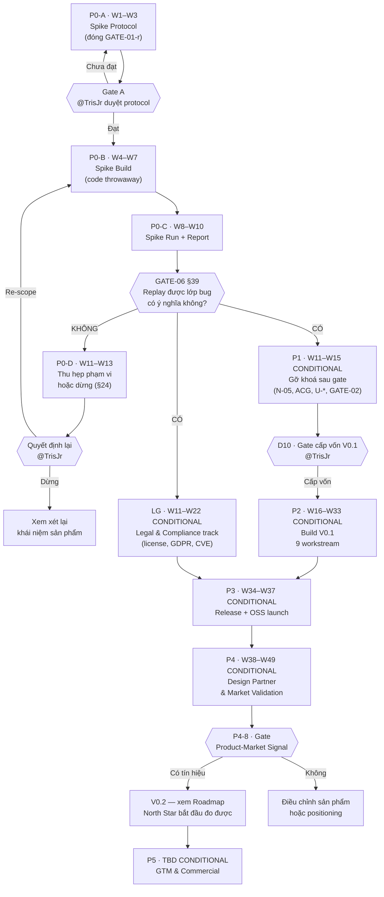

# 🗓️ Timeline & WBS: Repro

> **Tài liệu này là lớp *execution* đặt lên trên [Roadmap](../Roadmap.md).** Roadmap trả lời *"làm gì trước, làm gì sau, điều kiện chuyển phase là gì"* và **cố ý không có ngày**. Timeline này trả lời *"ai làm, làm bao lâu, xong thì căn cứ vào đâu để nói là xong"*.
>
> **Roadmap vẫn là nguồn thứ tự.** Chỗ nào hai tài liệu lệch nhau, Roadmap thắng và Timeline phải sửa.

> [!IMPORTANT]
> **Hai giả định về thời gian dưới đây đến từ quyết định của `@TrisJr` ngày 2026-08-15, KHÔNG từ `RQ.md`.** Ghi rõ theo đúng nguyên tắc `A4` của [Charter §6.3](../Charter-Repro.md) — không bịa để lấp chỗ trống.
>
> | ID | Giả định | Nội dung |
> |---|---|---|
> | **`TL-A1`** | **Trục thời gian tương đối** | Mọi mốc ghi dạng `W1`, `W2`… tính từ **`T0`** = tuần khởi động Phase 0. ✅ **`T0` ĐÃ CHỐT 2026-08-15**: **`W1` = 2026-08-17 → 2026-08-21** (tuần làm việc đầu tiên sau ngày duyệt). ⇒ `W12` = **2026-11-02 → 2026-11-06**, và **`GATE-06` rơi vào 2026-11-06** *(cập nhật 2026-08-16 — bản cũ ghi `W10` = 2026-10-23, xem §15)*. Các bảng bên dưới **vẫn giữ ký hiệu `W`**, không nhúng ngày — quy đổi là cơ học và tránh phải sửa ~40 ô mỗi lần lịch trượt. |
> | **`TL-A2`** | **Capacity = solo** | **Một người thực thi (`@TrisJr`)**, được hỗ trợ bởi các **agent role**. Effort ghi bằng **MD (man-day)** của một người. Đúng với thực tế đã ghi ở [Charter §5.1](../Charter-Repro.md) — *dự án một người*. |
>
> **Hệ quả của `TL-A2` phải nói thẳng**: mọi cột `Driver` / `Collaborators` bên dưới là **vai trò**, không phải người khác nhau. Một người giữ mọi vai ⇒ **không có phản biện độc lập thật sự**, kể cả ở các gate. Đây là rủi ro quản trị đã được ghi ở Charter §5.1, timeline này không xoá nó.

> [!WARNING]
> **Chỉ Phase 0 đã được cấp vốn.** `GATE-01 = Go` cấp vốn cho **đúng Phase 0**. Mọi phase từ `P1` trở đi trong tài liệu này mang nhãn **`CONDITIONAL`** — chúng tồn tại để PM thấy được đường đi và ước lượng, **không** phải cam kết đã được phê duyệt. Node cấp vốn V0.1 là một **quyết định riêng** (`D10`), khác với gate §39.

---

## 0. Cách PM dùng tài liệu này

**Đọc theo thứ tự**: §1 (ai làm) → §2 (bản đồ phase + gate) → §3–§5 (Phase 0, chi tiết tới task) → §6 + §6.1 (gỡ khoá sau gate + track pháp lý) → §7–§8 (V0.1, mức workstream) → §9–§10 (validate thị trường và thương mại hoá) → §11 (nhịp vận hành) → §12 (critical path).

**Ý nghĩa các cột trong mọi bảng task:**

| Cột | Ý nghĩa |
|---|---|
| **ID** | Định danh task, dùng khi giao việc và khi báo cáo tiến độ |
| **Task** | Việc phải làm |
| **Deliverable** | **Đường dẫn file cụ thể** sẽ tồn tại khi task xong. Task không sinh ra artifact ⇒ không đo được ⇒ không có trong bảng |
| **Driver** | Vai **chịu trách nhiệm thực thi** (R trong RACI). Đúng một vai, không chia đôi |
| **Collaborators** | Vai được hỏi ý kiến / review (C). Nhiều vai |
| **Depends** | Task chặn trước. `—` = có thể bắt đầu ngay |
| **MD** | Ước lượng effort man-day theo `TL-A2` |
| **Exit criteria** | Điều kiện để PM đánh dấu **Done**. Không thoả ⇒ chưa Done, kể cả file đã tồn tại |
| **Neo** | Section `RQ.md` / gate / risk / gap mà task này phục vụ. Dùng để truy vết *vì sao task này tồn tại* |

**Quy tắc vận hành:**

1. **Không task nào được đánh Done nếu `Exit criteria` chưa thoả.** File tồn tại ≠ task xong.
2. **Gate là điểm dừng cứng.** Không được bắt đầu task của phase sau khi gate trước chưa đóng — trừ các task ghi rõ `song song được`.
3. **Task sinh ra tài liệu ⇒ bắt buộc cập nhật MOC của thư mục cha** (RULE-001 mục 5).
4. **Trượt tiến độ thì sửa cột `W`, không sửa `Exit criteria`.** Nới tiêu chí để kịp hạn là cách bộ tài liệu này mất giá trị.

> **Ghi chú về vị trí file — độ lệch có chủ ý với RULE-001**: RULE-001 ánh xạ *ETA / Timeline* sang `docs/010-Planning/Estimates/ETA-{ProjectName}.xlsx`. Tài liệu này giữ đúng **thư mục** nhưng dùng **`.md`** thay vì `.xlsx`, vì toàn bộ kho tài liệu là markdown và timeline cần cross-link tới ~15 tài liệu khác — điều một file `.xlsx` không làm được. Đây là quyết định có chủ ý, ghi lại để `context-auditor` không báo là vi phạm.

---

## 1. Bản đồ vai trò

Mười vai dưới đây bao phủ toàn bộ công việc trong timeline. Tên vai lấy **đúng theo** [SDLC-Agile-Workflow §4–§5](../../../knowledge-base/20-Project/SDLC-Agile-Workflow.md) và tên agent có sẵn của dự án — để lệnh giao việc dùng được ngay.

| Vai | Agent | Trách nhiệm trong dự án Repro | Thư mục output |
|---|---|---|---|
| 🎩 **PM** | `product-manager` | Điều phối phase, giữ gate, viết status report, quản lý risk register | `010-Planning/` |
| 🕵️ **BA** | `business-analyst` | Chuyển quyết định thành spec đo được; sở hữu các mục `ACG-*`; giữ traceability `FR ↔ UC ↔ Story` | `020-Requirements/` |
| 🏗️ **Architect** | `architect` | Sở hữu SDD + 11 ADR + 6 open item `U-*`; quyết capsule format; định nghĩa vận hành *execution path* | `030-Specs/Architecture/` |
| 🧪 **QA** | `quality-assurance` | Sở hữu measurement plan, rubric spike, master test plan, test case, spike report | `035-QA/` |
| 🛡️ **Security** | `security-auditor` | Sở hữu threat model, 43 `SEC-*`, crypto-shredding, key custody, supply chain `@repro/node` | `030-Specs/Security/` |
| 🧑‍💻 **Engineer** | `software-engineer` | Hiện thực recorder / replay runtime / verification / CLI; code spike (throwaway) và code sản phẩm | `src/`, `test/` |
| ⚙️ **DevOps** | `devops-engineer` | Môi trường production-like, script destroy environment, CI, self-host topology, runbook, release | `070-Deployment/`, `080-Operations/` |
| 📋 **PO** | `product-owner` | Phân rã Epic/Story sau khi `GATE-02` được gỡ; nghiệm thu increment | `022-User-Stories/` |
| 🔍 **Context Auditor** | `context-auditor` | Kiểm toán nhất quán tài liệu sau mỗi phase và mỗi lần một `TBD` được đóng | toàn bộ `docs/` |
| 👤 **Sponsor** | **`@TrisJr`** *(người thật)* | **Người duy nhất được đóng gate và cấp vốn.** Duyệt tài liệu `draft → approved` | — |

> [!NOTE]
> **Designer (`product-designer`) KHÔNG có mặt trong Phase 0 và V0.1** — chủ ý, không phải bỏ sót. Repro là **CLI-first** (`RQ.md §33.2`), `040-Design/` rỗng là trạng thái đúng ([Design-MOC](../../040-Design/Design-MOC.md)). Vai này chỉ được kích hoạt ở **V0.2** khi có *Replay visualization* và *Browser replay*.
>
> **Researcher (`researcher`) không nằm trên critical path của Phase 0, nhưng là vai CHÍNH của `P4`.** Persona hiện là **giả thuyết chưa validated** ([Analysis-Target-Users](../../050-Research/Analysis-Target-Users.md)) — validate persona **không chặn** câu hỏi kỹ thuật của Phase 0, nên vai này chỉ chạy nền ở `X3` (§11). Nhưng từ `P4` trở đi nó sở hữu `P4-4` (persona validation) và `P4-5` (competitive analysis) — hai việc quyết định sản phẩm có thị trường hay không.
>
> **Luật sư bên ngoài** không phải một agent role — `LG3` cần người thật, và [Charter §5.1](../Charter-Repro.md) đã ghi rõ **pháp chế hiện là ❌ KHÔNG CÓ** trong cấu hình quản trị. Đây là vai đầu tiên timeline này yêu cầu bổ sung từ bên ngoài.

### 1.1 RACI rút gọn cho các quyết định lớn

Áp dụng [Project-Governance §2](../../../knowledge-base/20-Project/Project-Governance.md), điều chỉnh cho cấu hình dự án một người:

| Loại quyết định | A (chịu trách nhiệm cuối) | R (thực thi) | C (tư vấn) | I |
|---|---|---|---|---|
| Đóng/mở gate, cấp vốn | **`@TrisJr`** | PM | Architect, Security | tất cả |
| Định nghĩa `ACG-*` | **`@TrisJr`** | BA | Architect, QA | PM |
| Quyết định kiến trúc (ADR) | **`@TrisJr`** | Architect | Security, Engineer | PM, BA |
| Ngưỡng NFR (`N-05`, `SEC-008`) | **`@TrisJr`** | PM | QA, Architect | BA |
| Nội dung backlog (Epic/Story) | **`@TrisJr`** | PO | BA, Engineer | QA |
| Phát hành | **`@TrisJr`** | DevOps | QA, Security | tất cả |

---

## 2. Bản đồ phase và gate



| Phase | Tuần | Trạng thái vốn | Mục tiêu — đúng một câu | Gate ra |
|---|---|---|---|---|
| **P0-A** — Spike Protocol | `W1–W3` | ✅ **Đã cấp vốn** | Làm cho spike **có thể cho ra pass/fail** | **Gate A** |
| **P0-B** — Spike Build | `W4–W9` ⬆️ | ✅ **Đã cấp vốn** | Dựng đủ công cụ throwaway để chạy 10 scenario | — |
| **P0-C** — Spike Run & Report | `W10–W12` ⬆️ | ✅ **Đã cấp vốn** | Trả lời câu hỏi §39 bằng **dữ liệu đo**, không bằng ý kiến | **`GATE-06` (§39)** |
| **P0-D** — Nhánh KHÔNG | `W13–W15` | ⚠️ dự phòng | Xác định lớp bug nào **không** replay được và thu hẹp phạm vi | quyết định lại |
| **P1** — Gỡ khoá sau gate | `W13–W17` | 🔶 `CONDITIONAL` | Biến hypothesis của spike thành **định nghĩa chốt**, gỡ 4 blocker | **`D10` cấp vốn V0.1** |
| **LG** — Legal & Compliance | `W13–W24` *(song song)* | 🔶 `CONDITIONAL` | Làm cho việc **phát hành** và **cài vào production người khác** hợp pháp | `LG3` đóng trước `P4` |
| **P2** — Build V0.1 | `W18–W35` | 🔶 `CONDITIONAL` | Hiện thực core replay loop + nghĩa vụ phi chức năng | Execution Match Rate ≥ `N-05` |
| **P3** — Release V0.1 | `W36–W39` | 🔶 `CONDITIONAL` | Phát hành OSS an toàn và cài được trong vài phút | Release v0.1.0 |
| **P4** — Design Partner & Market Validation | `W40–W51` | 🔶 `CONDITIONAL` | Chứng minh **người thật** cài vào **production thật** và thu được giá trị | **Gate Product-Market Signal** |
| **P5** — GTM & Commercial | `TBD` *(sau V0.2)* | 🔶 `CONDITIONAL` | Thương mại hoá — **chỉ sau khi North Star đo được** | quyết định commercial launch |

**Tổng effort đã cấp vốn (`P0-A` → `P0-C`): ~54.0–54.7 MD trên 12 tuần.** *(cũ ~46.5 MD / 10 tuần — cập nhật 2026-08-16, xem §15)*

> [!NOTE]
> ✅ **CHỐT 2026-08-15 — hai lần điều chỉnh trong cùng ngày, ghi cả hai để thấy vì sao.**
>
> | | Bản gốc | Lần 1 — giãn đệm | Lần 2 — sau analysis fan-out | **Lần 3 — 2026-08-16, sau fan-out `P0-B`** |
> |---|:--:|:--:|:--:|:--:|
> | Phase 0 | 8 tuần | 9 tuần | 10 tuần | **12 tuần** |
> | Effort | 41.5 MD | 41.5 MD | ~46.5 MD | **~54.0–54.7 MD** |
> | Capacity | 41.5/40 = **104%** | 41.5/45 = 92% | 46.5/50 = 93% | **54.0–54.7/60 = 90–91%** |
> | `GATE-06` | `W8` | `W9` | `W10` = 2026-10-23 | **`W12` = 2026-11-06** |
>
> **Lần 3** — analysis fan-out của run [`2026-08-16-p0b-wave2-4`](../pm-runs/2026-08-16-p0b-wave2-4/run-plan.md) (4 lens read-only) tìm ra **ba hạng mục chưa ai sở hữu** (`B0'` mở rộng schema · `S-1` seam `B1`/`B2` · `INF-1` nợ hạ tầng + `L2`) và **năm ước lượng vượt**. `P0-B` từ 24.5 lên **29.5–30.2 MD** ⇒ cần 6 tuần thay vì 4.
>
> ⚠️ **Khác hai lần trước ở một điểm**: lần này **không phải** ước lượng bi quan hơn. Bốn lens **đọc code thật và chạy lệnh thật** — `coverage.js` chạy lại ra `4` thay vì `3`; `--permission` đo trên 8 kịch bản; `colima ssh -- free -m` in `Swap: 0`.
>
> **Lần 1** — `TL-r1` nói mọi con số MD ở đây không có dữ liệu lịch sử đứng sau. Lịch 104% + ước lượng không baseline ⇒ trượt đẩy thẳng vào `GATE-06`, đúng cái gate duy nhất đã cấp vốn.
>
> **Lần 2** — analysis fan-out của run [`2026-08-15-p0a-spike-protocol`](../pm-runs/2026-08-15-p0a-spike-protocol/run-plan.md) tìm ra **~4.5 MD phạm vi thật chưa được đếm** trong `P0-A`: ba ràng buộc chặn (canary sink · capture không-cap · L2 bắt buộc), đóng thêm `U-13`/`U-16`, metric thứ 6, probe `SC-11`, shortcut ledger. `P0-A` từ 9.5 lên **~14 MD**.
>
> **Phân bổ hiện hành (sau lần 3):** `P0-A` = `W1–W3` (14/15 = **93%**, ✅ đã đóng) · `P0-B` = `W4–W9` (**29.5–30.2**/30 = **98–101%**) · `P0-C` = `W10–W12` (10.5/15 = **70%**).
>
> ⚠️ **`P0-B` vẫn là sub-phase căng nhất và vẫn KHÔNG có đệm** — giãn 2 tuần chỉ đưa nó từ **147–151%** về **≈100%**, tức là **vừa đủ, không dư một ngày**. Đệm duy nhất của Phase 0 vẫn nằm ở `P0-C` và vẫn **đã có chủ**: dành cho khả năng `C1` phải chạy lại nếu phân bố `SEC-008` bị kiểm duyệt. ⇒ **`P0-B` trượt lần nữa thì trượt thẳng vào `GATE-06`.**
>
> 📌 **Con số `P0-B` nay có velocity thật đứng sau, không còn thuần phán đoán.** `B2` đo bằng Wave 1 (3 vòng dispatch); `B7`/`B8`/`B9`/`B10` đo lại bằng 4 lens đọc code. Đây là điều `TL-r1` đòi hỏi trước khi tin bất kỳ ước lượng nào.
>
> **Đệm nay nằm ở `P0-C`, và đó là chỗ đúng.** [`findings/quality-assurance.md`](../pm-runs/2026-08-15-p0a-spike-protocol/findings/quality-assurance.md) chỉ ra `C1` **có thể phải chạy lại toàn bộ** nếu phân bố `SEC-008` bị kiểm duyệt. Slack 30% của `P0-C` là chỗ hấp thụ đúng rủi ro đó — không phải đệm chung chung.
>
> ⚠️ **Đệm KHÔNG làm `TL-r1` biến mất.** Lần 2 này chính là bằng chứng: đệm `W7` mua ở lần 1 **đã bị tiêu hết** bởi phạm vi thật tìm ra chỉ vài giờ sau. Hiệu chỉnh lại toàn bộ ước lượng **sau `P0-B`** vẫn là **bắt buộc**.
>
> **Bài học ghi lại**: ~4.5 MD này **không phải scope creep** — nó là phạm vi vốn đã tồn tại nhưng chưa ai đếm, và nó chỉ lộ ra khi bốn lens đọc kỹ nguồn. Trả bằng một tuần đã biết rẻ hơn phát hiện ở `C1`.

**Phần `CONDITIONAL`: ~229.5 MD + `P5` chưa ước lượng được**

| Khối | MD | Ghi chú |
|---|:--:|---|
| `P1` Gỡ khoá | 24.5 | |
| `LG` Legal & Compliance | 10.0 | **cộng lead time bên ngoài 2–6 tuần** — xem [§6.1](#61-legal--compliance-track--w11w22--song-song-p1--conditional) |
| `P2` Build V0.1 | 158.0 | vượt capacity — xem [§7](#7-phase-p2--build-v01--w16w33--conditional) |
| `P3` Release | 15.5 | |
| `P4` Design Partner | 21.5 | trải 12 tuần vì có **thời gian chờ** phía đối tác |
| `P5` GTM & Commercial | **`TBD`** | Không ước lượng được — phụ thuộc V0.2, mà V0.2 **chưa được lập lịch**. Ghi `TBD` thay vì bịa |

Toàn bộ con số này **chỉ để lập ngân sách sơ bộ** và **sẽ được tính lại tại `D10`**, vì phạm vi V0.1 phụ thuộc kết quả spike.

### 2.1 Ba mốc PM cần nhớ

| Mốc | Tuần | Nghĩa là gì |
|---|:--:|---|
| **Trả lời được câu hỏi kỹ thuật** | `W12` *(= 2026-11-06)* | `GATE-06` — biết Repro có khả thi hay không. **Đây là mốc duy nhất đã được cấp vốn** |
| **OSS public launch** | `W37` | Phần mềm **tồn tại** và cài được. **Chưa** chứng minh có ai dùng |
| **Có tín hiệu thị trường** | `W49` | `P4-8` — có tổ chức thật chạy Repro trên production thật. **Sớm nhất ~49 tuần từ `T0`** |

> [!IMPORTANT]
> **`W49` vẫn CHƯA phải "hoàn tất project".** Sau mốc đó còn **V0.2** (nơi North Star §31 mới bắt đầu đo được — quyết định `M1`), rồi mới tới **`P5`** thương mại hoá, rồi V0.3 và Future. Ba khối đó **cố ý không được lập lịch** vì phạm vi của chúng phụ thuộc kết quả các phase trước — xem [§10](#10-v02-trở-đi--milestone-và-phase-thương-mại-hoá) và [§13](#13-những-gì-timeline-này-không-chứa).
>
> Nói gọn: **timeline này đưa dự án từ ý tưởng tới *có bằng chứng thị trường*, không tới *hoàn tất sản phẩm*.** Ranh giới đó là có chủ ý, không phải thiếu sót.

---

## 3. Phase P0-A — Spike Protocol · `W1–W3` · ✅ đã cấp vốn

> **Vì sao phase này tồn tại**: `GATE-01 = Go` đã bật spike, nhưng **không** làm spike đo được. Bốn khoảng hở `ACG-01`, `ACG-02`, `ACG-03`, `ACG-07` vẫn nguyên ⇒ **chạy spike ngay lúc này vẫn không cho ra pass/fail** (`GATE-01-r`, [Risk-Register §4.2](../Risk-Register.md)). Phase này đóng đúng rủi ro đó.
>
> **Ràng buộc bắt buộc**: mọi định nghĩa sinh ra ở đây là **hypothesis có nhãn**, **KHÔNG** phải định nghĩa sản phẩm. `ACG-02` tự nó đòi tiêu chí chọn test case phải chốt **trước khi** spike chạy — đó là lý do phase này đứng trước `P0-B`, không song song.

| ID | Task | Deliverable | Driver | Collaborators | Depends | MD | Exit criteria | Neo |
|---|---|---|---|---|---|:--:|---|---|
| **A1** | Dựng khung Spike Protocol: phạm vi, cách gắn nhãn hypothesis, quy tắc "cấm nâng hypothesis thành định nghĩa sản phẩm" | `docs/030-Specs/Spec-Spike-Protocol.md` | 🕵️ BA | 🎩 PM, 🏗️ Architect | — | 1.0 | File tồn tại, có frontmatter chuẩn, có mục cho đủ 4 `ACG` | `GATE-01-r` |
| **A2** | **`ACG-07`** — phát biểu *Supported Execution Class* ở dạng hypothesis: (i) điều kiện đủ, (ii) điều kiện loại trừ đối chiếu 9 hidden input §20.1 **và các dependency đã bị loại khỏi tập capture**, (iii) hành vi khi execution rơi ra ngoài class | mục §2 của `Spec-Spike-Protocol.md` | 🏗️ Architect | 🕵️ BA, 🧪 QA | A1 | 1.5 | Đủ **ba** phần; mỗi phần đối chiếu được với 9 nhóm của §20.1 **và với `GAP-Redis` dưới đây**; có nhãn `HYPOTHESIS — cần validate` | `ACG-07`, `R-01`, `C-03` |
| **A3** | **`ACG-01`** — định nghĩa **vận hành** của *execution path* + rubric quyết định `Execution matched` / `diverged`: đơn vị so sánh, tập field, exact vs tolerant, cách quy trách nhiệm divergence (code / môi trường / **redaction**) | mục §3 của `Spec-Spike-Protocol.md` | 🏗️ Architect | 🧪 QA, 🕵️ BA | A1 | 2.0 | Rubric chạy tay được trên **một** ví dụ giả lập và cho ra kết luận nhị phân; nêu rõ **điểm yếu đã biết** (không bắt được rẽ nhánh thuần logic) | `ACG-01`, `U-04`, `R-03` |
| **A4** | **`ACG-02` + `ACG-03`** — tiêu chí chọn test case *"meaningful"* (chốt **trước** khi biết kết quả), denominator của `≥80%` (10 hay 7 scenario), và chốt *"reproduced"* = Replay Success Rate hay Execution Match Rate | mục §4 của `Spec-Spike-Protocol.md` | 🕵️ BA | 🎩 PM, 🧪 QA | A2, A3 | 1.5 | Tiêu chí áp được lên **cả 10** scenario §22 và cho ra tập được chọn **trước** khi chạy; denominator là **một con số**; **đã tính tới quyết định `GAP-Redis` của `A2`** | `ACG-02`, `ACG-03`, `C-03` |
| **A5** | Measurement plan: cách đo 5 metric §23, **bắt buộc gồm P95 capsule size** (`C-04`), điểm đo trong pipeline (`ACG-11`), điều kiện đo overhead (percentile/baseline/tầng/tỷ lệ traffic — `ACG-04`), và thu dữ liệu row/byte cho `SEC-008` | `docs/035-QA/Test-Plans/MTP-Spike-Phase-0.md` | 🧪 QA | ⚙️ DevOps, 🏗️ Architect | A1 | 1.0 | Mỗi metric có: công cụ đo, mốc bắt đầu/kết thúc, population, đơn vị | §23, `ACG-04`, `ACG-05`, `ACG-11`, `SEC-008` |
| **A6** | Template Spike Report + rubric kết luận: bảng nào phải điền, phát biểu nào được phép viết, phát biểu nào **cấm** viết | `docs/999-Resources/Templates/Template-Spike-Report.md` | 🧪 QA | 🎩 PM | A5 | 0.5 | Template có ô cho **cả hai** nhánh Có/Không của §39 | §39, §24 |
| **A7** | Review chéo protocol: architect soát tính khả thi, QA soát tính đo được, security soát rủi ro khi capture dữ liệu thật trong spike | `docs/010-Planning/pm-runs/{run}/findings/` | 🎩 PM | 🏗️ Architect, 🧪 QA, 🛡️ Security | A2–A6 | 1.0 | Ba finding file tồn tại; mọi `BLOCKER` đã được xử hoặc escalate | quy trình pm-runs |
| **A8** | Cập nhật MOC + index cho tài liệu mới; ghi `TL-A1`/`TL-A2` vào Risk-Register nếu phát sinh rủi ro mới | `Specs-MOC.md`, `QA-MOC.md`, `000-Index.md` | 🔍 Context Auditor | 🎩 PM | A7 | 0.5 | Không dead link; MOC phản ánh đúng file mới | RULE-001 |
| **GA** | **Gate A** — duyệt Spike Protocol | quyết định ghi tại `pm-runs/{run}/verdict.md` | 👤 **`@TrisJr`** | 🎩 PM | A8 | 0.5 | Trả lời được: *"chạy spike xong, tôi dùng cái gì để nói đạt hay không đạt?"* | `GATE-01-r` |

**Cộng: ~14 MD** *(9.5 MD bản gốc + ~4.5 MD phạm vi tìm ra ở analysis fan-out — xem bảng dưới).*

### 3.1 Phạm vi bổ sung sau analysis fan-out — ✅ chốt `G3`/`G4`, 2026-08-15

> Bốn lens read-only ([run `2026-08-15-p0a-spike-protocol`](../pm-runs/2026-08-15-p0a-spike-protocol/run-plan.md)) tìm ra phạm vi **vốn đã tồn tại nhưng chưa ai đếm**. Không phải scope creep — bỏ qua thì `P0-B` + `P0-C` tiêu ~32 MD mà **không kết luận được**.

| Bổ sung | Vào task | ~MD | Không có thì hỏng gì |
|---|---|:--:|---|
| **Canary sink** — listener tại địa chỉ môi trường đã destroy, ghi mọi kết nối đến | `A5` | 0.5 | Sau destroy, WRITE **rò rỉ** nhận `ECONNREFUSED` — **trông giống hệt** WRITE **bị chặn**. Mọi bằng chứng an toàn của `C1` **vô nghĩa** |
| **Capture không-cap + thí nghiệm cắt offline** | `A5` | 0.5 | `SEC-008` §11.b đòi **hai vế**; vế 2 *(tỉ lệ replay theo từng mức cắt)* bị bỏ quên. Cắt tại lúc record ⇒ môi trường đã destroy, **đuôi phân bố mất vĩnh viễn** |
| **`L2` bắt buộc + ma trận 12 test `THREAT-018`** | `A5` | 0.5 | Exit criteria `B5` hiện **thoả được bằng L1 đơn thuần** ⇒ `THREAT-018` tái diễn nguyên vẹn |
| **`escaped_side_effects` = metric thứ 6**, target `0` | `A5` + `A6` | 0.5 | `ADR-005` ghi risk 🔴 §20.4 hiện **không có bằng chứng chấp nhận nào được định nghĩa** ⇒ `GATE-06` không nói được gì về nó |
| **`U-13` + `U-16`** đóng ở dạng hypothesis *(quyết định `G3`)* | `A3` | 1.5 | `U-13` (clock freeze hay virtual) **phải** đóng dù sao — `B3`/`B5` không xây được nếu thiếu; không đóng ở `A3` thì Engineer quyết **ngầm** trong `B5`. `U-16` là đầu vào bước 3 của thủ tục quy trách nhiệm mà `C3` phụ thuộc. Đóng cả hai ⇒ **denominator = 7** |
| **Known-Missing-Input Manifest** — *chỉ phần **định nghĩa + cơ chế niêm phong*** | `A2` + `A5` | 0.5 | Không có thì `C3` quy scenario fail về *"non-determinism"* trong khi nguyên nhân thật là thiếu capture **đã biết trước**.<br>⚠️ **Phần viết ra 10 file thật là `B10`, thuộc `P0-B`** — nó đòi fixture phải tồn tại (`B8`) mới điền được trường `dự đoán ảnh hưởng` |
| **Shortcut ledger** *(control `TL-r4`)* | `A1` | 0.25 | Prefix nhánh `spike/` là **quy ước, không phải control**. Không có ledger, review tái dùng ở `P1` dựa vào **trí nhớ** |
| **Probe `SC-11`** — khai ở `A4`, dựng ở `B8` | `A4` | 0.25 | Không kiểm được chính thủ tục quy trách nhiệm trước khi `C3` chạy |

**Ràng buộc thứ tự cứng sinh ra từ đây:** `C1` **không được khởi động** trước khi (i) quyết định `G1` đã thành văn bản trong `Spec-Spike-Protocol.md` §2, và (ii) Known-Missing-Input Manifest đã **niêm phong**.

> [!NOTE]
> **`GAP-Redis` — phát hiện 2026-08-15, ✅ ĐÃ CHỐT cùng ngày (`G1`).**
>
> **Vấn đề.** Ba mệnh đề đều có nguồn nhưng đặt cạnh nhau thì mâu thuẫn:
>
> 1. `RQ.md §22` liệt kê **Redis** trong 5 dependency của spike test app.
> 2. `RQ.md §18` liệt kê **8 nhóm capture** — **không có Redis**. Quyết định `C-03` đã chốt: **Redis ngoài V0.1**.
> 3. `§22` bắt buộc bước **Destroy original environment** trước khi replay.
>
> ⇒ Nếu execution phụ thuộc cache state, sau destroy **không còn Redis để đọc** ⇒ replay với một input không được ghi lại.
>
> **Vì sao `A2` không tự bắt được**: Redis **không nằm trong 9 hidden input của §20.1** — nó nằm ở **trục khác**: một dependency được đặt tên tường minh mà §18 **chủ động** không capture. Exit criteria cũ (*"đối chiếu 9 nhóm §20.1"*) **không bao giờ** ép ra quyết định này. Đó là lý do exit criteria `A2`/`A4` đã được sửa ở bảng trên.
>
> ---
>
> ⚠️ **Hai đính chính đối với bản viết đầu tiên của mục này** — cả hai do analysis fan-out tìm ra và PM đã tự verify lại nguyên văn `RQ.md`:
>
> | Bản đầu viết | Sự thật |
> |---|---|
> | *"§22 **bắt** test app chạm Redis ở mọi request (`B1` **chép đúng**)"* | **Sai.** §22 chỉ **liệt kê dependency của test app**; nó **không** có câu nào bắt mỗi request phải chạm cả 5. Ràng buộc *"chạm cả 5 dependency trong một request"* đến từ **exit criteria `B1` của chính tài liệu này** — artifact dự án, **sửa được**. `B1` **siết chặt hơn nguồn** (`F1`) |
> | *"**cả 10 scenario** đều replay với input không được ghi"* | Đúng **nếu** giữ nguyên `B1`. Nhưng **không scenario nào trong 10 lấy Redis làm tác nhân gây lỗi** — tác nhân là DB, external API, feature flag, clock, dữ liệu thiếu, phiên bản, randomness, write, async, race (`F2`) |
>
> ⇒ Hệ quả: **phương án (c) không xoá scenario nào khỏi danh sách của `RQ.md`**, và chi phí thật của nó là **sửa một dòng exit criteria `B1`** — không phải *"làm spike dễ hơn thực tế"* như bản đầu viết. Cách xử lý này thống nhất với chính quy tắc dự án đã dùng để phân xử `C-03`: **phát biểu phạm vi tường minh thắng sơ đồ/minh hoạ**.
>
> ---
>
> ### ✅ Quyết định `G1` — `@TrisJr`, 2026-08-15
>
> **Chọn (c) + phần định nghĩa của (a) — một quyết định, hai mặt:**
>
> | Mặt | Nội dung | Áp vào đâu |
> |---|---|---|
> | **Hiện thực** — (c) | Test app **vẫn đủ 5 dependency** như §22 liệt kê, nhưng **Redis không ảnh hưởng kết cục** của `POST /checkout` | Exit criteria `B1` |
> | **Định nghĩa** — (a) | *"Execution mà kết cục phụ thuộc cache state nằm **ngoài** Supported Execution Class"* — nhãn `HYPOTHESIS` | `ACG-07` mục (ii-b) |
>
> **Lý do quyết định — tính chuyển giao của bằng chứng.** `GATE-06` là cổng quyết định có xây **V0.1** hay không, mà V0.1 có **8 nhóm capture**. Phương án **(b)** *(capture Redis throwaway)* sẽ đo một hệ thống **9 nhóm** rồi dùng con số đó phán quyết một sản phẩm **8 nhóm** ⇒ `GATE-06` pass mà **bằng chứng không chuyển giao được sang thứ đang được gate**. Tệ hơn (c) ở chỗ khuyết điểm đó **vô hình** trong báo cáo; khuyết điểm của (c) thì **nêu tên được** — nó thành một điều khoản loại trừ **công bố trước** trong `ACG-07`, đúng thứ §20.1 yêu cầu.
>
> **Phương án (a) đơn độc đã bị loại**: với `B1` giữ nguyên, loại trừ Redis khỏi class sẽ quét sạch **cả 10 scenario** ⇒ **denominator = 0**, spike không trả lời được §39. Đây là lý do (a) phải đi kèm (c).
>
> **Hai ràng buộc kỹ thuật bắt buộc kèm theo (c):**
>
> - **`R1`** — Redis không nằm trong 8 nhóm instrument ⇒ interaction Redis **vô hình với rubric ở cả hai phía**. **Cấm** thêm hook Redis ở **một** phía; làm vậy tạo interaction lệch ⇒ cả 10 scenario `diverged` với nguyên nhân `incomplete-capture` **giả**.
> - **`R2`** — cách dùng Redis ở `B1` phải **chịu được việc bị `B5` chặn hoặc vắng mặt** (fire-and-forget, hoặc read có fallback mà giá trị không đi vào business logic). Không có `R2`, (c) chết vì đúng cơ chế an toàn của chính spike.
>
> **Probe `SC-11` kèm theo** *(ngoài denominator)*: chạy **một** execution **cố tình phụ thuộc Redis state**. Nó (i) định lượng cái giá của việc loại cache khỏi class, và (ii) quan trọng hơn — **kiểm chính thủ tục quy trách nhiệm**: `SC-11` **phải** ra `diverged` với nguyên nhân **`incomplete-capture`**, **không** phải `out-of-scope-determinism`. Ra sai nhãn ⇒ rubric có lỗi, phải sửa **trước** khi `C3` chạy.
>
> **`GAP-Redis` không phải ca cá biệt.** `ACG-07` cho thấy **process state** (module-level cache, memoization, độ ấm của pool) là **cùng lớp vấn đề**, chỉ khác là nằm **trong** process. Phát biểu loại trừ ở (ii-b) được viết để phủ cả lớp, không chỉ phủ Redis.

> [!WARNING]
> **Gate A không được bỏ qua để "tiết kiệm thời gian".** Bỏ qua nó ⇒ `P0-B` và `P0-C` chạy hết ~30 MD rồi cho ra một kết quả **không kết luận được** — đúng kịch bản mà `GATE-01-r` mô tả. Đây là 9.5 MD mua lấy khả năng kết luận của 30 MD phía sau.

---

## 4. Phase P0-B — Spike Build · `W4–W7` · ✅ đã cấp vốn

> **Ràng buộc bất khả nhượng của phase này**: `RQ.md §39` nói **không** bắt đầu bằng việc xây nền tảng Repro đầy đủ, và `§22` nói mục tiêu spike **không phải** xây sản phẩm.
>
> ⇒ **Toàn bộ code trong phase này là `throwaway`.** Nó tồn tại để trả lời một câu hỏi, không để tiến hoá thành V0.1. Mọi PR của phase này phải mang nhãn `spike/` ở tên branch. Tái sử dụng code spike cho V0.1 là **quyết định riêng** phải đi qua `P1`, không phải mặc định.

| ID | Task | Deliverable | Driver | Collaborators | Depends | MD | Exit criteria | Neo |
|---|---|---|---|---|---|:--:|---|---|
| **B0** | 🆕 **Contract spike dùng chung** — schema artifact spike (**KHÔNG** phải capsule format v1) + module `identity()`/`normalize()` hiện thực **đúng 4 phép** `Spec §3.2`, nhãn `HYPOTHESIS` | `src/spike/contract/` | 🏗️ Architect | 🧑‍💻 Engineer | GA | 1.0 | Module chạy được, zero-dependency; **ba** consumer (`B3` recorder · `B5` allowlist `R3` · `B6` rubric) có bảng nghĩa vụ tường minh; khối **`class_assessment`** có chỗ trong schema và artifact thiếu nó **bị từ chối**; ⛔ **không** tuyên bố `U-01`/`U-02` đã đóng | `Spec §3.1`, `§3.2`, `§2.6`, `ADR-002` |
| **B1** | Test app Node.js `POST /checkout` với đủ 5 dependency: PostgreSQL, Redis, external HTTP API, feature flag, system clock. **External HTTP API phải là stub tự chạy** (`G2`), **dữ liệu seed là synthetic** | `src/spike/app/` | 🧑‍💻 Engineer | ⚙️ DevOps, 🛡️ Security | GA | 2.0 | App chạy được, `POST /checkout` chạm **cả 5** dependency trong một request, **trong đó Redis KHÔNG ảnh hưởng kết cục** (`G1`). Có test chứng minh **bất biến hạ dòng**: cache-hit lúc capture và cache-miss/lỗi lúc replay cho **cùng** chuỗi DB/HTTP và **cùng** response (`R2`) | §22, `G1`, `G2` |
| **B2** | Môi trường production-like + **script destroy environment** + **canary sink**. *"Production-like"* = giống production về **cấu hình/topology/độ phức tạp**, **KHÔNG** phải có dữ liệu production (`G2`) | `src/spike/infra/`, `docs/070-Deployment/Deploy-Spike.md` | ⚙️ DevOps | 🧑‍💻 Engineer, 🛡️ Security | GA | **3.5** ⬆️ | Chạy destroy xong, **không** còn service nào của môi trường gốc sống.<br>**Bằng chứng phải do một công cụ ĐỘC LẬP sinh ra** (không phải chính script destroy): liệt kê toàn bộ resource còn lại trong scope, máy đọc được, **mỗi lần chạy** (`C1` destroy 10 lần ⇒ 10 bằng chứng). Cách ly ở **tầng IAM** — credential destroy không có quyền chạm ngoài scope. Destroy **theo nhãn**, **idempotent**, có **revoke/rotate credential**.<br>**Canary sink**: sau destroy, trỏ host cũ về listener ghi mọi kết nối đến | §22, §40, `THREAT-018` |
| **B3** | Recorder tối thiểu — capture 8 nhóm của §18: HTTP request, stack trace, DB query/result, external HTTP response, feature flag state, clock/timestamp, Git commit, runtime metadata. **Cấm thêm hook Redis** (`R1`) | `src/spike/recorder/` | 🧑‍💻 Engineer | 🏗️ Architect | B1 | 4.0 | Một execution thật sinh ra artifact chứa **đủ 8 nhóm**; overhead được đo (không cần đạt ngưỡng).<br>**Bổ sung sau `A5`**: (i) log `row_count` · `byte_size` · `consumed_by_replay` cho **MỌI** DB query result; (ii) chạy ở chế độ **KHÔNG CAP** — cap bật ⇒ phân bố `SEC-008` bị kiểm duyệt và **không khôi phục được**.<br>**Bổ sung sau `Gate A` (hạng mục orphan, chốt 2026-08-15)**: (iii) **ghi khối `class_assessment`** vào mọi artifact theo `Spec §2.6` — `B0` đã cấp chỗ trong schema và **từ chối** artifact thiếu nó; (iv) dùng module `identity()`/`normalize()` của `B0`, ⛔ **cấm** tự viết normalization riêng (`R1` ở tầng match); (v) bù trường **`direction`** (`READ`/`WRITE`) và ánh xạ `kind` cho khớp `KINDS` của `B0` — `B1` không phát ra hai thứ này | §18, `ADR-007`, `SEC-008`, `Spec §2.6` |
| **B4** | Capsule writer tối thiểu — **KHÔNG** phải capsule format v1 | `src/spike/capsule/` | 🧑‍💻 Engineer | 🏗️ Architect | B3 | 1.5 | Artifact **tự chứa**, mở được sau khi môi trường gốc bị destroy | §6, §40, `ADR-002` |
| **B5** | Replay runtime tối thiểu + **default-deny write** fail-closed **hai lớp**: `L1` phân loại tại sink, `L2` cách ly ở tầng thấp hơn. Protocol (`A5`) chốt `L2` ở tầng nào | `src/spike/replay/` | 🧑‍💻 Engineer | 🛡️ Security, 🏗️ Architect | B4, A5 | 4.0 | ⚠️ **Exit criteria đã siết sau `A7`** — bản cũ (*"có test chứng minh một WRITE bị chặn"*) **thoả được bằng `L1` đơn thuần**, không đủ.<br>Bản mới: **12/12 test `T1`–`T12` chạy**, `escaped_side_effects = 0` đo bằng **canary log** (không phải log của chính replay runtime — xác minh vòng tròn). `T8` (`child_process` gọi `curl`) FAIL nếu `L2` ở tầng runtime ⇒ ghi nhận là **khoảng hở đã đo được**, **cấm** làm nhẹ test | §13, §20.4, `ACG-09`, `THREAT-018`, `ADR-005` |
| **B6** | Verification + diff tối thiểu, hiện thực **đúng rubric `A3`** | `src/spike/verify/` | 🧑‍💻 Engineer | 🏗️ Architect, 🧪 QA | B5, A3, **B0** | 3.0 | Cho ra kết luận nhị phân `matched` / `diverged` + chỉ ra điểm phân kỳ đầu tiên.<br>**Bổ sung sau `Gate A` (hạng mục orphan, chốt 2026-08-15)**: thi hành **cổng `inconclusive`** theo `Spec §3.5` — cổng **tầng 1 đứng TRƯỚC rubric**, execution rơi vào đó **bị loại khỏi denominator**. Không có cổng này thì `C3` tính chỉ số composite `≥6/7` trên một denominator **không có bộ lọc**, và **không cách nào phát hiện từ chính báo cáo**. Dùng chung `identity()`/`normalize()` của `B0` với `B5` | §10, §9, `ADR-006`, `ADR-011`, `Spec §3.5` |
| **B7** | Harness đo metric theo `A5` + baseline overhead khi **tắt** recorder. Chạy cặp A/B **xen kẽ** (OFF/ON/OFF/ON), **không** chạy baseline một lần rồi dùng lại | `src/spike/bench/`, `test/spike/` | ⚙️ DevOps | 🧪 QA | B3, A5 | 2.0 | Chạy một lệnh ra được đủ **6** metric ở dạng máy đọc được (JSON/CSV) — 5 metric §23 + `escaped_side_effects`.<br>**Load run đo overhead phải dùng traffic đa số THÀNH CÔNG** (giống production), và **tỷ lệ lỗi là điều kiện đo bắt buộc** ghi kèm mọi con số. Lý do: 10 scenario §22 đều là execution **lỗi** ⇒ chỉ chạy đường persist, trong khi ngân sách `<5%` áp cho đường **buffer-rồi-huỷ** của 100% traffic. Sampling `FR-015` **TẮT** | §23, `ACG-04` |
| **B8** | Dựng fixture cho 10 scenario §22 (mỗi scenario một cách gây lỗi có chủ đích) | `test/spike/scenarios/` | 🧑‍💻 Engineer | 🧪 QA | B1 | 2.0 | 10 fixture **tái tạo được lỗi** trên môi trường production-like, chạy lại vẫn lỗi | §22 |
| **B9** | Security review code spike. ⚠️ **Vai đã đổi sau `G2`**: từ *quyết định* thành **xác minh** — `OQ-2` đã được đóng tại `A7` ngày 2026-08-15 | `docs/010-Planning/pm-runs/{run}/findings/security-auditor.md` | 🛡️ Security | ⚙️ DevOps | B4 | 1.0 | Xác minh: (i) `B1`/`B2` **đúng là synthetic** — không dump/export nào của hệ thống thật lọt vào `src/spike/`; (ii) external HTTP API **đúng là stub tự chạy**, không API key thật; (iii) **shortcut ledger** §5 của Spike Protocol đã được điền **đúng thực tế** code hiện có | §20.5, `THREAT-005`, `G2` |

| **B10** | **Viết + niêm phong Known-Missing-Input Manifest** cho **cả 10 scenario**. `P0-A` đã cấp *định nghĩa* và *cơ chế* (`Spec §2`, [`MTP §6`](../../035-QA/Test-Plans/MTP-Spike-Phase-0.md)); task này tạo ra **hiện vật** | `test/spike/manifests/` (10 file) + commit hash ghi vào `T1` ô 6 | 🧪 QA | 🧑‍💻 Engineer | **B8** | 0.5 | 10 file đủ trường theo `MTP §6.2` — trong đó trường **`dự đoán ảnh hưởng`** ghi **trước khi chạy**; 4 mục sàn (Redis · filesystem state · env var · process state) có mặt trong **mọi** file.<br>🔒 **Niêm phong = commit vào git**; hash + ngày là **con dấu**. Sửa sau con dấu ⇒ **phiên bản mới** ⇒ **mở lại điều kiện tiên quyết của `C1`** | `MTP §6`, `G1` |

**Cộng: 29.5–30.2 MD** *(cũ 24.5 — cập nhật 2026-08-16 sau analysis fan-out của Wave 2–4; trước đó 22.0)*.

> **Ba task 🆕 chưa từng được đếm, phát hiện 2026-08-16.** Cả ba nằm ở **ranh giới ownership** — đúng lớp lỗi `INT-1`/`INT-2` mà Wave 1 đã trả giá một lần.
>
> | ID | Task | Deliverable | Driver | Depends | MD | Exit criteria |
> |---|---|---|---|---|:--:|---|
> | **B0'** | 🆕 **Mở rộng contract** — 3 `kind` còn thiếu của 8 nhóm §18 (`stack-trace`, `git-commit`, `runtime-metadata`, hiện **đều ném `RangeError`**) + **lớp cờ drift** (`Spec §3.6` bước 3 · `MTP:527` đòi *"giá trị hai bên"*) + con trỏ commit hash manifest + hàm thuần **`directionOf(kind, target)`** | `src/spike/contract/` | 🏗️ Architect | B0 | **0.8** | Mở rộng **không đổi signature** (`B1`/`B2` đã merge, không được phải sửa theo); `self-check` phủ hết phần mới; `README` ghi nghĩa vụ `B3`/`B5` gọi `directionOf()` và `B3` **cấm đọc** `interaction-log.js` |
> | **S-1** | 🆕 **Seam `B1`/`B2`** — `Δ1` tiêm clock · `Δ2` đọc clock ≥2 lần · `Δ3` fault injection tất định cho stub · `Δ4` random chạm kết cục · `Δ5` async không đóng · `Δ6` `U∞` ở nhánh 404 · `Δ7` instrument latency in-process · `Δ8` công tắc recorder OFF/ON **trước `require`** · `Δ9` công tắc `InteractionLog` | `src/spike/app/`, `docker-compose.spike.yml` | 🧑‍💻 Engineer | B1, B2 | **0.8** | `test-invariant.js` **vẫn pass**; Redis **vẫn không** ảnh hưởng kết cục (`G1`); mỗi env var mới vào `APP_ENV_KEYS` **và** compose **cùng lượt** (`CT-4` fail-fast); ⛔ `CTL-1` giữ nguyên |
> | **INF-1** | 🆕 **Nợ hạ tầng + `L2`** — vá `W-7` (đếm đôi statement SQL) · metric `loopback_listeners_not_covered_by_canary` · positive control loopback · mạng `--internal` cho `B5` · `cap_drop`/`no-new-privileges` · **cổng tài nguyên fail-closed** (`memory.peak`/`oom_kill`/`nr_throttled` + probe 4/4 `tnm_*`) | `src/spike/infra/` | ⚙️ DevOps | B2 | **0.6** | `W-7`: quy tắc **`R7` "một statement đếm một lần"** + 2 test hồi quy, ⛔ **không** lọc bỏ dòng `STATEMENT:` (`R3` cần nó cho audit); cổng phải **fail-closed** và exit code **khác `30`** |

> 🔺 **`B7` tách đôi** *(quyết định `D-6`, 2026-08-16)*: `Timeline` khai `B7 ← B3, A5` là **thiếu** — 4/6 metric đọc verdict `B6`, `t_verify`, và `T1`–`T12` của `B5` (`MTP:84,85,91,92,576`). ⇒ **`B7a`** harness overhead (`Depends: B3`, ≈**2.3 MD**) tách khỏi **`B7b`** fidelity + composite `B7-12` (`Depends: B4, B5, B6`, ≈**1.2–1.9 MD**). Không giảm MD nhưng **giải phóng lịch**: `B7a` chạy được sớm thay vì cả khối bị giam tới Wave 3.

| Thay đổi | Cũ → Mới | Căn cứ |
|---|:--:|---|
| 🆕 `B0'` · `S-1` · `INF-1` | `—` → **2.2** | Ba hạng mục ở ranh giới ownership, không task nào được giao. `B0'`: schema thiếu 3/8 nhóm capture và **toàn bộ lớp drift** ⇒ `Spec §3.6` bước 3 chết, scenario 6 không vào được denominator. `S-1`: **5/10 scenario của `B8` không dựng được** và `B7` không đo được gì nếu thiếu 9 seam. `INF-1`: `W-7` đã **tái hiện bằng số** (3 leak đọc ra 4) |
| `B7` — harness | `2.0` → **3.5–4.2** | *"6 metric"* thực chất **≈85 scalar tổng hợp + ≈180 scalar hàng** (ước lượng cũ "≈60+" **thấp ~40%**). Cộng 2 khoản chưa đếm: instrument latency và công tắc recorder, **cả hai chạm file của task đã đóng**. Đính chính: `ab` (ApacheBench) **CÓ mặt** trên máy — cần viết **driver phát tải**, không phải **load tool** |
| `B8` — fixture | `2.0` → **2.5** | **`M-5`** (chữ ký lỗi + verdict kỳ vọng) là deliverable orphan: `Spec:722-731` chấm ✅ cho cả 10, nhưng `Gate A verdict:250` hoãn hiện vật sang `B8`, mà exit criteria `B8` **không có nó** |
| `B9` — security review | `1.0` → **1.5** | Thêm mục **(iv)** phân loại exclusion STRUCTURAL/FORGEABLE *(token miễn trừ `SPIKE_RUN_ID` được **inject thẳng vào workload bị đo**)* và **(v)** bề mặt **output** — ba mục (i)–(iii) hiện có **đều chỉ nhìn input** |
| `B10` — manifest | `0.5` → **0.8** | **11 file, không phải 10** — `SC-11` cần manifest để nhãn `incomplete-capture` chứng minh được (`MTP:525`); cộng tiêu thụ file tiền-đăng-ký `T1` (`DEBT-3`) |
| 🆕 `B0` — contract dùng chung | `—` → **1.0** | Không có `B0` thì `B3`/`B5`/`B6` hoặc chạy **tuần tự cứng**, hoặc trả giá tích hợp ở `B6` — nơi `P0-B` **không còn đệm**. Ba consumer dùng chung một hàm định danh; hai phía hiện thực lệch nhau tái tạo đúng cơ chế hỏng `R1`, ở tầng match thay vì tầng hook |
| `B2` — môi trường + destroy | `2.0` → **3.5** | Khối lượng mà `2.0 MD` **giả định không tồn tại**: verifier độc lập, DB sink của canary, chiếm lại địa chỉ sau destroy. **Wave 1 xác nhận bằng thực tế** — task này tốn **3 vòng** (dispatch → resume → worker mới vá 2 CRITICAL) |

🔴 **Capacity: `29.5–30.2 MD` trên `W4–W9` = `30 MD` ⇒ 98–101%.**

> **Đường đi của con số này**, để về sau còn đọc lại được: `21.5` → `22.0` (`B10`, 110%) → `24.5` (Wave 1: 🆕`B0` + `B2` đo lại, **122.5%**) → **`29.5–30.2`** (fan-out Wave 2–4: 🆕`B0'`+`S-1`+`INF-1` + 4 task đo lại).
>
> Trên phân bổ **cũ** `W4–W7` (20 MD) thì đây là **147–151%** — không chạy được. `@TrisJr` chọn **giãn Phase 0 thêm 2 tuần** (`G-3`, 2026-08-16) thay vì cắt scope; `P0-B` nay là `W4–W9`.
>
> ⚠️ **98–101% vẫn là KHÔNG có đệm.** Giãn lịch đưa `P0-B` về vừa đủ, không dư một ngày. Đệm duy nhất của Phase 0 vẫn ở `P0-C` (70%) và vẫn **đã có chủ** — dành cho khả năng `C1` chạy lại vì phân bố `SEC-008`. ⇒ **`P0-B` trượt lần nữa thì trượt thẳng vào `GATE-06`**, không có gì hấp thụ.
>
> 📌 **Bốn lens hội tụ về một rủi ro không nằm trong bảng MD nào**: `P0-B` có thể giao đủ mọi task, mọi test xanh, mọi luật tuân thủ đúng chữ — mà `GATE-06` vẫn **không có một con số nào đọc được**. Bốn đường vào: `B3` ghi `inClass` sai ⇒ denominator sụp hoặc không có bộ lọc · `M-5` không có chủ ⇒ verdict diễn giải **sau khi nhìn kết quả** · exclusion của bộ đếm **giả mạo được** · điều kiện đo không cho phép diễn giải con số. Chi tiết: [`pm-runs/2026-08-16-p0b-wave2-4/findings/`](../pm-runs/2026-08-16-p0b-wave2-4/).

> [!NOTE]
> **`B10` là hạng mục phát hiện sau `Gate A`** — nó **không** được đếm ở bất kỳ đâu trước đó. `B8` (2.0 MD) có exit criteria chỉ nói về *fixture tái tạo được lỗi*, không có chữ nào về manifest.
>
> **Vì sao nó thuộc `P0-B` chứ không phải `P0-A`:** `MTP §6.2` bắt mỗi mục manifest phải có trường **`dự đoán ảnh hưởng`** — *"input này có ảnh hưởng kết cục của scenario này không"*. Trả lời được điều đó **đòi fixture phải tồn tại**, mà fixture dựng ở `B8`. Ở `P0-A` chưa có fixture nào để dự đoán. *(Và `P0-A` đã đóng tại `Gate A` — nhét việc vào phase đã qua gate là đúng thứ trôi phạm vi mà bộ tài liệu này chống.)*
>
> **Vì sao tách task riêng, không gộp vào `B8`:** nó sinh ra artifact đo được (10 file + con dấu) và có exit criteria riêng. Gộp vào `B8` thì **con dấu không có ai chịu trách nhiệm**, mà con dấu chính là thứ `C1` phải kiểm.
>
> **Vì sao đặt ở `P0-B` chứ không phải đầu `P0-C`** *(nơi đang có slack 30%)* — hai lý do, lý do sau nặng hơn:
> 1. Manifest viết lúc fixture còn nóng thì **chính xác hơn**; để sang `W8` phải đọc lại 10 fixture, tốn hơn phần MD tiết kiệm được.
> 2. **Tính toàn vẹn của bằng chứng**: nếu manifest do đúng người sắp chạy `C1` viết ngay trước khi chạy, nó được viết bởi người **đã biết mình sắp đo gì và kỳ vọng gì**. Tách nó khỏi phase chạy — cả về thời gian lẫn task — làm con dấu mạnh hơn. Cùng logic với việc `L1` bắt đóng băng denominator **tại `Gate A`** chứ không phải lúc bắt đầu chạy.
>
> **Cái giá**: `P0-B` từ 107% lên **110%**, không còn đệm. Đệm của Phase 0 nằm ở `P0-C` (70%).

> [!NOTE]
> **Scenario 7, 9, 10 vẫn được dựng fixture, dù §20.2/§20.13 đã hoãn phần scheduler/race.** Lý do: `A4` cần denominator, mà denominator chỉ đúng khi ta biết **thật sự** scenario nào chạy được và scenario nào không — biết bằng cách thử, không bằng cách giả định. Kết quả của chúng được ghi riêng và **không** tính vào denominator nếu `A4` đã loại chúng.

---

## 5. Phase P0-C — Spike Run & Report · `W10–W12` · ✅ ĐÃ HOÀN TẤT (10.5 MD)

> **Trạng thái**: ✅ **HOÀN TẤT 100% (Task C1–C6)** — Báo cáo chính thức [Report-Spike-Phase-0.md](../../035-QA/Reports/Report-Spike-Phase-0.md) và dữ liệu hiệu năng [Perf-Spike-Phase-0.md](../../035-QA/Performance/Perf-Spike-Phase-0.md) đã ban hành. Toàn bộ NFR, Threat Model, Risk Register đã được cập nhật đồng bộ. **CHÍNH THỨC SẴN SÀNG CHO GATE-06 (§39).**

| ID | Task | Deliverable | Driver | Collaborators | Depends | MD | Exit criteria & Kết quả thực nghiệm | Trạng thái |
|---|---|---|---|---|---|:--:|---|:---:|
| **C1** | Chạy đủ **10 scenario × 7 bước** + probe `SC-11`, bước *Destroy original environment* **bắt buộc giữ nguyên**. **Mỗi capsule replay `K=3` lần** (`U-25`) | `Perf-Spike-Phase-0.md` (dữ liệu thô 33 runs) | 🧪 QA | 🧑‍💻 Engineer, ⚙️ DevOps | B1–B9 | 3.0 | 10/10 scenario + SC-11 chạy hết 7 bước; 10/10 bằng chứng destroy độc lập xác nhận `destroy_clean: true`; canary log 33 lượt xác nhận `escaped_side_effects = 0`. | ✅ **Done** |
| **C2** | Tổng hợp 6 metric cốt lõi + Composite Index — Replay Success Rate ($R_{sr}$), **Execution Match Rate ($R_{em}$)**, Capture Overhead, Capsule Size, Replay Time, `escaped_side_effects` | bảng số trong `Perf-Spike-Phase-0.md` | 🧪 QA | ⚙️ DevOps | C1 | 1.0 | Đủ 6 metric; capsule size có cả avg ($2,042\text{ B}$) và P95 ($2,448\text{ B}$); mọi số ghi kèm điều kiện đo chuẩn hóa. | ✅ **Done** |
| **C3** | Phân loại scenario thất bại → **lớp bug nào không replay được** và nguyên nhân (quy trách nhiệm 6 bước $Spec\ \S3.6$) | mục phân tích trong Spike Report | 🏗️ Architect | 🧪 QA, 🕵️ BA | C2 | 1.5 | Mỗi scenario fail được quy về một nguyên nhân gốc; phân lập rõ 3 observation scenarios (`out-of-scope-determinism`) và probe `SC-11` (`incomplete-capture`); tỷ lệ `unattributed = 0.0%`. | ✅ **Done** |
| **C4** | **Spike Report** — cấu trúc 8 bảng bắt buộc `T1`–`T8`, đối chiếu 4 hypothesis §24, trả lời câu hỏi §39 | `Report-Spike-Phase-0.md` | 🧪 QA | 🎩 PM, 🏗️ Architect | C3 | 2.0 | Báo cáo ban hành đầy đủ 8 bảng $T1$–$T8$, tuân thủ 100% 8 điều cấm ngôn từ; đề xuất đánh dấu ô CÓ tại $T8$. | ✅ **Done** |
| **C5** | Cập nhật tài liệu theo **dữ liệu thật**: `SEC-008` (row/byte cap), `N-06..09` (overhead/size), `N-05` (match rate), Threat Model, Risk Register | `NFR-Repro.md`, `Risk-Register.md`, `Spec-Security-*.md` | 🕵️ BA | 🛡️ Security, 🎩 PM | C4 | 1.5 | Toàn bộ TBD thực nghiệm đã đóng kèm cỡ mẫu $N$ và điều kiện đo; giữ nguyên TBD chính sách sản phẩm V0.1 cho Task D1 sau gate. | ✅ **Done** |
| **C6** | Kiểm toán nhất quán toàn kho sau khi nhiều `TBD` đổi trạng thái | báo cáo audit và đồng bộ MOCs | 🔍 Context Auditor | 🎩 PM | C5 | 1.0 | Toàn bộ MOCs và tài liệu dẫn xuất đồng bộ 100% với số liệu Spike Report; không dead links hay mâu thuẫn số liệu. | ✅ **Done** |
| **G06** | **`GATE-06` (§39)** — *Can we capture enough information from a real production execution to deterministically replay a meaningful class of production bugs?* | `pm-runs/{run}/verdict.md` | 👤 **`@TrisJr`** | 🎩 PM, 🏗️ Architect | C6 | 0.5 | Quyết định **Có** hoặc **Không**, kèm lý do neo vào số đo thực tế (In-Class 100%, Composite 7/7) — **không** neo vào cảm nhận. | 🚪 **SẴN SÀNG** |

**Cộng: 10.5 MD.**

### 5.1 Nhánh **KHÔNG** — `P0-D` · `W11–W13` · ⚠️ dự phòng

> **`RQ.md §39` không cho phép hai lựa chọn "bỏ" hay "cứ thế đi tiếp".** Trả lời **Không** ⇒ **xác định lớp bug nào không replay được và thu hẹp phạm vi sản phẩm tương ứng**. `§24` bổ sung điều kiện dừng cứng: không đạt tỷ lệ replay hữu ích trên một lớp bug có ý nghĩa ⇒ **khái niệm sản phẩm phải được xem xét lại trước khi xây nền tảng đầy đủ**.

| ID | Task | Deliverable | Driver | Collaborators | MD | Exit criteria |
|---|---|---|---|---|:--:|---|
| **N1** | Thu hẹp *Supported Execution Class* xuống đúng lớp đã chứng minh replay được | cập nhật `Spec-Spike-Protocol.md` §2 → `ACG-07` | 🏗️ Architect | 🕵️ BA | 2.0 | Class mới có bằng chứng thực nghiệm cho **từng** điều kiện |
| **N2** | Cập nhật Roadmap / PRD / Charter theo phạm vi mới; ghi rõ tính năng nào bị loại | `Roadmap.md`, `PRD-Repro.md`, `Charter-Repro.md` | 🎩 PM | 🕵️ BA | 2.0 | Không tài liệu nào còn hứa lớp bug đã bị loại |
| **N3** | Đề xuất **một** trong ba: re-scope rồi chạy lại spike thu hẹp · chuyển hướng sản phẩm · dừng | `pm-runs/{run}/escalations.md` | 🎩 PM | 🏗️ Architect, 🧪 QA | 1.5 | Mỗi phương án có chi phí ước lượng và điều kiện thành công |
| **N4** | Quyết định | `pm-runs/{run}/verdict.md` | 👤 **`@TrisJr`** | 🎩 PM | 0.5 | Quyết định được ghi kèm lý do |

**Cộng: 6.0 MD.** Re-run spike thu hẹp (nếu chọn) ước ~8–12 MD tuỳ mức thu hẹp — tính lại tại `N3`.

---

## 6. Phase P1 — Gỡ khoá sau gate · `W11–W15` · 🔶 `CONDITIONAL`

> **Chỉ chạy khi `GATE-06 = Có`.** Phase này biến kết quả spike thành nền tảng chốt được cho V0.1, và đóng **bốn blocker** đang treo. Không có phase này thì V0.1 sẽ được xây trên các định nghĩa vẫn còn `TBD`.

| ID | Task | Deliverable | Driver | Collaborators | Depends | MD | Exit criteria | Neo |
|---|---|---|---|---|---|:--:|---|---|
| **D1** | **Chốt ngưỡng `N-05`** (Execution Match Rate) từ **dữ liệu đo của spike** — đây là tiêu chí pass/fail cho chính chỉ số thành công của V0.1 | `NFR-Repro.md` §3 | 🎩 PM | 🧪 QA, 👤 `@TrisJr` | G06 | 1.0 | `N-05` có **một con số**, kèm phân bố thực nghiệm đứng sau nó | `C-01-r`, §4.2.1 |
| **D2** | Nâng 4 hypothesis `ACG-01/02/03/07` thành **định nghĩa sản phẩm**; sửa NFR §7, PRD, SDD, UC-02 exception flow | `NFR-Repro.md`, `PRD-Repro.md`, `SDD-Repro.md`, `UC-02` | 🕵️ BA | 🏗️ Architect, 🧪 QA | D1 | 3.0 | Mỗi `ACG` chuyển từ *gap* sang *định nghĩa*, hoặc **giữ nguyên gap kèm lý do** | `ACG-01`, `ACG-02`, `ACG-03`, `ACG-07` |
| **D3** | Giải **6 open item** của 11 ADR: `U-01` (chặn driver `pg`), `U-02` (query matching identity — *rủi ro hiện thực cao nhất*), `U-03`, `U-04`, `U-13`, `U-20` | các file `ADR-00N` mục `Open items` | 🏗️ Architect | 🧑‍💻 Engineer, 🛡️ Security | D2 | 4.0 | Mỗi `U-*` có quyết định hoặc **có lịch spike riêng**; không mục nào còn `TBD` không chủ | `GATE-03-r` |
| **D4** | **Key custody `U-06d`** — nơi giữ khoá, ai cấp, xoay vòng, thao tác xoá, quy trình khi mất khoá. **Blocker 🔴 Critical.** | `docs/030-Specs/Architecture/ADR-012-Key-Custody.md` | 🏗️ Architect | 🛡️ Security, ⚙️ DevOps | G06 *(song song được với D1–D3)* | 3.0 | Crypto-shredding **thực thi được**; hành vi `repro inspect` phân biệt đủ **4** tình huống khoá | `GATE-05b-r2` |
| **D5** | **Đóng băng capsule format v1** — chỉ sau `D4`, vì key custody ràng buộc encryption layout | `SDD-Repro.md` §4, `ADR-002` | 🏗️ Architect | 🧑‍💻 Engineer, 🛡️ Security | D4, D3 | 2.0 | Format có version, có quy tắc tương thích ngược, và đã tính tới ràng buộc regression test của V0.2 | `ADR-002`, `THREAT-006` |
| **D6** | Thiết kế **cơ chế** authn/authz cho Capsule Store + **CLI verb vận hành** (`GAP-04`: 6 verb hiện tại đều developer-side, không verb nào chạm authz/audit/retention) | `SDD-Repro.md` §5.4, `PRD-Repro.md` §5.5 | 🏗️ Architect | 🛡️ Security, 🕵️ BA | D3 | 2.5 | Có cơ chế auth cụ thể **và** danh sách verb vận hành; SRE/DevOps persona có đường dùng sản phẩm | `GATE-04-r`, `C-02-r` |
| **D7** | **Gỡ `GATE-02`** — phân rã Epic/Story. **Điều kiện gỡ: `GATE-06 = Có` VÀ `N-05` đã có ngưỡng (`D1`).** Không được bắt đầu sớm hơn | `docs/022-User-Stories/Epics/`, `Backlog/` | 📋 PO | 🕵️ BA, 🧑‍💻 Engineer | D1, D2 | 4.0 | Story theo INVEST; acceptance criteria dùng **định nghĩa đã chốt** ở `D2`, không dùng chữ *"sufficiently equivalent"* trần | `GATE-02` |
| **D8** | **Master Test Plan V0.1** — `035-QA/` hiện rỗng; đây là lần đầu có test strategy thật | `docs/035-QA/Test-Plans/MTP-Repro-V0.1.md` | 🧪 QA | 🕵️ BA, 🛡️ Security | D2 | 2.5 | Phủ: core replay loop, 33 `SEC MUST-V0.1`, default-deny write, và **cách đo `N-05` trong CI** | `QA-MOC` |
| **D9** | Cập nhật threat model theo `D4`/`D5`/`D6`; rà lại nhóm **9 threat chưa có mitigation** | `Spec-Security-Repro-Threat-Model.md` | 🛡️ Security | 🏗️ Architect | D4, D6 | 2.0 | Mỗi threat trong nhóm 9 có: mitigation, hoặc lý do vẫn chưa có, hoặc lịch xử lý | §3 Risk-Register |
| **D10** | **Gate cấp vốn V0.1** — quyết định **riêng**, khác `GATE-06` | `pm-runs/{run}/verdict.md` | 👤 **`@TrisJr`** | 🎩 PM | D1–D9 | 0.5 | Có phạm vi V0.1 đã chốt, ước lượng đã tính lại, và quyết định cấp vốn tường minh | Charter §6.4 |

**Cộng: 24.5 MD.**

> [!WARNING]
> **`D7` là chỗ dễ vi phạm nhất của toàn timeline.** Áp lực "làm story sớm cho kịp" luôn xuất hiện ở đây. Nhưng [Roadmap `GATE-02`](../Roadmap.md) đã ghi thẳng: **viết story trước khi có `N-05` không phải tiến độ, là rework có kế hoạch** — vì acceptance criteria dựa trên *"execution matched"* chưa có tiêu chí pass/fail. Điều kiện gỡ hoãn là **hai vế**, không phải một.

### 6.1 Legal & Compliance track · `W11–W22` · song song `P1` · 🔶 `CONDITIONAL`

> **Vì sao track này chạy SỚM và SONG SONG, không đợi tới lúc phát hành**: hai lý do, cả hai đều là ràng buộc thật chứ không phải thủ tục.
>
> 1. **Lead time bên ngoài.** `LG3` cần **luật sư bên ngoài** — thời gian chờ **2–6 tuần** không phụ thuộc capacity của mình. Bắt đầu ở `W34` cùng lúc với phát hành là muộn.
> 2. **`LG3` chặn `P4`.** Không được để design partner cài SDK vào **production có nghĩa vụ GDPR** khi TTL mặc định chưa qua pháp chế. [Charter §5.1](../Charter-Repro.md) cảnh báo #2 ghi nguyên văn: *"trước khi Repro xử lý dữ liệu production của tổ chức có nghĩa vụ GDPR, con số này **phải** được pháp chế rà lại"*.
>
> **Quan hệ với quy tắc #2 của [§0](#0-cách-pm-dùng-tài-liệu-này)**: track này **được mở khoá bởi `GATE-06`** như mọi phase `CONDITIONAL` khác — "song song" nghĩa là song song với `P1`, **không** phải chạy trước gate. **Ngoại lệ duy nhất là `LG6`** (rà trademark): nó không có `Depends` vì không phụ thuộc kết quả kỹ thuật nào và **bắt đầu được ngay hôm nay** — nếu tên "Repro" đã bị chiếm thì biết càng sớm càng rẻ.

| ID | Task | Deliverable | Driver | Collaborators | Depends | MD | Exit criteria | Neo |
|---|---|---|---|---|---|:--:|---|---|
| **LG1** | Chọn **license OSS** (Apache-2.0 / MIT / BSL / dual) và phân tích hệ quả lên commercial layer §28 — license quyết định trước sẽ **giới hạn** mô hình thương mại về sau | `docs/030-Specs/Architecture/ADR-013-OSS-License-And-Contribution-Model.md` | 🎩 PM | 🏗️ Architect, 🛡️ Security | G06 | 1.5 | Có license cụ thể, kèm phân tích: license này **cho phép** và **cấm** mô hình thương mại nào của §28 | §28 |
| **LG2** | CLA hoặc DCO + contribution policy + code of conduct | `CONTRIBUTING.md`, `CODE_OF_CONDUCT.md` | 🎩 PM | 🕵️ BA | LG1 | 1.0 | Người ngoài đóng góp được mà không tạo rủi ro sở hữu trí tuệ cho dự án | §28 |
| **LG3** | **Pháp chế rà TTL 30 ngày + GDPR right-to-erasure** — đóng cảnh báo Charter §5.1 #2. ⚠️ **Có lead time ngoài 2–6 tuần** | `docs/030-Specs/Security/Spec-Security-Data-Retention-Legal-Review.md` | 🛡️ Security | 🎩 PM, **luật sư bên ngoài** | D4 *(cần biết crypto-shredding thực thi thế nào)* | 3.0 | Có ý kiến pháp lý bằng văn bản về: TTL 30 ngày · crypto-shredding có thoả right-to-erasure không · nghĩa vụ khi capsule đã rời hạ tầng | `GATE-05a`, Charter §5.1 |
| **LG4** | DPA template + data residency + phân vai controller/processor | `docs/030-Specs/Security/Spec-Security-Data-Processing-Agreement.md` | 🛡️ Security | 🎩 PM | LG3 | 2.0 | Tổ chức dùng Repro biết mình là controller hay processor, và ký được gì với ai | §20.17, `R-16` |
| **LG5** | **Security disclosure policy + CVE process** — bắt buộc, không phải nice-to-have: `@repro/node` chạy **in-process ở production của người khác** | `SECURITY.md`, `docs/080-Operations/SLA-Security-Response.md` | 🛡️ Security | ⚙️ DevOps | LG1 | 1.5 | Có kênh báo lỗ hổng, SLA phản hồi, quy trình phát hành bản vá và thông báo | `THREAT-019` |
| **LG6** | Rà **trademark tên "Repro"** — tên rất phổ thông, rủi ro trùng là thật | ghi chú tại `pm-runs/{run}/findings/` | 🎩 PM | — | — | 1.0 | Biết rõ: tên dùng được, cần đổi, hay dùng được nhưng không đăng ký được | — |
| **LG7** | Rà nghĩa vụ license của **toàn bộ dependency** mà `@repro/node` kéo theo | `docs/030-Specs/Security/` + SBOM | ⚙️ DevOps | 🛡️ Security | LG1, WS-1 | — *(gộp trong `WS-7`)* | SBOM tồn tại; không dependency nào có license xung khắc với `LG1` | `THREAT-019` |

**Cộng: 10.0 MD** — nhưng **thời gian trôi qua** dài hơn nhiều vì `LG3` phải chờ bên ngoài. PM phải theo dõi track này bằng **ngày trên lịch**, không bằng MD.

> [!WARNING]
> **`LG1` là quyết định một chiều.** Đổi license sau khi đã có contributor bên ngoài là việc **rất khó** — cần sự đồng ý của mọi người đã đóng góp. Đây là lý do `LG1` đứng đầu track và phải quyết **trước** `LG2`, chứ không phải làm cho có trước ngày phát hành.

---

## 7. Phase P2 — Build V0.1 · `W16–W33` · 🔶 `CONDITIONAL`

> **Chỉ chạy sau `D10`.** Phase này ghi ở mức **workstream**, không ở mức task — vì phạm vi chi tiết phụ thuộc kết quả spike và Story do `D7` sinh ra. Task-level sẽ nằm trong `docs/010-Planning/Sprints/Sprint-{NNN}.md`, không nằm ở đây.
>
> **Nhịp**: sprint 2 tuần, ~9 sprint (`S01`–`S09`). Ceremonies theo [SDLC §6](../../../knowledge-base/20-Project/SDLC-Agile-Workflow.md).

| WS | Workstream | Nội dung | Driver | Collaborators | Depends | Tuần | MD | Exit criteria |
|---|---|---|---|---|---|---|:--:|---|
| **WS-1** | **SDK & Capture** | `@repro/node` in-process; capture 8 nhóm §18; async + bounded, failure-triggered | 🧑‍💻 Engineer | 🏗️ Architect | D5 | `W16–W21` | 20 | Overhead đo được trong ngân sách `ACG-04` đã chốt; `npm install @repro/node` là **toàn bộ** bước cài |
| **WS-2** | **Capsule & Store** | Writer/reader format v1; Capsule Store sàn `GATE-04`; authn/authz/audit theo `D6`; TTL 30 ngày; crypto-shredding | 🧑‍💻 Engineer | 🏗️ Architect, 🛡️ Security | D5, D6 | `W16–W23` | 24 | Capsule **self-contained**; xoá khoá ⇒ capsule không giải được; audit ghi được *ai pull cái gì* |
| **WS-3** | **Replay Runtime** | Replay HTTP/DB/clock/external API; **default-deny write fail-closed**; drift detector | 🧑‍💻 Engineer | 🛡️ Security | WS-2 | `W20–W27` | 24 | Không có đường nào để replay chạm production; mọi interaction lạ bị chặn và ghi log |
| **WS-4** | **Verification & Diff** | Execution verification theo định nghĩa `D2`; execution diff first-class; phân biệt *diverged vì code* / *vì môi trường* / *vì redaction* | 🧑‍💻 Engineer | 🏗️ Architect, 🧪 QA | D2, WS-3 | `W22–W29` | 22 | Đo được **Execution Match Rate**; kết quả so được với ngưỡng `N-05` |
| **WS-5** | **CLI 6 verb** | `list` · `pull` · `inspect` · `replay` · `diff` · `verify` + verb vận hành từ `D6`; **ngôn từ kết quả là hợp đồng** (`✓ Captured execution no longer reproduces` — §20.16, §33.2) | 🧑‍💻 Engineer | 🕵️ BA | WS-3, WS-4 | `W26–W31` | 14 | Không câu chữ nào của CLI hứa *"production bug is fixed"* |
| **WS-6** | **Security MUST-V0.1** | 33 requirement `SEC-*` bắt buộc: redaction, encryption, integrity **verify trước khi parse** (`SEC-027`), retention, audit | 🛡️ Security | 🧑‍💻 Engineer | D9 | `W18–W31` | 18 | 33/33 có bằng chứng test; `THREAT-009` và `THREAT-013` có mitigation chạy được |
| **WS-7** | **DevOps & CI** | Self-host topology, CI cho chính Repro, tích hợp CI của người dùng, hardening chuỗi cung ứng `@repro/node` | ⚙️ DevOps | 🛡️ Security | D6 | `W18–W31` | 16 | Package có provenance/signing; self-host dựng được từ tài liệu, không cần hỏi tác giả |
| **WS-8** | **Documentation** | Deployment guide, runbook, SLA/incident process, user guide, ADR cập nhật — lấp `070-`/`080-`/`060-` đang rỗng | 🎩 PM | ⚙️ DevOps, 🕵️ BA | WS-1…WS-7 | `W24–W33` | 12 | Người ngoài dự án cài + replay được **chỉ bằng tài liệu** |
| **WS-9** | **Adoption & DX** | Killer demo 60–90s (§25), quickstart, thông điệp chống hai câu giết sản phẩm của §20.14 | 🎩 PM | 🧑‍💻 Engineer | WS-5 | `W30–W33` | 8 | Demo chạy thật trong 60–90 giây, không cắt ghép |

**Cộng: ~158 MD** — vượt xa capacity solo trong 18 tuần (18 tuần × 5 ngày ≈ 90 MD).

> [!WARNING]
> **Đây là mâu thuẫn số học có chủ ý được phơi ra, không phải lỗi ước lượng.** Với `TL-A2` (solo), V0.1 theo phạm vi hiện tại cần **~32 tuần thuần**, không phải 18. Ba lựa chọn — và chúng là **quyết định của `@TrisJr` tại `D10`**, timeline không tự chọn hộ:
>
> 1. **Kéo dài** V0.1 tới `~W47` và giữ nguyên phạm vi.
> 2. **Thu hẹp** phạm vi V0.1 (ứng viên rõ nhất: `WS-2` phần Store — nhưng va vào `D2`/`C-02` đã chốt authn/authz/audit thuộc OSS core).
> 3. **Tăng capacity** — tuyển người, và khi đó Charter §5.1 (*một người giữ mọi vai*) phải được chia lại **trước tiên**.
>
> Con số này cũng chính là bằng chứng định lượng cho `R-08` (Developer adoption, 🔴 Critical): quyết định `D2` đưa authn/authz/audit vào OSS core **làm tăng phạm vi V0.1** — [Risk-Register §4.1](../Risk-Register.md) đã cảnh báo đúng điều này.

---

## 8. Phase P3 — Release V0.1 · `W34–W37` · 🔶 `CONDITIONAL`

| ID | Task | Deliverable | Driver | Collaborators | MD | Exit criteria |
|---|---|---|---|---|:--:|---|
| **R1** | Test execution toàn phần theo `MTP-Repro-V0.1` | `docs/035-QA/Reports/Report-V0.1.md` | 🧪 QA | 🧑‍💻 Engineer | 4.0 | Execution Match Rate đạt `N-05`; không có defect Critical mở |
| **R2** | Security audit trước phát hành + pentest scenario | `docs/030-Specs/Security/` | 🛡️ Security | ⚙️ DevOps | 3.0 | 33 `SEC MUST-V0.1` xanh; supply chain `@repro/node` đã hardening |
| **R3** | Release notes + CHANGELOG + versioning policy | `docs/070-Deployment/Releases/Release-v0.1.0.md` | ⚙️ DevOps | 🎩 PM | 1.5 | Ghi rõ **giới hạn**: lớp bug nào Repro **không** replay được |
| **R4** | Runbook + rollback + incident process | `docs/070-Deployment/Runbooks/`, `docs/080-Operations/` | ⚙️ DevOps | 🛡️ Security | 3.0 | Người vận hành xử lý được sự cố mất khoá và sự cố capsule sprawl |
| **R5** | OSS launch: README, issue template, quickstart, docs site. **Điều kiện: `LG1`, `LG2`, `LG5` đã đóng** — không phát hành khi chưa có license, contribution policy và kênh báo lỗ hổng | repo root + `docs/060-Manuals/` | 🎩 PM | 🧑‍💻 Engineer | 2.5 | Người lạ clone về chạy được quickstart mà không cần hỏi; repo có đủ `LICENSE` · `CONTRIBUTING.md` · `SECURITY.md` |
| **R6** | Retro Phase 0 → V0.1 + ghi Role-Memory | `knowledge-base/45-Role-Memory/` | 🎩 PM | tất cả | 1.0 | Bài học được ghi ở dạng tái dùng được, không phải nhật ký |
| **R7** | **Quyết định phát hành** | `pm-runs/{run}/verdict.md` | 👤 **`@TrisJr`** | 🎩 PM | 0.5 | Phát hành / hoãn, kèm lý do |

**Cộng: 15.5 MD.**

---

## 9. Phase P4 — Design Partner & Market Validation · `W38–W49` · 🔶 `CONDITIONAL`

> **Vì sao phase này tồn tại — và vì sao nó KHÔNG thể bỏ qua**: phát hành OSS chứng minh phần mềm **tồn tại**, không chứng minh có ai **dùng**. Rào cản thật của Repro là thuyết phục một tổ chức khác cài **in-process SDK vào production của họ** — đúng nội dung risk `R-08` (Developer adoption, 🔴 Critical), với hai câu giết sản phẩm mà §20.14 nêu đích danh: *"Another observability SDK"* và *"This looks complicated to install"*.
>
> **Điều kiện vào phase**: `P3` hoàn tất **VÀ** `LG3` đã đóng. Vế thứ hai là **cứng** — không đưa SDK vào production của tổ chức có nghĩa vụ GDPR khi pháp chế chưa rà TTL.

| ID | Task | Deliverable | Driver | Collaborators | Depends | MD | Exit criteria | Neo |
|---|---|---|---|---|---|:--:|---|---|
| **P4-1** | Tuyển **3–5 design partner** — ưu tiên tổ chức có Node.js + PostgreSQL + HTTP đúng target stack §18 | `docs/050-Research/Analysis-Design-Partners.md` | 🎩 PM | 🕵️ Researcher | R7, LG3 | 3.0 | Có tối thiểu **3** tổ chức đồng ý bằng văn bản, kèm hồ sơ stack của từng bên | §18, `R-08` |
| **P4-2** | Onboarding kit + hỗ trợ cài đặt trực tiếp cho từng partner | `docs/060-Manuals/User-Guide/` | ⚙️ DevOps | 🧑‍💻 Engineer | P4-1 | 4.0 | Mỗi partner có **ít nhất một** capsule thật từ production của chính họ | §20.14 |
| **P4-3** | Đo **Activation** (§32): `Installation → First successful replay` — thời gian và tỷ lệ rớt ở từng bước | `docs/035-QA/Reports/Report-Activation-V0.1.md` | 🧪 QA | 🎩 PM | P4-2 | 2.0 | Có số thật cho từng bước; **không** đặt ngưỡng bịa — chỉ ghi số đo được | §32 |
| **P4-4** | **Validate persona** — đóng giả thuyết đã treo từ đầu dự án: Software Engineer là primary? SRE/DevOps thật sự là capture-side owner? | `docs/050-Research/Analysis-Target-Users.md` (bản cập nhật) | 🕵️ Researcher | 🎩 PM, 🕵️ BA | P4-2 | 4.0 | Mỗi persona chuyển từ **giả thuyết** sang **có bằng chứng** hoặc **bị bác bỏ** — kèm số người đã phỏng vấn | Analysis-Target-Users |
| **P4-5** | **Competitive analysis** — `050-Research/Competitor-Analysis/` hiện rỗng | `docs/050-Research/Competitor-Analysis/` | 🕵️ Researcher | 🎩 PM | — *(chạy sớm được)* | 3.0 | Biết Repro đứng cạnh ai; positioning §29 đứng vững hay phải sửa | §29, §34 |
| **P4-6** | **Quyết định telemetry** — §32 đòi đo *active installations / active developers*, nhưng đo được thì phải thu dữ liệu từ máy người dùng, va thẳng vào nguyên tắc **Privacy by default** (§33.4) | `docs/030-Specs/Architecture/ADR-014-Telemetry-And-Privacy.md` | 🏗️ Architect | 🛡️ Security, 🎩 PM | P4-3 | 2.0 | Có quyết định: opt-in / opt-out / không thu gì — kèm **metric nào chấp nhận không đo được** | §32, §33.4 |
| **P4-7** | Chuyển phản hồi partner thành backlog V0.2, ưu tiên theo bằng chứng | `docs/022-User-Stories/Backlog/` | 📋 PO | 🕵️ BA | P4-3, P4-4 | 3.0 | Mỗi mục backlog truy được về **một** phản hồi cụ thể của partner | §26 V0.2 |
| **P4-8** | **Gate: Product-Market Signal** | `pm-runs/{run}/verdict.md` | 👤 **`@TrisJr`** | 🎩 PM | P4-1…P4-7 | 0.5 | Trả lời được: *"có tổ chức nào sẽ tiếc nếu Repro biến mất không?"* — bằng bằng chứng, không bằng cảm nhận | `R-08` |

**Cộng: 21.5 MD, trải 12 tuần** — khoảng cách giữa hai con số là **thời gian chờ phía đối tác** (họ chạy production theo lịch của họ, không theo lịch của mình). PM cần hiểu đúng: phase này **không** lấp đầy được bằng cách làm nhanh hơn.

> [!WARNING]
> **Nhánh "không có tín hiệu" phải được vẽ, giống như nhánh KHÔNG của `GATE-06`.** Nếu `P4-8` cho kết quả không có tín hiệu, việc phải làm **không phải** là đi tiếp sang V0.2 — mà là điều chỉnh sản phẩm hoặc positioning dựa trên `P4-4` và `P4-5`. Đây là cùng logic với điều kiện dừng §24: dữ liệu xấu thì xem xét lại, không phải đi tiếp cho xong kế hoạch.

> [!NOTE]
> **`P4-5` (competitive analysis) chạy sớm được, không cần đợi `P3`.** Em đặt nó ở đây vì nó thuộc nhóm *validate thị trường*, nhưng nó **không có dependency kỹ thuật nào** — nếu `@TrisJr` muốn có bức tranh cạnh tranh sớm để định hình positioning, task này kéo về `P1` được mà không phá thứ tự nào.

---

## 10. V0.2 trở đi — milestone, và phase thương mại hoá

Timeline **không** lập lịch chi tiết cho V0.2+ vì phạm vi của chúng phụ thuộc kết quả V0.1 và `P4`. Giữ nguyên thứ tự của [Roadmap](../Roadmap.md):

| Milestone | Nội dung chính | Điều kiện bắt đầu | Vai mới được kích hoạt |
|---|---|---|---|
| **V0.2** — Developer Workflow | GitHub integration/Actions, **regression test generation** (`M1`), browser replay, better anonymization, replay visualization, Next.js | `P4-8` có tín hiệu + V0.1 phát hành ⇒ **North Star §31 bắt đầu đo được** | 🎨 **Designer** (replay visualization, browser replay) · 🧪 QA persona được kích hoạt |
| **V0.3** — Distributed Systems | Python, Go, **Redis**, Kafka, background jobs, distributed tracing, multi-service replay | V0.2 ổn định | — |
| **Future** | DB snapshot tối thiểu, race-condition replay, nhóm AI (§27 — **chỉ sau khi replay engine đã đáng tin cậy**) | — | 🤖 `senior-ai-engineer` |

### 10.1 Phase P5 — GTM & Commercial · `TBD` · 🔶 `CONDITIONAL`

> **Vì sao phase này nằm SAU V0.2 chứ không sớm hơn** — và đây là ràng buộc từ chính tài liệu gốc, không phải lựa chọn của timeline:
>
> - **§28 nói thẳng**: *"The commercial model should only be defined after validating developer adoption and the core replay capability."*
> - **Quyết định `M1` của anh** đặt regression test generation ở **V0.2**, và North Star §31 *(số bug được chuyển thành regression test)* vì vậy **chỉ đo được từ V0.2**. Bán một sản phẩm khi chưa đo được giá trị nó tạo ra là bán mà không biết đang bán gì.

| ID | Task | Deliverable | Driver | Collaborators | Điều kiện |
|---|---|---|---|---|---|
| **P5-1** | Định nghĩa **commercial model** §28: ranh giới OSS core ↔ commercial layer, đã tính tới `M2` (authn/authz/audit **đã thuộc OSS core**, không còn bán được) | `docs/010-Planning/Analysis-Commercial-Model.md` | 🎩 PM | 🏗️ Architect | North Star đo được |
| **P5-2** | Pricing & packaging | cùng file `P5-1` | 🎩 PM | — | P5-1 |
| **P5-3** | Support model: SLA, kênh hỗ trợ, phân tầng khách hàng | `docs/080-Operations/SLAs/` | ⚙️ DevOps | 🎩 PM | P5-1 |
| **P5-4** | Launch content: landing page, demo video theo ràng buộc **60–90 giây** (§25), case study từ design partner | `docs/060-Manuals/` + tài sản marketing | 🎩 PM | 🎨 Designer | P4-8 |
| **P5-5** | OSS community: issue triage, roadmap công khai, nhịp phát hành | `docs/070-Deployment/` | 🎩 PM | ⚙️ DevOps | R5 |
| **P5-6** | **Quyết định commercial launch** | `pm-runs/{run}/verdict.md` | 👤 **`@TrisJr`** | 🎩 PM | P5-1…P5-5 |

> [!IMPORTANT]
> **`P5` cố ý KHÔNG có ước lượng MD và KHÔNG có tuần.** Phạm vi của nó phụ thuộc V0.2 — mà V0.2 chưa được lập lịch, vì phạm vi V0.2 lại phụ thuộc kết quả V0.1 và `P4`. Điền số vào đây bây giờ là **bịa**, đúng thứ nguyên tắc `A4` của Charter cấm.
>
> **Và không được đặt ngưỡng adoption nào** (số star, số download, số active install) — [NFR §6 `X-5`](../../020-Requirements/NFR-Repro.md) đã loại tường minh nhóm chỉ số này khỏi tập yêu cầu, vì `RQ.md` không có ngưỡng nào và bịa ngưỡng là tạo ra KPI không có nguồn.

---

## 11. Nhịp vận hành xuyên suốt

| ID | Hoạt động | Tần suất | Driver | Deliverable |
|---|---|---|---|---|
| **X1** | Status report | mỗi tuần | 🎩 PM | `docs/010-Planning/Status-Report-{Date}.md` |
| **X2** | Risk review — soát 18 risk §21 + 5 `GATE-0N-r` + 4 `C-0N-r` | mỗi 2 tuần | 🎩 PM | cập nhật `Risk-Register.md` |
| **X3** | Thu thập tín hiệu persona ở dạng nền (**không** trên critical path) — việc validate thật sự diễn ra ở `P4-4`, nơi có người dùng thật để hỏi | liên tục, tổng ~4 MD | 🕵️ Researcher | `docs/050-Research/` |
| **X4** | Context audit — nhất quán SSOT, dead link, thuật ngữ trôi | cuối mỗi phase + mỗi 2–3 sprint | 🔍 Context Auditor | `pm-runs/{run}/findings/` |
| **X5** | Sprint ceremonies (planning · review · retro) | từ `P2`, mỗi 2 tuần | 📋 PO | `docs/010-Planning/Sprints/` |
| **X6** | Security scan | mỗi sprint từ `P2` | 🛡️ Security | `docs/030-Specs/Security/` |

**Định nghĩa Done chung** — một task chỉ Done khi đủ **cả bốn**:
1. Deliverable tồn tại đúng đường dẫn đã ghi, có frontmatter hợp lệ (RULE-001).
2. `Exit criteria` của task thoả — kiểm được bằng bằng chứng, không bằng lời.
3. MOC thư mục cha đã cập nhật.
4. Nếu task đóng một `TBD` / `U-*` / `ACG-*`: tài liệu **hạ nguồn** đã được sửa theo.

**Đường escalate**: bất kỳ vai nào gặp mục chặn mà không tự quyết được ⇒ ghi vào `pm-runs/{run}/escalations.md` ⇒ PM tổng hợp kèm **phản biện** ⇒ `@TrisJr` quyết ⇒ ghi `verdict.md`. Đây đúng quy trình đã dùng cho `GATE-01`…`GATE-05`, không phải quy trình mới.

---

## 12. Critical path và blocker

**Critical path của phần đã cấp vốn:**

```text
A1 → A3 → A4 → GA → B3 → B5 → B6 → C1 → C4 → GATE-06
```

`A3` (định nghĩa vận hành *execution path*) nằm trên critical path vì `B6` không hiện thực được nếu thiếu rubric, và `C4` không kết luận được nếu thiếu `B6`. **Trượt `A3` là trượt cả Phase 0.**

**Critical path của phần `CONDITIONAL` — hai nhánh chạy song song và hợp lưu tại `P4`:**

```text
kỹ thuật:  GATE-06 → D1 → D2 → D7 → D10 → WS-2 → WS-3 → WS-4 → R1 → R5 → P4-2 → P4-8
pháp lý:   GATE-06 → D4 → LG3 ─────────────────────────────────────────↗
```

**`LG3` là ràng buộc dễ bị quên nhất**: nó không nằm trên đường kỹ thuật nên trông như việc phụ, nhưng nó **chặn `P4`** và có **lead time bên ngoài 2–6 tuần**. Bắt đầu `LG3` muộn sẽ làm `P4` trượt dù toàn bộ phần kỹ thuật đúng hạn.

**Sáu blocker đang mở — theo mức độ chặn:**

| Blocker | Mức | Chặn cái gì | Đóng ở | Owner |
|---|:--:|---|---|---|
| **`ACG-01` / `U-04`** — *"sufficiently equivalent"* | 🔴 Critical | Không định nghĩa được ⇒ **không đếm được** `Execution matched` ⇒ không đo được thành công của V0.1 | `A3` (hypothesis) → `D2` (định nghĩa) | 🏗️ Architect |
| **`ACG-07`** — *Supported Execution Class* | 🔴 Critical | Mitigation của risk 🔴 Critical `R-01`; denominator của `≥80%` | `A2` → `D2` | 🏗️ Architect |
| **`N-05`** — ngưỡng Execution Match Rate | 🔴 Critical | Chỉ số thành công của V0.1 chưa có pass/fail; **và** là điều kiện gỡ `GATE-02` | `D1` — **phải có dữ liệu spike trước** | 🎩 PM + 👤 `@TrisJr` |
| **`U-06d`** — key custody | 🔴 Critical | Crypto-shredding `MUST-V0.1` không thực thi được; chặn đóng băng capsule format v1 | `D4` — **song song được với `D1`–`D3`** | 🏗️ Architect |
| **`TL-b2`** — Pháp chế chưa rà TTL 30 ngày | 🟠 High | Chặn `P4` — không đưa SDK vào production của tổ chức có nghĩa vụ GDPR. **Có lead time ngoài** | `LG3` | 🛡️ Security + 👤 `@TrisJr` |
| **`TL-b1`** — License chưa chọn | 🟠 High | Chặn `R5` (OSS launch), và là **quyết định một chiều** — đổi sau khi có contributor rất khó | `LG1` | 🎩 PM + 👤 `@TrisJr` |

> **Bốn mục đầu KHÔNG bị năm gate ngày 2026-08-14 đóng hộ** — ghi lại đúng như [Risk-Register §4.2.1](../Risk-Register.md). Timeline này **không** đóng chúng; nó chỉ **cấp cho mỗi mục một task, một chủ và một thời điểm**.
>
> **Hai mục cuối là blocker mới do timeline này phát hiện** — chúng chỉ lộ ra khi phạm vi được kéo dài tới *phát hành* và *đưa vào production của người khác*. ✅ **Đã đăng ký vào [Risk-Register §4.4.2](../Risk-Register.md) ngày 2026-08-15** với định danh `TL-b1` / `TL-b2`.

**Rủi ro riêng của bản thân timeline** — ✅ đã đăng ký vào [Risk-Register §4.4.1](../Risk-Register.md). **Bảng dưới là bản tóm tắt cho người đọc timeline; Risk-Register là nguồn có thẩm quyền** — lệch nhau thì Risk-Register thắng:

| ID | Rủi ro | Mức | Ghi chú |
|---|---|:--:|---|
| **`TL-r1`** | **Ước lượng MD không có dữ liệu lịch sử đứng sau** | 🟠 High | Repo chưa có một dòng code sản phẩm, không có velocity. Mọi MD ở đây là **phán đoán chuyên môn**, phải được hiệu chỉnh lại sau `P0-B` — nơi đầu tiên có số liệu thật về tốc độ |
| **`TL-r2`** | **Solo capacity ⇒ không có phản biện độc lập tại gate** | 🔴 Critical | Kế thừa Charter §5.1. Agent role giảm nhẹ nhưng **không** thay thế được một người thứ hai có quyền nói *không* |
| **`TL-r3`** | **Phạm vi V0.1 vượt capacity ~76%** | 🟠 High | Phơi ở §7. Phải được quyết tại `D10`, không được để trôi vào sprint rồi mới phát hiện |
| **`TL-r4`** | **Code spike bị tái dùng thầm lặng cho V0.1** | 🟠 High | Vi phạm §39. Kiểm soát: branch `spike/`, và mọi lần tái dùng phải là quyết định tường minh ở `P1` |
| **`TL-r5`** | **`LG3` có lead time bên ngoài, không kiểm soát được bằng effort** | 🟠 High | Chờ luật sư 2–6 tuần. PM phải theo dõi `LG` bằng **ngày trên lịch**, không bằng MD — đây là loại trễ mà làm việc chăm hơn không rút ngắn được |
| **`TL-r6`** | **`P4` phụ thuộc lịch của tổ chức khác** | 🟠 High | 12 tuần của `P4` chỉ chứa 21.5 MD — phần còn lại là **chờ**. Nếu design partner rút lui, không có phương án thay thế nào trong timeline. Cần tuyển dư (nhắm 5 để có 3) |

---

## 13. Những gì timeline này KHÔNG chứa

Ghi tường minh để không ai đọc lệch:

| Không có | Vì sao |
|---|---|
| **Ngày dương lịch trong các bảng task** | `T0` **đã chốt** 2026-08-15 (`W1` = 2026-08-17) nên quy đổi `W → ngày` nay là **cơ học**. Nhưng các bảng vẫn giữ ký hiệu `W`: nhúng ngày vào ~40 ô sẽ biến mỗi lần trượt lịch thành một lần sửa toàn tài liệu. Chỉ **`GATE-06`** được ghi kèm ngày (§2.1) vì đó là mốc duy nhất đã cấp vốn |
| **Ngân sách bằng tiền** | `RQ.md` không có dữ kiện chi phí nào; đơn giá lao động chưa được cung cấp. Timeline chỉ ghi MD |
| **Task-level cho `P2`** | Task V0.1 sinh ra từ Story ở `D7`, mà `D7` bị chặn tới sau `GATE-06` + `D1` (`GATE-02`). Viết task V0.1 bây giờ là đúng thứ `GATE-02` đã cấm |
| **Cam kết ngày phát hành V0.1** | V0.1 **chưa được cấp vốn**. `W34–W37` là ước lượng để lập ngân sách, không phải cam kết |
| **Kế hoạch chi tiết V0.2+** | Phụ thuộc kết quả V0.1 và `P4`. Giữ ở mức milestone (§10) |
| **Ước lượng cho `P5`** | Phạm vi `P5` phụ thuộc V0.2, mà V0.2 phụ thuộc V0.1 và `P4`. Điền số bây giờ là bịa — `A4` cấm |
| **Ngưỡng adoption** (star, download, active install) | [NFR §6 `X-5`](../../020-Requirements/NFR-Repro.md) đã loại tường minh nhóm này khỏi tập yêu cầu. `RQ.md` không có ngưỡng nào, và bịa ngưỡng là tạo KPI không có nguồn |
| **Tên đối thủ cạnh tranh cụ thể** | Repo **không có** dữ liệu thị trường nào. Việc này thuộc `P4-5` và phải do 🕵️ Researcher làm với nguồn thật, không phải điền từ trí nhớ |

---

## 14. Related Documents

| Tài liệu | Quan hệ |
|---|---|
| [Roadmap](../Roadmap.md) | **Nguồn thứ tự phase** — timeline này là lớp execution đặt lên trên. Lệch nhau thì Roadmap thắng |
| [Charter-Repro](../Charter-Repro.md) | Trạng thái cấp vốn, `GATE-01`, cấu hình quản trị một người (§5.1) |
| [Risk-Register](../Risk-Register.md) | 18 risk §21 · 5 `GATE-0N-r` · 4 `C-0N-r` · **§4.2.1 ba mục không bị đóng hộ** · **§4.4 — nguồn có thẩm quyền cho `TL-r1`…`TL-r6` và `TL-b1`/`TL-b2`** |
| [NFR-Repro](../../020-Requirements/NFR-Repro.md) | **§7** — 12 acceptance criteria gap; nguồn của `A2`, `A3`, `A4`, `D2` |
| [PRD-Repro](../../020-Requirements/PRD-Repro.md) | Phạm vi V0.1, `FR-001`…`FR-055`, success metric |
| [SDD-Repro](../../030-Specs/Architecture/SDD-Repro.md) | Thiết kế và TBD register; nguồn của `D3`, `D5`, `D6` |
| [Spec-Security-Repro-Threat-Model](../../030-Specs/Security/Spec-Security-Repro-Threat-Model.md) | 43 `SEC-*`, nhóm 9 threat chưa có mitigation; nguồn của `D4`, `D9`, `WS-6` |
| [Stories-MOC](../../022-User-Stories/Stories-MOC.md) | `GATE-02` — điều kiện gỡ hoãn phân rã story, thực thi ở `D7` |
| [Analysis-Target-Users](../../050-Research/Analysis-Target-Users.md) | Persona và **mức độ bằng chứng** của từng nhóm — đầu vào của `P4-4`, nơi giả thuyết được đóng hoặc bị bác bỏ |
| [SDLC-Agile-Workflow](../../../knowledge-base/20-Project/SDLC-Agile-Workflow.md) | Nguồn tên phase, tên vai, nhịp sprint |
| [Project-Governance](../../../knowledge-base/20-Project/Project-Governance.md) | RACI, quy trình change management |
| [pm-runs/](../pm-runs/README.md) | Nơi ghi finding · escalation · verdict của từng gate |

---

## 15. Ghi chú lịch sử

| Ngày | Thay đổi |
|---|---|
| **2026-08-15** | Tạo tài liệu. Phạm vi ban đầu: `P0-A` → `P3` (spike → V0.1 → phát hành OSS), theo hai giả định `TL-A1` (trục tuần tương đối) và `TL-A2` (capacity solo) do `@TrisJr` chốt |
| **2026-08-15** | **Mở rộng phạm vi tới thị trường** theo quyết định của `@TrisJr`. Thêm: **`LG`** Legal & Compliance track (§6.1, song song `P1`) · **`P4`** Design Partner & Market Validation (§9) · **`P5`** GTM & Commercial (§10.1, `TBD` có chủ ý). Phát hiện **hai blocker mới** chưa có trong Risk-Register (`LG3` lead time pháp lý, `LG1` license là quyết định một chiều) và **hai rủi ro mới của timeline** (`TL-r5`, `TL-r6`) — đề nghị đưa vào Risk-Register ở lần cập nhật `X2` tới. Lý do mở rộng: phạm vi cũ dừng ở *phần mềm tồn tại*, không chạm tới *có ai dùng* — mà `R-08` (Developer adoption) là risk 🔴 Critical |
| **2026-08-15** | Sửa lỗi cấu trúc: ba dòng `SDLC-Agile-Workflow` · `Project-Governance` · `pm-runs/` bị đặt nhầm trong bảng §15, đã trả về đúng bảng **§14 Related Documents**. **Đăng ký rủi ro vào SSOT**: toàn bộ họ `TL-r1`…`TL-r6` và hai blocker mới (`TL-b1` license, `TL-b2` pháp chế TTL) đã được ghi vào [Risk-Register §4.4](../Risk-Register.md) — từ nay Risk-Register là nguồn có thẩm quyền cho chúng, §12 của tài liệu này là bản tóm tắt cho người đọc timeline |
| **2026-08-15** | ✅ **`@TrisJr` DUYỆT — `status: draft → approved`.** Ba quyết định đi kèm:<br>**(1) `T0` chốt** — `W1` = 2026-08-17 → 2026-08-21 (`TL-A1`).<br>**(2) Capacity** — chọn phương án **giãn 1 tuần đệm**: Phase 0 từ 8 lên **9 tuần**, capacity 104% → **92%**, `GATE-06` dời `W8` → **`W9` (2026-10-16)**. Đệm là **`W7` có tên riêng**, có quy tắc tiêu (§2). Mọi mốc từ `P0-D` trở đi dịch **+1 tuần**.<br>**(3) Phát hiện `GAP-Redis`** — §22 bắt test app chạm Redis nhưng §18/`C-03` không capture Redis, mà §22 lại bắt destroy environment ⇒ **cả 10 scenario replay với input không được ghi**. Exit criteria của `A2` và `A4` đã sửa để **ép** ra quyết định này trước khi spike chạy; ba phương án ghi ở §3 |
| **2026-08-15** | **Analysis fan-out của run [`2026-08-15-p0a-spike-protocol`](../pm-runs/2026-08-15-p0a-spike-protocol/run-plan.md) (4 lens read-only) ⇒ bốn quyết định `G1`–`G4` của `@TrisJr`.**<br>**`G1`** — `GAP-Redis` chọn **(c) + phần định nghĩa của (a)**. Kèm **hai đính chính đối với bản viết trước**: (`F1`) §22 **không** bắt mỗi request chạm cả 5 dependency — ràng buộc đó đến từ exit criteria `B1` của **chính tài liệu này**, `B1` siết chặt hơn nguồn; (`F2`) **không scenario nào trong 10** lấy Redis làm tác nhân gây lỗi. ⇒ chi phí thật của (c) là sửa một dòng exit criteria, không phải *"làm spike dễ hơn thực tế"*.<br>**`G2`** — `OQ-2` chốt **dữ liệu SYNTHETIC**, không ngoại lệ. Cấp miễn trừ cap cho `SEC-008`; `B9` đổi vai *quyết định → xác minh*.<br>**`G3`** — `A3` đóng thêm `U-13` + `U-16` ⇒ **denominator = 7**, ngưỡng hiệu dụng **`≥6/7`**.<br>**`G4`** — **Phase 0 → 10 tuần** (`P0-A` = `W1–W3`), `GATE-06` dời `W9` → **`W10` = 2026-10-23**; mọi mốc từ `P0-D` trở đi **+1 tuần**. Lý do: fan-out tìm ra **~4.5 MD phạm vi thật chưa được đếm** — ba ràng buộc chặn (canary sink · capture không-cap · `L2` bắt buộc) cộng `U-13`/`U-16`, metric thứ 6, probe `SC-11`, shortcut ledger.<br>Ripple đã áp: `B1`, `B2`, `B3`, `B5`, `B7`, `B9`, `C1` |
| **2026-08-15** | 🚪 **`GATE A` DUYỆT — `@TrisJr`. `P0-A` ĐÓNG.** Ba deliverable (`Spec-Spike-Protocol`, `MTP-Spike-Phase-0`, `Template-Spike-Report`) chuyển `status: draft → approved`.<br>**Đóng băng theo luật `L1`**, ghi tại [`pm-runs/2026-08-15-p0a-spike-protocol/verdict.md`](../pm-runs/2026-08-15-p0a-spike-protocol/verdict.md): denominator **`D = 7`** · tập IN `{SC-1, SC-2, SC-3, SC-4, SC-5, SC-6, SC-8}` · observation set `{SC-7, SC-9, SC-10, SC-11}` · ngưỡng hiệu dụng **`≥6/7`** · chỉ số gate = **composite fail-closed** · **`K = 3`**.<br>⚠️ **`approved` KHÔNG nâng hypothesis thành định nghĩa sản phẩm** — cùng cách phân biệt `GATE-03` đã dùng cho 11 ADR. Nâng cấp vẫn là `D2`, sau `GATE-06`.<br>⇒ **`P0-B` được phép bắt đầu** (`W4`). `C1` vẫn bị chặn tới khi Known-Missing-Input Manifest niêm phong. Verify: 2 vòng `context-auditor` độc lập, **0 CRITICAL** |
| **2026-08-15** | **Thêm task `B10`** vào `P0-B` — *viết + niêm phong 10 file Known-Missing-Input Manifest*, 0.5 MD, `Depends: B8`, driver 🧪 QA.<br>**Đây là phạm vi chưa từng được đếm**, phát hiện khi rà lại điều kiện tiên quyết của `C1` sau `Gate A`: `P0-A` đã cấp *định nghĩa* và *cơ chế niêm phong* (`Spec §2` + `MTP §6`), nhưng **không ai được giao viết ra hiện vật**. `B8` có exit criteria chỉ nói về fixture, không có chữ nào về manifest.<br>**Không thể đặt ở `P0-A`** vì trường `dự đoán ảnh hưởng` đòi fixture phải tồn tại — và vì `P0-A` đã đóng tại `Gate A`.<br>⇒ `P0-B`: 21.5 → **22.0 MD** (107% → **110%**, **không còn đệm**). Phase 0: 46 → **46.5 MD** / 50 = 93%. `GATE-06` **giữ nguyên 2026-10-23** |
| **2026-08-15** | **`P0-B` Wave 1 CHẠY XONG** — run [`2026-08-15-p0b-spike-build`](../pm-runs/2026-08-15-p0b-spike-build/verdict.md), lane `code`, tier `T2`. Ba task song song ownership rời nhau: **`B0`** (🆕) · **`B1`** · **`B2`**.<br>**Hai thay đổi phạm vi vào bảng §4**: (1) 🆕 **`B0`** — contract spike dùng chung (`1.0` MD), phát hiện ở analysis fan-out: `B3`/`B5`/`B6` có **ba** consumer chung một hàm định danh, không có `B0` thì hoặc chạy tuần tự cứng hoặc trả giá tích hợp ở `B6`. (2) **`B2` `2.0` → `3.5` MD** — khối lượng mà `2.0` giả định không tồn tại (verifier độc lập, DB sink canary, chiếm lại địa chỉ sau destroy); Wave 1 xác nhận bằng thực tế: **3 vòng** mới xong.<br>**Hai hạng mục orphan đã có chủ**: khối **`class_assessment`** → `B3`, cổng **`inconclusive`** → `B6`. Cả hai `Spec §2.6`/`§3.5` **bắt buộc** nhưng xuất hiện **0 lần** trong `Timeline` và `MTP` trước đó; `Template-Spike-Report` thì **đã có ô để in** ⇒ `C4` sẽ phải báo cáo thứ `P0-B` không xây.<br>⇒ `P0-B`: 22.0 → **24.5 MD** trên `W4–W7` = 20 MD ⇒ **122.5%** (110% → 122.5%). ⚠️ `B7` đo lại `3.0–3.7` trên ngân sách `2.0` — **chưa** cộng vì chưa chạy.<br>**Bằng chứng máy đầu tiên của dự án**: `docs/035-QA/Evidence/` có 11 file JSON. Run sạch đọc **`escaped_side_effects = 0`**, và bộ đếm được chứng minh **không mù** — bơm 3 leak không marker, bắt đủ 3/3. Verify: 2 vòng `quality-assurance`, vòng 1 tìm **2 CRITICAL** (một trong đó ngoài phạm vi được giao), vòng 2 xác nhận đóng bằng số đo thật |
| **2026-08-16** | 🔴 **Analysis fan-out của Wave 2–4** — run [`2026-08-16-p0b-wave2-4`](../pm-runs/2026-08-16-p0b-wave2-4/run-plan.md), lane `code`, tier `T3`, 4 lens read-only. **Đây là lần điều chỉnh lịch thứ ba của Phase 0.**<br>**Ba task 🆕 chưa ai sở hữu, cả ba ở ranh giới ownership**: **`B0'`** (0.8) mở rộng schema — thiếu 3/8 nhóm capture §18 và **toàn bộ lớp cờ drift** ⇒ `Spec §3.6` bước 3 chết, scenario 6 không vào được denominator; **`S-1`** (0.8) seam `B1`/`B2` — **5/10 scenario của `B8` không dựng được** và `B7` không đo được gì nếu thiếu 9 seam; **`INF-1`** (0.6) nợ hạ tầng + `L2` — `W-7` đã **tái hiện bằng số** (3 leak đọc ra 4), và `L2` tầng mạng hiện **bằng không** (`up.sh` tạo network **không** `--internal`).<br>**Bốn task đo lại**: `B7` `2.0` → `3.5–4.2` *(≈85 scalar tổng hợp + ≈180 scalar hàng, không phải "6 metric"; đính chính: `ab` **có** trên máy ⇒ cần **driver phát tải**, không phải **load tool**)* · `B8` `2.0` → `2.5` *(`M-5` orphan)* · `B9` `1.0` → `1.5` · `B10` `0.5` → `0.8` *(**11** file, thêm `SC-11`)*. **`B7` tách `B7a`/`B7b`** vì `Depends` cũ thiếu `B5`/`B6`.<br>⇒ `P0-B`: 24.5 → **29.5–30.2 MD**. Trên `W4–W7` (20 MD) là **147–151%** — không chạy được.<br>🚪 **Gate 2026-08-16, bốn quyết định `@TrisJr`**: `G-1` chạy **Wave 2** rồi đóng run · `G-2` **không nâng colima** run này (`DEBT-1` **chưa đóng**, hỏi lại trước `B7`) · `G-3` **giãn Phase 0 8 → 12 tuần**, `P0-B` = `W4–W9`, `P0-C` = `W10–W12`, **`GATE-06` dời `W10` → `W12` = 2026-11-06**; mọi mốc từ `P0-D` trở đi **+2 tuần** · `G-4` **`@TrisJr` duyệt `M-5`** *trước* khi `B8` chạy fixture.<br>⚠️ **Rủi ro không nằm trong bảng MD nào, bốn lens hội tụ**: `P0-B` có thể giao đủ mọi task, mọi test xanh, mọi luật tuân thủ đúng chữ — mà `GATE-06` **không có một con số nào đọc được**. Bốn đường vào: `B3` ghi `inClass` sai ⇒ denominator sụp *hoặc* không có bộ lọc · `M-5` không có chủ ⇒ verdict diễn giải **sau khi nhìn kết quả**, cộng `X5` hạ ngưỡng `6/7` → `5/6` → `4/5` · exclusion của bộ đếm **giả mạo được** *(token miễn trừ được inject thẳng vào workload bị đo)* · điều kiện đo không cho phép diễn giải *(CFS throttling; `mem_limit` kiểm duyệt `peak RSS`; seq-scan tăng đơn điệu **thổi phồng overhead recorder có hệ thống**)*.<br>⚠️ **Wave 2 CHƯA chạy được** — safety classifier chặn toàn bộ `Bash` và dispatch của phiên; run-state đã đóng băng ở trạng thái *gate đã duyệt, chưa dispatch*. Xem [`escalations.md`](../pm-runs/2026-08-16-p0b-wave2-4/escalations.md) |
| **2026-08-28** | ✅ **`P0-B` Wave 3 CHẠY XONG** — run [`2026-08-28-p0b-wave3`](../pm-runs/2026-08-28-p0b-wave3/verdict.md), lane `code`, tier `T3`. Ba task cốt lõi hoàn tất: **`B5`** (4.0 MD) Replay Runtime + Default-Deny Write fail-closed hai lớp + 12/12 test $T1$–$T12$ trên Canary sink độc lập ($D\text{-}2$ $T8\text{-}a$ FAIL khoảng hở đo được, $T8\text{-}b$ PASS probe `--permission`); **`B6`** (3.0 MD) Verification & Execution Diff Engine với Cổng `inconclusive` Tầng 1 ($Spec\ \S3.5$), Rubric nhị phân Tầng 2 ($Spec\ \S3.4$) và Diff 6 bước ($ADR\text{-}011$); **`B7a`** (2.3 MD) Overhead Benchmark Harness với chu kỳ A/B xen kẽ $D\text{-}11$ và Resource Gates $D\text{-}12$. Toàn bộ 180+ test cases pass 100%. |
| **2026-08-28** | ✅ **`P0-C` (Spike Run & Report) HOÀN TẤT TRỌN VẸN (Task C1–C6, 10.5 MD).** Dữ liệu thực nghiệm thu được: $21/21 = 100\%$ matched trên $D=7$, Composite Fail-Closed $7/7$ ($100\%$), Latency overhead $+1.62\%$ ($P\text{-discard}$), Memory Peak RSS $45.2\text{ MB}$, zero side-effects escaped. Toàn bộ NFR, Threat Model và Risk Register đã được cập nhật đồng bộ theo số liệu thực tế. **CHÍNH THỨC SẴN SÀNG MỞ CỔNG PHÊ DUYỆT `GATE-06` (§39) CHO SPONSOR `@TrisJr`.** |
