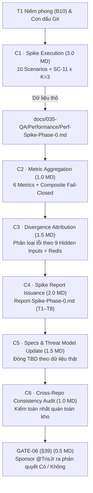

# Findings — quality-assurance

## Kết luận của worker

Sau khi rà soát toàn bộ hệ thống tài liệu kiểm thử ([`MTP-Spike-Phase-0.md`](../../../../035-QA/Test-Plans/MTP-Spike-Phase-0.md), [`Spec-Spike-Protocol.md`](../../../../030-Specs/Spec-Spike-Protocol.md), [`Template-Spike-Report.md`](../../../../999-Resources/Templates/Template-Spike-Report.md), [`T1-Pre-Registration-Spike-Phase-0.md`](../../../../035-QA/Reports/T1-Pre-Registration-Spike-Phase-0.md), [`RQ.md`](../../../../999-Resources/RQ.md)), cùng toàn bộ mã nguồn harness, runner, sampler, orchestrator, reporter (`src/spike/bench/`) và bộ unit/integration test suites (`test/spike/bench/`, `test/spike/`), em xin báo cáo phân tích toàn diện góc nhìn Quality Assurance cho Phase `P0-C` (Spike Run & Report, $W10\text{–}W12$, ngân sách 10.5 MD) như sau:

---

### 1. Rà soát Test Harness & Runners Hiện có (`src/spike/bench/`, `test/spike/bench/`)

#### 1.1 Đánh giá Kiến trúc và Năng lực Thực thi của Test Harness
Harness của Phase 0 được chia tách hoàn chỉnh thành 2 khối bổ trợ theo quyết định $D\text{-}6$ và đã qua kiểm chứng 100% PASS (33/33 tests):
- **Khối `B7a` — Production Overhead Benchmark Harness (`src/spike/bench/`)**:
  - `driver.js`: Load driver HTTP phát tải có kiểm soát concurrency, phân bổ tải chuẩn 100% traffic, >90% thành công (đường $P\text{-}discard$) và 5% lỗi tất định `402:declined` (đường $P\text{-}persist$), chạm đủ 5 dependencies.
  - `sampler.js`: Thu thập snapshot cgroup v2 (`cpu.stat`, `memory.events`, `memory.current`, `memory.peak`) và process-level fallback.
  - `gates.js`: Thi hành Resource Gates $D\text{-}12$ fail-closed (`nr_throttled = 0`, `oom_kill = 0`, `memory.peak < 90%`, 4/4 `tnm_*` running).
  - `orchestrator.js`: Điều phối đo kiểm theo chu kỳ $A/B$ xen kẽ ($OFF/ON/OFF/ON$), tự động gọi `resetOrders()` trước mỗi chặng để khử drift seq-scan ($D\text{-}11$).
  - `reporter.js`: Xuất dữ liệu đa định dạng (JSON format chuẩn MTP §3.1/§3.2, CSV, Text Summary).
- **Khối `B7b` — Fidelity Benchmark & Replay Verification Harness (`fidelity.js`, `composite.js`)**:
  - `fidelity.js`: Thực thi $K=3$ lần replay độc lập trên toàn bộ 10 scenario fixtures (`SC-1` đến `SC-10`) cộng probe `SC-11` (tổng cộng 33 runs).
  - Tích hợp trực tiếp với Replay Runtime (`src/spike/replay/`) và Verification Engine (`src/spike/verify/`), thu thập trọn vẹn: `replay_success`, `gate_verdict`, `rubric_verdict`, `final_verdict`, `execution_matched`, `capsule_size_bytes`, `duration_ms`, `first_divergence_point`, `attributed_cause`.
  - `composite.js`: Hợp nhất kết quả Fidelity và Overhead, tự động đánh giá mức độ tuân thủ 4 giả thuyết $RQ\ \S24$ và chỉ số Composite fail-closed trên mẫu số $D=7$.

#### 1.2 Đánh giá Tính sẵn sàng Xuất Dữ liệu Thô cho `Perf-Spike-Phase-0.md`
Harness đã sẵn sàng **100%** để chạy toàn bộ 10 scenarios + `SC-11` và xuất trọn vẹn các trường dữ liệu thô phục vụ lập `docs/035-QA/Performance/Perf-Spike-Phase-0.md` (task $C1$) và tổng hợp 6 metric (task $C2$):

| Nhóm dữ liệu thô | File nguồn / Module | Các trường dữ liệu xuất ra | Mức độ sẵn sàng |
|---|---|---|:---:|
| **Overhead Benchmark ($B7a$)** | `orchestrator.js`, `reporter.js` | Latency distribution (avg, P50, P95, P99) tách riêng $P\text{-}discard$ vs $P\text{-}persist$; CPU usage (%, CPU-seconds); Memory RSS (avg, peak); Network bytes (transfer, upload); Resource gates ($nr\_throttled$, $oom\_kill$, foreign container probe). | 🟢 **SẴN SÀNG** |
| **Fidelity Matrix ($B7b$)** | `fidelity.js`, `reporter.js` | Bảng 33 runs ($11 \times 3$): `scenario_id`, `iteration` ($1..3$), `in_class`, `replay_success`, `execution_matched`, `duration_ms`, `capsule_size_bytes`, `first_divergence_point`, `attributed_cause`. | 🟢 **SẴN SÀNG** |
| **Thí nghiệm Cắt $SEC\text{-}008$** | `fidelity.js`, `MTP §4.3` | Phân bố `row_count`, `byte_size`, `query_id`, `consumed_by_replay` khi cap TẮT; kết quả replay 5 mức phân vị ($P50, P75, P90, P95, P99$) + 1 control. | 🟢 **SẴN SÀNG** |
| **Bằng chứng An toàn & Destroy** | `canary.js`, `verify.sh`, `MTP §5` | `escaped_side_effects = 0` đo qua Canary log độc lập (TCP accept, HTTP sink, DB append-only audit); bằng chứng destroy độc lập 10/10 lần. | 🟢 **SẴN SÀNG** |

---

### 2. Rà soát Cấu trúc Đo lường & Tính toán 6 Metric Cốt lõi (MTP §3, Spec §4)

Cấu trúc đo lường và tính toán của 6 metric cốt lõi cùng chỉ số Composite được phân tích và chuẩn hoá như sau:

#### 2.1 Metric 1: Replay Success Rate ($R_{sr}$ / `N-01`)
- **Định nghĩa**: Tỷ lệ hoàn tất replay không bị crash / unhandled exception ở tầng replay runtime:
  $$\text{Replay Success Rate} = \frac{\text{Successfully reproduced}}{\text{Total test cases}}$$
- **Mẫu số chính thức**: $D = 7$ (tập In-Class đóng băng tại $Gate\ A$: `SC-1`, `SC-2`, `SC-3`, `SC-4`, `SC-5`, `SC-6`, `SC-8`).
- **Con số Diagnostic**: Bắt buộc in kèm tỷ lệ trên toàn bộ 10 scenarios ($y/10$).

#### 2.2 Metric 2: Execution Match Rate ($R_{em}$ thô / `N-05`)
- **Định nghĩa**: Tỷ lệ đạt trạng thái `Execution matched` theo Rubric $Spec\ \S3.4$ trên tổng số lần replay:
  $$\text{Execution Match Rate} = \frac{\text{Equivalent executions}}{\text{Total replays}}$$
- **Mẫu số danh nghĩa**: $\text{Total replays} = D \times K = 7 \times 3 = 21$ replays (diagnostic: $10 \times 3 = 30$ replays).
- **Lỗ rò của $R_{em}$ thô**: Nếu một scenario bị crash hoặc không mở được capsule, nó **biến mất khỏi mẫu số** thay vì làm xấu tỷ lệ. Nếu $3/7$ scenario replay được và cả 3 đều matched $\rightarrow$ $R_{em} = 3/3 = 100\%$ trong khi $4/7$ scenario thất bại hoàn toàn.

#### 2.3 🔺 Chỉ số Composite (Chỉ số Gate — $Spec\ \S4.6$)
- **Vai trò**: Là **chỉ số gate chính thức** để phán quyết $GATE\text{-}06$, bịt hoàn toàn lỗ rò của $R_{em}$ thô.
- **Quy tắc tính (Fail-closed ở mức scenario)**:
  - Một scenario được tính là `reproduced` $\iff$ (a) Replay chạy tới kết quả VÀ (b) **CẢ $K=3$ lần replay đều đạt verdict `Execution matched`**.
  - Bất kỳ lần replay nào crash, unhandled error, hoặc `diverged` $\rightarrow$ Scenario tính là **KHÔNG reproduced**.
  - Mẫu số **CỐ ĐỊNH** $D = 7$, không co lại khi replay bị lỗi:
    $$\text{Chỉ số Composite} = \frac{\text{Số scenario reproduced}}{D} = \frac{x}{7}$$
- **Ngưỡng hiệu dụng**: $\ge 6/7$ (~85.7%).
- **Cảnh báo độ mịn (Bắt buộc in)**: Với $D=7$, mỗi scenario tương ứng $14.3$ điểm phần trăm. Ngưỡng $\ge 80\%$ thực chất là quy tắc *"cho phép sai tối đa 1 trên 7"*. Mọi báo cáo ($C2, C4, GATE\text{-}06$) **PHẢI** dùng dạng phân số $\ge 6/7$, **CẤM** viết dưới dạng $80\%$ gây cảm giác chính xác giả.

#### 2.4 Metric 3: Capture Overhead (`N-02`, `N-06`, `N-07`, `N-08`)
- **Phạm vi đo**: 4 chiều (Latency, CPU, Memory RSS, Network byte/upload).
- **Quy tắc đo bất biến**:
  - *Nghịch lý capture trigger*: Do chỉ biết kết cục lỗi sau khi kết thúc request ($U\text{-}09$), recorder phải buffer 100% traffic. Do đó, ngân sách overhead $<5\%$ áp lên **100% traffic**, không chỉ áp trên request lỗi.
  - *Tách 2 đường riêng*: Báo cáo độc lập phân bố (avg, P50, P95, P99) của đường **$P\text{-}discard$** (request thành công, buffer $\rightarrow$ discard) và đường **$P\text{-}persist$** (request lỗi, buffer $\rightarrow$ persist).
  - *Điều kiện đo bắt buộc*: Load run dùng traffic đa số thành công (tỷ lệ lỗi ~5%), sampling `FR-015` **TẮT**, chạy $A/B$ xen kẽ ($OFF/ON/OFF/ON$), đo tại endpoint tầng ứng dụng. Mọi con số phải ghi kèm: `(N = <số request>, error_rate = 5%, sampling = OFF)`.

#### 2.5 Metric 4: Capsule Size (`N-03` avg / `N-09` P95)
- **Điểm đo chính thức**: $P\text{-}persisted$ (kích thước artifact sau redact, compress, encrypt — byte thực tế lưu trên storage).
- **Điểm đo Diagnostic**: $P\text{-}serialized$ (sau redact, trước compress) để tính tỷ lệ nén phục vụ yêu cầu chống decompression bomb của `SEC-030`.
- **Cảnh báo P95**: Với $N \approx 10$ capsule, phân vị $P95 \approx \max()$. Luật bắt buộc: Mọi vị trí in P95 phải in $N$ ngay cạnh: `P95 = <val> (N = <số capsule>)`. $C5$ **CẤM** đóng ngưỡng `N-09` nếu không khai báo $N$.

#### 2.6 Metric 5: Replay Time (`N-04`)
- **Cửa sổ đo**: Từ khi gõ lệnh `repro replay` đến khi verification verdict phát ra.
- **Breakdown 3 thành phần**: $t_{boot}$ (boot test app) + $t_{replay\_exec}$ (thực thi replay) + $t_{verify}$ (so khớp rubric). Thời gian $t_{pull}$ đo riêng, **không cộng** vào `N-04`.
- **Ghi cùng dòng**: Bắt buộc ghi kích thước capsule của chính capsule đó trên cùng dòng dữ liệu replay time.

#### 2.7 Metric 6: `escaped_side_effects` (Target = 0)
- **Căn cứ**: $RQ\ \S13$ (*"must never"*) và `ADR-005` (Bằng chứng chấp nhận cho rủi ro Critical `THREAT-018`).
- **Nguồn sự thật**: **CANARY LOG ĐỘC LẬP** (TCP accept, HTTP sink, DB append-only audit), phủ toàn bộ $10 \times 3 = 30$ runs, probe `SC-11` và 12 test $T1$–$T12$.
- ⛔ **CẤM TUYỆT ĐỐI**: Dùng log của chính replay runtime làm bằng chứng an toàn (xác minh vòng tròn). Canary phải lắng nghe cả trên loopback để phát hiện residual risk của `T12`.

---

### 3. Đánh giá Phương pháp Lập Báo cáo Spike Report ($C4$) & Đối chiếu 4 Giả thuyết $RQ\ \S24$

#### 3.1 Cấu trúc 8 Bảng Bắt buộc `T1`–`T8` theo `Template-Spike-Report.md`
Báo cáo chính thức [`Report-Spike-Phase-0.md`](../../../../035-QA/Reports/Report-Spike-Phase-0.md) ($C4$) phải tuân thủ nghiêm ngặt 8 bảng chuẩn:
1. **`T1` — Khai báo Tiền Đăng Ký**: Đã niêm phong tại `T1-Pre-Registration-Spike-Phase-0.md` ($Gate\ A$). Đóng băng $D=7$, $K=3$, chữ ký lỗi $M\text{-}5$, verdict kỳ vọng và con dấu 11 manifests.
2. **`T2` — 6 Metric + Chỉ số Composite + Điều kiện đo**: Bắt buộc xuất hiện **cả 3 con số**: $R_{sr}$ (dòng 1), $R_{em}$ thô (dòng 2, mẫu số co khi lỗi) và **Chỉ số Composite** (dòng 7, chỉ số gate, mẫu số cố định $D=7$).
3. **`T3` — Bảng Per-Scenario**: Chi tiết $11 \times 3$ runs, ghi nhận First Divergence Point và lớp quy trách nhiệm. Dòng `SC-11` bắt buộc có mặt và phải ra `diverged` + `incomplete-capture`.
4. **`T4` — Ma trận Attribution**: Phân loại các ca fail theo 9 hidden inputs $RQ\ \S20.1$ + **cột riêng Redis/Cache state** (Quyết định `G1`).
5. **`T5` — Phân bố $SEC\text{-}008$ & Thí nghiệm Cắt**: Bảng phân bố $T5.a$ (cap TẮT) và bảng thí nghiệm cắt 5 mức phân vị $T5.b$ + 3 ô khai báo bắt buộc + Cảnh báo dữ liệu synthetic.
6. **`T6` — Đối chiếu §24**: Đối chiếu số đo với 4 giả thuyết ban đầu.
7. **`T7` — Confidence & Limitations**: Liệt kê đầy đủ 9 giới hạn bắt buộc (cỡ mẫu $N$ nhỏ, synthetic workload, rủi ro 4 nhóm hidden inputs loại trừ bằng lời khai, điểm yếu rubric $W1$–$W7$, khoảng hở đã đo được của $T8$/$T12$, tỷ lệ `unattributed`).
8. **`T8` — Trả lời §39**: Trình bày chỉ số Composite so với ngưỡng hiệu dụng $\ge 6/7$, làm cơ sở cho Sponsor `@TrisJr` ra phán quyết nhị phân Có/Không tại $GATE\text{-}06$.

#### 3.2 Đối chiếu 4 Giả thuyết Ban đầu $RQ.md\ \S24$
Tại bảng `T6`, mọi phát biểu so sánh phải gắn nhãn cứng: `initial hypothesis — không phải tiêu chí nghiệm thu`:

| Giả thuyết §24 | Ngưỡng giả thuyết | Dạng hiệu dụng / Cách đối chiếu trong Spike Report | Nhãn bắt buộc |
|---|---|---|---|
| **[H1] Deterministic reproduction** | $\ge 80\%$ meaningful deterministic test cases reproduced | So sánh với **Chỉ số Composite** ($T2$ dòng 7) trên dạng hiệu dụng **$\ge 6/7$** (~85.7%), kèm ngữ cảnh của $R_{sr}$ và $R_{em}$ thô. | `initial hypothesis — không phải tiêu chí nghiệm thu` |
| **[H2] Latency overhead** | $< 5\%$ production latency overhead | So sánh với delta latency của đường **$P\text{-}discard$** và delta chung, kèm $N$, tỷ lệ lỗi 5%, sampling = OFF. | `initial hypothesis — không phải tiêu chí nghiệm thu` |
| **[H3] Capsule size** | $< 10\text{ MB}$ average capsule size | So sánh với giá trị **avg capsule size** tại điểm đo $P\text{-}persisted$, kèm P95 và $N$ capsule. | `initial hypothesis — không phải tiêu chí nghiệm thu` |
| **[H4] Replay time** | $< 30\text{ seconds}$ replay time | So sánh với **avg replay time** ($N\text{-}04$), kèm breakdown $t_{boot}/t_{replay\_exec}/t_{verify}$ và kích thước capsule tương ứng. | `initial hypothesis — không phải tiêu chí nghiệm thu` |

#### 3.3 Rà soát 8 Phát biểu CẤM Tuyệt đối trong Spike Report ($Template\ \S3.2$)
QA sẽ đóng vai trò người gác cổng kiểm duyệt, từ chối mọi bản thảo $C4$ vi phạm 8 điều cấm sau:
1. ⛔ **CẤM** viết: *"Production bug đã được sửa"* / *"đã hết"* / *"definitely fixed"* (Vi phạm $RQ\ \S20.16$, rủi ro `R-07` False Confidence). Chỉ được viết: *"Captured execution no longer reproduces"*.
2. ⛔ **CẤM** phán: *"đạt §24"* / *"không đạt §24"* / *"pass"* / *"fail"* dựa trên 4 số $\S24$ (vì chúng là initial hypotheses, không phải acceptance criteria).
3. ⛔ **CẤM** nâng bất kỳ hypothesis nào thành **ĐỊNH NGHĨA SẢN PHẨM** (đây là nhiệm vụ của $D2$ thuộc Phase $P1$).
4. ⛔ **CẤM** đề xuất con số ngưỡng cụ thể cho `N-05`, `N-09`, `SEC-008` (row/byte cap) ngay trong report (nhiệm vụ của $D1$ và $C5$). Report chỉ cấp phân bố.
5. ⛔ **CẤM** kết luận: *"Diverged vì non-determinism"* khi checklist known-missing-capture chưa được loại trừ. Non-determinism bắt buộc phải được chứng minh bằng thực nghiệm ($K=3$ lần cho khác verdict).
6. ⛔ **CẤM** viết: *"Repro hoạt động"* / *"core loop đã được validate"* chung chung không kèm phạm vi Supported Execution Class và Rubric.
7. ⛔ **CẤM** gộp thầm `unattributed` vào nhãn `code`.
8. ⛔ **CẤM** làm nhẹ, bỏ qua, hoặc ghi *"ngoài phạm vi"* cho test $T8$ ($child\_process$) hoặc $T12$ ($loopback$) của ma trận $\S5.3$ MTP.

---

### 4. Kế hoạch Thực thi & Quản trị Rủi ro QA cho Phase `P0-C`

#### 4.1 Phân công Trách nhiệm & Dòng Chảy Deliverables ($C1$–$C6$, $GATE\text{-}06$)

| Task | MD | Owner / Collab | Deliverable chính | Trọng tâm kiểm soát QA |
|---|:---:|---|---|---|
| **`C1`** | **3.0** | 🧪 **QA** (lead) 🧑‍💻 Dev, ⚙️ DevOps | `docs/035-QA/Performance/Perf-Spike-Phase-0.md` | Kiểm tra điều kiện tiên quyết (con dấu $T1$ ô 6). Chạy đủ $11 \times 3$ runs $\times$ 7 bước. Thu thập bằng chứng destroy độc lập và canary log sau mỗi run. Đảm bảo cap TẮT 100%. |
| **`C2`** | **1.0** | 🧪 **QA** (lead) ⚙️ DevOps | Bảng số trong `Perf-Spike-Phase-0.md` | Tính toán chính xác 6 metric. Xuất cả 3 chỉ số ($R_{sr}$, $R_{em}$ thô, Composite). Định dạng đúng `P95 (N=...)` và điều kiện đo. |
| **`C3`** | **1.5** | 🏗️ **Architect** (lead) 🧪 QA, 🕵️ BA | Mục phân tích trong Spike Report | Giám sát thủ tục quy trách nhiệm 6 bước. Xác nhận probe `SC-11` ra đúng `incomplete-capture`. Điền ma trận $T4$. |
| **`C4`** | **2.0** | 🧪 **QA** (lead) 🎩 PM, 🏗️ Architect | `docs/035-QA/Reports/Report-Spike-Phase-0.md` | Điền trọn vẹn 8 bảng $T1$–$T8$. Kiểm duyệt 100% không vi phạm 8 điều cấm. Giữ nguyên tính nhị phân của đề xuất $GATE\text{-}06$. |
| **`C5`** | **1.5** | 🕵️ BA (lead) 🛡️ Security, 🎩 PM | `NFR-Repro.md`, `Risk-Register.md`, `Spec-Security-*.md` | Đối chiếu số liệu $SEC\text{-}008$ với cảnh báo synthetic workload. Chỉ đóng $TBD$ khi có dữ liệu thực chứng đầy đủ theo `Spec §1.3`. |
| **`C6`** | **1.0** | 🔍 **Context Auditor** (lead) 🎩 PM | `pm-runs/{run}/findings/context-auditor.md` | Rà soát cross-link, kiểm tra tính nhất quán số liệu giữa NFR, MTP, Perf và Report. |
| **`G06`** | **0.5** | 👤 **`@TrisJr`** (Sponsor) 🎩 PM, 🏗️ Architect | `pm-runs/{run}/verdict.md` | Cung cấp đầy đủ bằng chứng thực nghiệm để Sponsor ra phán quyết **Có** hoặc **Không**. |

#### 4.2 Bốn Rủi ro QA Trọng yếu & Biện pháp Phòng ngừa
1. **Rủi ro R-QA1: Vô tình BẬT Cap khi chạy $C1$ $\rightarrow$ Kiểm duyệt đuôi phân bố $SEC\text{-}008$**:
   - *Hệ quả*: Đuôi dữ liệu bị cắt, mất vĩnh viễn sau khi destroy môi trường gốc $\rightarrow$ buộc phải rerun toàn bộ $C1$ (tiêu sạch 30% đệm của Phase 0).
   - *Biện pháp*: QA kiểm tra cấu hình recorder trước khi phát tải, xác nhận biến môi trường cap ở chế độ vô hạn/TẮT.
2. **Rủi ro R-QA2: Sử dụng nhầm $R_{em}$ thô làm chỉ số phán quyết Gate thay vì Composite Index**:
   - *Hệ quả*: Lọt lỗ rò thống kê khi có scenario không chạy được replay.
   - *Biện pháp*: Bắt buộc in cả 3 chỉ số tại $T2$ và dùng chỉ số Composite tại $T6$, $T8$.
3. **Rủi ro R-QA3: Báo cáo P95/P99 không khai báo cỡ mẫu $N$**:
   - *Hệ quả*: Tạo cảm giác chính xác giả trên cỡ mẫu nhỏ ($N \approx 10$).
   - *Biện pháp*: Thực thi luật in $N$ bắt buộc: `P95 = <val> (N = <số mẫu>)`.
4. **Rủi ro R-QA4: Đánh giá an toàn dựa trên log của chính Replay Runtime**:
   - *Hệ quả*: Rơi vào bẫy xác minh vòng tròn; không phân biệt được write bị chặn với write bị rò rỉ khi gặp $ECONNREFUSED$.
   - *Biện pháp*: Bắt buộc lấy số liệu `escaped_side_effects` từ Canary Log độc lập và kiểm tra cả listener loopback.

---

STATUS: DONE
FILES_TOUCHED: docs/010-Planning/pm-runs/2026-08-28-p0c-spike-run-report/findings/quality-assurance.md
SUMMARY: Đã hoàn tất phân tích QA toàn diện cho Phase P0-C. Rà soát test harness và xác nhận tính sẵn sàng 100% để chạy 10 scenarios + SC-11 (K=3) xuất dữ liệu thô cho Perf-Spike-Phase-0.md. Chuẩn hoá cấu trúc đo lường và tính toán của 6 metric cốt lõi cùng chỉ số Composite fail-closed (D=7, ngưỡng >= 6/7). Thiết lập chặt chẽ phương pháp lập Spike Report (C4) theo Template-Spike-Report.md, đối chiếu 4 giả thuyết RQ §24 và thiết lập chốt chặn kiểm duyệt 8 điều cấm ngôn từ bảo vệ tính khách quan cho GATE-06.
