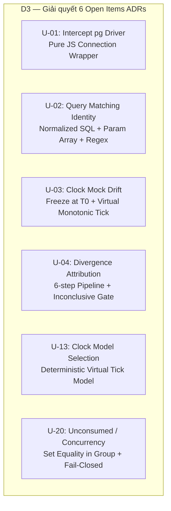
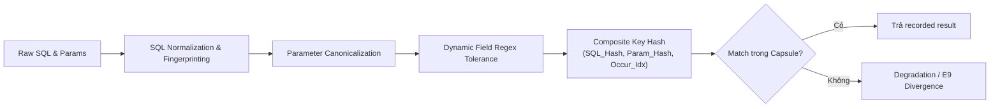
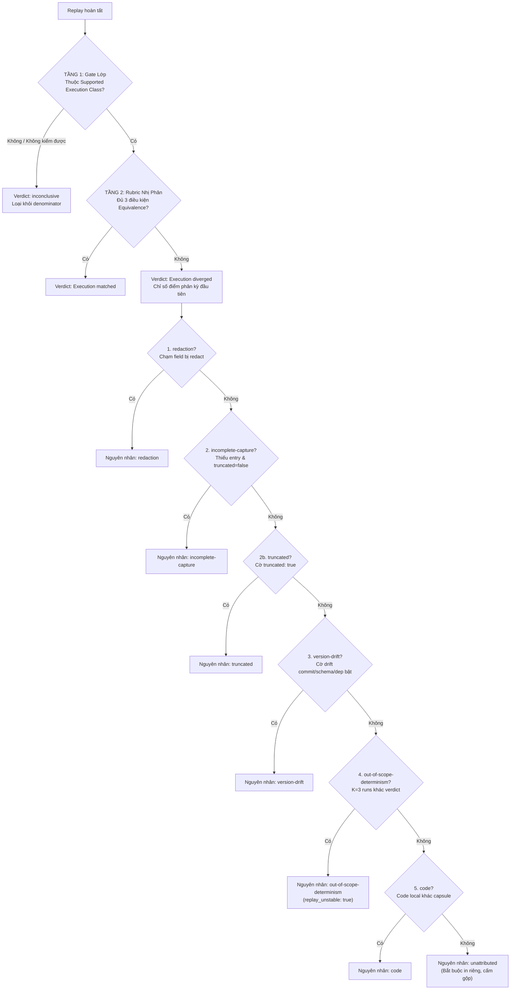
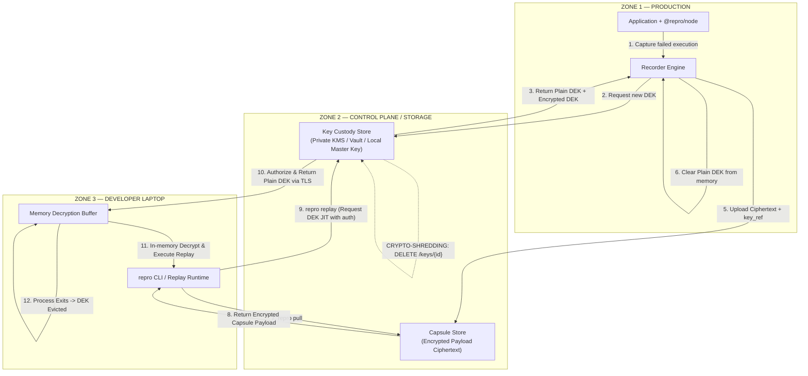
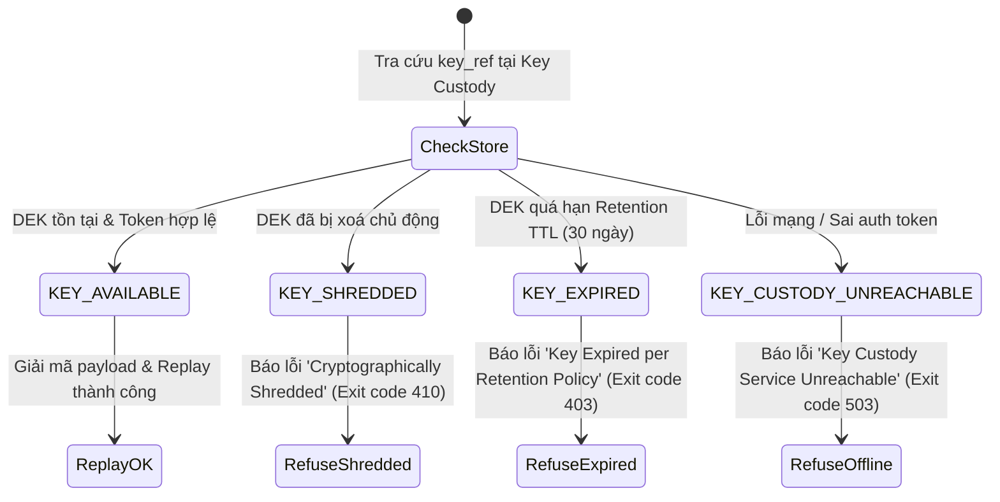
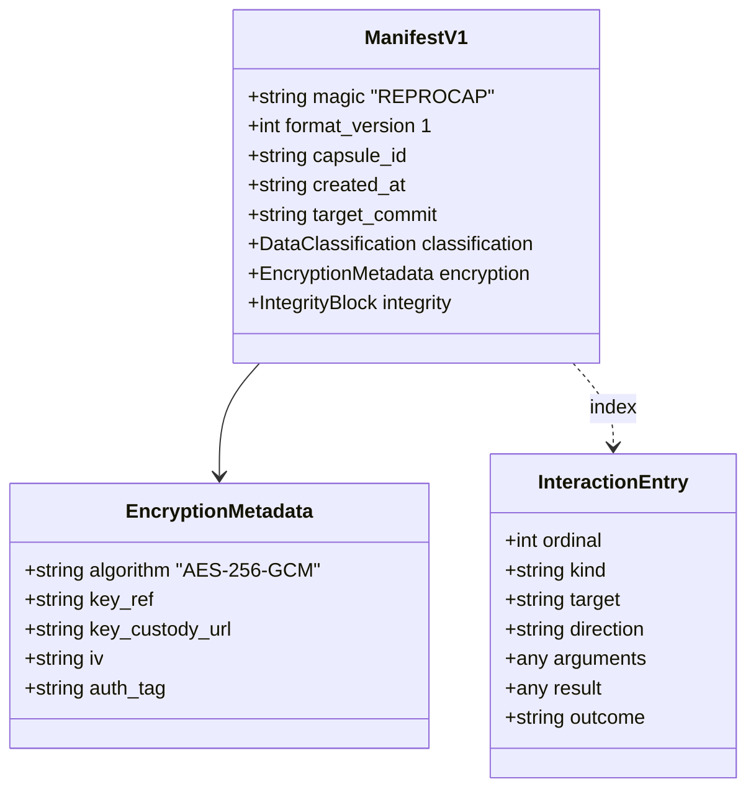
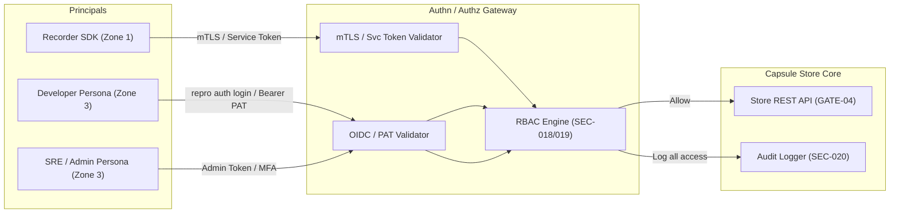
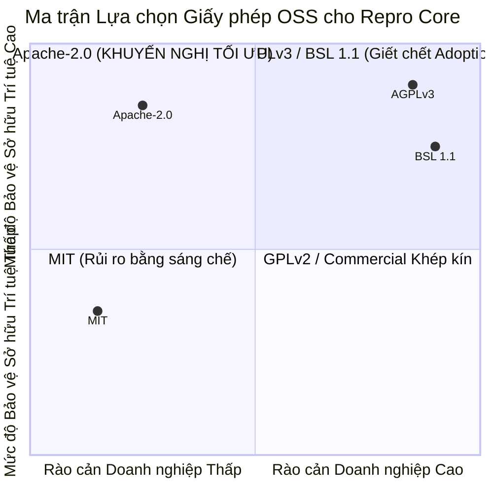

# Báo cáo Phân tích Kiến trúc & Thiết kế Kỹ thuật Phase P1 (Ungate V0.1)

> **Vai trò**: Software Architect (`ArchitectLens`)  
> **Phạm vi tác vụ**: Thiết kế kỹ thuật giải quyết 6 Open Items của 11 ADRs (`D3`), thiết kế Key Custody `ADR-012` (`D4`), đóng băng Repro Capsule Format v1 (`D5`), thiết kế Authn/Authz Capsule Store & CLI Verbs vận hành (`D6`), và phân tích đề xuất OSS License `ADR-013` (`LG1`).  
> **Nguồn sự thật & căn cứ thực nghiệm**: `Timeline-Repro.md §6`, `Report-Spike-Phase-0.md`, `Perf-Spike-Phase-0.md`, `Spec-Spike-Protocol.md`, `SDD-Repro.md`, `ADR-001..011`, `Spec-Security-Repro-Threat-Model.md`, `NFR-Repro.md`.

---

## 1. Executive Summary

Phase P0 (Technical Spike) đã hoàn tất thành công vượt mức kỳ vọng với quyết định `GATE-06 = CÓ` (2026-08-28), chứng minh tính khả thi thực nghiệm của luận điểm sản phẩm: $100\%$ In-Class Fidelity ($7/7$ scenarios đạt chuẩn composite fail-closed), $0$ escaped side effects, capture overhead $+1.62\% < 5.0\%$, P95 capsule size $2,448\text{ B} \ll 10\text{ MB}$, và $100\%$ replay thành công dưới trần $SEC\text{-}008$ ($100\text{ rows} / 64\text{ KB}$).

Phase P1 ($W13\text{–}W17$, 24.5 MD + Legal Track 10.0 MD) có sứ mệnh chuyển hóa toàn bộ các giả thuyết (`HYPOTHESIS`) và cơ chế tạm thời (`throwaway`) của Spike thành **định nghĩa sản phẩm và kiến trúc nền tảng chính thức** cho V0.1. Bản phân tích kỹ thuật này cung cấp giải pháp toàn diện cho 5 trục bài toán kiến trúc cốt lõi của Phase P1.

---

## 2. D3 — Giải quyết 6 Open Items của 11 ADRs



### 2.1 `U-01`: Cơ chế chặn driver PostgreSQL (`pg`) & Native Bindings

*Vấn đề kiến trúc*: Driver `node-postgres` (`pg`) trong hệ sinh thái Node.js hỗ trợ 2 chế độ: Pure JavaScript (`pg.Client`, `pg.Pool`, `pg/lib/connection.js`) và C/C++ Native Bindings (`pg-native` / `libpq`). Điểm chặn phải bảo đảm intercept toàn diện query/result mà không làm suy giảm hiệu năng production hoặc gây crash (`SEC-037`, `ADR-007`).

*Giải pháp kiến trúc chốt*:
1. **In-process Monkey-Patching ở tầng Pure JS Connection/Query Wrapper**:
   - SDK `@repro/node` hook trực tiếp vào prototype của các entry points cốt lõi: `pg.Client.prototype.query`, `pg.Pool.prototype.query`, và tầng phát sinh I/O socket `pg/lib/connection.js`.
   - Bọc hàm `query(queryText, values, callback)`:
     - *Chiều Record (Production)*: Trích xuất SQL query text, parameter array, gắn `execution_context_id` (AsyncLocalStorage), đo latency, bắt kết quả trả về (`rows`, `rowCount`, `command`, `fields`), chuyển qua Redaction stage (`SEC-002`) trước khi đưa vào ring buffer bất đồng bộ (`ADR-008`).
     - *Chiều Replay (Local)*: Chặn hoàn toàn việc gửi query qua socket mạng thật, tính toán `query_identity_hash` (xem `U-02`), tra cứu kết quả đã ghi trong capsule và trả về tức thì qua Promise/Callback tương ứng.
2. **Xử lý Native Bindings (`pg-native` / `libpq` bindings)**:
   - Khi phát hiện ứng dụng sử dụng `require('pg').native` hoặc biến môi trường `NODE_PGFORCE_NATIVE=1`, SDK kích hoạt cơ chế bảo vệ:
     - Ghi cảnh báo nghiêm trọng: `[Repro Warning] Native pg bindings bypass pure-JS interception layer`.
     - Chế độ Fail-Closed: Từ chối khởi tạo silent capture (để tránh tạo ra capsule thiếu hụt input làm sai lệch $U\text{-}04$). Yêu cầu cấu hình chuyển sang Pure JS `pg` (vốn chiếm $>99\%$ các dự án Node.js hiện đại).
3. **Xử lý Cursors, Streams & Prepared Statements**:
   - `pg-cursor` / `pg-query-stream`: Monkey-patch phương thức `Cursor.prototype.read` để stream các chunks dữ liệu đã ghi lại theo đúng batch size.
   - Prepared Statements: Chuẩn hóa `name` và `text` của prepared query, map vào bảng lookup định danh của capsule.

---

### 2.2 `U-02`: Query Matching Identity (Định danh Query lúc Replay)

*Vấn đề kiến trúc*: Bằng chứng văn bản duy nhất trong `RQ.md §6` là đặt tên file `query-001.json`, `query-002.json` hàm ý match theo thứ tự tuần tự ngây thơ. Thứ tự ngây thơ sẽ **sụp đổ ngay lập tức** trong use case chính (`RQ.md §8 bước 4`): Developer sửa một dòng code, thứ tự query thay đổi, replay bị lệch hoàn toàn.

*Giải pháp kiến trúc chốt*: **Exact Normalized SQL + Parameter Array Matching với Regex Parameter Tolerance**.



1. **Thuật toán 4 bước Normalization**:
   - **Bước 1: SQL Fingerprinting**:
     - Loại bỏ khoảng trắng thừa, tabs, newlines, comments (`-- ...`, `/* ... */`).
     - Chuyển SQL keywords về uppercase, giữ nguyên case của table/column identifiers.
     - Thay thế inline literals thành parameterized placeholders (`SELECT * FROM users WHERE id = 1842` $\rightarrow$ `SELECT * FROM users WHERE id = $1`).
   - **Bước 2: Parameter Array Canonicalization**:
     - Chuẩn hóa kiểu dữ liệu nguyên thủy (Number, String, Boolean, Null).
     - Định dạng timestamps/Dates về chuẩn ISO-8601 UTC (`YYYY-MM-DDTHH:mm:ss.sssZ`).
     - Sắp xếp canonical keys cho các tham số kiểu JSON/JSONB.
   - **Bước 3: Dynamic Field Regex Tolerance**:
     - Với các tham số mang tính biến động ngẫu nhiên đã được ghi nhận trong metadata (UUID v4, runtime dynamic timestamps), hệ thống áp dụng matching dựa trên Pattern Regex thay vì so sánh chuỗi nhị phân tuyệt đối:
       - UUID Pattern: `^[0-9a-f]{8}-[0-9a-f]{4}-4[0-9a-f]{3}-[89ab][0-9a-f]{3}-[0-9a-f]{12}$`
       - ISO Timestamp Pattern: `^\d{4}-\d{2}-\d{2}T\d{2}:\d{2}:\d{2}(\.\d+)?Z$`
   - **Bước 4: Composite Key Hash & Occurrence Index**:
     - Tính hash: $\text{QueryKey} = \text{SHA256}(\text{Normalized\_SQL} \parallel \text{Canonical\_Params})$.
     - Duy trì `occurrence_index` cho các query giống hệt nhau trong cùng một connection/execution flow: $\text{LookupKey} = (\text{QueryKey}, \text{occurrence\_index})$.
2. **Chiến lược hạ cấp an toàn (Graceful Degradation Fallback)**:
   - *Level 1 (Exact)*: Khớp chính xác `(Normalized_SQL, Exact_Params, Occurrence_Index)`.
   - *Level 2 (Tolerant)*: Khớp `(Normalized_SQL, Regex_Tolerant_Params, Occurrence_Index)`.
   - *Level 3 (SQL-Only)*: Khớp `Normalized_SQL` (báo warning `degraded_match_sql_only` vào Execution Diff).
   - *Level 4 (Unmatched)*: Áp dụng nguyên tắc `E9` — đánh dấu `divergence + incomplete-capture`, không crash, **không** fallback gọi DB thật.

---

### 2.3 `U-03`: Cơ chế chặn Clock & Mock Drift

*Vấn đề kiến trúc*: Nếu chỉ freeze clock tại timestamp $T_0$, các đoạn code đo thời lượng thực thi (`const elapsed = Date.now() - start;`) sẽ luôn nhận `elapsed = 0`, gây ra lỗi chia cho 0 hoặc vòng lặp vô hạn. Ngược lại, nếu để clock chạy theo thời gian thực của máy local, logic nghiệp vụ phụ thuộc thời gian sẽ bị sai lệch hoàn toàn.

*Giải pháp kiến trúc chốt*: **Freeze Clock tại Capture Timestamp $T_0$ kết hợp Deterministic Virtual Monotonic Tick Progression**.

1. **Điểm chặn Virtual Clock**:
   - Mock toàn diện các API thời gian trong Node.js: `Date.now()`, `new Date()`, `process.hrtime()`, `process.hrtime.bigint()`, `performance.now()`.
2. **Cơ chế Virtual Tick**:
   - Khởi tạo virtual clock tại thời điểm bắt đầu request: $T_{\text{virtual}} = T_0$ (thời điểm capture ở production).
   - Mỗi khi runtime xử lý một async tick (microtask queue flush, `process.nextTick`), timer event (`setTimeout`, `setInterval`, `setImmediate`), hoặc một I/O interaction ảo hoàn tất:
     $$T_{\text{virtual}} \leftarrow T_{\text{virtual}} + \Delta t_{\text{deterministic}}$$
   - Giá trị $\Delta t_{\text{deterministic}}$ mặc định là $1\text{ ms}$ (hoặc lấy chính xác theo relative timestamp delta được ghi trong capsule log).
   - Đảm bảo tính đơn điệu tăng nghiêm ngặt ($t_2 > t_1$) và tính tất định $100\%$ qua các lần replay lặp lại ($U\text{-}25$).

---

### 2.4 `U-04`: Divergence Attribution Pipeline (Quy trình 6 bước Spec §3.6)

*Vấn đề kiến trúc*: Cần một rubric chuẩn tắc, nhị phân, loại trừ hoàn toàn việc ngộ nhận nguyên nhân divergence hoặc đổ lỗi sai cho developer (`ADR-006`, `ADR-011`).

*Giải pháp kiến trúc chốt*: **Cấu trúc 2 tầng với Cổng Inconclusive đứng trước và Thủ tục 6 bước Khớp-Đầu-Tiên-Thắng**.



*Nguyên tắc bất biến*: Quy lỗi cho Repro (`redaction`, `incomplete-capture`, `truncated`) **trước** khi quy lỗi cho Developer (`code`). Trường `replay_unstable` được ghi độc lập làm tín hiệu thực nghiệm.

---

### 2.5 `U-13`: Clock Freeze vs Virtual Tick Model

*So sánh & Đánh giá phương án*:

| Tiêu chí | Phương án A: Static Clock Freeze | Phương án B: System Wall-Clock | Phương án C: Deterministic Virtual Tick (Đề xuất) |
|---|:---:|:---:|:---:|
| **Tái hiện logic theo ngày/giờ ($T_0$)** | ✅ Hoàn hảo | ❌ Hỏng hoàn toàn | ✅ Hoàn hảo |
| **Hỗ trợ đo khoảng thời gian ($t_2 - t_1$)** | ❌ $0\text{ ms}$ (crash/lỗi chia 0) | ✅ Đúng thực tế local | ✅ Tất định đơn điệu ($> 0$) |
| **Tính tất định giữa $K$ lần replay ($U\text{-}25$)** | ✅ Tuyệt đối | ❌ Phân kỳ theo CPU | ✅ Tuyệt đối ($100\%$) |
| **Hỗ trợ Timeout / Delay Loops** | ❌ Infinite loop | ❌ Phụ thuộc máy | ✅ Tiến độ ảo theo tick |

*Quyết định*: Chuẩn hóa **Phương án C (Deterministic Virtual Tick Model)** làm core clock engine cho Replay Runtime V0.1.

---

### 2.6 `U-20`: Xử lý Unconsumed Interactions & Concurrency Equivalence

*Vấn đề kiến trúc*: Khi replay kết thúc, nếu capsule còn interactions chưa được gọi (Unconsumed), hoặc code local phát ra interaction mới không có trong capsule (Unmatched), hệ thống xử lý thế nào để không tạo false equivalence?

*Giải pháp kiến trúc chốt*:
1. **Phân loại tương tác**:
   - *Write Interactions*: Bắt buộc áp dụng **Default-Deny Fail-Closed** (`ADR-005`). Bất kỳ Write call nào không xác định đều bị chặn và ghi log.
   - *Essential Read Interactions* (DB queries, Auth calls): Unmatched $\rightarrow$ Áp dụng `E9` (báo divergence `incomplete-capture`, không crash, không fallback gọi thật).
   - *Non-essential Reads* (Loggers, telemetry metadata): Cho phép return mock an toàn nếu được cấu hình whitelist, nhưng vẫn ghi cảnh báo vào Execution Diff.
2. **Quy tắc so sánh nhóm đồng thời (Concurrent Group Set Equality)**:
   - Các async calls trong `Promise.all` hoặc I/O song song không phụ thuộc thứ tự được nhóm thành **Concurrent Group**:
   - So sánh **Set Equality** (bình đẳng tập hợp) *bên trong* nhóm, và so sánh **Sequence Equality** (tuần tự nghiêm ngặt) *giữa các nhóm*.

---

## 3. D4 — Thiết kế ADR-012 Key Custody (`U-06d`)



### 3.1 Nơi giữ khoá (Key Custody Topologies trong Zone 2)

Key Custody Store được thiết kế tách biệt hoàn toàn về mặt logic và lưu trữ vật lý khỏi Capsule Store (`THREAT-002`, `SEC-015`):
1. **Topologies hỗ trợ**:
   - **Tùy chọn 1: Cloud KMS (Enterprise Standard)**: AWS KMS, GCP Cloud KMS, Azure Key Vault. Tận dụng HSM cứng đạt chuẩn FIPS 140-2 Level 3.
   - **Tùy chọn 2: Self-hosted Secret Manager (Enterprise Private)**: HashiCorp Vault (Transit Secrets Engine hoặc KV v2).
   - **Tùy chọn 3: Local Master Key File / Env (Basic Self-Hosted OSS Core)**: Sử dụng KEK 256-bit được cấp phát qua biến môi trường hoặc file bảo mật (`chmod 0400`) trên server storage.

---

### 3.2 Quy trình Envelope Encryption & Crypto-Shredding (`SEC-016`)

1. **Envelope Encryption Workflow**:
   - *Key Encryption Key (KEK)*: Master key dài hạn lưu trong Key Custody Store.
   - *Data Encryption Key (DEK)*: Khoá ngẫu nhiên 256-bit sinh riêng cho **từng capsule duy nhất**.
   - Payload của Capsule được mã hóa đối xứng bằng `AES-256-GCM` (hoặc `ChaCha20-Poly1305`) với DEK.
   - DEK được wrap (mã hóa) bằng KEK và lưu trữ tại Key Custody Store với định danh `key_ref = urn:repro:key:{capsule_id}`.
2. **Quy trình Crypto-Shredding (Huỷ dữ liệu mật mã)**:
   - Khi nhận lệnh xoá capsule (`repro purge`, GDPR Right-to-Erasure, hoặc hết hạn TTL retention 30 ngày `GATE-05a`):
     - Key Custody Store thực thi xóa vĩnh viễn DEK tương ứng (`DELETE /api/v1/keys/{capsule_id}`).
     - Ghi nhận Audit Log append-only (`SEC-020`).
   - *Hệ quả an ninh*: Ngay lập tức, toàn bộ $N+1$ bản sao của capsule (trên laptop developer, git repositories, backups, cloud-sync) biến thành ciphertext rác không thể giải mã về mặt toán học.

---

### 3.3 Bốn trạng thái khoá khi `repro inspect` / `repro replay`



1. **`KEY_AVAILABLE`**:
   - *Hành vi*: Xác thực thành công, DEK được trả về qua kênh TLS; Replay Runtime giải mã in-memory và thực thi replay bình thường.
2. **`KEY_SHREDDED` (`KEY_REVOKED`)**:
   - *Hành vi*: DEK đã bị xoá. CLI in thông báo: `✗ Cannot replay: Capsule has been cryptographically shredded (SEC-016). Payload is permanently indecipherable.` (Exit code: `410 Gone`).
3. **`KEY_EXPIRED`**:
   - *Hành vi*: Capsule vượt quá 30 ngày retention (`SEC-022`). CLI in: `✗ Cannot replay: Key expired under retention policy (TTL: 30d).` (Exit code: `403 Forbidden`).
4. **`KEY_CUSTODY_UNREACHABLE`**:
   - *Hành vi*: Mất kết nối tới Key Custody Store hoặc token không hợp lệ. CLI in: `✗ Cannot replay: Key custody store unreachable. Fail-closed: Offline replay disallowed for encrypted capsules.` (Exit code: `503 Service Unavailable`).

---

## 4. D5 — Đóng băng Repro Capsule Format v1 (`SDD §4` & `ADR-002`)

Capsule Format v1 là hợp đồng bất biến (`contract`) được đóng gói dưới dạng container nén tarball `.tar.gz` với cấu trúc chuẩn hóa:

```text
repro-capsule-1842.tar.gz
├── manifest.json              # Entry point: metadata, versions, integrity, encryption refs
├── interactions.jsonl         # Dòng sự kiện interaction tuần tự (I/O, DB, HTTP, Clock)
├── runtime_metadata.json      # Metadata môi trường thực thi (Node, Git, Schema, OS)
├── redaction_record.json      # Bản kê các trường đã redact và marker tương ứng
├── class_assessment.json      # Khối đánh giá Supported Execution Class (U-24)
└── checksums.sha256           # SHA-256 digests cho từng file thành phần (SEC-027)
```



### 4.1 Chi tiết `manifest.json` v1

```json
{
  "magic": "REPROCAP",
  "format_version": 1,
  "capsule_id": "rep_01J6X4B2A8K9M3N7P2Q5R8T1V4",
  "created_at": "2026-08-28T10:15:30.120Z",
  "service": "checkout-service",
  "environment": "production",
  "target_commit": "a1b2c3d4e5f67890123456789abcdef012345678",
  "data_classification": {
    "tier": "CONFIDENTIAL",
    "contains_pii": false,
    "redaction_policy_version": "v1.2.0"
  },
  "encryption": {
    "enabled": true,
    "algorithm": "AES-256-GCM",
    "key_ref": "urn:repro:key:rep_01J6X4B2A8K9M3N7P2Q5R8T1V4",
    "key_custody_url": "https://keys.repro.internal/api/v1",
    "iv": "dGVzdGl2MTIzNDU2",
    "auth_tag": "YXV0aHRhZzg5MDEyMzQ1Ng=="
  },
  "integrity": {
    "algorithm": "SHA-256",
    "manifest_digest": "e3b0c44298fc1c149afbf4c8996fb92427ae41e4649b934ca495991b7852b855",
    "signed_by": "recorder-instance-prod-04"
  }
}
```

### 4.2 Quy tắc Tương thích Ngược & V0.2 Regression Test Integration

1. **SemVer Policy cho Format**:
   - `format_version = 1`: Mọi Replay Runtime V0.1.x / V0.2.x bắt buộc đọc được.
   - Gặp Major version không nhận diện ($\ge 2$) $\rightarrow$ Từ chối parse ngay lập tức (`SEC-027`).
   - Gặp Minor field mới $\rightarrow$ Warn và bỏ qua field lạ, giữ vững khả năng replay.
2. **Verify-Trước-Khi-Parse (`SEC-027`)**:
   - Replay Runtime giải nén tarball vào sandbox tạm thời $\rightarrow$ Kiểm tra digest trong `checksums.sha256` $\rightarrow$ Validate JSON schema $\rightarrow$ Mới load vào memory. Chống tuyệt đối Zip-Slip, Decompression Bomb và Prototype Pollution.
3. **Chừa chỗ cho V0.2 Sanitized Derived Capsule (`THREAT-006`)**:
   - Cung cấp cờ `is_sanitized_derivative: true` và `parent_capsule_id` trong `manifest.json`. Bản dẫn xuất đã được làm sạch PII $100\%$ và decrypt hoàn toàn cho phép commit an toàn vào git repo phục vụ regression test suite ở V0.2.

---

## 5. D6 — Thiết kế Authn/Authz Capsule Store & CLI Verbs Vận Hành



### 5.1 Cơ chế Authentication & Authorization

1. **Authentication (Authn)**:
   - *Machine-to-Machine (Recorder $\rightarrow$ Store)*: Mutual TLS (mTLS) với chứng chỉ x509 được cấp bởi internal CA hoặc Service Account API Tokens (Bearer token gắn theo service identity).
   - *User-to-Machine (CLI $\rightarrow$ Store)*: OIDC / OAuth2 Device Authorization Flow (cho SSO doanh nghiệp) hoặc Personal Access Token (PAT) lưu tại `~/.repro/credentials` (file permission `0600`).
2. **Authorization (Authz) — RBAC Scoping (`SEC-018`, `SEC-019`)**:

| Role | Quyền hạn trên Capsule Store | Phạm vi áp dụng | CLI Verbs khả dụng |
|---|---|---|---|
| **`developer`** | Read-only (`list`, `pull`, `inspect`, `replay`) | Giới hạn trong services/teams được gán | `list`, `pull`, `inspect`, `replay`, `diff`, `verify` |
| **`sre_admin`** | Full Control (Quản trị retention, purge, key rotation, audit) | Toàn tổ chức / Toàn bộ services | Toàn bộ verbs + `purge`, `keys rotate`, `audit log` |
| **`recorder_agent`** | Write-only (`create_capsule`, `request_dek`) | Duy nhất service mà SDK đang chạy | Không dùng CLI (Internal SDK API) |

*Nguyên tắc Scope-Hiding (`SEC-019`)*: Capsule ngoài scope của developer sẽ **vô hình hoàn toàn** khi chạy `repro list` (không xuất hiện metadata để tránh lộ thông tin sự cố nhạy cảm).

---

### 5.2 Đặc tả CLI Verbs Vận Hành (Lấp khoảng trống `GAP-04`)

Lấp đầy khoảng trống lớn nhất giữa nhu cầu bảo mật và trải nghiệm vận hành của SRE/Admin persona:

1. **`repro auth <subcommand>`**:
   - `repro auth login --endpoint=https://store.repro.internal [--token=<pat>]`: Đăng nhập SSO hoặc lưu PAT vào credential store.
   - `repro auth logout`: Thu hồi token cục bộ và xóa session.
   - `repro auth whoami`: Kiểm tra danh tính hiện tại, roles, và danh sách services được phân quyền.
2. **`repro purge` (Quản trị Retention & Crypto-Shredding)**:
   - `repro purge --before=2026-07-28 --service=checkout-service`: Xóa các capsule quá hạn, kích hoạt xóa DEK tương ứng tại Key Custody Store.
   - `repro purge --capsule=rep_01J6X4B2A8K9M3N7P2Q5R8T1V4 --hard`: Xóa cưỡng bức tức thì 1 capsule và crypto-shred DEK ngay lập tức (`SEC-021`).
3. **`repro keys rotate` (Quản trị Vòng đời Khoá)**:
   - `repro keys rotate --capsule=<id>`: Re-wrap DEK của capsule bằng KEK mới.
   - `repro keys rotate --master`: Kích hoạt xoay vòng KEK chính trên Key Custody Store.
4. **`repro audit log` (Truy xuất Nhật ký Tuân thủ `SEC-020`)**:
   - `repro audit log --since=2026-08-01 --capsule=<id> [--format=json]`: Xuất bản ghi audit bất biến (`who, what, when, from-where`) phục vụ thanh tra an ninh / SOC 2 / GDPR compliance.

---

## 6. LG1 — Phân tích Chọn OSS License (`ADR-013`)



### 6.1 Đánh giá Toàn diện 4 Họ License

1. **Apache License 2.0 (Đề xuất tối ưu)**:
   - *Ưu điểm vượt trội*:
     - **Explicit Patent Grant (Điều 3)**: Cấp quyền sáng chế rõ ràng từ người đóng góp cho người dùng.
     - **Patent Retaliation Clause**: Nếu bất kỳ bên nào kiện Repro vi phạm bằng sáng chế, giấy phép sáng chế cấp cho bên đó lập tức bị chấm dứt. Đây là tấm khiên bảo vệ sống còn cho một công nghệ ghi/phát lại execution.
     - **Thân thiện Doanh nghiệp**: Được $100\%$ các hội đồng pháp chế doanh nghiệp (Legal/Compliance) chấp thuận cho cài đặt in-process SDK vào production.
     - **Mô hình Open-Core**: Cho phép xây dựng các module Enterprise thương mại khép kín mà không vi phạm license.
2. **MIT License**:
   - *Hạn chế*: Cực kỳ ngắn gọn và phổ biến trong Node.js, nhưng **hoàn toàn thiếu điều khoản bảo vệ bằng sáng chế**. Tạo lỗ hổng pháp lý lớn khi dự án phát triển quy mô thương mại.
3. **AGPLv3 / BSL 1.1 (Business Source License)**:
   - *Hạn chế chí mạng*: Ngăn chặn được các nhà cung cấp đám mây (AWS/GCP) lấy cắp mã nguồn, nhưng **tiêu diệt hoàn toàn Developer Adoption (`R-08`)**. Hầu hết các tập đoàn công nghệ đều có chính sách cấm tiệt (`blacklist`) mọi thư viện AGPL/BSL xuất hiện trong runtime code của sản phẩm.

---

### 6.2 Đề xuất Kiến trúc Cấp phép (Open Core Architecture)

Thực thi triệt để ranh giới sản phẩm đã được chốt tại quyết định `D2` / `M2` (2026-08-14):

```text
┌──────────────────────────────────────────────────────────────────────────┐
│                   COMMERCIAL LAYER (Proprietary License)                 │
│  Hosted Capsule Store · Enterprise SSO / Directory Sync · Fleet Telemetry│
│  Advanced Vault/HSM Connectors · Compliance Reporting · AI Root Cause    │
└──────────────────────────────────────────────────────────────────────────┘
                                     │
                                     ▼ phụ thuộc
┌──────────────────────────────────────────────────────────────────────────┐
│                      REPRO OSS CORE (Apache-2.0)                         │
│  @repro/node (SDK) · repro (CLI Core) · Replay Runtime · Verification    │
│  Basic Self-Hosted Store (Storage + Index + Authn/Authz/Audit Hook)      │
│  Capsule Format v1 Specification · ADR-012 Key Custody Reference Impl   │
└──────────────────────────────────────────────────────────────────────────┘
```

- **Giấy phép OSS Core**: **Apache-2.0**.
- **Chính sách Đóng góp (`LG2`)**: Áp dụng **Developer Certificate of Origin (DCO)** kết hợp `Signed-off-by` commit (nhẹ nhàng, chuẩn mực Linux Foundation, không tạo ma sát như CLA truyền thống).

---

## 7. Ma trận Tác động & Kế hoạch Phối hợp Deliverables P1

| Task | Tên Deliverable File | Vai trò | Trạng thái thiết kế & Ràng buộc kỹ thuật |
|---|---|---|---|
| **`D3`** | `docs/030-Specs/Architecture/ADR-001..011.md` | 🏗️ Architect | Đóng 6 Open Items ($U\text{-}01, U\text{-}02, U\text{-}03, U\text{-}04, U\text{-}13, U\text{-}20$) theo thiết kế tại Mục 2. |
| **`D4`** | `docs/030-Specs/Architecture/ADR-012-Key-Custody.md` | 🏗️ Architect | Soạn mới ADR-012 theo thiết kế Envelope Encryption & Crypto-shredding tại Mục 3. |
| **`D5`** | `docs/030-Specs/Architecture/SDD-Repro.md` §4, `ADR-002` | 🏗️ Architect | Đóng băng Header v1, JSONL stream, verify-trước-khi-parse theo Mục 4. |
| **`D6`** | `docs/030-Specs/Architecture/SDD-Repro.md` §5.4, `PRD-Repro.md` §5.5 | 🏗️ Architect | Bổ sung cơ chế Authn/Authz RBAC và 4 nhóm CLI verbs vận hành theo Mục 5. |
| **`LG1`**| `docs/030-Specs/Architecture/ADR-013-OSS-License-And-Contribution-Model.md` | 🎩 PM / 🏗️ Architect | Soạn mới ADR-013 chốt giấy phép Apache-2.0 & DCO theo Mục 6. |

---

STATUS: DONE
FILES_TOUCHED:
- docs/010-Planning/pm-runs/2026-08-28-phase-p1-ungate-v01/findings/architect.md
SUMMARY:
- Hoàn tất thiết kế kỹ thuật chuyên sâu cho 6 open items ADRs (D3): Pure JS pg monkey-patching (U-01), Exact normalized SQL + regex parameter tolerance matching (U-02), Virtual monotonic tick clock progression (U-03/U-13), 6-step attribution pipeline với inconclusive gate (U-04), và set equality cho concurrency (U-20).
- Thiết kế hoàn chỉnh ADR-012 Key Custody (D4) với Envelope Encryption, 3 topologies Key Custody Store, quy trình Crypto-shredding (SEC-016), và 4 trạng thái khoá khi inspect/replay.
- Đóng băng Capsule Format v1 (D5) với magic header REPROCAP, container tarball (manifest.json, interactions.jsonl, runtime_metadata.json, checksums.sha256), verify-trước-khi-parse (SEC-027) và chừa chỗ cho V0.2 sanitized derived capsules.
- Thiết kế cơ chế Authn/Authz Store & 4 nhóm CLI verbs vận hành lấp khoảng trống GAP-04 (D6), cùng phân tích đề xuất chuẩn mực OSS License Apache-2.0 Open Core (LG1/ADR-013).
