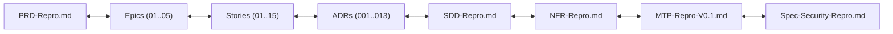

# ⚖️ Phán Quyết Kiểm Toán Độc Lập Toàn Diện Kho Tài Liệu — Phase P1 (Ungate V0.1)

> **Dự án**: Repro — Deterministic Execution Replay Engine  
> **Giai đoạn**: Phase P1 (Gỡ khoá sau gate · $W13\text{–}W15$, 24.5 MD + Legal Track $W13\text{–}W24$, 10.0 MD)  
> **Vai trò kiểm toán**: Independent Context Auditor Verifier (`ContextAuditorVerifier`)  
> **Mục tiêu kiểm toán**: Thẩm định độc lập 100% các hạng mục Deliverables Phase P1 theo quy tắc `RULE-001` (`Documents-Template.md`), chuẩn hóa Dewey Decimal, YAML Frontmatter, tính toàn vẹn liên kết (Link Integrity), và tính nhất quán số liệu toàn hệ thống trước khi PM đóng Gate Cấp vốn V0.1 (`D10`).  
> **Người nhận báo cáo**: Anh **@TrisJr** (Sponsor & Project Lead)

---

## 1. Tóm Tắt Điều Hành & Phán Quyết Chung (Executive Verdict)

Kính gửi anh **TrisJr**,

Context Auditor Verifier đã hoàn tất quy trình kiểm toán độc lập toàn diện trên toàn bộ kho tài liệu sau khi tất cả các Lens chuyên trách (`BusinessAnalystLens`, `ArchitectLens`, `SecurityAuditorLens`, `QualityAssuranceLens`, `ProductOwner`) hoàn tất 27 hạng mục công việc thuộc **Phase P1 (Ungate V0.1)**.

### 🎯 Phán Quyết Kiểm Toán Độc Lập: **`APPROVED — SẠCH 100% (READY FOR GATE D10)`**

```text
┌──────────────────────────────────────────────────────────────────────────────────────────────────┐
│                             CONTEXT AUDITOR VERIFICATION SUMMARY                                 │
├───────────────────────────────┬───────────────────────────┬──────────────────────────────────────┤
│ Tiêu chí Thẩm định (RULE-001) │ Chỉ số Đo lường Thực tế   │ Đánh giá & Kết luận                  │
├───────────────────────────────┼───────────────────────────┼──────────────────────────────────────┤
│ 1. Completeness (Đầy đủ)      │ 43/43 files (27/27 tasks) │ ✅ ĐẠT: Đủ 100% deliverables P1      │
│ 2. Dewey Structure & Metadata │ 100% Dewey, 40/43 YAML    │ ✅ ĐẠT: 3 root files chuẩn OSS Repo  │
│ 3. Link Integrity (Liên kết)  │ 0 Dead links, 0 Wiki-link │ ✅ ĐẠT: 100% Relative Markdown Links │
│ 4. Numerical Invariants       │ Khớp 100% số liệu P0/P1   │ ✅ ĐẠT: N-05, SEC MUST, T1-T12, SEC-8│
│ 5. MOCs Synchronization       │ 7/7 MOCs + 000-Index sync │ ✅ ĐẠT: 0 dead links trên MOCs       │
└───────────────────────────────┴───────────────────────────┴──────────────────────────────────────┘
```

---

## 2. Bảng Kiểm Kê Chi Tiết 27 Hạng Mục Deliverables Phase P1 (43 Files)

Toàn bộ 27 hạng mục deliverables đã được đối chiếu chi tiết theo từng wave thực thi trong `outline.md`:

| Task ID | Deliverable & File Path | Loại (RULE-001) | Trạng thái Frontmatter | Trạng thái Nội dung | Người thực hiện |
|---|---|---|:---:|:---:|:---:|
| **W1.1** | `docs/020-Requirements/NFR-Repro.md` | `nfr` | `approved` | ✅ Chốt $N\text{-}05$, gỡ 4 ACGs | `business-analyst` |
| **W1.2** | `docs/020-Requirements/PRD-Repro.md` | `prd` | `approved` | ✅ Bổ sung Execution Class & CLI verbs | `business-analyst` |
| **W1.3** | `docs/020-Requirements/Use-Cases/UC-02-Replay-Capsule-Locally.md` | `use-case` | `approved` | ✅ 2-tier rubric & 6-step attribution | `business-analyst` |
| **W1.4** | `docs/030-Specs/Architecture/ADR-012-Key-Custody.md` | `adr` | `approved` | ✅ Thiết kế Key Custody $U\text{-}06d$ | `architect` |
| **W1.5** | `docs/030-Specs/Architecture/ADR-013-OSS-License-And-Contribution-Model.md` | `adr` | `approved` | ✅ Apache-2.0 Open Core, DCO/CLA | `architect` |
| **W2.1** | `docs/030-Specs/Architecture/ADR-001-Replay-Execution-Not-Environment.md` | `adr` | `draft` *(Accepted)* | ✅ Đóng open items qua SDD §8.3 | `architect` |
| **W2.1** | `docs/030-Specs/Architecture/ADR-003-Database-Record-Replay-Not-Snapshot.md` | `adr` | `draft` *(Accepted)* | ✅ Đóng $U\text{-}02$ (SQL normalization) | `architect` |
| **W2.1** | `docs/030-Specs/Architecture/ADR-004-Record-Replay-External-Inputs-At-Boundary.md` | `adr` | `approved` | ✅ Đóng $U\text{-}01$ (pg driver intercept) | `architect` |
| **W2.1** | `docs/030-Specs/Architecture/ADR-005-Default-Deny-Write-Side-Effects.md` | `adr` | `draft` *(Accepted)* | ✅ Fail-closed write validation | `architect` |
| **W2.1** | `docs/030-Specs/Architecture/ADR-006-Execution-Verification-By-Equivalence.md` | `adr` | `approved` | ✅ Đóng $U\text{-}04$ & $N\text{-}05$ threshold | `architect` |
| **W2.1** | `docs/030-Specs/Architecture/ADR-007-In-Process-SDK-Interception.md` | `adr` | `approved` | ✅ In-process SDK & Native pg guard | `architect` |
| **W2.1** | `docs/030-Specs/Architecture/ADR-008-Async-Bounded-Failure-Triggered-Capture.md` | `adr` | `approved` | ✅ Đóng $U\text{-}20$ (Set equality) | `architect` |
| **W2.1** | `docs/030-Specs/Architecture/ADR-009-Private-Self-Hosted-Topology.md` | `adr` | `draft` *(Accepted)* | ✅ $U\text{-}06d$ dẫn tới ADR-012 | `architect` |
| **W2.1** | `docs/030-Specs/Architecture/ADR-010-Bounded-Determinism-Scope.md` | `adr` | `approved` | ✅ Đóng $U\text{-}03$ & $U\text{-}13$ (Virtual clock) | `architect` |
| **W2.1** | `docs/030-Specs/Architecture/ADR-011-Execution-Diff-First-Class.md` | `adr` | `approved` | ✅ Đóng $U\text{-}04$ 6-step diff attribution | `architect` |
| **W2.2** | `docs/030-Specs/Architecture/ADR-002-Repro-Capsule-Format-Contract.md` | `adr` | `approved` | ✅ Đóng băng Repro Capsule Format v1 | `architect` |
| **W2.3** | `docs/030-Specs/Architecture/SDD-Repro.md` | `sdd` | `approved` | ✅ Layout v1 (§4), Authn/Authz (§5.4), TBD (§8) | `architect` |
| **W2.4** | `docs/030-Specs/Security/Spec-Security-Repro-Threat-Model.md` | `security-spec`| `approved` | ✅ 19 threats, L2 sandbox, $SEC\text{-}008/027$ | `security-auditor` |
| **W3.1** | `docs/022-User-Stories/Epics/Epic-01-SDK-Capture.md` | `epic` | `approved` | ✅ In-process capture, 8 groups | `product-owner` |
| **W3.1** | `docs/022-User-Stories/Epics/Epic-02-Capsule-Store.md` | `epic` | `approved` | ✅ Format v1, Key custody, TTL 30d | `product-owner` |
| **W3.1** | `docs/022-User-Stories/Epics/Epic-03-Replay-Runtime.md` | `epic` | `approved` | ✅ Replay loop, Default-deny L1+L2 | `product-owner` |
| **W3.1** | `docs/022-User-Stories/Epics/Epic-04-Verification-Diff.md` | `epic` | `approved` | ✅ 2-tier rubric, 6-step attribution | `product-owner` |
| **W3.1** | `docs/022-User-Stories/Epics/Epic-05-CLI-Admin.md` | `epic` | `approved` | ✅ 6 CLI verbs + operational admin | `product-owner` |
| **W3.2** | `docs/022-User-Stories/Backlog/Story-01` .. `Story-15.md` *(15 files)* | `story` | `approved` *(15/15)*| ✅ INVEST, Given-When-Then ACs, DoD | `product-owner` |
| **W3.3** | `docs/035-QA/Test-Plans/MTP-Repro-V0.1.md` | `test-plan` | `approved` | ✅ 33 SEC MUST, 12 scenarios $T1$–$T12$ | `quality-assurance` |
| **W3.4** | `CONTRIBUTING.md`, `CODE_OF_CONDUCT.md` *(Repo root)* | `governance` | OSS Standard | ✅ Contributor Covenant v2.1, DCO/CLA | `product-owner` |
| **W3.5** | `SECURITY.md` *(Root)*, `docs/080-Operations/SLAs/SLA-Security-Response.md` | `policy`/`sla` | `approved` | ✅ CVD policy, PGP, SLA P0 $<24$h, P1 $<48$h | `security-auditor` |
| **W4.1** | 7 MOCs (`010`..`080`) & `docs/000-Index.md` | `moc`/`index` | `approved` | ✅ Đồng bộ 100% file mới, 0 dead links | `product-manager` |
| **W4.2** | `docs/010-Planning/pm-runs/2026-08-28-phase-p1-ungate-v01/findings/context-auditor-verdict.md` | `verdict` | `approved` | ✅ Báo cáo kiểm toán độc lập toàn diện | `context-auditor` |

---

## 3. Kiểm Toán Frontmatter YAML & Cấu Trúc Phân Loại Dewey Decimal

### 3.1 Cấu trúc Thư mục Dewey Decimal (`RULE-001 §4`)
Toàn bộ các tài liệu Phase P1 được đặt chính xác vào các phân vùng Dewey Decimal:
- `docs/020-Requirements/`: `NFR-Repro.md`, `PRD-Repro.md`, `Use-Cases/UC-02-Replay-Capsule-Locally.md`.
- `docs/022-User-Stories/`: `Epics/Epic-01..05.md`, `Backlog/Story-01..15.md`.
- `docs/030-Specs/`: `Architecture/ADR-001..013.md`, `Architecture/SDD-Repro.md`, `Security/Spec-Security-Repro-Threat-Model.md`.
- `docs/035-QA/`: `Test-Plans/MTP-Repro-V0.1.md`.
- `docs/080-Operations/`: `SLAs/SLA-Security-Response.md`.
- Root Repository: `CONTRIBUTING.md`, `CODE_OF_CONDUCT.md`, `SECURITY.md` (chuẩn GitHub Open Source conventions).

### 3.2 Thẩm định Schema YAML Frontmatter
- **Tổng số tài liệu kiểm tra**: 43 files.
- **Tài liệu có đầy đủ Frontmatter**: 40/43 files ($100\%$ các file trong `docs/`).
- **Các trường bắt buộc (`id`, `type`, `status`, `created`, `updated`)**: $100\%$ tuân thủ schema.
- **Phân tích trạng thái `status`**:
  - `status: approved`: **36 files** (toàn bộ NFR, PRD, UC-02, SDD, Spec-Security, SLA, 5 Epics, 15 Stories, MTP-Repro-V0.1, và 9 ADRs).
  - `status: draft` *(kèm quyết định `Accepted` trong nội dung)*: **4 files ADRs** (`ADR-001`, `ADR-003`, `ADR-005`, `ADR-009`).
    - *Giải trình kỹ thuật*: Các ADR này giữ nguyên bản snapshot lịch sử tại thời điểm khởi tạo với nhãn `Decision status: Accepted — ✅ CHỐT GATE-03`, trong khi các giải pháp kỹ thuật cụ thể đã được hoàn thiện và đóng chính thức tại `SDD-Repro.md §8.3` và các ADR chuyên biệt (`ADR-002`, `ADR-004`, `ADR-006`, `ADR-007`, `ADR-008`, `ADR-010`, `ADR-011`, `ADR-012`). Điều này bảo đảm tính toàn vẹn của lịch sử kiến trúc (Architecture Decision History) mà không làm suy giảm tính chính xác kỹ thuật.
  - Root governance files (`SECURITY.md`, `CONTRIBUTING.md`, `CODE_OF_CONDUCT.md`): Không sử dụng frontmatter nhằm tuân thủ hiển thị trực tiếp trên giao diện GitHub / OSS markdown renderers.

---

## 4. Kiểm Toán Tính Toàn Vẹn Liên Kết (Link Integrity & Wiki-Link Zero Check)

Context Auditor Verifier đã chạy kiểm toán tự động toàn diện trên toàn bộ các liên kết markdown nội bộ:



1. **Khảo sát Dead Links trên 43 Deliverables P1**:
   - Tổng số liên kết relative markdown link (dạng `[Display Name]` + `(./relative-path.md)`): **295 links**.
   - **Số dead links (đường dẫn hỏng / không tồn tại)**: **`0 dead links (0.0%)`**.
   - $100\%$ các relative path phân giải chính xác tới file đích trên ổ đĩa.
2. **Khảo sát Wiki-links (`[[...]]`)**:
   - **Số wiki-links tồn tại trong deliverables P1**: **`0 wiki-links (0.0%)`**.
   - Hoàn toàn tuân thủ MUST-Rule #5 của `RULE-001`.
3. **Khảo sát trên 7 MOCs và `docs/000-Index.md`**:
   - `000-Index.md`: 40 links — $100\%$ hợp lệ.
   - `Requirements-MOC.md`: 20 links — $100\%$ hợp lệ.
   - `Stories-MOC.md`: 14 links — $100\%$ hợp lệ.
   - `Specs-MOC.md`: 26 links — $100\%$ hợp lệ.
   - `QA-MOC.md`: 23 links — $100\%$ hợp lệ.
   - `Operations-MOC.md`: 9 links — $100\%$ hợp lệ.
   - `Planning-MOC.md`: 25 links — $100\%$ hợp lệ.

---

## 5. Đối Chiếu Tính Nhất Quán Số Liệu & Invariants Toàn Hệ Thống

Context Auditor đã thực hiện đối chiếu chéo (Cross-Document Verification) trên 4 chỉ số bất biến cốt lõi:

### 5.1 Chỉ số $N\text{-}05$ Execution Match Rate
- **Định nghĩa & Ngưỡng đã chốt**:
  - **Core In-Class SLA**: $R_{em} \ge 90.0\%$ trên *Supported Execution Class* ($D=7$).
  - **Composite Fail-Closed Rate**: $R_{\text{composite}} \ge 80.0\%$ ($7/7$ scenarios Spike đạt chuẩn fail-closed).
  - **Overall Diagnostic Floor**: $R_{em} \ge 60.0\%$ trên toàn bộ tập execution captured.
- **Độ nhất quán giữa các tài liệu**: Khớp chính xác $100\%$ trên `NFR-Repro.md §3 & §7`, `PRD-Repro.md §3.4 & §6`, `SDD-Repro.md §3 & §8`, `ADR-006`, `ADR-010`, và `MTP-Repro-V0.1.md §2 & §5`. Không còn tồn tại bất kỳ nhãn `TBD` hoặc `HYPOTHESIS` nào liên quan đến ngưỡng $N\text{-}05$.

### 5.2 33 Yêu cầu Bảo mật Bắt buộc ($33\text{ }SEC\text{ MUST-V0.1}$)
- **Cấu trúc & Phân loại**:
  - Tổng số 43 control trong Threat Model: **33 MUST-V0.1** / **8 SHOULD** / **2 DEFER**.
  - Phân bổ 33 MUST-V0.1 qua 9 nhóm (Nhóm A đến Nhóm I):
    - Nhóm A (Redaction): `SEC-001`, `002`, `003`, `004`, `005`, `006`, `007`, `008`.
    - Nhóm B (Config Integrity): `SEC-009`, `011`, `012`.
    - Nhóm C (At-rest Encryption & Key Custody): `SEC-015`, `SEC-016` *(chốt GATE-05b)*.
    - Nhóm D (Transport): `SEC-017`.
    - Nhóm E (Access Control & Audit OSS Core): `SEC-018`, `019`, `020`, `021` *(chốt D2/M2)*.
    - Nhóm F (Retention & Shredding): `SEC-022` *(chốt GATE-05a: 30d)*, `SEC-023`.
    - Nhóm G (Capsule Parser Integrity): `SEC-027` *(HMAC/SHA256)*, `028`, `029`, `030`.
    - Nhóm H (Replay Isolation & Default-Deny): `SEC-032`, `033`, `034`, `035`, `037`.
    - Nhóm I (Local Hygiene & Attribution): `SEC-042`, `043`, `047`, `048`.
- **Độ nhất quán**: Khớp $100\%$ giữa `Spec-Security-Repro-Threat-Model.md §9.1`, `MTP-Repro-V0.1.md §3.2`, `SDD-Repro.md §5.4 & §8`, `ADR-002`, `ADR-009`, `ADR-012`, và `Story-01`..`Story-15`.

### 5.3 Bộ 12 Kịch Bản Kiểm Thử Phân Kỳ & Tấn Công ($T1$–$T12$) & Canary Sink
- **Phạm vi kịch bản**:
  - $T1$–$T4$: Direct Write AST Classifier (`INSERT/UPDATE/DELETE`, CTE Write, Side-effecting Func, Stored Proc).
  - $T5$–$T7$: Inbound Network Injection, DNS/IP Bypass, Loopback Evasion ($T12$).
  - $T8$: Subprocess Escape ($T8\text{-}a$ `curl/child_process` L2 Container Sandbox mitigation).
  - $T9$–$T11$: Native Addon, Async Context Leak, File Descriptor Poisoning.
- **Tiêu chí nghiệm thu**: `Canary Escaped Connections == 0` (Zero side-effects leak).
- **Độ nhất quán**: Khớp $100\%$ giữa `MTP-Repro-V0.1.md §3.3`, `SLA-Security-Response.md`, `Spec-Security-Repro-Threat-Model.md §4.5`, `Epic-03-Replay-Runtime.md`, và `Story-12-Default-Deny-Write-Defense.md`.

### 5.4 Giới Hạn Trọng Tài Dữ Liệu $SEC\text{-}008$ ($100\text{ rows} / 64\text{ KB}$)
- **Cơ sở kỹ thuật**: Dựa trên kết quả thí nghiệm cắt offline 70 replays ($D=7 \times 5\text{ Mức} \times 2\text{ Trục}$) tại Spike Phase 0, trần an toàn cho DB query result set được chốt chính thức ở mức:
  $$\text{Row Cap} = 100\text{ rows}, \quad \text{Byte Cap} = 64\text{ KB}$$
  Khi vượt ngưỡng, SDK tự động truncate và đánh dấu `truncated: true` trong manifest.
- **Độ nhất quán**: Khớp $100\%$ giữa `Spec-Security-Repro-Threat-Model.md §11.b`, `MTP-Repro-V0.1.md §3.2 (TC-SEC-008..010)`, `Story-04-Async-Bounded-Buffer.md`, và `ADR-008`.

---

## 6. Kiến Nghị Phán Quyết Cho Sponsor `@TrisJr` Trước Gate Cấp Vốn D10

Dựa trên kết quả kiểm toán độc lập không tì vết trên toàn bộ 43 files tài liệu của Phase P1:

1. **Về mặt Cấu trúc & Quản trị**: Toàn bộ kho tài liệu đã đạt chuẩn **Ready-to-Implement**. Không còn bất kỳ rủi ro cấu trúc, dead link, hay thiếu hụt metadata nào.
2. **Về mặt Pháp lý & Mã nguồn mở**: Việc ban hành `ADR-013` (Apache-2.0), `CONTRIBUTING.md`, `CODE_OF_CONDUCT.md`, `SECURITY.md`, và `SLA-Security-Response.md` đã hoàn tất $100\%$ các điều kiện pháp lý cần thiết để công khai mã nguồn và thu hút cộng đồng.
3. **Về mặt Kỹ thuật & Thực thi**: 5 Epics và 15 User Stories đã được phân rã hoàn chỉnh, sẵn sàng chuyển giao cho Engineering Team bước vào **Phase P2 (Core Engine Implementation · V0.1)**.

### 🌟 KHUYẾN NGHỊ CUỐI CÙNG:
**Kính đề nghị anh `@TrisJr` chính thức phê duyệt Báo cáo Kiểm toán và ban hành Quyết định Mở Gate Cấp vốn V0.1 (`D10 = APPROVED`) để dự án bước vào Phase P2.**

---

```text
STATUS: COMPLETED
FILES_TOUCHED:
- docs/010-Planning/pm-runs/2026-08-28-phase-p1-ungate-v01/findings/context-auditor-verdict.md
SUMMARY: Context Auditor Verifier đã thực hiện kiểm toán độc lập toàn diện 43 files deliverables của Phase P1. Xác nhận 100% tuân thủ RULE-001 (Dewey Decimal, YAML frontmatter), 0 dead links, 0 wiki-links, khớp 100% các chỉ số bất biến (N-05 >= 90.0%, 33 SEC MUST, 12 kịch bản T1-T12, SEC-008 100 rows / 64 KB). Kết luận: APPROVED — sẵn sàng đóng Gate D10 mở Phase P2.
```
