# 🔍 Báo Cáo Kiểm Toán Toàn Diện Kho Tài Liệu — Phase P1 (Gỡ Khoá Sau Gate)

> **Dự án**: Repro — Deterministic Execution Replay Engine  
> **Giai đoạn**: Phase P1 (Gỡ khoá sau gate · $W13\text{–}W15$, 24.5 MD + Legal Track $W13\text{–}W24$, 10.0 MD)  
> **Vai trò**: Context Auditor Lens (`@context-auditor`)  
> **Chủ đề**: Comprehensive Inventory, Dewey Structure, Frontmatter Schema, MOCs Alignment & Link Integrity Audit  
> **Người nhận**: Anh **@TrisJr** (Sponsor & Lead)

---

## 1. Tóm Tắt Điều Hành & Kết Quả Kiểm Toán Hiện Trạng

Kính gửi anh **TrisJr**, sau khi anh chính thức phê duyệt `GATE-06 = CÓ` (§39) vào ngày 2026-08-28 (`docs/010-Planning/pm-runs/2026-08-28-p0c-spike-run-report/verdict.md`), dự án Repro bước vào đợt cập nhật và ban hành tài liệu lớn nhất từ trước đến nay: **Phase P1 (Gỡ khoá sau gate · 24.5 MD) và Legal & Compliance Track (10.0 MD)**. Đợt cập nhật này tác động trực tiếp lên **~25 tài liệu** xuyên suốt toàn bộ kho `docs/` và thư mục gốc của repository.

Context Auditor đã thực hiện kiểm kê và thẩm định toàn diện kho tài liệu hiện hữu, ghi nhận các kết quả cốt lõi:

1. **Hiện trạng kho tài liệu cốt lõi (Core Docs Baseline)**:
   - Tổng số file tài liệu cốt lõi trong `docs/` (không tính các run cũ trong `pm-runs/`): **65 files**.
   - Cấu trúc thư mục tuân thủ 100% hệ thống phân loại Dewey Decimal theo `RULE-001` (`Documents-Template.md`).
   - Tỷ lệ có YAML Frontmatter: **63/65 files** (2 file ngoại lệ có chủ ý: `README.md` tại root và `docs/999-Resources/RQ.md` là nguồn sự thật concept gốc 1995 dòng không được can thiệp).
   - Tỷ lệ trạng thái: **55 files `draft`**, **8 files `approved`** (các tài liệu hoàn tất của Phase 0: `Timeline-Repro.md`, `Spec-Spike-Protocol.md`, `MTP-Spike-Phase-0.md`, `Template-Spike-Report.md`, `Perf-Spike-Phase-0.md`, `Report-Spike-Phase-0.md`, `T1-Pre-Registration-Spike-Phase-0.md`, `Audit-Spike-Code-Phase-0.md`).

2. **Tính toàn vẹn liên kết (Link Integrity) & Tuân thủ RULE-001**:
   - Quét tự động toàn bộ liên kết nội bộ Markdown trong 65 file cốt lõi: **0 dead links (0.0%)**.
   - Quét kiểm tra Wiki-link (`[[...]]`): **0 wiki-links**. Toàn bộ liên kết đều dùng chuẩn relative markdown link `[Text](./path.md)` theo đúng MUST-rule #5 của `RULE-001`.

3. **Phạm vi tác động của Phase P1**:
   - **12 tài liệu hiện hữu cần cập nhật (UPDATE)**: `000-Index.md`, `Timeline-Repro.md`, `Risk-Register.md`, `Roadmap.md`, `Planning-MOC.md`, `NFR-Repro.md`, `PRD-Repro.md`, `Requirements-MOC.md`, `UC-02-Replay-Capsule-Locally.md`, `SDD-Repro.md`, 11 file `ADR-001`..`011`, `Spec-Security-Repro-Threat-Model.md`, `Specs-MOC.md`, `QA-MOC.md`, `Stories-MOC.md`, `Operations-MOC.md`.
   - **15 tài liệu mới cần tạo lập (CREATE NEW)**: `ADR-012-Key-Custody.md`, `ADR-013-OSS-License-And-Contribution-Model.md`, `MTP-Repro-V0.1.md`, 5 Epics (`Epic-01`..`Epic-05`), 5–10 User Stories trong `Backlog/`, `SLA-Security-Response.md`, `CONTRIBUTING.md`, `CODE_OF_CONDUCT.md`, `SECURITY.md`, `LICENSE`.

---

## 2. Ma Trận Kiểm Kê Toàn Diện Deliverables Phase P1 (Inventory Matrix)

Bảng dưới đây chi tiết hoá toàn bộ ~27 tài liệu thuộc phạm vi cập nhật và tạo mới trong Phase P1, phân loại theo cấu trúc Dewey, vai trò phụ trách, và tiêu chuẩn định danh theo `RULE-001`:

| Phân Loại Dewey | Đường Dẫn File (Target Path) | Thao Tác | Task / Deliverable ID | Vai Trò Phụ Trách | Trạng Thái Đích | Tiêu Chuẩn Naming & Schema Frontmatter |
|---|---|:---:|:---:|:---:|:---:|---|
| **000 Root** | `docs/000-Index.md` | **UPDATE** | P1 Integration | 🎩 PM | `draft` | `INDEX-000` / `type: index` |
| **000 Root** | `README.md` | **UPDATE** | P1 DX / Overview | 🎩 PM | `live` | (Root overview, markdown thuần) |
| **000 Root** | `LICENSE` | **UPDATE** | `LG1` | 🎩 PM / 🛡️ Security | `approved` | Apache-2.0 / MIT (chốt từ `ADR-013`) |
| **000 Root** | `CONTRIBUTING.md` | **CREATE** | `LG2` | 🎩 PM / 🕵️ BA | `approved` | Root Governance policy |
| **000 Root** | `CODE_OF_CONDUCT.md` | **CREATE** | `LG2` | 🎩 PM | `approved` | Contributor Covenant v2.1 |
| **000 Root** | `SECURITY.md` | **CREATE** | `LG5` | 🛡️ Security / ⚙️ DevOps | `approved` | Security vulnerability disclosure policy |
| **010-Planning** | `docs/010-Planning/Planning-MOC.md` | **UPDATE** | MOC Sync | 🎩 PM | `draft` | `MOC-PLANNING` / `type: moc` |
| **010-Planning** | `docs/010-Planning/Estimates/Timeline-Repro.md` | **UPDATE** | WBS P1 Tracking | 🎩 PM | `approved` | `TIMELINE-001` / `type: timeline` |
| **010-Planning** | `docs/010-Planning/Risk-Register.md` | **UPDATE** | Risk Resolution | 🎩 PM / 🛡️ Security | `draft` | `RISK-001` / `type: risk-register` |
| **010-Planning** | `docs/010-Planning/Roadmap.md` | **UPDATE** | Phase P1 Ungate | 🎩 PM | `draft` | `ROADMAP-001` / `type: roadmap` |
| **010-Planning** | `docs/010-Planning/OKRs.md` | **UPDATE** | V0.1 OKRs (Opt) | 🎩 PM | `draft` | `OKRS-001` / `type: okrs` |
| **020-Requirements**| `docs/020-Requirements/Requirements-MOC.md` | **UPDATE** | MOC Sync | 🕵️ BA | `draft` | `MOC-020` / `type: moc` |
| **020-Requirements**| `docs/020-Requirements/NFR-Repro.md` | **UPDATE** | `D1` + `D2` | 🎩 PM / 🕵️ BA | `draft` | `NFR-001` / `type: nfr` (Chốt `N-05` & 4 ACGs) |
| **020-Requirements**| `docs/020-Requirements/PRD-Repro.md` | **UPDATE** | `D2` + `D6` | 🕵️ BA / 🏗️ Architect | `draft` | `PRD-001` / `type: prd` (FR-041, Op-verbs) |
| **020-Requirements**| `docs/020-Requirements/Use-Cases/UC-02-Replay-Capsule-Locally.md` | **UPDATE** | `D2` | 🕵️ BA | `draft` | `UC-02` / `type: use-case` (Exception flows) |
| **022-User-Stories**| `docs/022-User-Stories/Stories-MOC.md` | **UPDATE** | `D7` (Gỡ GATE-02)| 📋 PO | `draft` | `MOC-STORIES` / `type: moc` |
| **022-User-Stories**| `docs/022-User-Stories/Epics/Epic-01-SDK-In-Process-Capture.md` | **CREATE** | `D7` / WS-1 | 📋 PO | `draft` | `EPIC-001` / `type: epic` |
| **022-User-Stories**| `docs/022-User-Stories/Epics/Epic-02-Capsule-Format-And-Storage.md` | **CREATE** | `D7` / WS-2 | 📋 PO | `draft` | `EPIC-002` / `type: epic` |
| **022-User-Stories**| `docs/022-User-Stories/Epics/Epic-03-Replay-Runtime-And-Default-Deny.md` | **CREATE** | `D7` / WS-3 | 📋 PO | `draft` | `EPIC-003` / `type: epic` |
| **022-User-Stories**| `docs/022-User-Stories/Epics/Epic-04-Verification-And-Execution-Diff.md` | **CREATE** | `D7` / WS-4 | 📋 PO | `draft` | `EPIC-004` / `type: epic` |
| **022-User-Stories**| `docs/022-User-Stories/Epics/Epic-05-CLI-And-Operator-Experience.md` | **CREATE** | `D7` / WS-5 | 📋 PO | `draft` | `EPIC-005` / `type: epic` |
| **022-User-Stories**| `docs/022-User-Stories/Backlog/Story-001`..`Story-015.md` | **CREATE** | `D7` Stories | 📋 PO / 🕵️ BA | `draft` | `STORY-001`..`015` / `type: story` |
| **030-Specs** | `docs/030-Specs/Specs-MOC.md` | **UPDATE** | MOC Sync | 🏗️ Architect | `draft` | `MOC-SPECS` / `type: moc` |
| **030-Specs** | `docs/030-Specs/Architecture/SDD-Repro.md` | **UPDATE** | `D2`+`D5`+`D6` | 🏗️ Architect | `draft` | `SDD-001` / `type: sdd` (§4 Format v1, §5.4 Auth) |
| **030-Specs** | `docs/030-Specs/Architecture/ADR-001` .. `ADR-011.md` | **UPDATE** | `D3` (6 unknowns)| 🏗️ Architect | `draft` (`Accepted`)| `ADR-001`..`011` / `type: adr` (Open items) |
| **030-Specs** | `docs/030-Specs/Architecture/ADR-012-Key-Custody.md` | **CREATE** | `D4` (Key custody)| 🏗️ Architect / 🛡️ Security | `draft` (`Accepted`)| `ADR-012` / `type: adr` (Crypto-shredding) |
| **030-Specs** | `docs/030-Specs/Architecture/ADR-013-OSS-License-And-Contribution-Model.md`| **CREATE**| `LG1` (License) | 🎩 PM / 🏗️ Architect | `draft` (`Accepted`)| `ADR-013` / `type: adr` (OSS License) |
| **030-Specs** | `docs/030-Specs/Security/Spec-Security-Repro-Threat-Model.md` | **UPDATE** | `D9` Threat Model| 🛡️ Security / 🏗️ Architect | `draft` | `SPEC-SEC-001` / `type: security-spec` |
| **035-QA** | `docs/035-QA/QA-MOC.md` | **UPDATE** | MOC Sync | 🧪 QA | `draft` | `MOC-QA` / `type: moc` |
| **035-QA** | `docs/035-QA/Test-Plans/MTP-Repro-V0.1.md` | **CREATE** | `D8` Master Test | 🧪 QA | `draft` | `MTP-V01` / `type: test-plan` (33 SEC, N-05) |
| **080-Operations**| `docs/080-Operations/Operations-MOC.md` | **UPDATE** | MOC Sync | 🛡️ Security / ⚙️ DevOps | `draft` | `MOC-080` / `type: moc` |
| **080-Operations**| `docs/080-Operations/SLAs/SLA-Security-Response.md` | **CREATE** | `LG5` SLA | 🛡️ Security | `draft` | `SLA-SEC-001` / `type: sla` |
| **pm-runs** | `docs/010-Planning/pm-runs/2026-08-28-phase-p1-ungate-v01/verdict.md` | **CREATE** | `D10` Gate V0.1 | 👤 `@TrisJr` / 🎩 PM | `approved` | `PM-VERDICT-P1` / `type: verdict` |

---

## 3. Kiểm Toán Chi Tiết Frontmatter, Type, ID & Dewey Hierarchy

### 3.1 Quy Chuẩn Frontmatter Bắt Buộc Theo `RULE-001`
Mọi tài liệu tạo mới và cập nhật trong Phase P1 **BẮT BUỘC** phải có cấu trúc YAML Frontmatter ở đầu file:

```yaml
---
id: {TYPE}-{NNN}           # Định danh duy nhất theo chuẩn (VD: ADR-012, EPIC-001, MTP-V01)
type: {document_type}      # enum chuẩn: adr, epic, story, test-plan, sla, prd, sdd, moc, etc.
status: draft|review|approved|deprecated
project: repro             # Đặt 'repro' cho tài liệu dự án
created: YYYY-MM-DD        # Ngày tạo ban đầu
updated: YYYY-MM-DD        # Ngày cập nhật gần nhất
---
```

### 3.2 Bảng Đối Chiếu Enum `type` và Quy Tắc Sinh `id`

| Thư Mục Đích | Loại Tài Liệu | `type` Enum Chuẩn | Mẫu `id` Chuẩn | Ví Dụ Cụ Thể Trong P1 |
|---|---|---|---|---|
| `docs/010-Planning/` | Planning MOC | `moc` | `MOC-PLANNING` | `docs/010-Planning/Planning-MOC.md` |
| `docs/010-Planning/Estimates/` | Timeline & WBS | `timeline` | `TIMELINE-001` | `docs/010-Planning/Estimates/Timeline-Repro.md` |
| `docs/020-Requirements/` | PRD | `prd` | `PRD-001` | `docs/020-Requirements/PRD-Repro.md` |
| `docs/020-Requirements/` | NFR | `nfr` | `NFR-001` | `docs/020-Requirements/NFR-Repro.md` |
| `docs/020-Requirements/Use-Cases/` | Use Case | `use-case` | `UC-{NN}` | `docs/020-Requirements/Use-Cases/UC-02-Replay-Capsule-Locally.md` |
| `docs/022-User-Stories/` | Stories MOC | `moc` | `MOC-STORIES` | `docs/022-User-Stories/Stories-MOC.md` |
| `docs/022-User-Stories/Epics/` | Epic | `epic` | `EPIC-{NNN}` | `docs/022-User-Stories/Epics/Epic-01-SDK-In-Process-Capture.md` |
| `docs/022-User-Stories/Backlog/` | User Story | `story` | `STORY-{NNN}` | `docs/022-User-Stories/Backlog/Story-001-Inbound-HTTP-Capture.md` |
| `docs/030-Specs/` | Specs MOC | `moc` | `MOC-SPECS` | `docs/030-Specs/Specs-MOC.md` |
| `docs/030-Specs/Architecture/` | ADR | `adr` | `ADR-{NNN}` | `docs/030-Specs/Architecture/ADR-012-Key-Custody.md` |
| `docs/030-Specs/Architecture/` | SDD | `sdd` | `SDD-001` | `docs/030-Specs/Architecture/SDD-Repro.md` |
| `docs/030-Specs/Security/` | Security Spec | `security-spec` | `SPEC-SEC-001` | `docs/030-Specs/Security/Spec-Security-Repro-Threat-Model.md` |
| `docs/035-QA/` | QA MOC | `moc` | `MOC-QA` | `docs/035-QA/QA-MOC.md` |
| `docs/035-QA/Test-Plans/` | Master Test Plan | `test-plan` | `MTP-{Name}` | `docs/035-QA/Test-Plans/MTP-Repro-V0.1.md` |
| `docs/080-Operations/` | Operations MOC | `moc` | `MOC-080` | `docs/080-Operations/Operations-MOC.md` |
| `docs/080-Operations/SLAs/` | SLA Document | `sla` | `SLA-{Name}` | `docs/080-Operations/SLAs/SLA-Security-Response.md` |

### 3.3 Phát Hiện Các Điểm Lệch Cũ & Khuyến Nghị Chuẩn Hóa
1. **`Timeline-Repro.md`**: Thiếu trường `created: 2026-08-15` trong YAML Frontmatter (hiện chỉ có `updated: 2026-08-28`). $\rightarrow$ **Đề xuất**: Bổ sung `created: 2026-08-15` khi cập nhật WBS Phase P1.
2. **`OKRs.md`**: Thiếu trường `updated`. $\rightarrow$ **Đề xuất**: Cập nhật `updated: 2026-08-28` khi rà soát mục tiêu V0.1.
3. **Thư mục con chưa tạo vật lý**:
   - `docs/022-User-Stories/Epics/` và `docs/022-User-Stories/Backlog/` (cần tạo khi thực thi Task `D7`).
   - `docs/080-Operations/SLAs/` (cần tạo khi thực thi Task `LG5`).

---

## 4. Chiến Lược Đồng Bộ Hệ Thống MOCs & Master Index (000-Index.md)

Khi các deliverables của Phase P1 được ban hành, **7 file MOCs trung tâm và `000-Index.md`** bắt buộc phải được cập nhật đồng bộ để duy trì tính toàn vẹn của đồ thị tri thức:

```mermaid
graph TD
    Index[docs/000-Index.md] --> MOC010[010-Planning/Planning-MOC.md]
    Index --> MOC020[020-Requirements/Requirements-MOC.md]
    Index --> MOC022[022-User-Stories/Stories-MOC.md]
    Index --> MOC030[030-Specs/Specs-MOC.md]
    Index --> MOC035[035-QA/QA-MOC.md]
    Index --> MOC080[080-Operations/Operations-MOC.md]

    MOC010 --> Timeline[Estimates/Timeline-Repro.md]
    MOC010 --> Risk[Risk-Register.md]
    MOC010 --> Roadmap[Roadmap.md]

    MOC020 --> PRD[PRD-Repro.md]
    MOC020 --> NFR[NFR-Repro.md]
    MOC020 --> UC02[Use-Cases/UC-02.md]

    MOC022 --> Epics[Epics/Epic-01..05.md]
    MOC022 --> Backlog[Backlog/Story-001..015.md]

    MOC030 --> SDD[Architecture/SDD-Repro.md]
    MOC030 --> ADRs[Architecture/ADR-001..013.md]
    MOC030 --> TM[Security/Threat-Model.md]

    MOC035 --> MTP[Test-Plans/MTP-Repro-V0.1.md]
    MOC035 --> P0QA[Reports/Report-Spike-Phase-0.md]

    MOC080 --> SLA[SLAs/SLA-Security-Response.md]
```



### 4.1 Danh Mục Yêu Cầu Cập Nhật Từng MOC

#### 1. `docs/000-Index.md`
- **Cập nhật Bối cảnh**: Ghi nhận `GATE-06 = CÓ` (§39) đã đóng ngày 2026-08-28. Phase 0 đã hoàn tất; dự án đang trong **Phase P1 (Gỡ khoá sau gate · W13–W15)**.
- **Bổ sung Bảng Tài liệu Lớn**:
  - `ADR-012-Key-Custody.md` (Key management & crypto-shredding).
  - `ADR-013-OSS-License-And-Contribution-Model.md` (Lựa chọn OSS License).
  - `MTP-Repro-V0.1.md` (Master Test Plan cho V0.1).
  - Cập nhật dòng `Stories-MOC`: Gỡ bỏ nhãn "rỗng theo GATE-02", thay bằng danh sách 5 Epics V0.1.

#### 2. `docs/010-Planning/Planning-MOC.md`
- **Cập nhật Tiến độ**: Ghi nhận hoàn tất Phase P0-C, chuyển trọng tâm sang theo dõi 10 tasks $D1\text{–}D10$ và 5 tasks Legal $LG1\text{–}LG5$.
- **Cập nhật Risk Register**: Điểm danh các rủi ro kỹ thuật đã được giải quyết qua spike và thiết kế P1 ($U\text{-}06d$, `GAP-04`, `LG1`, `LG3`).

#### 3. `docs/020-Requirements/Requirements-MOC.md`
- **Cập nhật NFR**: Ghi nhận $N\text{-}05$ đã có ngưỡng cam kết chính thức ($R_{em} \ge 90\%$ In-Class, Composite $\ge 80\%$, Diagnostic Floor $\ge 60\%$).
- **Cập nhật 4 ACGs**: Xác nhận $ACG\text{-}01, 02, 03, 07$ đã được nâng thành Định nghĩa Sản phẩm chính thức.

#### 4. `docs/022-User-Stories/Stories-MOC.md`
- **Gỡ bỏ hoàn toàn `GATE-02`**: Xoá bỏ các đoạn cảnh báo "hoãn có chủ ý", thay thế bằng cấu trúc Backlog chính thức của V0.1.
- **Liên kết Thư mục Con**:
  - Trỏ tới `Epics/` với 5 Epics: `Epic-01` (SDK & Capture), `Epic-02` (Capsule & Store), `Epic-03` (Replay Runtime), `Epic-04` (Verification & Diff), `Epic-05` (CLI & DX).
  - Trỏ tới `Backlog/` chứa danh sách User Stories chi tiết theo chuẩn INVEST.

#### 5. `docs/030-Specs/Specs-MOC.md`
- **Bổ sung ADR mới**: Đăng ký `ADR-012-Key-Custody.md` và `ADR-013-OSS-License-And-Contribution-Model.md` vào Bảng Quyết định Kiến trúc.
- **Cập nhật ADR 001–011**: Xác nhận mục `Open items` của 11 ADRs đã được giải quyết tại Task $D3$.
- **Cập nhật SDD & Threat Model**: Ghi nhận đóng băng Capsule Format v1 (§4), thiết kế authn/authz (§5.4), và cập nhật 9 threats bảo mật.

#### 6. `docs/035-QA/QA-MOC.md`
- **Đăng ký Master Test Plan V0.1**: Thêm đường dẫn `docs/035-QA/Test-Plans/MTP-Repro-V0.1.md`.
- **Cập nhật Trạng thái QA**: Chuyển từ "Test plan V0.1 chưa có" sang "MTP-Repro-V0.1 đã ban hành, bao phủ 33 SEC MUST-V0.1, core replay loop, và CI harness $N\text{-}05$".

#### 7. `docs/080-Operations/Operations-MOC.md`
- **Đăng ký SLA Document**: Thêm đường dẫn `docs/080-Operations/SLAs/SLA-Security-Response.md`.
- **Cập nhật `GAP-04`**: Ghi nhận `GAP-04` đã được giải quyết thông qua thiết kế cơ chế auth và tập CLI verbs vận hành ($D6$).

---

## 5. Thẩm Định Tính Toàn Vẹn Liên Kết (Link Integrity & Linking Rules)

### 5.1 Quy Tắc Liên Kết Tương Đối (Relative Markdown Links)
Context Auditor tái khẳng định quy tắc bất biến theo `RULE-001 §Linking Rules`:
- **Chỉ sử dụng standard relative markdown links**: `[Display Text](./path/to/file.md)`.
- **TUYỆT ĐỐI KHÔNG DÙNG WIKI-LINKS**: Cấm `[[File-Name]]` hoặc `[[File-Name|Display Text]]`.
- **Quy tắc lùi cấp chuẩn xác**:
  - Cùng thư mục: `[File](./Other-File.md)`
  - Thư mục con: `[File](./SubDir/File.md)`
  - Lùi 1 cấp: `[File](../SiblingDir/File.md)`
  - Lùi 2 cấp (từ `docs/022-User-Stories/Epics/` về `docs/020-Requirements/`): `[PRD-Repro](../../020-Requirements/PRD-Repro.md)`
  - Lùi 3 cấp (từ `docs/010-Planning/pm-runs/{run}/findings/` về `docs/`): `[NFR-Repro](../../../../020-Requirements/NFR-Repro.md)`

### 5.2 Bảng Mẫu Đường Dẫn Liên Kết Chuẩn Cho Deliverables Phase P1

| Từ File Nguồn (Source) | Tới File Đích (Target) | Đường Dẫn Chuẩn (Standard Relative Markdown Link) |
|---|---|---|
| `docs/022-User-Stories/Epics/Epic-01-SDK.md` | `PRD-Repro.md` | `[PRD-Repro](../../020-Requirements/PRD-Repro.md)` |
| `docs/022-User-Stories/Epics/Epic-01-SDK.md` | `SDD-Repro.md` | `[SDD-Repro](../../030-Specs/Architecture/SDD-Repro.md)` |
| `docs/022-User-Stories/Backlog/Story-001.md` | `Epic-01-SDK.md` | `[Epic-01](../Epics/Epic-01-SDK-In-Process-Capture.md)` |
| `docs/030-Specs/Architecture/ADR-012-Key-Custody.md` | `SDD-Repro.md` | `[SDD-Repro](./SDD-Repro.md)` |
| `docs/030-Specs/Architecture/ADR-012-Key-Custody.md` | `Threat-Model.md` | `[Threat-Model](../Security/Spec-Security-Repro-Threat-Model.md)` |
| `docs/035-QA/Test-Plans/MTP-Repro-V0.1.md` | `SDD-Repro.md` | `[SDD-Repro](../../030-Specs/Architecture/SDD-Repro.md)` |
| `docs/035-QA/Test-Plans/MTP-Repro-V0.1.md` | `Threat-Model.md` | `[Threat-Model](../../030-Specs/Security/Spec-Security-Repro-Threat-Model.md)` |
| `docs/035-QA/Test-Plans/MTP-Repro-V0.1.md` | `NFR-Repro.md` | `[NFR-Repro](../../020-Requirements/NFR-Repro.md)` |
| `docs/080-Operations/SLAs/SLA-Security-Response.md`| `SECURITY.md` (root)| `[SECURITY.md](../../../SECURITY.md)` |
| `docs/080-Operations/SLAs/SLA-Security-Response.md`| `Threat-Model.md` | `[Threat-Model](../../030-Specs/Security/Spec-Security-Repro-Threat-Model.md)` |

---

## 6. Kế Hoạch & Bộ Tiêu Chí Kiểm Tra Xác Thực (Validation Checklist)

Để đảm bảo việc soạn thảo toàn bộ ~25 deliverables của Phase P1 diễn ra mượt mà, không xung đột và đạt chuẩn chất lượng tuyệt đối, Context Auditor đề xuất lộ trình triển khai theo 4 Waves:

```text
┌─────────────────────────────────────────────────────────────────────────────┐
│                      LỘ TRÌNH SOẠN THẢO DELIVERABLES PHASE P1               │
├─────────────────────────────────────────────────────────────────────────────┤
│ Wave 1: Foundation & Baseline Specifications (D1, D2, D4, LG1)               │
│ • Chốt NFR-Repro (§3 N-05 SLA, §7 Nâng cấp 4 ACGs)                          │
│ • Soạn thảo ADR-012 (Key Custody) & ADR-013 (OSS License)                   │
│ • Cập nhật PRD-Repro, SDD-Repro (§4 Capsule v1), UC-02                      │
├─────────────────────────────────────────────────────────────────────────────┤
│ Wave 2: Architecture Solutions & Security Deep Dive (D3, D5, D6, D9)         │
│ • Giải quyết 6 Open Items trong ADR-001..011                                │
│ • Thiết kế authn/authz & CLI Op-verbs trong SDD §5.4                        │
│ • Cập nhật Spec-Security-Repro-Threat-Model (Mitigations cho 9 threats)     │
├─────────────────────────────────────────────────────────────────────────────┤
│ Wave 3: Agile Backlog, QA Strategy & Legal Policies (D7, D8, LG2, LG5)       │
│ • Soạn thảo 5 Epics & 15 User Stories trong docs/022-User-Stories/          │
│ • Soạn thảo Master Test Plan V0.1 (docs/035-QA/Test-Plans/MTP-Repro-V0.1.md)│
│ • Ban hành CONTRIBUTING.md, CODE_OF_CONDUCT.md, SECURITY.md, SLA-Security   │
├─────────────────────────────────────────────────────────────────────────────┤
│ Wave 4: Master MOCs Synchronization & Gate Verdict (D10, MOCs, Index)       │
│ • Cập nhật đồng bộ 7 MOCs (Planning, Reqs, Stories, Specs, QA, Ops, Index) │
│ • Sponsor @TrisJr phê duyệt Gate Cấp Vốn V0.1 (verdict.md)                  │
└─────────────────────────────────────────────────────────────────────────────┘
```

### 6.1 Bảng Checklist Nghiệm Thu Từng Tài Liệu (DoD per Document)
Trước khi kết thúc Phase P1, mọi tài liệu mới và cập nhật phải vượt qua 6 tiêu chí kiểm tra:

- [ ] **1. Vị trí lưu trữ**: Nằm đúng thư mục Dewey Decimal theo `RULE-001` (dưới `docs/` hoặc root đối với policy).
- [ ] **2. Tên file**: Tuân thủ chuẩn đặt tên PascalCase/Kebab-case theo bảng Document Type Mapping.
- [ ] **3. Frontmatter đầy đủ**: Có đủ `id`, `type`, `status`, `created`, `updated`, `project: repro`.
- [ ] **4. 100% Markdown Links**: Tất cả liên kết chéo đều dùng standard relative link `[Text](./path.md)`, không có wiki-link nào.
- [ ] **5. Không có Broken Links**: Mọi relative path đều trỏ tới file vật lý có thực.
- [ ] **6. Đăng ký MOC & Index**: File MOC cha tương ứng và `000-Index.md` đã được cập nhật đường dẫn tới tài liệu.

---

```text
STATUS: DONE
FILES_TOUCHED: docs/010-Planning/pm-runs/2026-08-28-phase-p1-ungate-v01/findings/context-auditor.md
SUMMARY: Context Auditor đã hoàn tất kiểm kê toàn diện kho tài liệu cho Phase P1: (1) Thiết lập ma trận quản lý 27 deliverables (12 cập nhật, 15 tạo mới) chuẩn Dewey & RULE-001; (2) Rà soát 65 file cốt lõi hiện hữu, xác nhận 0 dead links và 0 wiki-links; (3) Xác lập chiến lược đồng bộ 7 MOCs trung tâm và 000-Index.md sau khi gỡ bỏ GATE-02; (4) Chuẩn hoá ma trận relative markdown links và lộ trình triển khai 4 Waves; sẵn sàng 100% cho đội ngũ bắt tay soạn thảo deliverables Phase P1.
```
