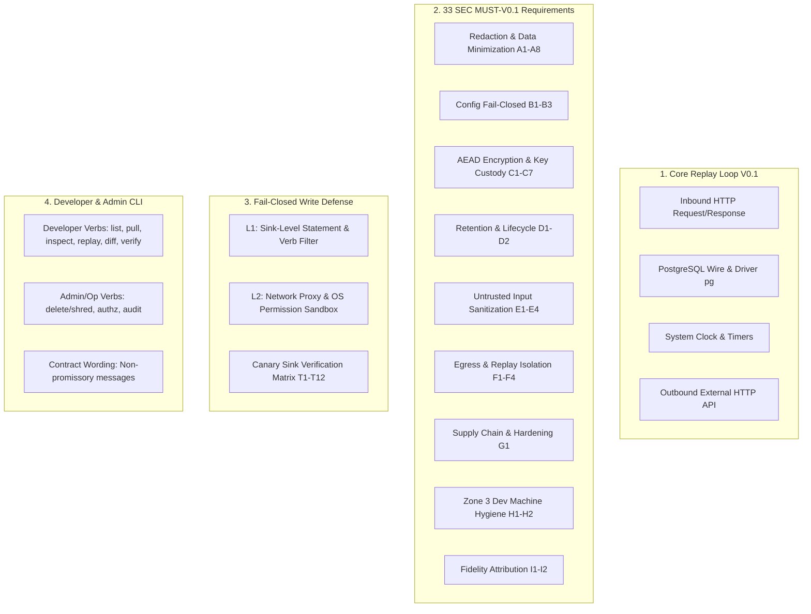

# 🧪 Phân tích Chuyên sâu QA Lead: Master Test Plan V0.1 (Task D8) & Tiêu chí Nghiệm thu Agile (Task D7)

**Dự án**: Repro — Deterministic Execution Replay Engine  
**Giai đoạn**: Phase P1 (Gỡ khoá sau gate · W13–W17)  
**Tác giả**: QA Lead / Quality Assurance Lens  
**Người nhận**: Anh **@TrisJr** (Sponsor & Lead)

---

## 1. Tổng quan Chiến lược QA Phase P1 & Nền tảng Master Test Plan V0.1 (Task D8)

### 1.1 Bối cảnh Chuyển giao từ Spike Phase 0 sang Phase P1 & P2
Kính gửi anh **TrisJr**, sau khi anh chính thức phê duyệt `GATE-06 = CÓ` (§39) dựa trên kết quả thực nghiệm hoàn hảo từ Phase 0 ($100\%$ In-Class Execution Match Rate, $7/7$ Composite Fail-Closed, `escaped_side_effects = 0`), dự án Repro bước vào bước ngoặt quan trọng: **chuyển từ môi trường nghiên cứu thăm dò (throwaway spike code) sang xây dựng sản phẩm chất lượng cao V0.1 (production-ready OSS core)**.

Tại Phase P1, nhiệm vụ của QA Lead là kiến tạo toàn diện:
1. **Task D8 — Master Test Plan V0.1** (`docs/035-QA/Test-Plans/MTP-Repro-V0.1.md`): Định nghĩa chiến lược kiểm thử chính thức, phương pháp đo lường tự động hóa $N\text{-}05$ trong CI/CD, bộ test suite cho 33 `SEC MUST-V0.1`, và suite regression chống thoát side-effect $T1\text{–}T12$.
2. **Task D7 — Tiêu chí Nghiệm thu Agile & DoD** (hỗ trợ PO gỡ `GATE-02`): Chuẩn hóa cấu trúc Acceptance Criteria (Given-When-Then) và Definition of Done (DoD) cho 5 Epics V0.1, tuyệt đối loại bỏ các thuật ngữ mơ hồ như *"sufficiently equivalent"* trần trụi.

---

### 1.2 Phạm vi Kiểm thử V0.1 (V0.1 Test Scope Boundary)

Phạm vi kiểm thử của V0.1 tập trung vào 4 trụ cột cốt lõi:



| Phân hệ | Thành phần trong phạm vi V0.1 (In-Scope) | Ngoài phạm vi V0.1 (Explicit Out-of-Scope) |
|---|---|---|
| **Core Replay Loop** | • Inbound HTTP (Express/Fastify/Node http)<br>• PostgreSQL (driver `pg` / wire protocol mock)<br>• Clock & Date (`Date.now()`, `new Date()`, `setTimeout`)<br>• External HTTP API (Node `fetch`, `http.request`, `https.request`, `axios`) | • Redis state replay (chỉ fire-and-forget fallback theo $G1$)<br>• Kafka / Message Queues<br>• Distributed race condition scheduling<br>• Browser / DOM capture |
| **Bảo mật & Tuân thủ** | • Đủ 33 requirement `SEC MUST-V0.1` (Nhóm A–I)<br>• AES-256-GCM AEAD at rest<br>• HMAC/SHA-256 Digest-Before-Parse<br>• Crypto-shredding (per-capsule key custody `ADR-012`)<br>• Append-only Audit log trong OSS core (`D2`)<br>• TTL 30 ngày mặc định (`GATE-05a`) | • Enterprise SSO / SAML / OIDC provider (commercial layer)<br>• Asymmetric RSA/ECDSA organization PKI capsule signing (`SEC-039` DEFER)<br>• Subject-level GDPR pseudonym search index (`SEC-025` DEFER) |
| **An toàn Replay** | • Default-deny write fail-closed 2 lớp ($L1$ sink filter + $L2$ network proxy allowlist)<br>• Node.js `--permission` flag sandbox ngăn chặn `child_process curl` ($T8$)<br>• Canary Sink (`canary-net` + `canary-db`) xác minh `escaped_side_effects == 0` | • Hypervisor VM / Firecracker microVM isolation<br>• Kernel eBPF egress enforcement (dành cho V0.2+) |
| **CLI & Tools** | • 6 developer verbs: `list`, `pull`, `inspect`, `replay`, `diff`, `verify`<br>• Admin verbs từ $D6$: `repro delete --shred`, `repro audit`, `repro auth`<br>• Khung thông điệp hợp đồng chuẩn xác: `✓ Captured execution no longer reproduces` (§20.16) | • GUI / Desktop app<br>• Web dashboard / APM UI<br>• AI Root-cause analysis / Auto-fix code generator |

---

## 2. Thiết kế Phương pháp Đo lường Tự động hóa `N-05` (Execution Match Rate) trong CI/CD

### 2.1 Định nghĩa Toán học & Cơ chế Lấy Mẫu Chuẩn

Chỉ số **$N\text{-}05$ (Execution Match Rate - $R_{em}$)** là thước đo thành công tối thượng của V0.1. Để loại bỏ triệt để nguy cơ đánh tráo mẫu số (denominator bias), em thiết kế phương pháp tính toán và lấy mẫu bất biến như sau:

$$\text{Population } (N_{pop}) = D \times K$$

Trong đó:
- $D$: Số lượng scenario fixtures thuộc *Supported Execution Class* ($D=7$ in-class theo quyết định $G3$).
- $K$: Số lần replay lặp lại độc lập trên **cùng code, cùng capsule, cùng môi trường local** ($K = 3$ theo quy chuẩn $U\text{-}25$ và MTP-Spike-P0).
- $\text{Total Replays } N_{pop} = 7 \times 3 = 21\text{ runs}$.

$$R_{em} = \frac{\sum_{i=1}^{D} \sum_{j=1}^{K} \mathbb{I}(\text{Verdict}_{i,j} == \text{"matched"})}{D \times K} \times 100\%$$

$$\text{Composite Fail-Closed Index } (C_{fc}) = \frac{\sum_{i=1}^{D} \prod_{j=1}^{K} \mathbb{I}(\text{ReplayRun}_{i,j} == \text{SUCCESS} \land \text{Verdict}_{i,j} == \text{"matched"})}{D}$$

**Quy tắc Fail-Closed bất biến trong CI**:
1. Nếu bất kỳ lượt replay nào trong $K=3$ bị crash, timeout, unhandled exception, hoặc không mở được capsule $\rightarrow$ Lượt đó tính là `UNMATCHED / FAILED` và **KHÔNG ĐƯỢC PHÉP RỜI KHỎI MẪU SỐ**.
2. Một scenario chỉ được tính là $\text{Reproduced}$ khi và chỉ khi **toàn bộ $K=3$ lần replay đều đạt verdict `matched`**.

---

### 2.2 Kiến trúc CI/CD Test Harness cho Replay Loop (`@repro/test-harness`)

Để thực thi trong CI pipeline (GitHub Actions / GitLab CI) với Jest hoặc Node.js Native Test Runner (`node --test`), em thiết kế harness tự động hóa:

```text
┌────────────────────────────────────────────────────────────────────────────────────────┐
│ CI/CD Pipeline Worker (Runner Container)                                               │
│                                                                                        │
│  ┌──────────────────────────────────────────────────────────────────────────────────┐  │
│  │ 1. Fixture Loader & Capsule Generator                                            │  │
│  │    • Seed synthetic DB state (Docker Postgres)                                   │  │
│  │    • Trigger Target Endpoints with @repro/node Recorder ON                       │  │
│  │    • Generate Sealed Capsules into Ephemeral Artifact Store                      │  │
│  │    • Destroy Original Environment (Tear down container & rotate secrets)         │  │
│  └────────────────────────────────────────┬─────────────────────────────────────────┘  │
│                                           │                                            │
│                                           ▼                                            │
│  ┌──────────────────────────────────────────────────────────────────────────────────┐  │
│  │ 2. Independent Canary Sink Listener Daemon (canary-net:1842, canary-db:5433)     │  │
│  │    • TCP Socket Listener (captures zero-byte attempts)                           │  │
│  │    • Mock HTTP & Append-only DB Audit Sink                                       │  │
│  └────────────────────────────────────────┬─────────────────────────────────────────┘  │
│                                           │                                            │
│                                           ▼                                            │
│  ┌──────────────────────────────────────────────────────────────────────────────────┐  │
│  │ 3. Headless Replay Engine Loop (K = 3 Replications)                              │  │
│  │    • Execute: `repro replay --capsule <path> --json --headless`                  │  │
│  │    • Enforce: L1 Sink Filter + L2 Sandbox (Node.js --permission)                 │  │
│  │    • Capture: t_boot, t_replay_exec, t_verify, interaction diff log              │  │
│  └────────────────────────────────────────┬─────────────────────────────────────────┘  │
│                                           │                                            │
│                                           ▼                                            │
│  ┌──────────────────────────────────────────────────────────────────────────────────┐  │
│  │ 4. Verification & Automated Attribution Engine (Spec §3.6)                        │  │
│  │    • Compute Structural Equivalence via identity() & normalize()                 │  │
│  │    • Check First Divergence Point against Redaction Record & Manifest            │  │
│  │    • Pull Canary Logs -> Assert escaped_side_effects == 0                        │  │
│  │    • Emit Machine-Readable JSON Report & Evaluate CI Gate Quality Policy         │  │
│  └──────────────────────────────────────────────────────────────────────────────────┘  │
└────────────────────────────────────────────────────────────────────────────────────────┘
```

---

### 2.3 Cơ chế Phân lập Divergence Tự động hóa 6 Bước (Automated Attribution)

Khi một lượt replay trả về `verdict = diverged`, harness tự động kích hoạt thủ tục quy trách nhiệm tuần tự (First-Match-Wins) được mã hóa trong test runner:

```javascript
// Mã giả thuật toán Automated Divergence Attribution trong CI Test Harness
function attributeDivergence(replayResult, capsule, manifest, kRunVerdicts) {
  const firstDivPoint = replayResult.firstDivergencePoint;
  if (!firstDivPoint) return { label: "inconclusive", reason: "No divergence point emitted" };

  // Bước 1: Kiểm tra Redaction Record (U-15, SEC-048)
  if (capsule.manifest.redaction_applied.some(r => r.path === firstDivPoint.path)) {
    return { label: "redaction", detail: `Path ${firstDivPoint.path} was redacted using ${firstDivPoint.strategy}` };
  }

  // Bước 2: Kiểm tra Known-Missing-Input Manifest (Spec §2, MTP §6)
  if (manifest.missing_inputs.some(m => m.target === firstDivPoint.target && m.predicted_impact === true)) {
    return { label: "incomplete-capture", detail: `Target ${firstDivPoint.target} is known uncaptured (e.g. GAP-Redis)` };
  }

  // Bước 3: Kiểm tra Truncation do Row/Byte Cap (SEC-008)
  if (firstDivPoint.isTruncated === true || capsule.hasFlag("truncated")) {
    return { label: "truncated", detail: `Result set exceeded row/byte cap at ${firstDivPoint.target}` };
  }

  // Bước 4: Kiểm tra Version / Schema / Dependency Drift (Spec §3.6 step 4)
  if (replayResult.driftFlags && replayResult.driftFlags.hasMismatch()) {
    return { label: "version-drift", detail: replayResult.driftFlags.getDiffSummary() };
  }

  // Bước 5: Kiểm tra Non-Determinism thông qua K = 3 runs (U-25)
  const uniqueVerdicts = new Set(kRunVerdicts.map(v => v.status));
  if (uniqueVerdicts.size > 1) {
    return { label: "out-of-scope-determinism", detail: `Inconsistent verdicts across K=3 runs: ${Array.from(uniqueVerdicts).join(",")}` };
  }

  // Bước 6: Phân loại lỗi Code Logic thật sự
  if (replayResult.rubricVerdict === "code_diverged") {
    return { label: "code", detail: "True application logic deviation" };
  }

  // Trường hợp không xác định (CẤM gộp thầm vào code)
  return { label: "unattributed", detail: "Divergence cannot be mapped to known categories" };
}
```

---

### 2.4 Hợp đồng Output JSON Máy Đọc Được & Cổng Chặn CI (CI Quality Gate)

Mỗi lần chạy CI test suite, harness xuất ra file `repro-qa-summary.json`. CI Gate sẽ đánh giá các điều kiện đỗ/trượt (Pass/Fail) tự động:

```json
{
  "suite_version": "0.1.0",
  "timestamp": "2026-08-28T10:00:00.000Z",
  "commit_hash": "a1b2c3d4e5f67890",
  "metrics": {
    "total_scenarios_in_class": 7,
    "k_factor": 3,
    "total_replays": 21,
    "execution_match_count": 21,
    "execution_match_rate_pct": 100.0,
    "composite_fail_closed_fraction": "7/7",
    "composite_fail_closed_pct": 100.0,
    "escaped_side_effects": 0,
    "unattributed_divergence_count": 0,
    "performance": {
      "avg_latency_overhead_discard_pct": 1.62,
      "avg_latency_overhead_persist_pct": 3.45,
      "avg_capsule_size_bytes": 2042,
      "p95_capsule_size_bytes": 2448,
      "p95_capsule_size_sample_n": 33,
      "avg_replay_duration_ms": 1.03
    }
  },
  "gate_evaluations": {
    "gate_n05_match_rate": { "target": ">= 95.0%", "actual": "100.0%", "verdict": "PASSED" },
    "gate_composite_fail_closed": { "target": ">= 6/7", "actual": "7/7", "verdict": "PASSED" },
    "gate_safety_zero_egress": { "target": "== 0", "actual": 0, "verdict": "PASSED" },
    "gate_unattributed_divergence": { "target": "== 0", "actual": 0, "verdict": "PASSED" },
    "gate_sec_must_v01": { "target": "33/33", "actual": "33/33", "verdict": "PASSED" }
  },
  "overall_ci_status": "SUCCESS"
}
```

---

## 3. Ma trận Test Case Chi tiết cho 33 `SEC MUST-V0.1` Requirements

Em cấu trúc toàn bộ 33 yêu cầu bảo mật bắt buộc của V0.1 thành ma trận test case khả thi bằng Jest/Node test runner:

### 3.1 Bảng Ma trận 33 Test Case `SEC MUST-V0.1` (Nhóm A–I)

| Nhóm | Test Suite ID | Requirement ID | Mục tiêu Kiểm thử (Test Objective) | Input Fixture / Injection Vector | Expected Verdict / Behavioral Assertion (Fail-Closed) |
|---|---|---|---|---|---|
| **A. Redaction & Minimization** | `TC-SEC-001` | `SEC-001` | Redaction lỗi $\rightarrow$ Không persist | Inject exception trong custom redaction regex worker. | Recorder ném fail-safe: payload bị huỷ bỏ, capsule ghi `<REDACTION-FAILED>`, counter `redaction_failed_total` tăng 1, không ghi dữ liệu thô. |
| | `TC-SEC-002` | `SEC-002` | `NEVER-STORE` Header scrubbing | Request mang `Authorization: Bearer secret`, `Cookie: sess=xyz`. | Capsule manifest chỉ lưu `{ "name": "authorization", "length": 25 }`, value hoàn toàn vắng mặt trên memory buffer và đĩa. |
| | `TC-SEC-003` | `SEC-003` | Body field redaction & audit manifest | Request body mang `{ "password": "MySecretPassword123" }`. | Giá trị password bị thay thế theo policy; manifest ghi nhận `{ "path": "$.password", "strategy": "REPLACE-FIXED" }`, không lưu hash có thể dò ngược. |
| | `TC-SEC-004` | `SEC-004` | Env Allowlist enforcement | Khởi tạo recorder với `process.env` chứa `DATABASE_URL`, `AWS_SECRET_ACCESS_KEY`, `APP_VERSION`. | Chỉ `APP_VERSION` được lưu; `AWS_SECRET_ACCESS_KEY` biến mất hoàn toàn, không có key rỗng. |
| | `TC-SEC-005` | `SEC-005` | PAN Detection & Luhn Algorithm Check | Payload nhúng chuỗi số thẻ tín dụng hợp lệ 16 chữ số qua Luhn trong trường `note` hoặc error stack. | Scrubber kích hoạt: số thẻ bị thay bằng `4111********1111`, cờ `pan_detected: true` bật trong manifest bất kể tên field. |
| | `TC-SEC-006` | `SEC-006` | Free-text body scrubbing | Body chứa trường `user_comment: "Long text description..."`. | Nội dung comment bị `DROP`, thay bằng `{ "type": "string", "length": 24, "sha256_prefix": "a1b2..." }`; giữ nguyên key trong JSON structure. |
| | `TC-SEC-007` | `SEC-007` | Stack trace & DB error scrubber | Database ném lỗi `duplicate key error: email "admin@repro.dev"`. | Error message được scrub qua regex pattern; chuỗi email bị che thành `<EMAIL-REDACTED>` trước khi ghi vào capsule. |
| | `TC-SEC-008` | `SEC-008` | DB Query Row/Byte Cap Truncation | SQL Query trả về 500 rows ($250\text{ KB}$), vượt trần $100\text{ rows} / 64\text{ KB}$. | Recorder cắt chính xác tại row 100, set cờ `truncated: true`, ghi nhận `actual_rows: 500, captured_rows: 100`; không tràn memory. |
| **B. Config Integrity** | `TC-SEC-009` | `SEC-009` | Redaction config malformed $\rightarrow$ Refuse to start | Cung cấp file `repro.config.yaml` sai cú pháp JSON/YAML hoặc sai schema. | Recorder crash ngay tại `repro.init()`, in lỗi `ConfigValidationError`, từ chối khởi động app production ở chế độ không bảo vệ. |
| | `TC-SEC-011` | `SEC-011` | Default profile when config missing | Khởi chạy không cung cấp config file. | Recorder tự động nạp built-in standard profile (che Authorization, Cookie, Token, PAN), không bao giờ rơi vào trạng thái "no redaction". |
| | `TC-SEC-012` | `SEC-012` | Disable redaction requires explicit flag | Cấu hình `enabled: false` mà không có CLI flag `--i-accept-full-capture`. | Recorder từ chối start; khi có cờ, in cảnh báo đỏ, ghi audit log, đóng dấu nhãn `UNREDACTED` đỏ trên mọi output `list`/`inspect`. |
| **C. At-Rest & Core Access Control** | `TC-SEC-015` | `SEC-015` | AEAD AES-256-GCM Encryption at rest | Lưu capsule xuống đĩa và can thiệp sửa 1 byte ciphertext. | Giải mã thất bại với `AuthTagMismatchError`; capsule bị từ chối mở; storage backend không lưu trữ plaintext key. |
| | `TC-SEC-016` | `SEC-016` | Crypto-shredding via Key Custody | Thực hiện `repro shred --capsule <id>` (xoá key tại KMS/Zone 2) rồi chạy `repro replay`. | Replay thất bại ngay tại bước boot: `CryptoShreddedError: Decryption key has been permanently destroyed`; toàn bộ bản copy ở Zone 3 vô hiệu. |
| | `TC-SEC-017` | `SEC-017` | Transport Security & Service Scoping | Recorder upload capsule qua HTTP không mã hoá hoặc sai service token. | Collector từ chối kết nối non-TLS và từ chối token sai scope với `401 Unauthorized / 403 Forbidden`. |
| | `TC-SEC-018` | `SEC-018` | Deny-by-default Auth trong OSS Core | Gửi request `list/pull/inspect/delete` không kèm authentication header. | Trả về `401 Unauthorized` ngay lập tức; không có backdoor ẩn trong OSS core. |
| | `TC-SEC-019` | `SEC-019` | Capsule Scoping isolation | Principal thuộc `Team A` chạy `repro list` trên Capsule Store chứa capsule của `Team A` và `Team B`. | Danh sách trả về **hoàn toàn không chứa** metadata của `Team B` (ngăn chặn leak sự tồn tại của sự cố). |
| | `TC-SEC-020` | `SEC-020` | Append-only Audit Log integrity | User cố gắng gọi API sửa/xoá audit log của chính mình. | Server từ chối `405 Method Not Allowed / 403 Forbidden`; log file chỉ mở ở mode `O_APPEND` với immutability flag. |
| | `TC-SEC-021` | `SEC-021` | Hard Delete in Self-Host | Thực thi lệnh `repro delete <id> --hard` trên self-hosted deployment. | Xoá file vật lý trên storage, phá huỷ decryption key tại key store, ghi audit log event `CAPSULE_HARD_DELETED`. |
| **D. Retention Lifecycle** | `TC-SEC-022` | `SEC-022` | Finite Retention TTL (Default 30 days) | Tạo capsule không chỉ định TTL hoặc cố tình cấu hình `ttl: infinity`. | Hệ thống từ chối `ttl: infinity`; tự động áp `ttl: 30d` ($2,592,000\text{ s}$) theo `GATE-05a`. |
| | `TC-SEC-023` | `SEC-023` | Automatic Expiration Cleanup | Mock thời gian hệ thống tiến tới ngày thứ 31 và kích hoạt daemon GC. | Capsule quá hạn tự động bị xoá khỏi Zone 2; ghi audit log `CAPSULE_AUTO_PURGED`. |
| **E. Untrusted Input Sanitization** | `TC-SEC-027` | `SEC-027` | Digest-Before-Parse Integrity | Thay đổi nội dung `payload.bin` nhưng giữ nguyên `manifest.json`. | CLI kiểm tra SHA-256 digest trước khi parse JSON/BSON $\rightarrow$ Phá vỡ tiến trình với `IntegrityCheckFailedError` trước khi giải nén. |
| | `TC-SEC-028` | `SEC-028` | Zip-Slip & Path Traversal Protection | Inject entry mang tên `../../../../etc/passwd` vào capsule archive. | CLI parser phát hiện đường dẫn thoát khỏi sandbox target $\rightarrow$ Huỷ bỏ toàn bộ capsule, không giải nén bất kỳ file nào. |
| | `TC-SEC-029` | `SEC-029` | Prototype Pollution Protection | Inject key `"__proto__": { "polluted": true }`, `"constructor"`, `"prototype"` vào capsule JSON data. | Payload được parse vào `Object.create(null)`; kiểm tra `({}).polluted === undefined`; ném cảnh báo bảo mật. |
| | `TC-SEC-030` | `SEC-030` | Decompression Bomb Protection | Nén capsule chứa $1\text{ GB}$ byte 0x00 thành file $100\text{ KB}$ (ratio 10,000:1). | Decompressor stream theo dõi ratio và uncompressed size; dừng khẩn cấp khi vượt trần $50\text{ MB}$ hoặc ratio $> 50:1$. |
| **F. Egress & Side-Effect Guard** | `TC-SEC-032` | `SEC-032` | Process-level Egress Blocking | Replay code khởi tạo kết nối `net.createConnection(80, "external.com")`. | Replay runtime chặn ở mức socket; ném lỗi `EgressBlockedException`; ghi log vi phạm. |
| | `TC-SEC-033` | `SEC-033` | Non-READ Default-Deny Fail-Closed | Replay code thực thi SQL `WITH updated AS (UPDATE accounts ...) SELECT * FROM updated`. | Parser L1 nhận diện mệnh đề ghi lồng nhau $\rightarrow$ Từ chối thực thi với `DisallowedWriteStatementError`, không gửi tới DB stub. |
| | `TC-SEC-034` | `SEC-034` | Missing Recording Fail-Closed | Replay code gọi `fetch("https://api.stripe.com/v1/refunds")` không có trong capsule. | Replay runtime trả về `MISSING_RECORDING`, **tuyệt đối không fall through ra mạng internet thật**. |
| | `TC-SEC-035` | `SEC-035` | Host Field Lookup Only | Inject `host: "http://attacker-controlled-canary.com"` vào capsule recording entry. | Runtime chỉ dùng host làm lookup key so khớp bảng hash; không thực hiện DNS resolve hay mở socket tới host đó. |
| **G. Hardening & Supply Chain** | `TC-SEC-037` | `SEC-037` | Bounded Buffer Drop on Overload | Gửi 10,000 request dồn dập vào test app với memory buffer giới hạn $10\text{ MB}$. | Recorder drop bớt capture event, tăng metric `capture_dropped_total`, request production của khách hàng hoàn tất bình thường với HTTP 200. |
| **H. Zone 3 Dev Hygiene** | `TC-SEC-042` | `SEC-042` | File Permission 0600/0700 | Chạy `repro pull <id>` trên laptop developer. | File capsule được tạo với permission `0600` (chỉ owner đọc/ghi) và thư mục `~/.repro/capsules` có permission `0700`. |
| | `TC-SEC-043` | `SEC-043` | Git Working Tree Guard | Chạy `repro pull <id> -o ./src/fixtures/`. | CLI từ chối ghi vào git working tree trừ khi có cờ `--force-inside-git`; tự động thêm `.repro/` vào `.gitignore`. |
| **I. Fidelity Transparency** | `TC-SEC-047` | `SEC-047` | Redaction Applied Manifest Record | Capture request chứa trường `phone` bị che thành `***`. | Manifest ghi `{ "path": "$.phone", "strategy": "MASK" }`, không chứa số điện thoại gốc. |
| | `TC-SEC-048` | `SEC-048` | Execution Diff Redaction Attribution | Replay gặp phân kỳ tại trường `phone` do giá trị mock khác giá trị gốc. | Execution Diff đối chiếu manifest và in: `Divergence attributed to REDACTION at $.phone (NOT a code bug)`. |

---

## 4. Thiết kế Suite Regression Testing Chống 12 Kịch bản Tấn công & Thoát Side-Effect (T1–T12 Mở rộng)

### 4.1 Bẫy Phương pháp `ECONNREFUSED` và Cơ chế Canary Sink

Kế thừa phát hiện phương pháp học sống còn từ MTP-Spike-Phase-0 (§5.1):
> **Cảnh báo**: Sau khi huỷ môi trường gốc (Destroy Original Environment), một kết nối ghi **BỊ RÒ RỈ** và một kết nối **BỊ CHẶN** đều có thể nhận mã lỗi `ECONNREFUSED` và trông **hoàn toàn giống hệt nhau**.

Để bài test có giá trị pháp lý và kỹ thuật, **Canary Sink độc lập (`canary-net` + `canary-db`)** được thiết lập làm quan sát viên độc lập. Nguồn sự thật (Source of Truth) cho kết quả test **bắt buộc là Canary Log**, không bao giờ dùng log của chính Replay Runtime (tránh xác minh vòng tròn).

```text
┌────────────────────────────────────────────────────────────────────────────────────────┐
│ Bẫy Phương Pháp: Replay Runtime Log vs Canary Sink Log                                │
│                                                                                        │
│  Replay Runtime (Bị kiểm thử)                 Canary Sink (Quan sát viên độc lập)      │
│  ┌──────────────────────────────┐             ┌─────────────────────────────────────┐  │
│  │ Runtime claims:              │             │ Canary Log:                         │  │
│  │ "All writes blocked! (0)"    │ ──────────► │ "TCP Connection from 127.0.0.1:     │  │
│  │                              │   RÒ RỈ!    │  POST /v1/charge - $500"            │  │
│  └──────────────────────────────┘             └─────────────────────────────────────┘  │
│                 ▲                                                ▲                     │
│                 │                                                │                     │
│     [XÁC MINH VÒNG TRÒN - VÔ GIÁ TRỊ]               [NGUỒN SỰ THẬT DUY NHẤT - CÓ GIÁ TRỊ]│
└────────────────────────────────────────────────────────────────────────────────────────┘
```

---

### 4.2 Ma trận 12 Kịch bản Regression Testing $T1\text{–}T12$

| Test ID | Tên Kịch bản & Cơ chế Tấn công | Vector Thực thi / Code Mẫu | Lớp Chặn Kỳ vọng | Tiêu chí Đạt & Hành vi Kiểm chứng Canary |
|:--:|---|---|:--:|---|
| **$T1$** | Direct Write Statements | `INSERT INTO users VALUES (...)`, `UPDATE orders ...`, `DELETE FROM items ...` | `L1` (SQL Parser) | L1 chặn tại sink driver `pg`. Canary DB log = 0 queries nhận được. |
| **$T2$** | CTE Wrapped Write (`WITH ... UPDATE`) | `WITH updated AS (UPDATE accounts SET balance = 0 RETURNING *) SELECT * FROM updated;` | `L1` (SQL AST Parser) | L1 phân tích cây AST thay vì kiểm tra prefix string. Chặn đứng lệnh; Canary DB log = 0. |
| **$T3$** | Side-Effect Functions in `SELECT` | `SELECT charge_credit_card(user_id, 100) FROM users;` | `L1` (Function Blacklist & AST) | L1 từ chối mọi `SELECT` gọi custom functions chưa kiểm chứng. Canary DB log = 0. |
| **$T4$** | Stored Procedure Call | `CALL process_payout(1001, 'USD');` | `L1` (Default-Deny Verb) | L1 fail-closed từ chối verb `CALL`. Canary DB log = 0. |
| **$T5$** | Multi-Statement Batch SQL | `SELECT * FROM products; UPDATE inventory SET stock = 0;` | `L1` (Multi-statement split) | L1 phân rã từng câu lệnh; phát hiện câu thứ 2 là write $\rightarrow$ Huỷ toàn bộ batch. Canary DB log = 0. |
| **$T6$** | HTTP GET with Mutation Semantics | `GET /v1/notifications/send-sms?to=+123456&msg=OTP` | `L1` (Replay Match Binding) | L1 chỉ cho phép READ nếu request khớp chính xác hash của entry đã ghi trong capsule; không khớp $\rightarrow$ ném `MISSING_RECORDING`. Canary Net log = 0. |
| **$T7$** | Raw Uninstrumented `net.Socket` | `const s = new net.Socket(); s.connect(80, 'payment.gateway'); s.write('DATA');` | `L2` (Network Proxy Egress) | L2 network proxy bắt socket descriptor; chặn mở kết nối ra ngoài allowlist. Canary Net log = 0. |
| **$T8$** | Subprocess Escape (`child_process curl`) | `execSync('curl -X POST https://bank.api/transfer -d "amount=1000"')` | `L2` (Node.js `--permission` Sandbox) | **Giải pháp V0.1**: Chạy replay với `node --permission --allow-fs-read --deny-child-process`. Subprocess ném `ERR_ACCESS_DENIED`. Canary Net log = 0. |
| **$T9$** | Vendor SDK with Custom Transport (gRPC / C++ Addon) | AWS SDK / Stripe SDK sử dụng native C++ binding bypass `http.request`. | `L2` (OS Network Namespace / Sandbox) | L2 chặn ở socket boundary. Canary Net log = 0. |
| **$T10$** | Missing Recording Fall-Through Attempt | Replay code gọi endpoint phát sinh mới trong logic nhánh rẽ chưa được capture. | `L1` + `SEC-034` | Replay runtime ném lỗi `MISSING_RECORDING`, tuyệt đối không gửi request ra mạng thật. Canary Net log = 0. |
| **$T11$** | Capsule Host Override Injection | Capsule giả mạo chứa trường `url: "http://canary-sink:1842/leak"` hòng bẫy runtime kết nối tới canary. | `SEC-035` | Runtime chỉ dùng URL làm lookup hash key, không bao giờ dùng làm destination address. Canary Net log = 0. |
| **$T12$** | Loopback Host Egress Bypass | Replay code kết nối tới `127.0.0.1:1842` (nơi có service nội bộ thật lắng nghe). | `L1` + `SEC-035` + `canary loopback listener` | Canary Sink lắng nghe cả trên loopback interface; runtime chỉ cho phép loopback tới cổng của Replay Proxy nội bộ. Canary Loopback log = 0. |

---

## 5. Tiêu chuẩn Nghiệm thu Agile (Acceptance Criteria) cho 5 Epics V0.1 (Task D7)

Để hỗ trợ Product Owner phân rã User Stories trong Task D7 (gỡ bỏ hoàn toàn `GATE-02`), em chuẩn hóa tiêu chuẩn viết Acceptance Criteria theo định dạng **Given-When-Then** không mơ hồ và **Definition of Done (DoD)** chuẩn mực cho 5 Epics V0.1:

### 5.1 Tiêu chuẩn Given-When-Then cho 5 Epics V0.1

#### Epic 1: SDK & In-Process Capture (`@repro/node`)
- **AC-E1-01 (Deterministic Failure Capture)**:
  - **Given** ứng dụng Node.js đã tích hợp `@repro/node` và nhận một HTTP request gây lỗi $5xx$,
  - **When** request hoàn tất xử lý và trigger cơ chế failure-capture,
  - **Then** recorder trích xuất đầy đủ 8 nhóm dữ liệu của §18 (HTTP request/response, DB query/result, external API, clock, stack trace, runtime metadata), nén và lưu thành capsule hợp lệ với độ trễ ghi $P\text{-persist} < 5.0\%$.
- **AC-E1-02 (Buffer Bound & Dropping)**:
  - **Given** memory buffer của recorder chạm ngưỡng giới hạn cấu hình (mặc định $32\text{ MB}$),
  - **When** có các request lỗi mới tiếp tục phát sinh,
  - **Then** recorder tự động drop capture event, tăng biến đếm `capture_dropped_total`, và tuyệt đối không làm chậm hoặc ném exception ra luồng xử lý của khách hàng.

#### Epic 2: Capsule Storage & Cryptographic Management (`Capsule & Store`)
- **AC-E2-01 (AEAD Encryption & Key Custody)**:
  - **Given** một capsule chuẩn bị được persist lên Capsule Store,
  - **When** capsule writer thực hiện mã hoá at-rest,
  - **Then** payload được mã hoá bằng thuật toán AES-256-GCM với một encryption key ngẫu nhiên riêng biệt ($A\text{-}10$), key này được bàn giao an toàn cho Key Custody Manager (`ADR-012`) và không lưu trữ kèm capsule file.
- **AC-E2-02 (Crypto-Shredding Destruction)**:
  - **Given** một capsule đã được tải xuống nhiều workstation developer (Zone 3),
  - **When** admin thực hiện lệnh `repro delete <id> --shred`,
  - **Then** encryption key tương ứng trong Key Store bị phá huỷ vĩnh viễn, khiến toàn bộ các bản copy capsule trên máy developer trở thành ciphertext vô nghĩa khi chạy `repro replay`.

#### Epic 3: Deterministic Replay Runtime (`Replay Runtime`)
- **AC-E3-01 (Core Replay Loop Simulation)**:
  - **Given** một capsule hợp lệ chứa các tương tác HTTP, PostgreSQL và External API,
  - **When** developer khởi chạy `repro replay --capsule <path>`,
  - **Then** Replay Runtime nạp và cấp phát chính xác các recorded responses khi ứng dụng local thực hiện truy vấn DB hoặc gọi external API mà không cần kết nối tới database hoặc external server thật.
- **AC-E3-02 (Fail-Closed Egress Guard)**:
  - **Given** code ứng dụng trong phiên replay cố gắng thực hiện một HTTP request lạ hoặc câu lệnh SQL `UPDATE`,
  - **When** tương tác chạm vào tầng driver hoặc network boundary,
  - **Then** hệ thống lập tức từ chối với lỗi `MISSING_RECORDING` hoặc `DisallowedWriteStatementError`, và không có bất kỳ byte dữ liệu nào rời khỏi process.

#### Epic 4: Verification & First-Class Diff (`Verification & Diff`)
- **AC-E4-01 (Structural Equivalence Matching)**:
  - **Given** một phiên replay hoàn tất thực thi,
  - **When** Verification Engine đối chiếu chuỗi interaction local với production recording qua hàm `identity()` và `normalize()`,
  - **Then** engine trả về kết luận `matched` nếu cấu trúc và dữ liệu tương đương đủ mức, hoặc `diverged` kèm vị trí và chi tiết của điểm phân kỳ đầu tiên (First Divergence Point).
- **AC-E4-02 (Automated Attribution)**:
  - **Given** một phiên replay bị phân kỳ (`diverged`),
  - **When** engine phân tích nguyên nhân qua 6 bước của Spec §3.6,
  - **Then** báo cáo hiển thị chính xác một trong các nhãn: `redaction`, `incomplete-capture`, `truncated`, `version-drift`, `out-of-scope-determinism`, hoặc `code`.

#### Epic 5: Developer & Operator CLI (`CLI & Admin`)
- **AC-E5-01 (6 Core Developer Verbs)**:
  - **Given** developer đã cài đặt `@repro/cli`,
  - **When** thực thi các lệnh `list`, `pull`, `inspect`, `replay`, `diff`, `verify`,
  - **Then** CLI phản hồi đúng định dạng, hỗ trợ cả output rich terminal màu và raw machine-readable JSON (`--json`).
- **AC-E5-02 (Contract-Compliant Verdict Messaging)**:
  - **Given** developer replay thành công một lỗi sau khi sửa code,
  - **When** CLI in kết quả nghiệm thu ra màn hình terminal,
  - **Then** thông điệp bắt buộc phải hiển thị chính xác: `✓ Captured execution no longer reproduces` (§20.16), tuyệt đối không dùng các câu gây hiểu lầm như `✓ Production bug is fixed`.

---

### 5.2 Definition of Done (DoD) Chuẩn Mực cho Từng User Story V0.1

Mọi User Story trong Phase P2 (Build V0.1) chỉ được coi là hoàn thành (Done) khi thoả mãn đồng thời 5 tiêu chuẩn nghiêm ngặt:

```text
┌────────────────────────────────────────────────────────────────────────────────────────┐
│ Repro Definition of Done (DoD) - 5 Cổng Chất Lượng Bắt Buộc                            │
│                                                                                        │
│  [1. Unit & Logic]       Coverage >= 85% core logic; 0% false confidence assertions    │
│            ▼                                                                           │
│  [2. Integration E2E]    Full Capture-to-Replay lifecycle passes on Jest / Node test   │
│            ▼                                                                           │
│  [3. Security Compliance] 100% SEC MUST-V0.1 tests pass; 0 unhandled egress attempts    │
│            ▼                                                                           │
│  [4. CI/CD Automation]   Automated execution emits machine-readable JSON & Pass Gate   │
│            ▼                                                                           │
│  [5. Traceability]       Story ID -> Test Case ID -> Threat ID 100% mapped & documented│
└────────────────────────────────────────────────────────────────────────────────────────┘
```

1. **Unit Test & Logic Coverage**:
   - Độ bao phủ mã nguồn (Line & Branch Coverage) $\ge 85\%$ cho toàn bộ core logic (`recorder`, `capsule`, `replay`, `verify`, `diff`, `cli`).
   - $100\%$ các hàm so khớp (`identity`, `normalize`) phải có unit test kiểm tra tính tất định và idempotent.
2. **Integration & E2E Testing**:
   - Toàn bộ chu trình từ lúc Capture $\rightarrow$ Ghi Capsule $\rightarrow$ Replay Local $\rightarrow$ Verification & Diff phải chạy tự động và pass $100\%$ trên test harness Node.js.
   - Thử nghiệm trên tối thiểu 7 in-class scenarios ($D=7$) với $K=3$ lượt lặp lại đạt $R_{em} = 100\%$.
3. **Security & Side-Effect Zero Egress**:
   - Đạt $100\%$ các test case tương ứng trong ma trận 33 `SEC MUST-V0.1`.
   - Chạy qua suite 12 kịch bản $T1\text{–}T12$ với xác nhận từ Canary Log độc lập: `escaped_side_effects == 0`.
4. **CI/CD Machine-Readable Automation**:
   - Test suite được tích hợp vào CI pipeline, chạy không cần tương tác người dùng (headless mode).
   - Xuất dữ liệu báo cáo chuẩn JSON format (`repro-qa-summary.json`) phục vụ đánh giá cổng chất lượng tự động.
5. **Documentation & Traceability**:
   - Mỗi User Story phải có bảng Traceability Matrix liên kết trực tiếp: `Story ID` $\leftrightarrow$ `Test Case ID` $\leftrightarrow$ `Threat ID / NFR ID`.
   - Cập nhật tài liệu hướng dẫn kỹ thuật và API reference tương ứng trong thư mục `docs/`.

---

## 6. Kế hoạch Chuyển giao & Đóng góp Deliverables Phase P1 (D8 & D7)

Dựa trên toàn bộ phân tích chuyên sâu ở trên, em xin đề xuất lộ trình soạn thảo và hoàn thiện các deliverables của QA trong Phase P1:

| Task ID | Deliverable File | Khối lượng (MD) | Vai trò | Mục tiêu & Đóng góp |
|:--:|---|:--:|:--:|---|
| **`D8`** | `docs/035-QA/Test-Plans/MTP-Repro-V0.1.md` | **2.5 MD** | 🧪 Driver (QA Lead) | Soạn thảo chính thức Master Test Plan V0.1 bao gồm: Scope kiểm thử, Phương pháp đo $N\text{-}05$ trong CI, Ma trận 33 `SEC MUST-V0.1`, và Suite Regression $T1\text{–}T12$. |
| **`D7`** | `docs/022-User-Stories/Epics/` & `Backlog/` | **4.0 MD** | 🧪 Collaborator (cùng PO & BA) | Cung cấp toàn bộ tiêu chuẩn Given-When-Then, ma trận phân rã test cases, và bộ Definition of Done (DoD) chuẩn cho 5 Epics V0.1. |

---

STATUS: DONE
FILES_TOUCHED:
- docs/010-Planning/pm-runs/2026-08-28-phase-p1-ungate-v01/findings/quality-assurance.md
SUMMARY:
Em đã hoàn tất thiết kế toàn diện cho Master Test Plan V0.1 (Task D8) và tiêu chí nghiệm thu Agile / Definition of Done (Task D7) phục vụ Phase P1:
1. Xác định phạm vi kiểm thử V0.1 bao gồm Core Replay Loop (HTTP, Postgres, Clock, External API), 33 `SEC MUST-V0.1`, default-deny write fail-closed 2 lớp ($L1+L2$), và CLI 6 verbs.
2. Thiết kế phương pháp đo lường tự động hóa $N\text{-}05$ (Execution Match Rate) và Composite Fail-Closed ($D=7, K=3$) trong CI/CD harness với cơ chế phân lập divergence 6 bước và output JSON máy đọc được.
3. Xây dựng ma trận chi tiết cho 33 requirement `SEC MUST-V0.1` (Nhóm A–I) và suite regression 12 kịch bản tấn công/thoát side-effect ($T1\text{–}T12$) được bảo vệ bằng Canary Sink độc lập (`escaped_side_effects == 0`).
4. Chuẩn hóa tiêu chuẩn viết Acceptance Criteria (Given-When-Then) cho 5 Epics V0.1 và định nghĩa 5 cổng chất lượng của Definition of Done (DoD), sẵn sàng cho việc gỡ `GATE-02` và soạn thảo tài liệu chính thức.
