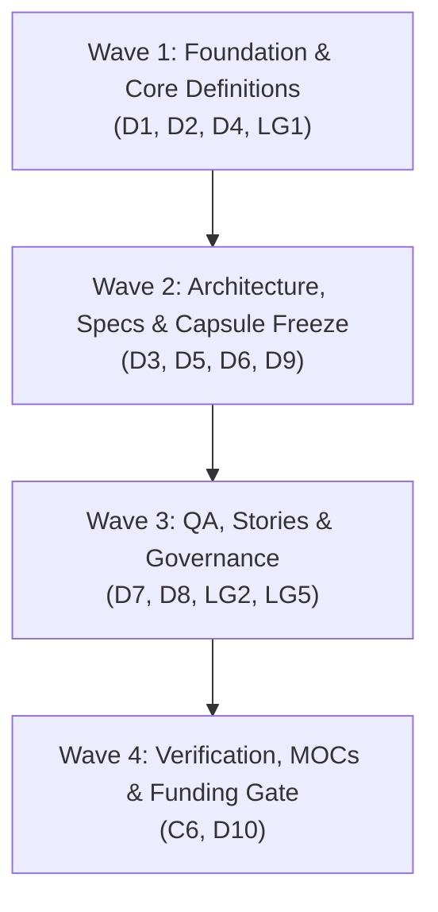

# Run Plan: 2026-08-28-phase-p1-ungate-v01

## 1. Triage & Định tuyến

- **Lane**: `doc`
- **Shape**: `B — Normalization sweep & Authoring` (kết hợp authoring các tài liệu mới và sweep chuẩn hóa cập nhật các tài liệu nền tảng hiện hữu).
- **Tier**: **T3** (Điểm: 3/4)
  - `Q1` (Chạm >1 tầng tài liệu): **Có** (010, 020, 022, 030, 035, 080, Root).
  - `Q2` (Sửa tài liệu `approved` / đổi contract): **Có** (NFR, PRD, SDD, 11 ADRs, Threat Model chuyển từ `HYPOTHESIS` sang định nghĩa chính thức; ban hành `ADR-012`, `ADR-013`, `MTP-Repro-V0.1`).
  - `Q3` (Mơ hồ, thiếu AC): **Không** (Exit criteria từng task `D1`–`D10` và `LG1`–`LG5` đã được định nghĩa chi tiết trong `Timeline-Repro.md §6` và `§6.1`).
  - `Q4` (>5 file hoặc >1 ngày công): **Có** (24.5 MD P1 + 10.0 MD Legal Track, chạm ~25 files).

---

## 2. Tóm Tắt Kết Quả Analysis Fan-out (5 Specialist Lenses)

1. **Context Auditor**: Đã kiểm kê toàn bộ kho tài liệu, xác nhận 27 deliverables (12 cập nhật, 15 tạo mới) tuân thủ 100% Dewey Decimal & RULE-001; 65 file cốt lõi hiện hữu đạt **0 dead links, 0 wiki-links**.
2. **Business Analyst**: Thiết kế hệ thống cam kết $N\text{-}05$ đa tầng ($\ge 90.0\%$ In-Class, $\ge 80.0\%$ Composite fail-closed, $\ge 60.0\%$ Diagnostic floor); nâng 4 $ACG$ ($ACG\text{-}01/02/03/07$) thành định nghĩa sản phẩm chính thức; cấu trúc thay đổi cho `NFR-Repro.md`, `PRD-Repro.md`, `SDD-Repro.md`, `UC-02`.
3. **Software Architect**: Giải quyết dứt điểm 6 Open Items của 11 ADRs ($U\text{-}01, U\text{-}02, U\text{-}03, U\text{-}04, U\text{-}13, U\text{-}20$); thiết kế kiến trúc Key Custody $U\text{-}06d$ trong `ADR-012`; đóng băng Repro Capsule Format v1 trong `ADR-002` & SDD §4; thiết kế authn/authz & CLI operational verbs; đề xuất OSS License Apache-2.0 Open Core trong `ADR-013`.
4. **Security Auditor**: Nâng cấp Threat Model ($D9$) bịt kín $THREAT\text{-}018$ bằng L2 Container Sandbox, chốt trần $SEC\text{-}008$ ($100\text{ rows} / 64\text{ KB}$ per query) và $SEC\text{-}027$ (Integrity check); thẩm định GDPR Art 17 Right-to-Erasure cho crypto-shredding + TTL 30 ngày ($LG3$); ban hành khung `SECURITY.md` và `SLA-Security-Response.md` ($LG5$).
5. **Quality Assurance**: Thiết kế Master Test Plan V0.1 ($D8$) phủ core replay loop, fail-closed write blocking (L1+L2), 33 $SEC\text{ MUST-V0.1}$, CI/CD automated $N\text{-}05$ harness với 6-step attribution, 12 regression scenarios $T1$–$T12$; chuẩn hóa tiêu chuẩn Acceptance Criteria (Given-When-Then) và DoD 5 cổng cho 5 Epics ($D7$).

---

## 3. Lộ Trình Triển Khai Theo Lô (Execution Waves & Budget)

Toàn bộ Phase P1 được phân rã thành **4 Waves tuần tự** với các tập ownership rời nhau tuyệt đối:

| Wave | Hạng mục Tasks | Deliverable Files | Worker Role | Dispatch Mode | Ngân sách Tool Calls |
|---|---|---|---|:---:|:---:|
| **Wave 1** | **`D1`**, **`D2`**, **`D4`**, **`LG1`** | `NFR-Repro.md`, `PRD-Repro.md`, `UC-02-Replay-Capsule-Locally.md`, `ADR-012-Key-Custody.md`, `ADR-013-OSS-License-And-Contribution-Model.md` | `business-analyst`, `architect`, `product-manager` | Tuần tự theo file / Song song theo domain rời | 60 calls |
| **Wave 2** | **`D3`**, **`D5`**, **`D6`**, **`D9`** | `ADR-001`..`ADR-011` (Open items), `ADR-002-Repro-Capsule-Format-Contract.md`, `SDD-Repro.md`, `Spec-Security-Repro-Threat-Model.md` | `architect`, `security-auditor` | Tuần tự theo file / Song song theo domain rời | 60 calls |
| **Wave 3** | **`D7`**, **`D8`**, **`LG2`**, **`LG5`** | `docs/022-User-Stories/Epics/` (5 Epics), `docs/022-User-Stories/Backlog/` (15 Stories), `MTP-Repro-V0.1.md`, `CONTRIBUTING.md`, `CODE_OF_CONDUCT.md`, `SECURITY.md`, `SLA-Security-Response.md` | `product-owner`, `quality-assurance`, `security-auditor` | Tuần tự theo file / Song song theo domain rời | 60 calls |
| **Wave 4** | **`C6`**, **`D10`** | `findings/context-auditor.md`, Cập nhật 7 MOCs & `000-Index.md`, `docs/010-Planning/pm-runs/2026-08-28-phase-p1-ungate-v01/verdict.md`, `cost.md` | `context-auditor`, `product-manager`, 👤 `@TrisJr` | Tuần tự / Verify pass | 60 calls |

---

## 4. File Ownership Map (Rời Nhau Tuyệt Đối)

| Agent / Role | Sở hữu độc quyền (Được phép ghi) | Cấm chạm |
|---|---|---|
| **PM (Main loop)** | `docs/010-Planning/pm-runs/2026-08-28-phase-p1-ungate-v01/*`, Toàn bộ file MOCs (`*-MOC.md`), `docs/000-Index.md`, `docs/010-Planning/Estimates/Timeline-Repro.md` | Nội dung chi tiết các tài liệu chuyên môn khi đang dispatch worker |
| **Business Analyst** | `docs/020-Requirements/NFR-Repro.md`, `docs/020-Requirements/PRD-Repro.md`, `docs/020-Requirements/Use-Cases/UC-02-Replay-Capsule-Locally.md` | Các file ADRs, `SDD-Repro.md`, MOCs, `000-Index.md` |
| **Architect** | `docs/030-Specs/Architecture/ADR-001..013*.md`, `docs/030-Specs/Architecture/SDD-Repro.md` | Các file Requirements, User Stories, MOCs, `000-Index.md` |
| **Security Auditor** | `docs/030-Specs/Security/Spec-Security-Repro-Threat-Model.md`, `docs/080-Operations/SLAs/SLA-Security-Response.md`, `SECURITY.md` | Các file Kiến trúc, User Stories, MOCs, `000-Index.md` |
| **Product Owner** | `docs/022-User-Stories/Epics/Epic-*.md`, `docs/022-User-Stories/Backlog/Story-*.md`, `CONTRIBUTING.md`, `CODE_OF_CONDUCT.md` | Các file Requirements, Specs, MOCs, `000-Index.md` |
| **Quality Assurance** | `docs/035-QA/Test-Plans/MTP-Repro-V0.1.md` | Các file Specs, Requirements, MOCs, `000-Index.md` |
| **Context Auditor** | `docs/010-Planning/pm-runs/2026-08-28-phase-p1-ungate-v01/findings/context-auditor.md` (Read-only toàn kho khi verify) | Toàn bộ `docs/` và root files khi đang verify |

> **Ràng buộc bất biến**:
> 1. Toàn bộ file MOCs (`Requirements-MOC`, `Stories-MOC`, `Specs-MOC`, `QA-MOC`, `Operations-MOC`, `Planning-MOC`) và `000-Index.md` do PM **độc quyền** cập nhật ở Wave 4, không cấp cho worker nào.
> 2. `outline.md` và `run-plan.md` do PM độc quyền quản lý.

---

## 5. Danh Sách Artifact Sắp Tạo / Sửa Ngoài Run-State

1. `docs/020-Requirements/NFR-Repro.md` (Update §3, §7 — $N\text{-}05$ và 4 ACGs)
2. `docs/020-Requirements/PRD-Repro.md` (Update §3.4, §5.5 — ACGs, authn/authz, CLI verbs)
3. `docs/020-Requirements/Use-Cases/UC-02-Replay-Capsule-Locally.md` (Update exception flow — rubric so sánh)
4. `docs/030-Specs/Architecture/ADR-012-Key-Custody.md` (**Tạo mới** — $U\text{-}06d$ Key Custody & Crypto-shredding)
5. `docs/030-Specs/Architecture/ADR-013-OSS-License-And-Contribution-Model.md` (**Tạo mới** — $LG1$ Apache-2.0 License)
6. `docs/030-Specs/Architecture/ADR-001` .. `ADR-011` (Update mục Open items — $D3$)
7. `docs/030-Specs/Architecture/ADR-002-Repro-Capsule-Format-Contract.md` (Update — Đóng băng format v1)
8. `docs/030-Specs/Architecture/SDD-Repro.md` (Update §4, §5.4, §8 — Format v1, authn/authz, 6 open items)
9. `docs/030-Specs/Security/Spec-Security-Repro-Threat-Model.md` (Update — L2 Sandbox, $SEC\text{-}008$, $SEC\text{-}027$, 9 threats)
10. `docs/022-User-Stories/Epics/` (5 Epics mới: SDK, Capsule, Replay, Verify, CLI)
11. `docs/022-User-Stories/Backlog/` (15 User Stories mới chuẩn INVEST)
12. `docs/035-QA/Test-Plans/MTP-Repro-V0.1.md` (**Tạo mới** — Master Test Plan V0.1)
13. `CONTRIBUTING.md`, `CODE_OF_CONDUCT.md` (**Tạo mới** tại Repo Root — $LG2$)
14. `SECURITY.md` (**Tạo mới** tại Repo Root — $LG5$)
15. `docs/080-Operations/SLAs/SLA-Security-Response.md` (**Tạo mới** — $LG5$)
16. Toàn bộ 7 MOCs và `docs/000-Index.md` (Đồng bộ đăng ký)

---

## 6. Assumptions & Rủi Ro Tiềm Ẩn

- `AS-1`: **Độ mịn của phân bố thực tế**: Mẫu số $D=7$ tại Spike Phase 0 đạt $100\%$, việc đặt cam kết $N\text{-}05 \ge 90.0\%$ cho In-Class và $\ge 80.0\%$ Composite là biên an toàn tối ưu cho V0.1.
  - *Nếu sai*: Nếu độ phức tạp của ứng dụng thực tế gây tụt match rate dưới $90\%$, cơ chế Diagnostic $\ge 60\%$ và 6-step attribution sẽ chỉ ra nguyên nhân phân kỳ không do lỗi sản phẩm.
- `AS-2`: **Khả thi của Crypto-shredding (ADR-012)**: Xoá DEK tại Private KMS đảm bảo $100\%$ tính hợp lệ của GDPR Right-to-Erasure mà không cần quét xoá physical copies phân tán.
  - *Nếu sai*: Cần bổ sung cơ chế Tombstone broadcast protocol ở V0.2.
- `AS-3`: **Apache-2.0 License (ADR-013)**: Cho phép cộng đồng áp dụng tự do SDK in-process mà vẫn bảo vệ bằng sáng chế và mở đường cho bản thương mại Self-hosted Enterprise ở V0.3+.

---

## 7. Trình Duyệt GATE

- **Trình ngày**: 2026-08-28
- **Người duyệt**: Sponsor `@TrisJr`
- **Kết quả**: Sẵn sàng trình duyệt qua Ask tool để kích hoạt triển khai 4 Waves.
