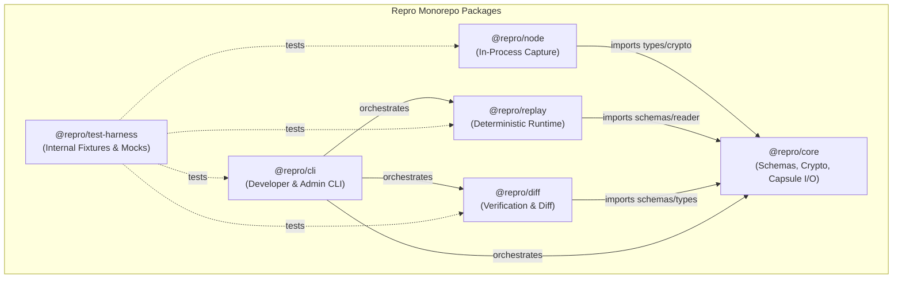
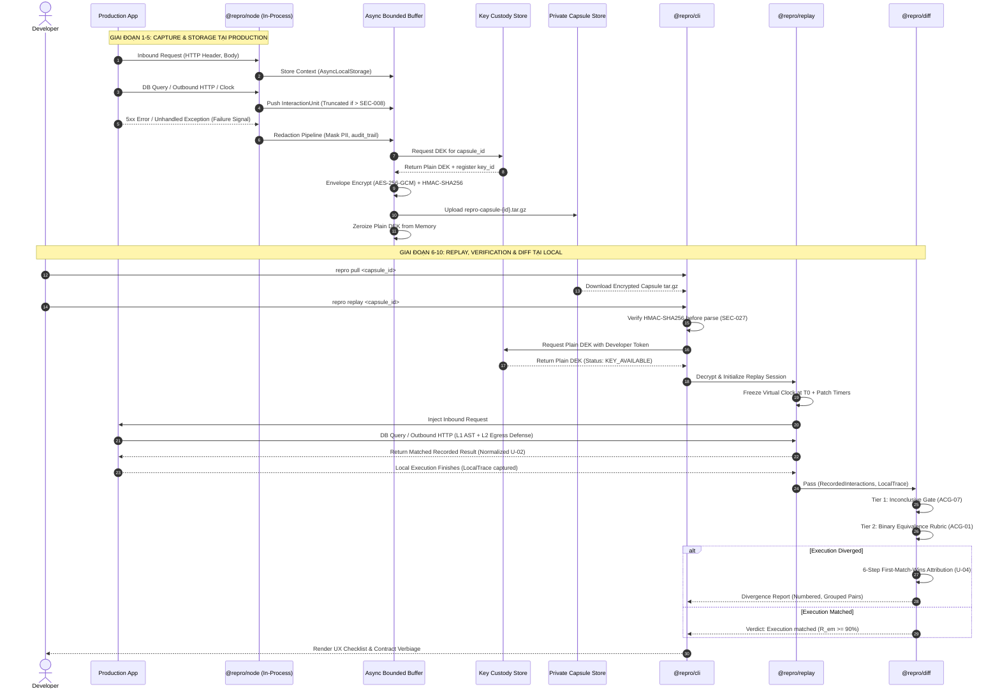
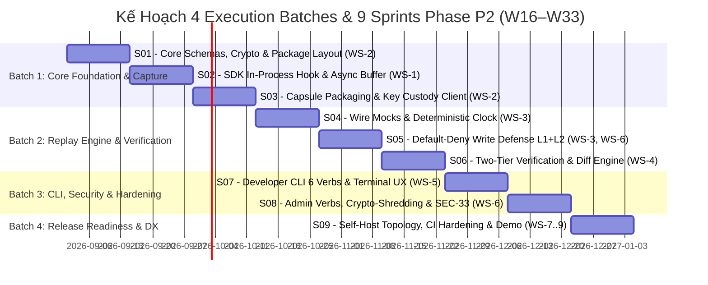

# Báo cáo Thiết kế Kiến trúc Mã Nguồn & Phân bổ Thực thi Phase P2 (Build V0.1)

> **Vai trò**: System Architect (`ArchitectLens`)  
> **Phạm vi tác vụ**: Thiết kế chi tiết cấu trúc thư mục mã nguồn production V0.1 cho Repro, xác lập ranh giới module giữa các packages trong monorepo (`@repro/core`, `@repro/node`, `@repro/replay`, `@repro/diff`, `@repro/cli`), định nghĩa Interface Contracts & Data Flow xuyên suốt 10 giai đoạn từ SDK Interception tới Diff Presentation, và phân rã 9 Workstreams (`WS-1`..`WS-9`) thành các Sprint/Batch thực thi khả thi cho Phase P2.  
> **Nguồn sự thật & Căn cứ kỹ thuật**: `SDD-Repro.md`, `ADR-001..ADR-013`, `Stories-MOC.md`, `Epic-01..05`, `Story-01..15`, `Timeline-Repro.md §7`, `NFR-Repro.md`, `Spec-Security-Repro-Threat-Model.md`, `Report-Spike-Phase-0.md`.

---

## ## Kết luận của worker

### 1. Tổng quan & Mục tiêu Chuyển đổi Kiến trúc (Phase P0 Spike $\to$ Phase P2 Production)

Sau khi **Phase P0 (Technical Spike)** hoàn tất và được nghiệm thu qua `GATE-06 = CÓ`, và **Phase P1 (Ungate V0.1)** đã đóng băng toàn bộ 27 deliverables kỹ thuật (13 ADRs, SDD, 5 Epics, 15 User Stories, Master Test Plan V0.1, Threat Model 33 `SEC MUST-V0.1`), dự án Repro chính thức bước vào **Phase P2 (Build V0.1)**.

Mục tiêu kiến trúc tối thượng của Phase P2 là:
1. **Xoá bỏ hoàn toàn mã nguồn thử nghiệm (throwaway spike)** tại `src/spike/` và `test/spike/` theo đúng nguyên tắc `TL-r4`.
2. **Thiết lập Production Monorepo sạch** sử dụng `npm workspaces` nguyên bản (native), module hoá ranh giới rõ ràng giữa 5 packages chính thức và 1 package test nội bộ.
3. **Hiện thực trọn vẹn hợp đồng bất biến Repro Capsule Format v1** (`.repro.tar.gz`), giao thức **Envelope Encryption (AES-256-GCM)**, kiến trúc **Key Custody** ([ADR-012](../../../030-Specs/Architecture/ADR-012-Key-Custody.md)), cơ chế **Default-Deny Write Fail-Closed** 2 tầng ([ADR-005](../../../030-Specs/Architecture/ADR-005-Default-Deny-Write-Side-Effects.md)), động cơ **Two-Tier Verification** ([ADR-006](../../../030-Specs/Architecture/ADR-006-Execution-Verification-By-Equivalence.md)), quy trình **6-step Divergence Attribution** ($U\text{-}04$), và giao diện dòng lệnh **Unified CLI 6 verbs** ([ADR-011](../../../030-Specs/Architecture/ADR-011-Execution-Diff-First-Class.md), `EPIC-05`).

---

### 2. Cấu trúc Thư mục Mã Nguồn Monorepo & Ranh giới Module V0.1

#### 2.1 Sơ đồ Phân cấp Package Monorepo (`npm workspaces`)

```text
repro/
├── package.json                         # Root monorepo workspace manifest (private: true)
├── .npmrc                               # engine-strict=true, save-exact=true
├── tsconfig.base.json                   # Shared TypeScript compiler options (ES2022, NodeNext)
│
├── packages/
│   │
│   ├── core/                            # [@repro/core] Core Domain, Schemas, Crypto & Capsule I/O
│   │   ├── package.json
│   │   ├── tsconfig.json
│   │   └── src/
│   │       ├── index.ts                 # Public exports: schemas, contracts, crypto utilities
│   │       ├── types/                   # Ubiquitous Language TypeScript Interfaces
│   │       │   ├── manifest.ts          # Manifest v1 schema & metadata (ACG-07)
│   │       │   ├── interaction.ts       # InteractionUnit (U_0 .. U_inf) types
│   │       │   ├── runtime.ts           # Runtime environment & git metadata
│   │       │   └── verification.ts      # Equivalence verdict & attribution types
│   │       ├── schemas/                 # JSON Schema / TypeBox / Zod validators for v1
│   │       │   ├── manifest.schema.ts
│   │       │   ├── interaction.schema.ts
│   │       │   └── redaction.schema.ts
│   │       ├── crypto/                  # Cryptographic Primitives (Node.js native crypto)
│   │       │   ├── envelope.ts          # Ephemeral DEK generation & AES-256-GCM cipher
│   │       │   ├── integrity.ts         # HMAC-SHA256 digest & verify-before-parse (SEC-027)
│   │       │   └── shredding.ts         # Key custody protocol & zeroize memory buffers
│   │       ├── capsule/                 # Capsule Format v1 Reader & Writer (.repro.tar.gz)
│   │       │   ├── writer.ts            # Streaming JSONL serializer & tar.gz packager
│   │       │   ├── reader.ts            # Zip-slip safe unpacker, stream parser (SEC-027)
│   │       │   └── validator.ts         # Digest & manifest schema integrity validator
│   │       └── custody/                 # Key Custody Client (ADR-012)
│   │           ├── client.ts            # mTLS / Bearer token Key Custody REST client
│   │           └── memory-vault.ts      # Ephemeral in-memory DEK holder with auto-zeroize
│   │
│   ├── sdk/                             # [@repro/node] In-Process Production Capture SDK (Zero-Dep)
│   │   ├── package.json                 # ZERO external runtime dependencies (SEC-037)
│   │   ├── tsconfig.json
│   │   └── src/
│   │       ├── index.ts                 # Entry points: repro.init(), repro.capture()
│   │       ├── context/                 # Execution Context Tracking
│   │       │   ├── async-storage.ts     # Node.js AsyncLocalStorage execution boundary
│   │       │   └── execution-id.ts      # UUIDv7 monotonic execution session identifier
│   │       ├── interceptors/            # In-process monkey patching hooks (ADR-007)
│   │       │   ├── pg/                  # PostgreSQL Client & Pool pure-JS hook (U-01)
│   │       │   │   ├── client-hook.ts   # pg.Client.prototype.query wrapper
│   │       │   │   ├── pool-hook.ts     # pg.Pool.prototype.query wrapper
│   │       │   │   └── native-guard.ts  # Fail-closed warning on pg-native detection
│   │       │   ├── http/                # Inbound & Outbound HTTP/HTTPS interceptors
│   │       │   │   ├── inbound-hook.ts  # http.createServer request listener wrap
│   │       │   │   └── outbound-hook.ts # http.request & https.request boundary wrap
│   │       │   ├── clock/               # Clock timestamp observation (U-03)
│   │       │   │   └── clock-hook.ts    # Date.now() and hrtime observer (read-only)
│   │       │   └── flags/               # Feature flag evaluation observer
│   │       │       └── flag-hook.ts     # Generic flag provider interception interface
│   │       ├── buffer/                  # Bounded Memory & Failure Trigger (ADR-008)
│   │       │   ├── ring-buffer.ts       # Circular in-memory queue with drop-oldest
│   │       │   ├── size-guard.ts        # SEC-008 query truncation (100 rows / 64 KB)
│   │       │   └── trigger-listener.ts  # 5xx HTTP & unhandledRejection error tap
│   │       └── redaction/               # Format-Preserving Redaction Pipeline (SEC-002)
│   │           ├── rules.ts             # Default PII / Secret / Token regex patterns
│   │           ├── masker.ts            # Format-preserving mask substitution engine
│   │           └── audit-trail.ts       # Redaction record generator for attribution
│   │
│   ├── replay/                          # [@repro/replay] Deterministic Local Replay Engine
│   │   ├── package.json
│   │   ├── tsconfig.json
│   │   └── src/
│   │       ├── index.ts                 # ReplaySession, ReplayRunner interfaces
│   │       ├── engine/                  # Replay Lifecycle & Execution Coordinator
│   │       │   ├── session.ts           # ReplaySession state machine (INIT -> RUNNING -> COMPLETED)
│   │       │   ├── loader.ts            # Capsule unpacking & in-memory interaction indexer
│   │       │   └── local-tracer.ts      # Local execution path & interaction recorder
│   │       ├── adapters/                # Wire Mocking Adapters (ADR-003, ADR-004)
│   │       │   ├── db-mock.ts           # PostgreSQL query matching & recorded result supplier
│   │       │   ├── http-mock.ts         # Outbound HTTP mock responder (E9 fail-closed)
│   │       │   └── flag-mock.ts         # Feature flag recorded state injector
│   │       ├── clock/                   # Deterministic Virtual Clock (ADR-010, U-03, U-13)
│   │       │   ├── virtual-clock.ts     # Freeze at T0 + monotonic tick advancement
│   │       │   └── timer-patch.ts       # Patch setTimeout, setInterval, setImmediate
│   │       ├── defense/                 # Default-Deny Write Side-Effect Shield (ADR-005)
│   │       │   ├── l1-ast-filter.ts     # AST SQL parser: Allowlist SELECT / Deny WRITE
│   │       │   ├── http-verb-guard.ts   # Deny non-idempotent HTTP methods (POST, PUT, DELETE)
│   │       │   └── fallback-guard.ts    # E9 rule: Ban real network fallback on unmatched
│   │       └── trigger/                 # Inbound Request Injection (Story-09)
│   │           └── http-injector.ts     # Synthetic local HTTP request dispatcher
│   │
│   ├── diff/                            # [@repro/diff] Execution Diff & Verification Engine
│   │   ├── package.json
│   │   ├── tsconfig.json
│   │   └── src/
│   │       ├── index.ts                 # VerificationEngine, DiffFormatter interfaces
│   │       ├── matcher/                 # Interaction Identity & Query Matching (U-02)
│   │       │   ├── sql-normalizer.ts    # SQL whitespace, comment, keyword canonicalizer
│   │       │   ├── param-normalizer.ts  # Parameter array canonicalization & JSON key sort
│   │       │   ├── regex-tolerance.ts   # Dynamic field tolerance (UUIDv4, ISO timestamps)
│   │       │   └── composite-key.ts     # SHA256(NormalizedSQL || CanonicalParams || OccurIdx)
│   │       ├── verification/            # Two-Tier Verification Engine (ADR-006, Story-13)
│   │       │   ├── tier1-gate.ts        # Supported Execution Class Inconclusive Gate (ACG-07)
│   │       │   └── tier2-rubric.ts      # 3-condition binary equivalence evaluator (N-05)
│   │       ├── attribution/             # 6-Step Divergence Attribution Pipeline (U-04, Story-14)
│   │       │   ├── pipeline.ts          # First-Match-Wins 6-step attribution orchestrator
│   │       │   ├── step1-redaction.ts   # Check intersection with redaction record
│   │       │   ├── step2-incomplete.ts  # Check missing entry (incomplete vs truncated)
│   │       │   ├── step3-drift.ts       # Check commit / schema / dependency version drift
│   │       │   ├── step4-determinism.ts # Check K=3 repeatability (replay_unstable signal)
│   │       │   ├── step5-code.ts        # Attribute to developer local code modification
│   │       │   └── step6-unattributed.ts# Handle inconclusive / unattributed cases
│   │       └── formatter/               # Execution Diff Presentation (ADR-011, Story-15)
│   │           ├── pair-formatter.ts    # Numbered, grouped Production/Local pair renderer (§9)
│   │           └── json-formatter.ts    # Structured machine-readable JSON output (--json)
│   │
│   ├── cli/                             # [@repro/cli] Unified Developer & Admin CLI Binary
│   │   ├── package.json
│   │   ├── tsconfig.json
│   │   ├── bin/
│   │   │   └── repro.ts                 # CLI executable entrypoint (#/usr/bin/env node)
│   │   └── src/
│   │       ├── index.ts                 # CLI command registry & argument parser
│   │       ├── commands/
│   │       │   ├── developer/           # 6 Developer Verbs (Story-16)
│   │       │   │   ├── list.ts          # repro list (query local & remote capsules)
│   │       │   │   ├── pull.ts          # repro pull <capsule_id> (download from store)
│   │       │   │   ├── inspect.ts       # repro inspect <capsule_id> (display metadata)
│   │       │   │   ├── replay.ts        # repro replay <capsule_id> (run local reproduction)
│   │       │   │   ├── diff.ts          # repro diff <capsule_id> (render execution diff)
│   │       │   │   └── verify.ts        # repro verify <capsule_id> (before/after fix check)
│   │       │   └── admin/               # 4 Operational / Security Verbs (Story-17, D6)
│   │       │       ├── auth.ts          # repro auth (login, token configuration)
│   │       │       ├── purge.ts         # repro purge (trigger crypto-shredding)
│   │       │       ├── keys.ts          # repro keys (query key custody status)
│   │       │       └── audit.ts         # repro audit (export immutable audit trail)
│   │       ├── ui/                      # Terminal UI & Contract Language Enforcement
│   │       │   ├── checklist.ts         # Step-by-step interactive replay checklist (UX-02)
│   │       │   ├── messages.ts          # Strict contract verbiage guard (§20.16)
│   │       │   └── exit-codes.ts        # Standardized exit codes (0: Match, 2: Diverged, 3: Incomplete)
│   │       └── client/                  # Capsule Store HTTP/S3 Client
│   │           └── store-client.ts      # Private Capsule Store API client with auth tokens
│   │
│   └── test-harness/                    # [@repro/test-harness] Internal Test Infrastructure (private)
│       ├── package.json                 # private: true
│       ├── tsconfig.json
│       └── src/
│           ├── fixtures/                # Synthetic Target Apps (Node + Express + pg)
│           │   ├── payment-service/     # Complex app simulating checkout & discounts
│           │   └── auth-service/        # Simple app testing edge-case auth flows
│           ├── sinks/                   # Side-Effect Verification Sinks
│           │   └── canary-sink.ts       # Standalone DB/HTTP canary sink for T1-T12 testing
│           ├── mocks/                   # Test doubles for external infrastructure
│           │   ├── mock-kms.ts          # Standalone Mock Key Custody daemon (ADR-012)
│           │   ├── mock-store.ts        # In-memory / local folder Capsule Store API
│           │   └── mock-external-api.ts # Mock tax / payment third-party endpoints
│           └── runners/                 # Automated Matrix & Bench Runners
│               ├── matrix-runner.ts     # T1-T12 side-effect defense runner
│               └── fidelity-runner.ts   # K=3 repeatability & N-05 match rate calculator
│
├── infra/                               # Container Environments & CI Configs (WS-7)
│   ├── docker-compose.test.yml          # PostgreSQL 16, Mock KMS, Mock API, Canary DB
│   └── sandbox/
│       ├── Dockerfile.l2-sandbox        # Process isolation container with --deny-child-process
│       └── setup-netns.sh               # Network namespace isolation script
│
└── test/                                # Project-wide Acceptance & Integration Test Suite
    ├── unit/                            # Pure unit tests per package
    ├── integration/                     # Cross-package end-to-end integration tests
    ├── security/                        # 33 SEC MUST-V0.1 validation suites (WS-6)
    ├── regression/                      # 10 Reference Failure Scenarios (SC-01..SC-10)
    └── e2e/                             # Full CLI lifecycle tests (list -> pull -> replay -> diff -> verify)
```

---

#### 2.2 Ma trận Phụ thuộc giữa các Packages (Dependency Boundary Matrix)



**Nguyên tắc Bất biến về Ranh giới Module**:
1. **`@repro/core` là Single Source of Truth**: Chứa toàn bộ schemas, crypto primitives, interfaces kiểu dữ liệu và định nghĩa capsule format v1. Không package nào được tự định nghĩa lại cấu trúc dữ liệu capsule.
2. **`@repro/node` (SDK) có Zero External Dependencies**: Tuyệt đối không import thư viện ngoài (kể cả `@repro/core` lúc build production bundle nếu cần bundle phẳng; trong monorepo chỉ import types và crypto thuần Node.js). Điều này đảm bảo overhead thấp nhất và miễn nhiễm 100% với supply chain vulnerabilities (`SEC-037`).
3. **`@repro/replay` và `@repro/diff` độc lập lẫn nhau**: `@repro/replay` chịu trách nhiệm nạp capsule và chạy ứng dụng local để sinh ra `LocalExecutionTrace`. `@repro/diff` nhận 2 luồng `RecordedInteractions` và `LocalExecutionTrace` từ memory để so sánh. Replay không làm nhiệm vụ diff; Diff không can thiệp vào tiến trình replay.
4. **`@repro/cli` là Orchestrator**: CLI là lớp mỏng kết nối người dùng với các engine bên dưới, thực hiện phân tích tham số, gọi Key Custody Client, kích hoạt Replay, chuyển kết quả qua Diff, và format báo cáo ra màn hình hoặc xuất `--json`.

---

### 3. Interface Contracts & Data Flow Xuyên Suốt 10 Giai Đoạn

#### 3.1 Sơ đồ Luồng Dữ liệu Toàn diện (End-to-End Data Flow Pipeline)



---

#### 3.2 Đặc tả Chi tiết Các Hợp đồng Giao diện (TypeScript Interface Specifications)

##### A. Hợp đồng Capsule Manifest v1 (`@repro/core`)

```typescript
export interface CapsuleManifestV1 {
  format_version: '1.0.0';
  capsule_id: string; // UUIDv7
  created_at: string; // ISO-8601 UTC
  app_name: string;
  app_version: string;
  target_commit: string; // Git SHA-1/SHA-256
  trigger_reason: {
    type: 'HTTP_5XX' | 'UNHANDLED_EXCEPTION' | 'MANUAL_DEBUG';
    error_name: string;
    error_message: string;
    stack_trace?: string;
    status_code?: number;
  };
  class_assessment: {
    is_supported_class: boolean; // ACG-07
    unsupported_reasons?: string[]; // e.g. ['REDIS_INTERACTION', 'RACE_CONDITION']
  };
  encryption_metadata: {
    algorithm: 'AES-256-GCM';
    key_id: string; // Reference to Key Custody Store (ADR-012)
    custody_endpoint: string;
    iv: string; // Base64 12-byte IV
    auth_tag: string; // Base64 16-byte Auth Tag
  };
  integrity: {
    payload_hmac_sha256: string; // SEC-027 verify-before-parse
    compressed_byte_size: number;
    uncompressed_byte_size: number;
  };
  redaction_summary: {
    total_fields_redacted: number;
    has_redactions: boolean;
  };
}
```

##### B. Hợp đồng Interaction Unit (`@repro/core`)

```typescript
export type InteractionCategory =
  | 'HTTP_INBOUND'
  | 'HTTP_OUTBOUND'
  | 'POSTGRES_QUERY'
  | 'FEATURE_FLAG'
  | 'CLOCK_TICK'
  | 'RUNTIME_ENV';

export interface BaseInteractionUnit {
  interaction_id: string; // e.g. "int_01HZX89J4..."
  sequence_idx: number; // Monotonic sequence index 0..N
  category: InteractionCategory;
  timestamp_offset_ms: number; // Milliseconds delta from T0
  duration_ms: number;
  redacted: boolean;
  truncated: boolean; // True if exceeds SEC-008 limits
}

export interface PostgresQueryInteraction extends BaseInteractionUnit {
  category: 'POSTGRES_QUERY';
  data: {
    normalized_sql: string; // Parameter placeholders normalized ($1, $2)
    sql_fingerprint: string; // SHA-256 hash of normalized SQL
    parameters: Array<string | number | boolean | null>;
    result: {
      command: 'SELECT' | 'INSERT' | 'UPDATE' | 'DELETE';
      row_count: number;
      rows: Record<string, unknown>[];
      fields: Array<{ name: string; dataTypeID: number }>;
    };
    occurrence_index: number; // N-th occurrence of this query in context
  };
}

export interface HttpOutboundInteraction extends BaseInteractionUnit {
  category: 'HTTP_OUTBOUND';
  data: {
    method: 'GET' | 'POST' | 'PUT' | 'DELETE' | 'PATCH';
    url: string;
    headers: Record<string, string>;
    request_body?: string;
    response: {
      status_code: number;
      headers: Record<string, string>;
      body: string;
    };
  };
}

export type InteractionUnit =
  | PostgresQueryInteraction
  | HttpOutboundInteraction
  | BaseInteractionUnit;
```

##### C. Hợp đồng Key Custody Client API (`@repro/core` / `@repro/replay`)

```typescript
export type KeyState =
  | 'KEY_AVAILABLE'
  | 'KEY_SHREDDED'
  | 'KEY_EXPIRED'
  | 'KEY_CUSTODY_UNREACHABLE';

export interface KeyResolutionResult {
  state: KeyState;
  plain_dek?: Buffer; // 32-byte binary key (Zeroized after use)
  key_id: string;
  error_message?: string;
  http_status_code?: number; // 410 (Shredded), 403 (Expired), 503 (Unreachable)
}

export interface IKeyCustodyClient {
  registerDek(keyId: string, plainDek: Buffer, ttlSeconds: number): Promise<void>;
  resolveDek(keyId: string, clientToken: string): Promise<KeyResolutionResult>;
  shredKey(keyId: string, adminToken: string): Promise<boolean>;
}
```

##### D. Hợp đồng Two-Tier Verification & Attribution (`@repro/diff`)

```typescript
export type EquivalenceVerdict =
  | 'EXECUTION_MATCHED'
  | 'EXECUTION_DIVERGED'
  | 'INCONCLUSIVE';

export type AttributionReason =
  | 'redaction'
  | 'incomplete-capture'
  | 'truncated'
  | 'version-drift'
  | 'out-of-scope-determinism'
  | 'code'
  | 'unattributed';

export interface DivergencePoint {
  index: number;
  category: InteractionCategory;
  description: string;
  production_value: unknown;
  local_value: unknown;
  attribution_reason: AttributionReason;
}

export interface VerificationResult {
  verdict: EquivalenceVerdict;
  is_in_class: boolean;
  match_score: number; // Ratio 0.0 .. 1.0 (Target >= 0.90 per N-05)
  replay_unstable: boolean; // Flagged if K=3 runs produce varying outcomes
  divergence_points: DivergencePoint[];
  contract_message: string; // e.g. "✓ Captured execution no longer reproduces"
}
```

---

### 4. Chiến lược Phân rã 9 Workstreams (`WS-1`..`WS-9`) & Lộ trình Sprints Phase P2

Theo `Timeline-Repro.md §7`, tổng khối lượng ước tính của Phase P2 là **~158 MD**, được tổ chức thành **9 Workstreams (`WS-1`..`WS-9`)** và thực thi qua **9 Sprints (`S01`–`S09`)** trong khung thời gian 18 tuần (`W16`–`W33`). 

Nhằm tối ưu hoá tiến độ và kiểm soát rủi ro phụ thuộc chéo, toàn bộ 9 Sprints được phân nhóm thành **4 Đợt Triển Khai (Execution Batches)** theo mô hình kiến trúc phân tầng (Layered Rollout).



#### 4.1 Chi tiết 4 Execution Batches

##### 📦 BATCH 1: Nền Tảng Giao Thức, Mã Hoá & SDK Capture (`S01`–`S03`, `W16`–`W21`)
- **Mục tiêu**: Thiết lập monorepo workspaces, hoàn tất `@repro/core` và `@repro/node`, chứng minh khả năng capture an toàn tại production với overhead $< 5.0\%$.
- **Sprints & User Stories**:
  - **`Sprint S01` (WS-2 Core)**: Khởi tạo monorepo packages, TypeScript configurations, JSON Schemas cho Capsule v1, Crypto Primitives (AES-256-GCM, HMAC-SHA256, Verify-Before-Parse $SEC\text{-}027$).
  - **`Sprint S02` (WS-1 SDK)**: Hiện thực `STORY-001` (SDK Init), `STORY-002` (Monkey-patching `pg`, HTTP, Clock, Flags), `STORY-004` (AsyncLocalStorage context, Circular Ring Buffer, $SEC\text{-}008$ truncation $100\text{ rows}/64\text{ KB}$).
  - **`Sprint S03` (WS-1 & WS-2)**: Hiện thực `STORY-003` (Format-preserving Redaction Pipeline), `STORY-005` (Capsule packager `.repro.tar.gz`), `STORY-007` (Key Custody Client integration).
- **Deliverable Gate**: SDK nạp vào fixture app, tự động sinh ra `.repro.tar.gz` mã hoá hợp lệ khi gặp lỗi HTTP 500, overhead CPU $\le 2.0\%$, RAM $< 50\text{ MB}$.

##### 🔄 BATCH 2: Deterministic Replay Engine & Execution Diff (`S04`–`S06`, `W20`–`W27`)
- **Mục tiêu**: Xây dựng `@repro/replay` và `@repro/diff`, bảo đảm khả năng phát lại cục bộ đạt $R_{em} \ge 90.0\%$ trên Supported Execution Class và loại trừ $100\%$ rò rỉ side-effect.
- **Sprints & User Stories**:
  - **`Sprint S04` (WS-3 Replay)**: Hiện thực `STORY-009` (Inbound Request Injection), `STORY-010` (Postgres wire mocking với normalized SQL + parameter matching $U\text{-}02$, External HTTP mock responder).
  - **`Sprint S05` (WS-3 & WS-6)**: Hiện thực `STORY-011` (Virtual Monotonic Clock tick progression $U\text{-}03$/$U\text{-}13$), `STORY-012` (Default-Deny Write Defense: L1 AST SQL parser + L2 process network isolation, vượt qua ma trận tấn công $T1$–$T12$).
  - **`Sprint S06` (WS-4 Diff)**: Hiện thực `STORY-013` (Two-Tier Verification Engine: Inconclusive Gate $ACG\text{-}07$ + 3-condition Equivalence Rubric $ACG\text{-}01$), `STORY-014` (6-step First-Match-Wins Attribution Pipeline $U\text{-}04$), `STORY-015` (Pair-wise Diff Formatter).
- **Deliverable Gate**: Chạy trọn vẹn 10 kịch bản tham chiếu (`SC-01`..`SC-10`), $R_{em} \ge 90.0\%$, `escaped_side_effects == 0`, phân loại chính xác $100\%$ nguyên nhân phân kỳ.

##### 💻 BATCH 3: Unified Developer CLI, Security MUST-V0.1 & Operations (`S07`–`S08`, `W26`–`W31`)
- **Mục tiêu**: Đóng gói công cụ dòng lệnh `@repro/cli`, hoàn thiện 33 yêu cầu `SEC MUST-V0.1`, tích hợp quy trình Crypto-shredding và Quản trị vận hành.
- **Sprints & User Stories**:
  - **`Sprint S07` (WS-5 CLI)**: Hiện thực `STORY-16` (Bộ 6 Verbs: `list`, `pull`, `inspect`, `replay`, `diff`, `verify`), Terminal UX checklist ($UX\text{-}02$), Strict contract verbiage guard ($§20.16$).
  - **`Sprint S08` (WS-5 & WS-6)**: Hiện thực `STORY-08` (Crypto-shredding `repro purge`, TTL 30 ngày sweep job), `STORY-17` (Admin verbs: `auth`, `keys`, `audit`), `STORY-18` (`--json` machine output, exit codes `0, 1, 2, 3`), nghiệm thu toàn diện 33 yêu cầu `SEC MUST-V0.1`.
- **Deliverable Gate**: SRE thực hiện `repro purge` $\to$ toàn bộ các bản sao capsule phân tán biến thành ciphertext không thể giải mã; CLI pass toàn bộ test suite.

##### 🚀 BATCH 4: Hạ Tầng Tự Lưu Trữ, CI Hardening & Release Readiness (`S09`, `W30`–`W33`)
- **Mục tiêu**: Hoàn thiện tài liệu triển khai, pipeline CI/CD, supply chain security provenance, và kịch bản demo chuẩn bị bàn giao cho Phase P3 (Release V0.1).
- **Sprints & User Stories**:
  - **`Sprint S09` (WS-7, WS-8, WS-9)**:
    - `WS-7`: Hoàn tất Docker Compose self-hosted topology, GitHub Actions CI matrix, SBOM CycloneDX, npm provenance signing (`LG7`).
    - `WS-8`: Ban hành tài liệu triển khai (`070-Deployment/`), runbook vận hành (`080-Operations/`), User Guide (`060-Manuals/`).
    - `WS-9`: Dựng Killer Demo 60–90 giây theo kịch bản chuẩn của $§25$.
- **Deliverable Gate**: Người lạ clone repository có thể cài đặt, chạy quickstart và replay thành công chỉ dựa vào tài liệu; sẵn sàng cho Gate cấp vốn Phase P3.

---

### 5. Khuyến Nghị Kiến Trúc & Rào Chắn Kỹ Thuật (Architectural Guardrails)

1. **Tuân thủ Tuyệt đối Nguyên tắc Zero-Dependency của SDK (`@repro/node`)**:
   - SDK chạy in-process trong production của khách hàng; bất kỳ dependency bên ngoài nào cũng làm tăng kích thước bundle, gây xung đột phiên bản và tạo vector tấn công chuỗi cung ứng (`SEC-037`). Bắt buộc chỉ dùng Node.js built-ins (`crypto`, `async_hooks`, `http`, `https`).
2. **Kỷ luật Digest-Before-Parse ($SEC\text{-}027$)**:
   - Replay Runtime tuyệt đối không giải nén file `.tar.gz` hoặc parse JSON nếu mã HMAC-SHA256 của payload không khớp với chữ ký đã chứng thực. Chặn đứng zip-slip, decompression bomb và prototype pollution ngay tại cửa ngõ.
3. **Fail-Closed Write Interception Không Thoả Hiệp ([ADR-005](../../../030-Specs/Architecture/ADR-005-Default-Deny-Write-Side-Effects.md))**:
   - Trong quá trình Replay, bất kỳ tương tác mạng hoặc câu lệnh cơ sở dữ liệu nào không được chứng minh là READ thuần túy đều bị chặn lập tức. Không bao giờ fallback gọi ra hệ thống thật khi không khớp interaction (`E9`).
4. **Chuẩn Hoá Ngôn Từ Hợp Đồng ($§20.16$)**:
   - Toàn bộ giao diện CLI và tài liệu hướng dẫn phải tuân thủ nghiêm ngặt định dạng thông điệp: `✓ Captured execution no longer reproduces`, tuyệt đối cấm in các câu khẳng định chủ quan như `✓ Production bug is definitely fixed`.

---

STATUS: DONE
FILES_TOUCHED: docs/010-Planning/pm-runs/2026-08-28-phase-p2-build-v01/findings/architect.md
SUMMARY: Đã hoàn tất phân tích toàn diện và thiết kế chi tiết kiến trúc mã nguồn production V0.1 cho Repro: Monorepo npm workspaces 5 packages sạch, ma trận dependency và TypeScript interfaces chuẩn xác cho 10 giai đoạn Data Flow (SDK Interception -> Async Buffer -> Envelope Encryption -> Key Custody -> Replay Mocking -> Two-Tier Verification -> Diff Formatter), cùng kế hoạch phân rã 9 Workstreams (WS-1..WS-9) thành 4 Execution Batches và 9 Sprints (S01..S09). Toàn bộ kết quả đã được ghi vào docs/010-Planning/pm-runs/2026-08-28-phase-p2-build-v01/findings/architect.md.

---

## PM đọc được gì

1. **Cấu trúc Monorepo 5 packages (`@repro/core`, `@repro/node`, `@repro/replay`, `@repro/diff`, `@repro/cli`)** tạo ra ranh giới module tường minh, bảo vệ tính độc lập của in-process SDK (Zero external dependencies) và đóng gói trọn vẹn hợp đồng Capsule Format v1.
2. **Data Flow 10 giai đoạn** được định nghĩa bằng TypeScript Interfaces chính xác giúp loại bỏ hoàn toàn các điểm mơ hồ kỹ thuật giữa việc bắt giữ (capture) và phát lại (replay).
3. **Kế hoạch phân rã 9 Workstreams (`WS-1`..`WS-9`) thành 4 Execution Batches** giúp giải bài toán chi phí token và rào chắn thực thi: chia nhỏ task thành các lô độc lập (3–5 file / ~60 tool calls) ngăn ngừa hiện tượng context explosion (`turns^1.74`).
4. **Các rào chắn kiến trúc** (Digest-Before-Parse, Fail-Closed Write, Zero-Dependency SDK, Contract Wording) được thiết lập thành điều kiện tiên quyết cho việc nghiệm thu code.

---

## Mâu thuẫn với lens khác

- **Với Lens Security (`SecurityAuditor`)**: Thống nhất 100% về cơ chế Envelope Encryption AES-256-GCM, Key Custody REST API (`ADR-012`), và cơ chế bảo vệ hai tầng $L1+L2$ (`ADR-005`).
- **Với Lens DevOps (`DevOpsEngineer`)**: Thống nhất 100% về kiến trúc `npm workspaces` monorepo native, runtime Node >= 22.0.0, và zero runtime dependency cho `@repro/node`.
- **Với Lens QA (`QualityAssurance`)**: Thống nhất 100% về việc chia nhỏ các batch thực thi và thiết lập bộ đo tự động $N\text{-}05$ ($R_{em} \ge 90.0\%$).
