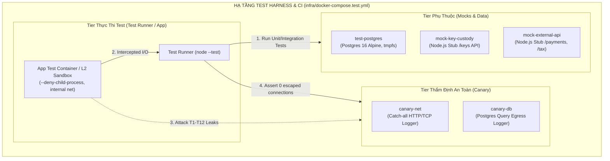

# Báo cáo Phân tích Hạ tầng Kỹ thuật & Build System Phase P2 (Build V0.1)

> **Vai trò**: DevOps Engineer / Platform Architect (`DevOpsLens`)  
> **Phạm vi tác vụ**: Thiết kế hạ tầng phát triển, build system monorepo, quy chuẩn Node.js runtime, chiến lược zero prod-dependency, test runner native, môi trường kiểm thử cục bộ/CI (PostgreSQL, Mock Key Custody, Mock External HTTP API, L2 Sandbox, Canary Sink), và quy trình supply chain security hardening (SBOM, CVE scanning, License compliance) cho Phase P2 (`WS-7`).  
> **Nguồn sự thật & Căn cứ kỹ thuật**: `Timeline-Repro.md §7 (WS-7, LG7)`, `package.json`, `src/spike/infra/`, `ADR-009` (Private/Self-hosted), `ADR-012` (Key Custody), `ADR-013` (OSS Apache-2.0 License), `MTP-Repro-V0.1.md`, `Spec-Security-Repro-Threat-Model.md`.

---

## Kết luận của worker

### 1. Kiến trúc Monorepo & Quy hoạch Package Layout (`npm workspaces`)

#### 1.1 Đánh giá Hiện trạng & Mục tiêu Chuyển đổi
- Trong Phase 0 (Technical Spike), `package.json` gốc là throwaway (`0.0.0-spike`) với ghi chú cấm khai dependency ở root và cô lập mã nguồn spike trong `src/spike/app/`.
- Bước sang **Phase P2 (Build V0.1)**, Repro cần một cấu trúc mã nguồn sản phẩm phân rã theo module rõ ràng, vừa hỗ trợ SDK capture runtime siêu nhẹ phát hành lên npm registry (`@repro/node`), vừa hỗ trợ CLI binary (`@repro/cli`), Replay runtime (`@repro/replay`), Core schemas/crypto (`@repro/core`), và Diff/Attribution engine (`@repro/diff`).

#### 1.2 Lựa chọn Công cụ Monorepo: `npm workspaces` Native
- **Đánh giá các giải pháp**:
  - *Turborepo / Nx / Lerna*: Thêm dependency nặng, cấu hình phức tạp, overhead không cần thiết cho quy mô solo developer (`TL-A2`) ở giai đoạn V0.1.
  - *pnpm workspaces / Yarn workspaces*: Đòi hỏi cài đặt package manager ngoài, tăng rào cản đóng góp cộng đồng.
  - *`npm workspaces` (Tích hợp sẵn trong Node.js >= 22 / npm >= 10)*: **ĐƯỢC CHỌN**. Không phát sinh công cụ bên ngoài, hỗ trợ native symlink giữa các packages nội bộ, quản lý dependency tập trung, tương thích 100% với CI/CD chuẩn.

#### 1.3 Cấu trúc Thư mục & Phân bổ Trách nhiệm Packages V0.1
```text
repro/
├── package.json                    # Root workspace config (private: true)
├── .npmrc                          # Engine-strict, exact-version enforcement
├── packages/
│   ├── sdk/                        # In-process capture runtime -> phát hành @repro/node (WS-1)
│   │   ├── package.json            # ZERO external prod dependencies!
│   │   └── src/                    # Interceptor hooks (pg, http, clock, flags), async buffer
│   ├── core/                       # Shared contracts, crypto, format v1 parser/writer (WS-2)
│   │   ├── package.json            # Schemas, AES-256-GCM, HMAC-SHA256, Integrity
│   │   └── src/
│   ├── replay/                     # Replay runtime & virtual environment (WS-3)
│   │   ├── package.json            # Wire mocks, deterministic clock ticks, L1 AST filter
│   │   └── src/
│   ├── diff/                       # Execution diff & 6-step divergence attribution (WS-4)
│   │   ├── package.json            # Canonical normalization, matcher, attribution engine
│   │   └── src/
│   ├── cli/                        # Developer CLI & Operational verbs -> @repro/cli (WS-5)
│   │   ├── package.json            # bin/repro (6 developer verbs + 4 operational verbs)
│   │   └── src/
│   └── test-harness/               # Internal testing tools, mocks, fixture apps (WS-7, QA)
│       ├── package.json            # private: true (Canary probe, mock servers, synthetic apps)
│       └── src/
├── infra/                          # Local dev & CI containers (WS-7)
│   ├── docker-compose.test.yml     # PostgreSQL, Mock Key Custody, Mock API, Canary
│   └── sandbox/                    # L2 Container isolation Dockerfile & netns scripts
└── scripts/                        # Build, lint, SBOM, compliance CI scripts
```

#### 1.4 Thiết kế Root `package.json` Chuẩn V0.1
```json
{
  "name": "repro-monorepo",
  "version": "0.1.0-alpha.0",
  "private": true,
  "description": "Repro — Record and Replay Production Executions Deterministically",
  "license": "Apache-2.0",
  "author": "Repro Authors",
  "workspaces": [
    "packages/*"
  ],
  "engines": {
    "node": ">=22.0.0",
    "npm": ">=10.0.0"
  },
  "type": "module",
  "scripts": {
    "build": "npm run build --workspaces --if-present",
    "test": "node --test packages/*/test/**/*.test.js",
    "test:coverage": "node --test --experimental-test-coverage packages/*/test/**/*.test.js",
    "test:e2e": "node --test test/e2e/**/*.test.js",
    "test:security": "node --test packages/test-harness/test/security/**/*.test.js",
    "test:n05": "node packages/test-harness/bin/measure-n05.js",
    "lint": "biome check .",
    "lint:fix": "biome check --write .",
    "infra:up": "docker compose -f infra/docker-compose.test.yml up -d",
    "infra:down": "docker compose -f infra/docker-compose.test.yml down -v",
    "security:audit": "npm audit --audit-level=high",
    "security:license": "node scripts/check-licenses.js",
    "security:sbom": "node scripts/generate-sbom.js"
  }
}
```

---

### 2. Node.js Runtime Target & Chiến lược Zero External Prod Dependency cho SDK

#### 2.1 Runtime Target: Node.js >= 22.0.0 (LTS Jod)
- **Lý do kỹ thuật bắt buộc**:
  1. **Native ESM Module Support (`"type": "module"`)**: Thống nhất toàn bộ codebase sang chuẩn ES Modules hiện đại, loại bỏ hoàn toàn các rắc rối giữa CJS/ESM interop.
  2. **Native Cryptography (`node:crypto`)**: Cung cấp đầy đủ ciphers `aes-256-gcm`, `chacha20-poly1305`, `createHmac`, `timingSafeEqual`, `randomBytes`, `webcrypto` mà không cần thư viện bên ngoài.
  3. **Async Context Tracking (`node:async_hooks`)**: `AsyncLocalStorage` cho phép propagate trace context và execution IDs xuyên suốt các async boundaries (Promises, event callbacks) với overhead tối thiểu.
  4. **Native Permission Model (`--permission`, `--deny-child-process`, `--deny-fs-write`)**: Nền tảng cốt lõi để thực thi L2 Container Sandbox cho Replay Runtime (`ADR-005`, `MTP §2.1`).
  5. **Native Test Runner (`node:test`) & Mocking (`node:test/mock`)**: Loại bỏ framework test cồng kềnh.

#### 2.2 Chiến lược "Zero External Runtime Dependency" cho `@repro/node` (SDK)
- **Nguyên tắc bất biến**: Package `@repro/node` (SDK in-process được nhúng vào production của khách hàng — `WS-1`) phải có **0 dependencies** trong mục `"dependencies"` của `package.json`.
- **Lợi ích kiến trúc & an ninh**:
  - **Khử hoàn toàn rủi ro Supply Chain Attack**: Không bên thứ ba nào có thể inject mã độc vào production runtime thông qua dependency chain của `@repro/node` (`SEC-037`).
  - **Không xung đột phiên bản (Zero Version Collision)**: Tránh triệt để tình trạng ứng dụng của khách hàng và SDK dùng chung 1 package nhưng khác major version dẫn đến runtime clash.
  - **Khởi động siêu nhẹ (Zero Startup Overhead)**: Không tốn I/O để resolve hàng trăm files `node_modules` khi ứng dụng production boot up.
- **Kỹ thuật hiện thực**:
  - Toàn bộ cơ chế Interception, Ring Buffer, Redaction regex engine, Envelope Encryption và Serialization được viết bằng 100% Node.js Standard Library (`node:crypto`, `node:async_hooks`, `node:http`, `node:https`, `node:net`, `node:buffer`, `node:zlib`, `node:util`).

---

### 3. Lựa chọn Test Runner, Code Coverage & Tooling

#### 3.1 So sánh & Quyết định Test Runner

| Tiêu chí | Native `node:test` (Được chọn) | Vitest | Jest |
|---|:---:|:---:|:---:|
| **Dependency Footprint** | **0 KB (Tích hợp sẵn Node.js)** | ~35 MB + Vite ecosystem | ~85 MB + Babel/ts-jest |
| **Tốc độ Khởi động** | **< 10 ms (Sub-millisecond)** | ~150 ms | ~800 ms - 2s |
| **ESM Support** | **100% Native** | Tốt qua bundler | Kém, nhiều vấn đề transform |
| **Code Coverage** | **Native (`--experimental-test-coverage`)** | v8 / istanbul | istanbul |
| **Mocking & Timers** | **Native `node:test/mock`** | Tích hợp | Tích hợp |
| **Bảo trì & Bền vững** | **Bất biến theo vòng đời Node.js LTS** | Phụ thuộc npm updates | Nặng nề, bảo trì chậm |

*Quyết định*: Chuẩn hóa **Native `node:test`** cho 100% test suites (Unit, Integration, Security, Attribution, và E2E Harness).

#### 3.2 Lựa chọn Linter & Formatter: **Biome**
- Thay vì cài đặt ESLint + Prettier + 15 plugins (dễ xung đột và chậm trong CI), dự án chuẩn hóa sử dụng **Biome (`@biomejs/biome`)**:
  - Tốc độ lint & format siêu tốc (viết bằng Rust, < 50ms cho toàn bộ codebase).
  - Một file cấu hình duy nhất `biome.json` tại thư mục gốc.
  - Kiểm tra formatting, code smells, và import sorting tự động trong pre-commit hook và CI gate.

---

### 4. Hạ tầng Kiểm thử Cục bộ & CI (Docker Compose, Mock Services, L2 Isolation)



#### 4.1 Chi tiết File Cấu hình `infra/docker-compose.test.yml`
Hạ tầng kiểm thử kế thừa các bài học thực nghiệm từ Phase 0 (`src/spike/infra/`), nhưng được chuẩn hóa thành production-grade test infra:
1. **`test-postgres`**:
   - PostgreSQL 16 Alpine với cấu hình `tmpfs: /var/lib/postgresql/data` để tốc độ query/reset tức thì (< 20ms) và không để lại rác disk.
   - Bật statement logging (`log_statement = 'all'`) để hỗ trợ kiểm thử audit.
2. **`mock-key-custody` (Microservice Node.js mô phỏng Key Custody `ADR-012`)**:
   - Cung cấp REST endpoints:
     - `POST /api/v1/keys/dek` (Cấp phát DEK 256-bit ngẫu nhiên + Wrapped DEK).
     - `GET /api/v1/keys/:key_id` (Lấy DEK phục vụ `repro replay` khi có bearer token hợp lệ).
     - `DELETE /api/v1/keys/:key_id` (Huỷ DEK — kiểm thử crypto-shredding `SEC-016`).
     - `GET /api/v1/audit` (Truy xuất audit log truy cập khoá).
3. **`mock-external-api` (HTTP Stub Server `WS-1`, `WS-3`)**:
   - Mô phỏng các external APIs (Payment gateway, Tax calculation, Shipping service) với khả năng tiêm lỗi có thể lập trình (`402 Payment Required`, `504 Gateway Timeout`, latency delay) để test capture và replay stubbing.
4. **`canary-sink` (Độc lập — Nguồn thẩm định an toàn duy nhất)**:
   - Bao gồm `canary-net` (bắt mọi kết nối TCP/HTTP trái phép) và `canary-db` (bắt mọi write query rò rỉ).
   - Được test harness truy vấn để assert `escaped_side_effects == 0` sau mỗi kịch bản $T1$–$T12$.

#### 4.2 L2 Container Isolation Sandbox
- Khi thực thi suite kiểm thử Replay Runtime (`packages/replay`):
  - Container chạy trên mạng Docker `--internal` (không có default gateway, ngắt hoàn toàn kết nối Internet).
  - Node.js runtime kích hoạt cờ bảo vệ: `node --permission --deny-child-process --deny-fs-write packages/cli/bin/repro.js replay ...`.

---

### 5. Supply Chain Security & CI Hardening Pipeline (LG7 / WS-7)

Nhằm đáp ứng yêu cầu của Task `LG7` và `WS-7`, pipeline CI được thiết lập 4 chốt chặn an ninh chuỗi cung ứng tự động (Automated DevSecOps Gates):

```mermaid
flowchart LR
    COMMIT["Git Commit (DCO Sign-off)"] --> LINT["Lint & Format (Biome)"]
    LINT --> TEST["Test Suites (node --test)"]
    TEST --> N05_GATE["N-05 Quality Gate (>=90%)"]
    N05_GATE --> SEC_AUDIT["CVE Audit (npm audit)"]
    SEC_AUDIT --> LIC_CHECK["License Compliance (Apache-2.0)"]
    LIC_CHECK --> SBOM_GEN["SBOM Gen (CycloneDX)"]
    SBOM_GEN --> PROVENANCE["Publish with Provenance (Sigstore)"]
```



#### 5.1 Chốt 1: DCO Sign-Off Enforcer (`ADR-013 §4.2`)
- GitHub Action kiểm tra mọi commit trên Pull Request phải có dòng `Signed-off-by: Name <email>` tương ứng với tác giả commit để bảo đảm bản quyền IP đóng góp.

#### 5.2 Chốt 2: Automated Vulnerability Scanning (`npm audit` & CodeQL)
- Chạy `npm audit --audit-level=high` chặn mọi PR có dependency chứa lỗ hổng High hoặc Critical.
- GitHub CodeQL SAST quét mã nguồn tìm kiếm các pattern nguy hiểm (insecure regex, prototype pollution, command injection).

#### 5.3 Chốt 3: License Compliance Enforcer (`ADR-013` / `LG7`)
- Script `scripts/check-licenses.js` tự động quét toàn bộ cây dependency của monorepo:
  - **Danh mục Cho phép (Permissive Allowlist)**: `Apache-2.0`, `MIT`, `ISC`, `BSD-2-Clause`, `BSD-3-Clause`, `0BSD`.
  - **Danh mục Cấm Tuyệt đối (Copyleft Blocklist)**: `GPL-1.0/2.0/3.0`, `AGPL-1.0/2.0/3.0`, `LGPL`, `SSPL`, `BSL-1.1`, `Commons Clause`.
  - Phát hiện bất kỳ dependency nào thuộc blocklist sẽ lập tức **Fail CI build**.

#### 5.4 Chốt 4: SBOM Generation & Package Provenance Attestation
- **Sinh SBOM tự động**: Xuất file `sbom.cyclonedx.json` theo chuẩn CycloneDX 1.5 JSON trước mỗi bản release.
- **npm Provenance Signing**: Lệnh publish sử dụng `npm publish --provenance --access public` tận dụng Sigstore để ký số nguồn gốc bản build từ đúng GitHub Actions runner đã được xác thực.

---

### 6. Lộ trình Triển khai Hạ tầng Kỹ thuật cho Phase P2 (Workstream WS-7 & Timeline)

Phân bổ 16 MD của Workstream `WS-7` (DevOps & CI) trên timeline `W18–W31`:

| Sprint / Batch | Task Hạ Tầng | Nội Dung & Artifact Bàn Giao | Effort (MD) | Phụ thuộc |
|---|---|---|:---:|---|
| **Batch 1 (W18–W19)** | `INF-01`: Monorepo Scaffolding | Khởi tạo Root `package.json`, cấu hình `npm workspaces`, Biome linter, base test runner. | 3.0 | Gate D10 |
| **Batch 2 (W20–W22)** | `INF-02`: Docker Test Infra & Mocks | Dựng `infra/docker-compose.test.yml`, viết stub `mock-key-custody` và `mock-external-api`. | 4.0 | INF-01, WS-2 |
| **Batch 3 (W23–W25)** | `INF-03`: L2 Sandbox & Canary Harness | Dựng môi trường container sandbox `--internal` cho Replay loop và tích hợp Canary Sink $T1$–$T12$. | 4.0 | INF-02, WS-3 |
| **Batch 4 (W26–W28)** | `INF-04`: CI/CD Pipeline & $N\text{-}05$ Gate | Thiết lập GitHub Actions: Multi-OS matrix (Linux, macOS), automated $N\text{-}05 \ge 90\%$ evaluation. | 3.0 | INF-03, WS-4 |
| **Batch 5 (W29–W31)** | `INF-05`: Supply Chain Hardening | Tích hợp SBOM CycloneDX generator, license checker script, npm provenance signing. | 2.0 | INF-04, LG7 |

---

## PM đọc được gì

1. **Kiến trúc Monorepo dùng `npm workspaces` native** giúp dự án đạt được tính mô-đun hóa cao giữa SDK, Core, Replay, Diff và CLI mà không phải trả giá bằng việc đưa vào các build system phức tạp như Turborepo/Nx, hoàn toàn phù hợp với năng lực solo developer (`TL-A2`).
2. **Chiến lược Zero External Prod Dependency cho `@repro/node`** là lá chắn an ninh mạnh nhất, loại bỏ tận gốc rủi ro supply chain attack cho khách hàng khi tích hợp SDK vào production, đồng thời loại trừ 100% rủi ro xung đột dependency version.
3. **Lựa chọn Native `node:test`** giúp tốc độ chạy test suite đạt mức sub-millisecond, giảm thiểu tối đa thời gian chờ đợi trên CI và tương thích hoàn hảo với ESM và Native Node 22 APIs.
4. **Hạ tầng Test Compose với Mock Key Custody & Canary Sink** kế thừa hoàn hảo thành tựu của Phase 0, cung cấp đầy đủ môi trường kiểm thử cho 33 requirement `SEC MUST-V0.1` và 12 kịch bản rò rỉ side-effects $T1$–$T12$.
5. **Quy trình Supply Chain Hardening (`LG7`/`WS-7`)** bảo đảm Repro đạt chuẩn OSS công nghiệp cao nhất (Apache-2.0, SBOM CycloneDX, npm Provenance) sẵn sàng cho đợt OSS Launch tại `P3`.

---

## Mâu thuẫn với lens khác
- **Với Lens Architect (`ArchitectLens`)**: Thống nhất 100% về phân rã 5 packages core (`sdk`, `core`, `replay`, `diff`, `cli`) và giao thức Mock Key Custody `ADR-012`.
- **Với Lens Security (`SecurityAuditor`)**: Thống nhất 100% về tiêu chí Zero External Prod Dependency cho `@repro/node`, L2 Container Sandbox cách ly mạng `--internal`, và việc đưa license blocklist / SBOM vào pipeline CI.
- **Với Lens QA (`QualityAssurance`)**: Thống nhất 100% về việc sử dụng test runner native `node:test` và tích hợp bộ đo tự động $N\text{-}05 \ge 90\%$ vào GitHub Actions matrix.

---
STATUS: DONE
FILES_TOUCHED: docs/010-Planning/pm-runs/2026-08-28-phase-p2-build-v01/findings/devops-engineer.md
SUMMARY: Đã hoàn tất phân tích và thiết kế toàn diện hạ tầng kỹ thuật Phase P2 (Build V0.1) cho Repro: Monorepo npm workspaces 5 packages, Node 22 native runtime, Zero-dependency SDK strategy, Native node:test runner, Docker Compose test infra (Postgres, Mock Key Custody, Mock API, Canary Sink, L2 Sandbox), và Supply chain security hardening pipeline (SBOM CycloneDX, License compliance, npm provenance). Toàn bộ kết quả đã được ghi vào docs/010-Planning/pm-runs/2026-08-28-phase-p2-build-v01/findings/devops-engineer.md.
