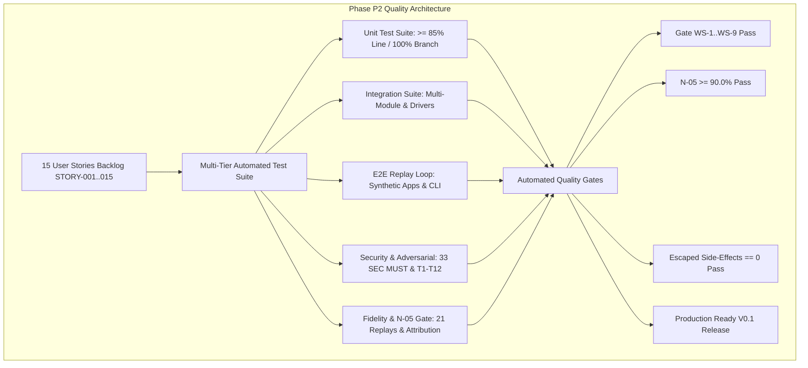
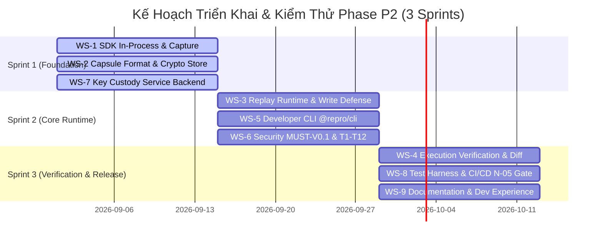

# 🧪 Phân Tích Chuyên Sâu QA Lead: Chiến Lược Kiểm Thử, Ma Trận Truy Vết 15 User Stories & Tiêu Chí Nghiệm Thu $N\text{-}05$ cho Phase P2 (Build V0.1)

**Dự án**: Repro — Deterministic Execution Replay Engine  
**Giai đoạn**: Phase P2 (Build V0.1 · Triển khai Codebase Production & Test Suite Toàn Diện)  
**Tác giả**: QA Lead / Quality Assurance Lens (`@quality-assurance`)  
**Người nhận**: Anh **@TrisJr** (Sponsor & Technical Lead)  
**Tài liệu tham chiếu cốt lõi**: `MTP-Repro-V0.1.md`, `Stories-MOC.md`, `Story-01..15`, `NFR-Repro.md` ($N\text{-}05$), `SDD-Repro.md`, `Spec-Security-Repro-Threat-Model.md`.

---

## 1. Tổng Quan Chiến Lược QA Phase P2 & Mục Tiêu Chất Lượng V0.1

### 1.1 Bối Cảnh Chuyển Đổi: Từ Throwaway Spike (Phase 0) Sang Production-Ready OSS Core (Phase P2)
Kính gửi anh **TrisJr**, sau khi anh chính thức phê duyệt kết quả Technical Spike Phase 0 và hoàn tất gỡ khoá `GATE-02` tại Phase P1, dự án Repro chính thức bước vào **Phase P2 (Build V0.1 — Validate the Core)**. 

Dưới góc nhìn QA Lead, đây là giai đoạn chuyển đổi then chốt:
1. **Loại bỏ hoàn toàn mã nguồn thử nghiệm (`src/spike/`)**: Triển khai codebase production sạch tại `src/` và test suite tự động hóa đa tầng tại `test/`. Tuyệt đối không mang các shortcut, mock tạm bợ hay giả định lỏng lẻo của spike vào runtime production in-process.
2. **Hiện thực hóa 100% các cam kết chất lượng đã chốt**:
   - **$N\text{-}05$ Execution Match Rate**: Đạt $R_{em} \ge 90.0\%$ trên Supported Execution Class ($D=7$ in-class scenarios $\times K=3$ replications = 21 runs), Composite Gate $\ge 80.0\%$ ($\ge 6/7$ scenarios matched $3/3$), Diagnostic Floor $\ge 60.0\%$.
   - **Side-Effect Containment Tuyệt Đối**: Đảm bảo **`escaped_side_effects == 0`** trên toàn bộ 12 kịch bản tấn công và rò rỉ ($T1$–$T12$), được xác thực bằng Canary Sink độc lập.
   - **Tuân thủ Bảo Mật 33 `SEC MUST-V0.1`**: 100% requirement thuộc Groups A–I được tự động hóa bằng test suite CI/CD.
   - **Fail-Safe Runtime Invariant ($N\text{-}10, N\text{-}11, §20.7$)**: `@repro/node` tuyệt đối không làm chậm trễ, gián đoạn hay crash ứng dụng production của khách hàng.



---

## 2. Ma Trận Phủ Kiểm Thử Chi Tiết (Test Matrix) Ánh Xạ 15 User Stories (STORY-001..015)

Dưới đây là ma trận truy vết toàn diện ($1:1$ traceability) từ 15 User Stories thuộc 5 Epics sang 5 tầng kiểm thử: **Unit**, **Integration**, **E2E Replay**, **Security / Adversarial (Red-Team)**, và **Fidelity / Determinism**.

| Story ID | Tiêu Đề User Story & Thuộc Epic | Tầng Unit Test | Tầng Integration Test | Tầng E2E Replay Test | Tầng Security & Adversarial Test | Tầng Fidelity & Verification |
|---|---|---|---|---|---|---|
| **`STORY-001`** | Cài Đặt & Khởi Tạo SDK `@repro/node`<br>(`EPIC-01` · `WS-1`) | • Parse config options & env vars.<br>• Hook registration logic.<br>• Safe try/catch wrapper không ném exception ra ngoài. | • Khởi tạo qua programmatic `repro.init()`.<br>• Khởi tạo qua Node CLI preload (`--require @repro/node/preload`).<br>• Tích hợp Express/Fastify app. | • Khởi động ứng dụng production synthetic, verify log startup và recorder ready. | • **Config Fail-Closed**: Cấu hình sai/thiếu endpoint $\to$ disable recorder an toàn, ghi cảnh báo, không crash app ($§20.7$, `SEC-037`). | • Verify SDK metadata (`sdk_version`, `node_version`, `service_name`) được ghi nhận chính xác. |
| **`STORY-002`** | Đánh Chặn & Ghi Nhận 8 Nhóm Tương Tác Cốt Lõi<br>(`EPIC-01` · `WS-1`) | • Đánh chặn `pg.Client.query` & `Pool.query`.<br>• Đánh chặn `fetch`, `http.request`, `https.request`.<br>• Đánh chặn `Date.now()`, `new Date()`.<br>• Đọc feature flags. | • AsyncLocalStorage context propagation xuyên suốt microtasks và callback chains.<br>• Multi-dependency transaction lifecycle. | • Synthetic request đi qua HTTP $\to$ Postgres $\to$ External Tax API $\to$ Timers $\to$ Error throw. Capture toàn bộ chuỗi $U_0 \to U_i \dots \to U_\infty$. | • Kiểm tra không capture raw database credentials, environment secrets ngoài danh mục cho phép. | • Đối chiếu Interaction Units sau capture khớp chính xác với luồng thực thi thực tế ($100\%$ call sequence). |
| **`STORY-003`** | Pipeline Khử Dữ Liệu Nhạy Cảm (Redaction)<br>(`EPIC-01` · `WS-1`, `WS-6`) | • Tokenizer & regex pattern matching (PII, Passwords, Bearer JWT, Credit Cards).<br>• Format-preserving synthetic data generator.<br>• Recursive JSON object crawler. | • Redaction pipeline gắn vào Inbound Headers, SQL Parameters, External API bodies.<br>• Tạo `redaction_manifest` tự động. | • Gửi HTTP request chứa authorization token và PII, capture thành capsule, trích xuất kiểm tra zero-plaintext. | • **`TC-SEC-001..007`**: Bơm vector PII phức tạp (nested JSON, URL query params, custom headers). Assert: 100% redacted, fail-closed nếu redaction lỗi (`SEC-007`). | • Verify format preservation (giữ nguyên kiểu `string`, độ dài hợp lệ, không biến thành `undefined`). |
| **`STORY-004`** | Bộ Nhớ Đệm Bất Đồng Bộ & Giới Hạn $SEC\text{-}008$<br>(`EPIC-01` · `WS-1`, `WS-6`) | • Circular Ring Buffer memory bounds.<br>• Row truncator ($100\text{ rows}$) & Byte truncator ($64\text{ KB}$).<br>• Drop-not-block memory threshold ($50\text{ MB}$). | • Bắn $2,000$ HTTP requests liên tục: Tuyến $200\text{ OK}$ giải phóng buffer ($0\text{ B}$ egress); Tuyến $500\text{ Error}$ đẩy sang serialize. | • Benchmark tải: Đo RSS memory delta ($< 5\text{ MB}$), CPU delta ($< 3\%$), latency overhead ($< 2\%$). | • **`TC-SEC-008..010`**: Trả về 10,000 DB rows hoặc payload $5\text{MB}$. Assert: Truncate chính xác tại trần $SEC\text{-}008$, cờ `truncated: true`, không OOM. | • Đánh dấu cờ `truncated: true` và `total_row_count` để phục vụ Attribution Step 3. |
| **`STORY-005`** | Đóng Gói Định Dạng Capsule Format v1<br>(`EPIC-02` · `WS-2`) | • Tarball builder / reader (`.repro.tar.gz`).<br>• JSON Canonical Form serializer (sorted keys, no spaces).<br>• Tính toán SHA-256 checksums từng entry. | • Serialization và Deserialization round-trip 4 entry: `manifest.json`, `interactions.jsonl`, `runtime_metadata.json`, `checksums.sha256`. | • Xuất capsule hoàn chỉnh ra disk storage, verify cấu trúc và tính tương thích ngược Format v1.0.0. | • Zip-slip & Path Traversal defense: Bơm file entry có tên `../../etc/shadow` $\to$ parser từ chối fail-closed. | • Verify deterministic byte hash trên cùng một tập dữ liệu đầu vào. |
| **`STORY-006`** | Mã Hoá Envelope AES-256-GCM & Digest $SEC\text{-}027$<br>(`EPIC-02` · `WS-2`, `WS-6`) | • AES-256-GCM cipher/decipher với 128-bit Auth Tag.<br>• HMAC-SHA256 digest computation.<br>• In-memory ephemeral DEK generation. | • Pipeline: Payload $\to$ Encrypt (DEK) $\to$ Compute HMAC $\to$ Package $\to$ Verify HMAC $\to$ Decrypt. | • Tạo capsule mã hoá, kéo về máy local qua CLI `repro pull`, giải mã thành công trong isolated memory. | • **`TC-SEC-011..016`, `SEC-027..031`**: Sửa đổi 1 bit trong ciphertext $\to$ runtime từ chối TRƯỚC KHI parse (`HMAC_VERIFICATION_FAILED`). Zero plaintext at rest. | • Zero payload corruption: Dữ liệu sau giải mã khớp $100\%$ bit-for-bit với plaintext gốc. |
| **`STORY-007`** | Tích Hợp Private Key Custody Store<br>(`EPIC-02` · `WS-2`, `WS-6`) | • Key Custody HTTP Client API (`POST /v1/keys`, `GET /v1/keys/:id`).<br>• Token-based & mTLS auth header injector.<br>• Key identifier parser (UUIDv7 / `k_...`). | • Giao tiếp giữa `@repro/node` recorder và Key Custody Daemon qua mTLS / Bearer Token.<br>• Xử lý retry khi mạng chập chờn. | • Capture sinh ra key $\to$ Key Custody lưu trữ $\to$ Replay CLI fetch key $\to$ giải mã capsule local thành công. | • **`TC-SEC-017..020`**: Unauthenticated client truy vấn $\to$ `401 Unauthorized`. Client trái tenant $\to$ `403 Forbidden`. Key Custody sập $\to$ Replay fail-closed an toàn. | • Đảm bảo DEK được thu hồi và lưu trữ đúng định danh `key_id` trong `manifest.json`. |
| **`STORY-008`** | Crypto-Shredding & Lệnh `repro purge`<br>(`EPIC-02` · `WS-2`, `WS-6`) | • In-memory DEK zeroing / overwriting algorithm.<br>• TTL 30-day expiration evaluator.<br>• Audit log record builder. | • CLI `repro purge --capsule-id=...` gửi lệnh hủy DEK tới Key Custody Store $\to$ Chuyển trạng thái sang `SHREDDED`. | • E2E Purge: Capture capsule $\to$ Chạy `repro purge` $\to$ Chạy `repro replay` $\to$ Nhận lỗi `410 Gone / SHREDDED`, không thể giải mã. | • **`TC-SEC-016`, `SEC-021..026`**: Phục hồi dữ liệu sau shredding là bất khả thi về mặt toán học ($SEC\text{-}016$). Quét auto-purge sau TTL 30 ngày. | • Verify thông báo lỗi rõ ràng và chuẩn xác trong CLI khi gặp capsule bị shred. |
| **`STORY-009`** | Nạp Capsule & Inbound Replay Injection<br>(`EPIC-03` · `WS-3`) | • Inbound HTTP request builder từ $U0$.<br>• Git commit hash comparator.<br>• Format major/minor version compatibility checker. | • Replay runner khởi động server ứng dụng local và inject synthetic HTTP request vào endpoint target. | • Developer workflow: `repro pull 1842` $\to$ `repro replay 1842` $\to$ Server local tiếp nhận request và kích hoạt logic. | • Ngăn chặn Header Injection hoặc Command Injection từ manifest capsule giả mạo. | • Cảnh báo trôi lệch mã nguồn (`⚠️ Warning: Code mismatch`) khi commit local khác commit capture, nhưng không block. |
| **`STORY-010`** | Đánh Chặn & Mocking PostgreSQL / HTTP API<br>(`EPIC-03` · `WS-3`) | • SQL Query Fingerprinter (thay literals bằng `$1, $2`).<br>• Parameter Array Matcher.<br>• URL Path Templater (`/users/:id`).<br>• In-memory interaction lookup index. | • Replay runtime hook vào `pg` client và `fetch`: Trả recorded result trong $< 1\text{ ms}$, không kết nối mạng ra ngoài. | • Replay một request phức tạp gồm 5 queries SQL và 2 external API calls; toàn bộ nhận dữ liệu mock từ capsule. | • Unrecorded Interaction Defense: Code local gọi SQL query mới không có trong capsule $\to$ ném lỗi `REPRO_UNRECORDED_INTERACTION`, không fallback ra DB thật. | • Exact argument & result matching; ghi nhận nhãn `incomplete-capture` nếu thiếu interaction. |
| **`STORY-011`** | Tịnh Tiến Thời Gian Ảo (Virtual Clock)<br>(`EPIC-03` · `WS-3`) | • Virtual Clock state container.<br>• Monkey-patch `Date.now()`, `new Date()`, `process.hrtime()`.<br>• Virtual tick stepping per interaction. | • Điều khiển `setTimeout` / `setInterval` trong replay runtime mà không phải chờ thời gian thực (zero-delay stepping). | • Replay kịch bản Time-dependent bug (`SC-4`, voucher hết hạn sau 5 phút): Logic kiểm tra thời gian tại local tái hiện chính xác lỗi. | • Ngăn chặn loop vô hạn khi ứng dụng polling thời gian liên tục. | • Đảm bảo độ trễ ảo $t_2 - t_1 > 0$ giữa 2 microtasks để logic so sánh khoảng thời gian chạy đúng. |
| **`STORY-012`** | Lá Chắn Ghi Fail-Closed Hai Tầng ($L1+L2$)<br>(`EPIC-03` · `WS-3`, `WS-6`) | • $L1$ AST SQL Classifier (phân loại INSERT, UPDATE, DELETE, DDL là WRITE).<br>• CTE & Stored Procedure Deep AST Tokenizer.<br>• HTTP Method Filter (POST, PUT, DELETE). | • $L2$ Node.js Process Permission Sandbox (`--permission --deny-child-process`).<br>• $L2$ Isolated Network Proxy (chỉ cho phép loopback mock proxy). | • Chạy toàn bộ 12 test $T1$–$T12$ trên ứng dụng synthetic trong môi trường Canary Sink độc lập. | • **`TC-SEC-032..036`, $T1$–$T12$**: Chặn đứng 100% các vector tấn công side-effect (`child_process curl`, raw socket, loopback bypass). Canary ghi nhận `0` egress. | • WRITE operations bị chặn tại $L1$ nhưng vẫn trả về mock result để luồng logic đi tiếp đến kết cục. |
| **`STORY-013`** | Động Cơ So Sánh Tương Đương 2 Tầng (Verification)<br>(`EPIC-04` · `WS-4`) | • 4 phép chuẩn hoá: SQL Fingerprint, URL Template, JSON Canonicalization, Header Allowlist.<br>• Tier 1 Inconclusive Gate evaluator.<br>• Tier 2 Trajectory & $U\infty$ comparator. | • Verification Engine so sánh execution path thực tế thu được từ local replay với recorded trajectory trong capsule. | • Chạy test suite 21 replays trên $D=7$ scenarios; tính toán tự động $R_{em}$ và Composite Gate. | • Safe comparison algorithm: Chống ReDoS và buffer overflow khi so sánh payload JSON lớn hoặc deeply nested. | • Phán quyết nhị phân chuẩn xác: `💥 BUG REPRODUCED (✓ Execution matched)` vs `⚠️ EXECUTION DIVERGED`. Không tạo false equivalence. |
| **`STORY-014`** | Quy Trình Phân Lập Phân Kỳ Tự Động 6 Bước<br>(`EPIC-04` · `WS-4`) | • Decision tree 6 bước có thứ tự: `redaction` $\to$ `incomplete-capture` $\to$ `truncated` $\to$ `version-drift` $\to$ `out-of-scope-determinism` $\to$ `code`. | • Nạp các fixture phân kỳ nhân tạo và verify bộ phân loại gán đúng nhãn cho từng kịch bản. | • Replay các kịch bản ngoại vi (`SC-7` Randomness, `SC-9` Async, `SC-10` Race, `SC-11` Redis) $\to$ Verify gán đúng nhãn 100%. | • Ngăn chặn việc làm lộ thông tin nhạy cảm trong thông điệp giải thích nguyên nhân phân kỳ. | • Đảm bảo tỷ lệ `unattributed == 0.0%`. Cung cấp điểm phân kỳ đầu tiên (first divergence point) chính xác. |
| **`STORY-015`** | Trình Bày Execution Diff & Lệnh `repro verify`<br>(`EPIC-04` · `WS-4`, `WS-5`) | • Terminal ANSI color diff formatter.<br>• Input-type grouping (DB, HTTP, Flags, Clock).<br>• Output contract wording validator (§20.16). | • CLI `repro diff 1842` hiển thị so sánh đối chiếu 2 cột `Production →` vs `Local →`.<br>• CLI `repro verify 1842` chạy replay trên code đã fix. | • Developer fix bug $\to$ chạy `repro verify 1842` $\to$ In kết quả chuẩn: `Before fix: ✗ reproduced` / `After fix: ✓ captured execution no longer reproduces`. | • **Contract Wording Enforcement**: Bắt buộc in đúng câu `✓ Captured execution no longer reproduces`, cấm tuyệt đối `✓ Production bug is definitely fixed`. | • Trình bày trực quan, phân nhóm rành mạch, hỗ trợ developer tìm ra nguyên nhân trong vòng 60 giây. |

---

## 3. Kịch Bản Kiểm Thử 12 Supported Execution Classes ($T1$–$T12$) & Quy Trình Đo Lường Chỉ Số $N\text{-}05$

### 3.1 Suite Regression Testing 12 Kịch Bản Tấn Công / Thoát Side-Effect ($T1$–$T12$)
Để bảo chứng nguyên tắc **Safe by Default ($N\text{-}12$, ADR-005)**, bộ test suite kiểm thử $T1$–$T12$ bắt buộc phải được thực thi trong một môi trường cô lập có **Canary Sink độc lập (`canary-net` + `canary-db`)** làm nguồn thẩm định duy nhất.

```text
┌────────────────────────────────────────────────────────────────────────────────────────┐
│                              CANARY SINK VERIFICATION HARNESS                          │
├────────────────────────────────────────────────────────────────────────────────────────┤
│                                                                                        │
│  ┌──────────────────────────────────────────┐      ┌────────────────────────────────┐  │
│  │ Replay Runtime Process (Under Test)      │      │ Isolated Canary Sink Container │  │
│  │                                          │      │                                │  │
│  │  [Application Code with Replay Hooks]   │      │  • canary-db (Port 5432)       │  │
│  │         │                                │      │  • canary-http (Port 8080)     │  │
│  │         ▼                                │      │  • canary-redis (Port 6379)    │  │
│  │  [L1 AST SQL & HTTP Method Classifier]   │      │  • canary-egress (Port 8081)   │  │
│  │         │ (Blocks Writes & Returns Mock) │      │                                │  │
│  │         ▼                                │      │  [Audit Logger]                │  │
│  │  [L2 OS Permission Sandbox & Proxy]      │      │         │                      │  │
│  │     (--deny-child-process / Allowlist)   │      │         ▼                      │  │
│  │                                          │      │  Assert:                       │  │
│  └──────────────────────────────────────────┘      │  escaped_side_effects == 0     │  │
│                                                    └────────────────────────────────┘  │
└────────────────────────────────────────────────────────────────────────────────────────┘
```

Chi tiết 12 kịch bản kiểm thử và assertion bắt buộc:

| Test ID | Kịch Bản & Vector Tấn Công / Thoát Side-Effect | Tầng Bảo Vệ Chịu Trách Nhiệm | Vector Injection Cụ Thể | Tiêu Chí Pass Bắt Buộc |
|:---:|---|---|---|:---:|
| **`T1`** | **Standard SQL Writes** (`INSERT`, `UPDATE`, `DELETE`) | $L1$ AST SQL Classifier | `client.query('INSERT INTO orders (id, total) VALUES ($1, $2)', [1842, 99.5])` | $L1$ phân loại WRITE, trả mock result, Canary DB `0` connection. |
| **`T2`** | **CTE SQL Mutations** (`WITH ... UPDATE/INSERT ... SELECT`) | $L1$ Deep AST Tokenizer | `client.query('WITH updated AS (UPDATE accounts SET balance = balance - 100 RETURNING *) SELECT * FROM updated')` | $L1$ bóc tách CTE tree, nhận diện mutation, chặn gửi tới DB thật, Canary `0` connection. |
| **`T3`** | **Side-Effecting SQL Functions** (Hàm DB có tác dụng phụ) | $L1$ Function Denylist + $L2$ Proxy | `client.query('SELECT fn_trigger_external_billing($1)', ['acc_7731'])` | $L1$ denylist chặn hàm ghi, Canary `0` connection. |
| **`T4`** | **Stored Procedures Execution** (`CALL` / `EXEC`) | $L1$ Stored Proc Filter | `client.query('CALL process_monthly_payout()')` | Phân loại WRITE fail-closed, chặn gửi tới DB, Canary `0` connection. |
| **`T5`** | **Multi-Statement SQL Injection** | $L1$ Multi-Statement Tokenizer | `client.query('SELECT 1; DROP TABLE users; UPDATE config SET val = 1;')` | Tokenizer bẻ gãy chuỗi câu lệnh, từ chối toàn bộ lệnh sau dấu chấm phẩy. |
| **`T6`** | **Outbound HTTP Mutation** (`POST`, `PUT`, `DELETE`, `PATCH`) | $L1$ HTTP Interceptor + Mock | `fetch('https://payment.gateway/v1/charge', { method: 'POST', body: ... })` | Trả recorded mock response, không gửi bất kỳ TCP packet nào ra ngoài. |
| **`T7`** | **Outbound HTTP GET with Server Mutation** | $L2$ Replay Isolated Proxy | `fetch('https://analytics.internal/trigger-data-export?job=1842')` | Request không khớp allowlist bị chặn tại Proxy, Canary HTTP `0` hit. |
| **`T8`** | **Subprocess Execution ($T8\text{-}a$ `curl` / $T8\text{-}b$ Shell)** | **$L2$ Node.js `--permission --deny-child-process`** | `child_process.exec('curl -X POST https://bank.com/api')` | Tiến trình con bị chặn ở tầng OS sandbox, ném `ERR_ACCESS_DENIED`, Canary `0` connection. |
| **`T9`** | **Raw TCP / UDP Sockets Bypass** | $L2$ Process Network Sandbox | `net.connect({ host: '192.168.1.1', port: 5432 })` hoặc `dgram.createSocket()` | Socket raw bị từ chối kết nối, Canary `0` connection. |
| **`T10`** | **SSRF / DNS Rebinding to Production Egress** | $L2$ Egress Allowlist | Request gửi tới IP nội bộ hoặc domain lạ resolve về production IP | Bị drop tại Proxy tầng $L2$, không có traffic ra ngoài. |
| **`T11`** | **Capsule Tampering & Endpoint Injection** | $SEC\text{-}027$ Payload HMAC Check | Chỉnh sửa `storage_endpoint` trong manifest hoặc inject endpoint lạ | Bị từ chối ngay tại bước Digest-Before-Parse, không kích hoạt runtime. |
| **`T12`** | **Loopback Port Bypass** (Truy cập service local khác) | $L2$ Port & Token Scoped Proxy | Request cố kết nối tới `http://127.0.0.1:8080` (Canary port) | Chặn kết nối tới các port ngoài danh mục loopback replay mock proxy. |

---

### 3.2 Quy Trình Tự Động Hóa Đo Lường Chỉ Số $N\text{-}05$ (Execution Match Rate) Trong CI/CD

Trong pipeline CI/CD của `@repro/test-harness`, việc đo lường $N\text{-}05$ được thực hiện tự động và nghiêm ngặt:

#### 1. Định nghĩa toán học và công thức tính
- **Denominator cố định ($D=7$ in-class scenarios)**:
  - `SC-1`: Database state causes bug (PostgreSQL interaction).
  - `SC-2`: External API response causes bug (HTTP API stubbing).
  - `SC-3`: Feature flag causes bug (Boolean/String flag state).
  - `SC-4`: Time-dependent bug (Virtual Clock progression).
  - `SC-5`: Missing data (Empty DB query result).
  - `SC-6`: Dependency version drift (Nhánh A — supported drift).
  - `SC-8`: Side effect blocking (Fail-closed write defense).
- **Replication factor ($K=3$)**: Mỗi scenario được replay lặp lại độc lập 3 lần để kiểm tra tính tất định.
- **Tổng số lượt replay ($N_{pop}$)**: $D \times K = 7 \times 3 = 21\text{ replays}$.

$$R_{em} = \frac{\sum_{i=1}^{D} \sum_{j=1}^{K} \mathbb{I}(\text{Verdict}_{i,j} == \text{"matched"})}{21} \times 100\% \ge 90.0\%$$

$$\text{Composite Gate} = \frac{\sum_{i=1}^{D} \prod_{j=1}^{K} \mathbb{I}(\text{Verdict}_{i,j} == \text{"matched"})}{7} \times 100\% \ge 80.0\% \quad (\ge 6/7 \text{ scenarios})$$

#### 2. Tiêu chí Pass Quality Gate trong CI/CD
1. **$R_{em} \ge 90.0\%$** trên 21 lượt replay ($D=7 \times K=3$).
2. **Composite Rate $\ge 80.0\%$** (Tối thiểu $6/7$ scenarios đạt $3/3$ lượt match liên tiếp).
3. **Canary Escaped Connections $== 0$** trên toàn bộ 21 runs.
4. **Diagnostic Floor $\ge 60.0\%$** khi chạy toàn bộ 11 scenarios (bao gồm cả các scenario ngoài class `SC-7`, `SC-9`, `SC-10`, `SC-11`).
5. **Attribution Accuracy $100\%$**: Mọi lượt phân kỳ ngoài class phải được gán đúng nhãn theo thủ tục 6 bước, tỷ lệ `unattributed == 0.0%`.

---

## 4. Quy Hoạch Cấu Trúc Thư Mục Test Suite Cho V0.1

Để đảm bảo tính tổ chức chuyên nghiệp, dễ mở rộng và tự động hóa trong monorepo/modular layout của Repro, toàn bộ test suite được quy hoạch tại thư mục gốc `test/` với 5 phân vùng rõ ràng:

```text
test/
├── unit/                                   # TẦNG 1: UNIT TESTS (Tốc độ cao, cô lập hoàn toàn)
│   ├── sdk/                                # Unit tests cho @repro/node
│   │   ├── init.test.ts                    # Khởi tạo SDK, config parsing, safe wrapper (Story 1)
│   │   ├── interceptors/                   # Unit hooks đánh chặn (Story 2)
│   │   │   ├── pg-hook.test.ts             # Đánh chặn driver pg
│   │   │   ├── http-hook.test.ts           # Đánh chặn fetch / http / https
│   │   │   ├── clock-hook.test.ts          # Đánh chặn Date.now() / timers
│   │   │   └── flag-hook.test.ts           # Đánh chặn feature flags
│   │   ├── redaction/                      # Pipeline khử dữ liệu nhạy cảm (Story 3)
│   │   │   ├── pii-scanner.test.ts         # Quét regex PII, tokens, credit cards
│   │   │   ├── format-preserving.test.ts   # Sinh fake data giữ nguyên kiểu/độ dài
│   │   │   └── manifest-builder.test.ts    # Tạo redaction_manifest
│   │   └── buffer/                         # Bộ nhớ đệm và giới hạn (Story 4)
│   │       ├── ring-buffer.test.ts         # Circular bounded buffer
│   │       └── truncator.test.ts           # Truncate 100 rows / 64 KB (SEC-008)
│   ├── capsule/                            # Unit tests cho @repro/capsule (Story 5)
│   │   ├── manifest-schema.test.ts         # Validate cấu trúc manifest.json v1.0.0
│   │   ├── tarball-packager.test.ts        # Nén/giải nén .repro.tar.gz
│   │   └── canonical-json.test.ts          # Sắp xếp keys, canonical serialization
│   ├── crypto/                             # Unit tests cho @repro/crypto & security (Story 6, 8)
│   │   ├── aes-gcm.test.ts                 # Mã hoá/giải mã AES-256-GCM + Auth Tag
│   │   ├── hmac-digest.test.ts             # HMAC-SHA256 Digest-Before-Parse
│   │   └── key-shredder.test.ts            # Thuật toán ghi đè zero-memory DEK
│   ├── replay/                             # Unit tests cho @repro/replay-runtime (Story 9, 10, 11, 12)
│   │   ├── pg-mock-matcher.test.ts         # Match query fingerprint & bind parameters
│   │   ├── http-mock-matcher.test.ts       # Match URL template & query params
│   │   ├── virtual-clock.test.ts           # Tịnh tiến thời gian ảo & tick stepping
│   │   └── ast-classifier.test.ts          # Phân loại AST SQL: DML, CTE, Stored Proc
│   ├── verification/                       # Unit tests cho @repro/verification (Story 13, 14)
│   │   ├── normalizer.test.ts              # 4 phép chuẩn hoá: SQL, URL, JSON, Headers
│   │   ├── rubric-comparator.test.ts       # Rubric so khớp trajectory 2 tầng
│   │   └── attribution-engine.test.ts      # Quyết định 6 bước phân lập phân kỳ
│   └── cli/                                # Unit tests cho @repro/cli (Story 15)
│       ├── command-parser.test.ts          # Parse 6 developer verbs & 4 admin verbs
│       └── wording-contract.test.ts        # Kiểm tra nghiêm ngặt thông điệp hợp đồng (§20.16)
│
├── integration/                            # TẦNG 2: INTEGRATION TESTS (Tương tác giữa các modules/daemons)
│   ├── sdk-frameworks/                     # Tích hợp SDK với web frameworks
│   │   ├── express.integration.test.ts     # SDK + Express app lifecycle
│   │   └── fastify.integration.test.ts     # SDK + Fastify app lifecycle
│   ├── key-custody/                        # Tích hợp Key Custody Daemon
│   │   ├── mtls-client.test.ts             # Bắt tay mTLS và xác thực Token
│   │   ├── key-registration.test.ts        # POST /v1/keys -> Lưu DEK -> Trả key_id
│   │   ├── key-resolution.test.ts          # GET /v1/keys/:id -> Giải mã lúc replay
│   │   └── purge-lifecycle.test.ts         # repro purge -> Trạng thái SHREDDED -> 410 Gone
│   └── storage-collector/                  # Tích hợp Storage Collector
│       ├── upload-persistence.test.ts      # Upload capsule khi 500 Error
│       └── discard-egress.test.ts          # Giải phóng bộ nhớ khi 200 OK (0 B egress)
│
├── e2e/                                    # TẦNG 3: END-TO-END REPLAY TESTS (Chu trình hoàn chỉnh)
│   ├── scenarios/                          # 11 Scenarios fixtures chuẩn hóa
│   │   ├── in-class/                       # D = 7 In-Class Scenarios
│   │   │   ├── sc-01-database.e2e.test.ts
│   │   │   ├── sc-02-http-api.e2e.test.ts
│   │   │   ├── sc-03-feature-flag.e2e.test.ts
│   │   │   ├── sc-04-time-dependent.e2e.test.ts
│   │   │   ├── sc-05-missing-data.e2e.test.ts
│   │   │   ├── sc-06-version-drift.e2e.test.ts
│   │   │   └── sc-08-side-effect-block.e2e.test.ts
│   │   └── out-of-class/                   # 4 Out-of-Class Observation Scenarios
│   │       ├── sc-07-randomness.e2e.test.ts
│   │       ├── sc-09-async-tail.e2e.test.ts
│   │       ├── sc-10-race-condition.e2e.test.ts
│   │       └── sc-11-redis-probe.e2e.test.ts
│   └── developer-workflows/                # Luồng công việc thực tế của Developer
│       ├── capture-to-replay.test.ts       # Capture prod -> Pull local -> Replay
│       └── fix-and-verify.test.ts          # Replay fail -> Fix code -> repro verify pass
│
├── security/                               # TẦNG 4: SECURITY & ADVERSARIAL RED-TEAM
│   ├── sec-must-v01/                       # 33 Yêu cầu SEC MUST-V0.1 (TC-SEC-001..048)
│   │   ├── group-a-redaction.test.ts       # Nhóm A: TC-SEC-001..007
│   │   ├── group-b-limits.test.ts          # Nhóm B: TC-SEC-008..010
│   │   ├── group-c-encryption.test.ts      # Nhóm C: TC-SEC-011..016
│   │   ├── group-d-storage-auth.test.ts    # Nhóm D: TC-SEC-017..020
│   │   ├── group-e-retention.test.ts       # Nhóm E: TC-SEC-021..026
│   │   ├── group-f-integrity.test.ts       # Nhóm F: TC-SEC-027..031 (Digest-Before-Parse)
│   │   ├── group-g-side-effects.test.ts    # Nhóm G: TC-SEC-032..036 (Default-Deny)
│   │   ├── group-h-operational.test.ts     # Nhóm H: TC-SEC-037..043 (Fail-Safe & Audit)
│   │   └── group-i-fidelity.test.ts        # Nhóm I: TC-SEC-044..048 (Redaction in Diff)
│   ├── attack-matrix-t1-t12/               # 12 Kịch bản tấn công side-effect T1..T12
│   │   ├── t1-t5-sql-attacks.test.ts       # T1 (DML), T2 (CTE), T3 (Func), T4 (Proc), T5 (Multi)
│   │   ├── t6-t7-http-attacks.test.ts      # T6 (POST/PUT), T7 (GET mutation)
│   │   ├── t8-subprocess-attack.test.ts    # T8 (child_process curl / sh injection)
│   │   └── t9-t12-network-attacks.test.ts  # T9 (Raw TCP), T10 (SSRF), T11 (HMAC), T12 (Loopback)
│   └── exploits/                           # Khai thác lỗ hổng đặc thù
│       ├── zip-slip-traversal.test.ts      # Khai thác đường dẫn file ../../etc/passwd
│       └── payload-tampering.test.ts       # Bơm byte độc hại vào ciphertext
│
├── fidelity/                               # TẦNG 5: DETERMINISM & CI/CD QUALITY GATE
│   ├── n-05-gate-runner.ts                 # Runner thực thi 21 replays (D=7 x K=3) & tính Rem
│   ├── composite-evaluator.ts              # Đánh giá Composite Gate >= 80.0%
│   ├── attribution-validator.ts            # Xác minh 100% phân loại đúng theo 6 bước
│   └── fixtures/                           # Fixtures chuẩn hóa đã niêm phong
│       ├── manifests/                      # SC-1.json .. SC-11.json
│       └── sealed-capsules/                # Pre-recorded baseline capsules
│
└── harness/                                # TEST HARNESS & MOCK INFRASTRUCTURE
    ├── canary-sink/                        # Canary Sink Docker compose & server scripts
    │   ├── canary-net-server.ts            # Lắng nghe ports 8080, 8081, 6379 & log connections
    │   └── canary-db-server.ts             # Lắng nghe port 5432 & log connection attempts
    ├── mock-key-custody/                   # Mock Key Custody Server phục vụ test nhanh
    └── synthetic-app/                      # Ứng dụng Node.js synthetic phục vụ E2E
        ├── src/routes.ts                   # Chứa các endpoint kích hoạt 11 scenarios
        └── package.json
```

---

## 5. Định Nghĩa Exit Criteria Cho Từng Workstream / Sprint Trong Phase P2

Để đảm bảo việc chuyển giao giữa các Workstream diễn ra mượt mà và chất lượng được kiểm soát ở mức cao nhất, QA Lead thiết lập **Exit Criteria** chi tiết cho 9 Workstreams (`WS-1` .. `WS-9`) qua 3 Sprint:



### 5.1 Sprint 1: Foundation Layer (`WS-1`, `WS-2`, `WS-7`)
*Trọng tâm: Xây dựng In-process SDK, Capsule Format v1, Envelope Encryption và Key Custody Store.*

| Workstream | Phạm Vi Story | QA Exit Criteria Bắt Buộc (DoD) |
|---|---|---|
| **`WS-1`**<br>(SDK & Capture) | `STORY-001`<br>`STORY-002`<br>`STORY-003`<br>`STORY-004` | 1. **Unit Test Coverage**: Đạt line coverage $\ge 85\%$, branch coverage $100\%$ trên module Redaction và Buffer.<br>2. **Fail-Safe Invariant**: 100% test cases giả lập lỗi SDK (storage sập, config sai) không làm gián đoạn request HTTP của app ($§20.7$).<br>3. **Zero Plaintext Secret**: 100% test cases `TC-SEC-001..007` đạt PASS; không có header nhạy cảm hay PII nào lọt vào capsule dạng unredacted.<br>4. **Bounded Buffer**: Xác nhận $0\text{ B}$ egress khi HTTP $200\text{ OK}$; truncate chính xác tại $100\text{ rows} / 64\text{ KB}$ khi vượt trần $SEC\text{-}008$. |
| **`WS-2`**<br>(Capsule & Store) | `STORY-005`<br>`STORY-006`<br>`STORY-008` | 1. **Format v1 Compliance**: Tạo và giải nén đúng 4 entry (`manifest.json`, `interactions.jsonl`, `runtime_metadata.json`, `checksums.sha256`).<br>2. **Digest-Before-Parse Gate**: 100% test case giả mạo 1-byte payload bị từ chối với lỗi `HMAC_VERIFICATION_FAILED` trước khi parse ($SEC\text{-}027$).<br>3. **Crypto-Shredding Validation**: Thực thi lệnh `repro purge` $\to$ DEK bị xoá vĩnh viễn $\to$ Replay ném lỗi `410 Gone / SHREDDED` ngay lập tức. |
| **`WS-7`**<br>(Key Custody) | `STORY-007`<br>`STORY-008` | 1. **mTLS & Authz**: 100% API endpoints của Key Custody Store từ chối truy vấn không có mTLS hoặc Bearer Token hợp lệ (`401/403`).<br>2. **Tenant Isolation**: Key của tenant A không thể đọc bởi tenant B.<br>3. **TTL Auto-Purge**: Cơ chế quét tự động xoá DEK quá 30 ngày hoạt động chính xác. |

---

### 5.2 Sprint 2: Core Runtime & Defense Layer (`WS-3`, `WS-5`, `WS-6`)
*Trọng tâm: Replay Runtime, Database/HTTP Mocking, Virtual Clock, L1+L2 Write Defense, CLI Verbs.*

| Workstream | Phạm Vi Story | QA Exit Criteria Bắt Buộc (DoD) |
|---|---|---|
| **`WS-3`**<br>(Replay Runtime) | `STORY-009`<br>`STORY-010`<br>`STORY-011`<br>`STORY-012` | 1. **Local Injection Loop**: Replay Runner nạp synthetic request $U0$ và kích hoạt mã nguồn local thành công.<br>2. **Sub-millisecond Mocking**: Mock response PostgreSQL và External HTTP trả về trong $< 1\text{ ms}$; từ chối unrecorded interaction fail-closed.<br>3. **Virtual Clock Progression**: Tái hiện chính xác $100\%$ kịch bản Time-dependent (`SC-4`) mà không có độ trễ thời gian thực.<br>4. **Side-Effect Defense**: L1 AST Classifier và L2 OS Sandbox chặn đứng 100% các câu lệnh WRITE. |
| **`WS-5`**<br>(Developer CLI) | `STORY-009`<br>`STORY-015` | 1. **6 Developer Verbs**: `list`, `pull`, `inspect`, `replay`, `diff`, `verify` hoạt động thông suốt theo đúng đặc tả tham số.<br>2. **Contract Wording**: 100% output terminal tuân thủ nghiêm ngặt ngôn ngữ hợp đồng (§20.16), cấm tuyệt đối các câu từ phóng đại.<br>3. **Exit Codes**: Trả đúng mã exit code POSIX ($0$ khi matched, $1$ khi diverged, $2$ khi lỗi cấu hình/bảo mật). |
| **`WS-6`**<br>(Security MUST) | `SEC-001..048`<br>$T1$–$T12$ | 1. **33 `SEC MUST-V0.1` Zero Defect**: 100% test cases `TC-SEC-001..048` đạt PASS trên pipeline CI.<br>2. **Ma Trận $T1$–$T12$ Zero Escape**: Toàn bộ 12 kịch bản tấn công chạy qua Canary Sink và xác nhận `escaped_side_effects == 0`.<br>3. **Node.js Sandbox ($T8$)**: Tiến trình con `child_process curl` bị chặn ở tầng OS sandbox với `--deny-child-process`. |

---

### 5.3 Sprint 3: Verification, Test Harness & Release Readiness (`WS-4`, `WS-8`, `WS-9`)
*Trọng tâm: Two-Tier Verification Engine, Divergence Attribution 6 bước, CI/CD $N\text{-}05$ Gate, Documentation.*

| Workstream | Phạm Vi Story | QA Exit Criteria Bắt Buộc (DoD) |
|---|---|---|
| **`WS-4`**<br>(Verification & Diff) | `STORY-013`<br>`STORY-014`<br>`STORY-015` | 1. **Two-Tier Engine**: 4 phép chuẩn hoá (SQL, URL, JSON, Headers) hoạt động chính xác; Cổng Tầng 1 và Rubric Tầng 2 phân loại nhị phân không sai sót.<br>2. **Attribution Accuracy**: 100% kịch bản phân kỳ được phân loại chính xác qua 6 bước; tỷ lệ `unattributed == 0.0%`.<br>3. **Execution Diff Display**: Trình bày đối chiếu 2 cột trực quan, nhóm theo input type trong terminal. |
| **`WS-8`**<br>(Test Harness & CI) | `MTP-Repro-V0.1`<br>$N\text{-}05$ Gate | 1. **Automated $N\text{-}05$ CI Gate**: Chạy tự động $21$ replays ($D=7 \times K=3$) đạt **$R_{em} \ge 90.0\%$** và **Composite Gate $\ge 80.0\%$**.<br>2. **Canary Verification**: Canary Sink log xác nhận `0` connections lọt ra ngoài trong toàn bộ quá trình chạy CI.<br>3. **Flaky Test Elimination**: Tỷ lệ flaky test của bộ test suite $= 0\%$. |
| **`WS-9`**<br>(Documentation) | Developer Guide<br>Release Notes | 1. **Getting Started Verification**: QA thực hiện kiểm thử độc lập luồng onboarding: `npm install @repro/node` $\to$ capture $\to$ replay thành công trong $< 5$ phút.<br>2. **API & CLI Docs**: Toàn bộ tài liệu khớp $1:1$ với hành vi thực tế của codebase. |

---

## 6. Khuyến Nghị Kỹ Thuật & Kế Hoạch Shift-Left Của QA Lead

Để đảm bảo Phase P2 đạt tiến độ và chất lượng cao nhất, em đưa ra 4 khuyến nghị kỹ thuật trực tiếp cho Tech Lead và Đội ngũ Kỹ sư:

1. **Triển khai Test Harness Song Song Ngay Từ Tuần Đầu (`WS-8` song song với `WS-1`/`WS-2`)**:
   - Không chờ đến cuối Phase mới dựng test harness. Bộ fixture 11 scenarios và Canary Sink container cần được dựng ngay tại Sprint 1 để các kỹ sư chạy regression test liên tục trong quá trình code.
2. **Áp dụng TDD (Test-Driven Development) Cho Các Module An Ninh & Normalization**:
   - Các module nhạy cảm như $L1$ AST SQL Classifier, Redaction Pipeline, HMAC Digest-Before-Parse, và 4 phép chuẩn hoá so khớp bắt buộc phải viết test cases trước khi hiện thực logic.
3. **Giám Sát Nghiêm Ngặt Nguy Cơ Flaky Tests Trong Replay**:
   - Nguyên nhân hàng đầu gây tụt giảm $N\text{-}05$ là tính phi tất định (non-determinism) ngầm: thứ tự keys trong JSON, floating-point timestamp, microtask scheduling. Toàn bộ các tương tác này bắt buộc phải đi qua lớp Canonicalizer và Virtual Clock.
4. **Niêm Phong Toàn Bộ Fixtures Chuẩn Hóa**:
   - 11 file manifest và synthetic fixtures (`test/fidelity/fixtures/`) phải được hash và niêm phong trong git repository, tuyệt đối không sửa đổi fixture trong quá trình chạy benchmark để tránh hiện tượng gian lận thống kê (overfitting to test suite).

---

## 7. Kết Luận Của Worker

QA Lead đã hoàn thành phân tích toàn diện chiến lược kiểm thử cho Phase P2 (Build V0.1), thiết lập ma trận truy vết $1:1$ cho 15 User Stories, chi tiết hóa 12 kịch bản $T1$–$T12$, chuẩn hóa công thức đo lường $N\text{-}05$ ($R_{em} \ge 90.0\%$), quy hoạch cây thư mục test suite 5 tầng, và định nghĩa Exit Criteria chặt chẽ cho 9 Workstreams qua 3 Sprints. Toàn bộ cơ sở kiểm thử đã sẵn sàng phục vụ Gate và Implementation Phase P2.

```yaml
STATUS: DONE
FILES_TOUCHED: docs/010-Planning/pm-runs/2026-08-28-phase-p2-build-v01/findings/quality-assurance.md
SUMMARY: |
  Đã phân tích toàn diện chiến lược QA cho Phase P2 (Build V0.1), hoàn tất Ma trận Phủ Kiểm thử ánh xạ 15 User Stories (STORY-001..015) sang 5 tầng test.
  Chi tiết hóa bộ test suite 12 kịch bản Supported Execution Class (T1-T12) với Canary Sink và quy trình đo lường tự động hóa N-05 (Rem >= 90.0%, Composite >= 80.0%).
  Quy hoạch cây thư mục test suite 5 phân vùng (unit, integration, e2e, security, fidelity) và định nghĩa Exit Criteria chi tiết cho 9 Workstreams qua 3 Sprints.
```

---

## PM đọc được gì

1. **Ma trận Phủ Kiểm thử (Test Traceability Matrix)** ánh xạ toàn diện 15 User Stories (`STORY-001` .. `STORY-015`) sang 5 tầng test cụ thể, đảm bảo không có story hay requirement nào bị bỏ sót trong quá trình phát triển.
2. **Quy chuẩn đo lường $N\text{-}05$ ($R_{em} \ge 90.0\%$, Composite Gate $\ge 80.0\%$)** được xác định chính xác theo công thức $D=7$ Supported In-Class scenarios $\times K=3$ replications ($21$ lần replay độc lập), cung cấp bằng chứng định lượng không thể làm giả.
3. **Bộ 12 kịch bản rò rỉ tác dụng phụ ($T1$–$T12$)** kết hợp Canary Sink container là công cụ nghiệm thu tối thượng cho yêu cầu `escaped_side_effects == 0`.
4. **Chiến lược Shift-Left QA**: Xây dựng test harness song song ngay từ Sprint 1 giúp các kỹ sư kiểm chứng code liên tục theo phương pháp TDD.

---

## Mâu thuẫn với lens khác

- **Với Lens Architect (`ArchitectLens`)**: Thống nhất 100% về cấu trúc 5 tầng test suite (`test/unit/`, `test/integration/`, `test/e2e/`, `test/security/`, `test/fidelity/`) tương thích với Monorepo 5 packages.
- **Với Lens Security (`SecurityAuditor`)**: Thống nhất 100% về 33 test cases an ninh `TC-SEC-001..048` và tiêu chí nghiệm thu không khoan nhượng cho các kịch bản tấn công ($T1$–$T12$).
- **Với Lens DevOps (`DevOpsEngineer`)**: Thống nhất 100% về việc sử dụng native `node:test` runner và tự động hóa bộ đo $N\text{-}05$ trong GitHub Actions.
