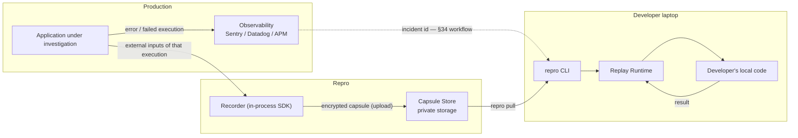
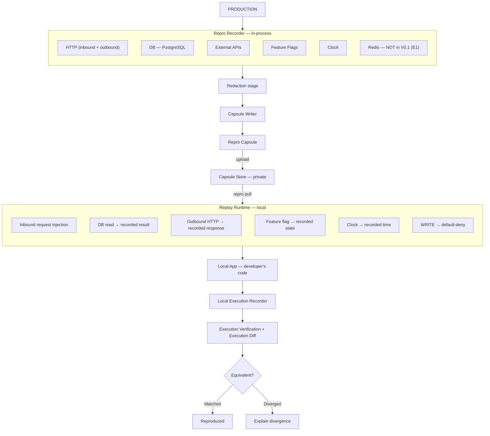
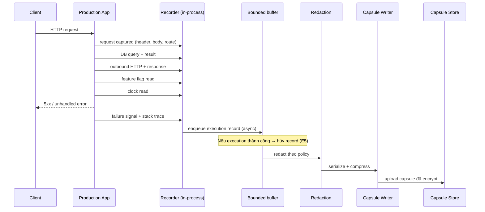
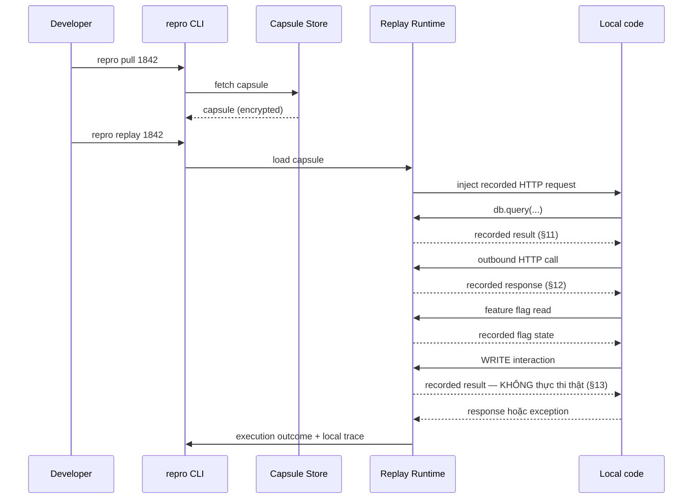
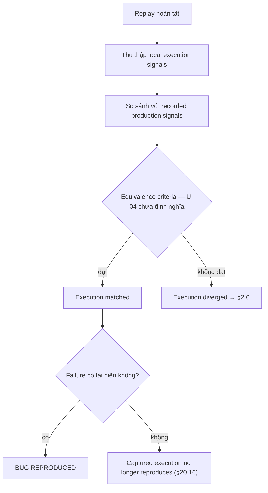
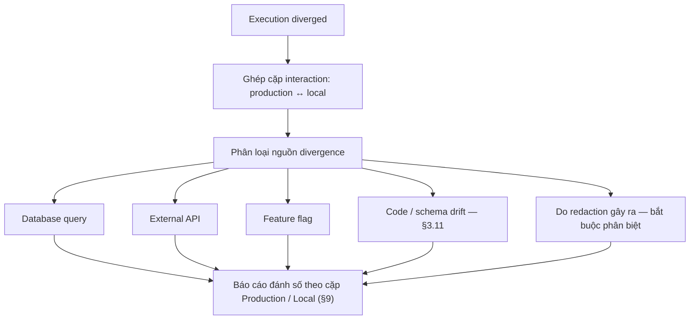
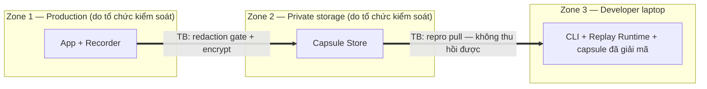
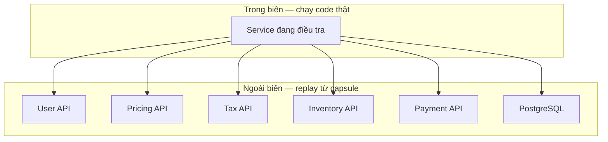

# System Design Document — Repro

> **Production happened. Now replay it.** — `RQ.md` §36

**Đối tượng đọc**: người sẽ hiện thực Repro. Tài liệu này được viết để người đọc **phân biệt được ba trạng thái**: điều đã quyết (`CHỐT`), điều được đề xuất nhưng chưa ai cân (`cần validate`), và điều chưa biết (`TBD`).

**Quy ước nhãn dùng xuyên suốt**:

| Nhãn | Nghĩa |
|---|---|
| `[stated]` | `RQ.md` nói thẳng điều này, có section number kèm theo |
| `[inferred]` | Suy luận của thiết kế, **không** có trong `RQ.md` |
| `CHỐT` | Đã là quyết định thiết kế của V0.1 |
| `TBD` | Chưa biết. Có thể kèm *phương án đề xuất* gắn nhãn **cần validate** |
| `SPIKE` | Phải trả lời bằng technical spike §22 trước khi hiện thực |
| **cần anh chốt** | Mâu thuẫn nội tại của `RQ.md`, tài liệu này **không** tự phân xử |
| ✅ **ĐÃ CHỐT `<ngày>`** | Mâu thuẫn nội tại của `RQ.md` **đã được người có thẩm quyền chọn phía**. Bối cảnh hai phía **vẫn được giữ nguyên** bên dưới nhãn — vì `RQ.md` vẫn tự nói ngược ở chính chỗ đó, và không giữ bằng chứng thì về sau không ai hiểu vì sao tài liệu dẫn xuất chọn phía này |
| ✅ **CHỐT GATE-0N — 2026-08-14** *(dạng nhãn chuẩn: **không** đặt backtick quanh `GATE-0N`, để `grep 'CHỐT GATE-0'` bắt được mọi chỗ)* | **Quyết định gate** của người có thẩm quyền (`@TrisJr`) ngày **2026-08-14**: năm quyết định `GATE-01`…`GATE-05b`. Khác nhãn ngay trên: nhãn này ghi một **quyết định gate về đầu tư / phê duyệt / phạm vi**, không phải phân xử một mâu thuẫn nội tại của `RQ.md`. Bằng chứng và bối cảnh bên dưới nhãn **vẫn giữ nguyên**. Hai họ nhãn **không được trộn** — nhãn `✅ ĐÃ CHỐT <ngày>` thuộc riêng `M1`/`M2` |

> **Mapping tên gọi** — `GATE-01` = G1 · `GATE-02` = G2 · `GATE-03` = G3 · `GATE-04` = G4 · `GATE-05a`/`GATE-05b` = G5.
> **Trong tài liệu chỉ dùng `GATE-0N`**: `G1`/`G2`/`G3` đã bị [PRD-Repro](../../020-Requirements/PRD-Repro.md) chiếm làm Goals của V0.1, và `D1`/`D2` là hai quyết định `M1`/`M2` của run trước — dùng lại là tạo dead link ngữ nghĩa.

---

## 1. Overview

### 1.1 Mục đích và trạng thái tài liệu

*Nguồn: `RQ.md` §1, §39, §40 — cộng trạng thái repo.*

Đây là **thiết kế trước khi hiện thực**. Tại thời điểm viết, `src/` và `test/` của repo **rỗng** — không có một dòng code nào của Repro tồn tại. Mọi mô tả component trong tài liệu này là *thiết kế dự kiến*, **không** phải mô tả hệ thống đang chạy.

Tài liệu phục vụ hai mục tiêu, theo đúng thứ tự ưu tiên mà `RQ.md` §39 đặt ra `[stated]`:

1. Cung cấp đủ cấu trúc để **technical spike** (§22) có thể được thiết kế và thực thi.
2. Cung cấp blueprint để MVP V0.1 được hiện thực **sau khi** spike trả lời `[stated]` §39: *"Can we capture enough information from a real production execution to deterministically replay a meaningful class of production bugs?"*

`RQ.md` §39 nói rõ `[stated]`: **không** bắt đầu bằng cách xây toàn bộ platform. Nếu spike trả lời "no", phạm vi sản phẩm phải được thu hẹp trước khi tài liệu này được nâng lên `status: approved`.

> ✅ **CHỐT GATE-01 — 2026-08-14.** **Phase 0 technical spike (§22) đã được BẬT** — quyết định `Go` của `@TrisJr`, coi spike là **điều kiện đầu tư**, không phải một task trong kế hoạch. `Sponsor` = **`@TrisJr`** · `Manager` = **`@TrisJr`** · Owner của **18/18 risk** = **`@TrisJr`**. Mục tiêu #1 của tài liệu này (cấp đủ cấu trúc để spike thiết kế được) vì thế **không còn là điều kiện giả định** mà là việc đang tới hạn.
>
> ⚠️ **`GATE-01-r` — `Go` KHÔNG tự làm cho spike đo được.** Bốn khoảng hở `ACG-01` / `ACG-02` / `ACG-03` / `ACG-07` vẫn nguyên: không có denominator, không có định nghĩa *"reproduced"*, không có tiêu chí chọn test case, không có *Supported Execution Class*. Chạy spike lúc này vẫn **không kết luận được pass/fail** — xem `GATE-01-r` tại [Risk-Register](../../010-Planning/Risk-Register.md) và kế hoạch spike ở §8.2. Trạng thái `status: draft` của tài liệu này **không đổi** vì `GATE-01`: nó chỉ được nâng khi spike trả lời, đúng câu §39 ở trên.

### 1.2 Product thesis

*Nguồn: `RQ.md` §1, §4, §5, §35, §40.*

Nguyên lý nền tảng, `RQ.md` §1 phát biểu nguyên văn `[stated]`:

> **Repro does not reproduce the production environment. It reproduces the production execution.**

Lý do §4 đưa ra `[stated]`: production (Kubernetes, 20 API replica, PostgreSQL cluster, Redis, Kafka, external API, cloud infra, feature flag, secret) và local (Docker, 1 API, local PostgreSQL, local Redis, mock service) **khác nhau về bản chất**; sao chép môi trường tạo ra độ phức tạp khổng lồ. Vì vậy trừu tượng hoá được chọn là: **capture the execution, not the environment**.

Hệ quả kiến trúc trực tiếp — đây là điều làm Repro khác một APM: đối tượng được portable hoá **không phải là dữ liệu quan sát** mà là **tập input ngoài (external input) mà một execution đã nhận**. §40 gọi capsule là *"everything needed to understand the execution"* `[stated]`.

Xem [ADR-001 — Replay Execution Not Environment](./ADR-001-Replay-Execution-Not-Environment.md).

### 1.3 Architectural drivers

*Nguồn: `RQ.md` §20 (17 risk), §21 (Risk Matrix), §33 (Product Principles).*

Kiến trúc của Repro **bị dẫn dắt bởi risk nhiều hơn bởi feature**. §21 Risk Matrix liệt kê 8 risk `🔴 Critical` với cột `MVP? = Yes`. Tám risk đó, chứ không phải danh sách capability §18, mới là thứ quyết định hình dạng hệ thống.

| Driver | Risk nguồn | Ràng buộc lên kiến trúc | Component chịu trách nhiệm |
|---|---|---|---|
| Capture đủ để replay | §20.1 Critical | Giới hạn MVP vào một class execution request/response deterministic được định nghĩa rõ | §3.2, §3.3 |
| Determinism có biên | §20.2 Critical | Clock capture/replay vào; scheduler/race replay hoãn | §3.2, [ADR-010](./ADR-010-Bounded-Determinism-Scope.md) |
| Không được có false equivalence | §20.3 Critical | Execution Verification là **core feature**, phân biệt *"replay completed"* với *"execution matched"* | §3.9, [ADR-006](./ADR-006-Execution-Verification-By-Equivalence.md) |
| Không được gây side effect | §20.4 Critical | Default-deny write khi replay | §3.7, §7.3, [ADR-005](./ADR-005-Default-Deny-Write-Side-Effects.md) |
| Dữ liệu production là nhạy cảm | §20.5 Critical | Redaction + anonymization + encryption + retention + self-host + access control | §3.4, §4.9, §7 |
| Attack surface | §20.6 Critical | Topology private/self-hosted, **không** mặc định gửi lên public SaaS | §6.1, [ADR-009](./ADR-009-Private-Self-Hosted-Topology.md) |
| Không tạo false confidence | §20.16 Critical | Ngôn từ kết quả bị ràng buộc (xem §5.3) | §3.9, §5.3 |
| Adoption | §20.14 Critical | Tích hợp tối thiểu: `npm install @repro/node` + `repro.init()` | §3.1, §5.1 |
| Overhead production | §20.7 High | Capture async, buffer bounded, sampling, capture limit, chỉ capture failed/high-value | §3.3, §6.2, [ADR-008](./ADR-008-Async-Bounded-Failure-Triggered-Capture.md) |
| Drift (version/schema/dependency) | §20.8–20.10 High | Capture metadata môi trường + cảnh báo mismatch | §3.11 |
| Replay boundary | §20.11 High | Định nghĩa biên replay tường minh quanh service dependency | §6.4 |
| Capsule size | §20.12 High | Compression, dedup, content hashing, size limit, selective capture | §4.7 |
| Compliance | §20.17 High | Retention, deletion, encryption, audit log, redaction, self-host, data residency | §7.4, §7.5 |

Nguyên tắc vận hành xuyên suốt, §20.7 phát biểu nguyên văn `[stated]`:

> **Repro must never become the reason production becomes slower or fails.**

### 1.4 Ubiquitous language

*Nguồn: `RQ.md` §5, §6, §9, §10, §13, §14, §17, §18, §20.1, §20.8–20.11.*

| Thuật ngữ | Định nghĩa | Nguồn | Trạng thái |
|---|---|---|---|
| **Execution** | Một lượt chạy của ứng dụng từ HTTP request tới response, đi qua auth → feature flag → DB read → external API → business logic | §5 | `[stated]` |
| **Repro Capsule** | Artifact portable đóng gói execution đã capture | §6 | `[stated]` |
| **Recorder** | Thành phần chạy trong process production, capture external input | §17 | `[stated]` |
| **Replay Runtime** | Thành phần chạy local, cấp lại recorded input cho code local | §17 | `[stated]` |
| **Execution Diff** | Trình bày chỗ execution local phân kỳ khỏi production | §9 | `[stated]` |
| **Execution Verification** | Xác định execution có **tương đương đủ mức** (*sufficiently equivalent*) hay không, không chỉ là "replay chạy xong" | §10 | `[stated]` — nhưng *"sufficiently equivalent"* **không được định nghĩa ở đâu trong `RQ.md`**, xem `U-04` |
| **Replay Boundary** | Ranh giới giữa cái chạy code thật ở local và cái được replay từ recorded response | §14, §20.11 | `[stated]` |
| **READ / WRITE interaction** | Phân loại tương tác với hệ thống ngoài để quyết định hành vi replay an toàn | §13 | `[stated]` |
| **Drift** | Chênh lệch giữa production và local: code version (§20.8), DB schema (§20.9), external dependency (§20.10) | §20.8–20.10 | `[stated]` |
| **Supported Execution Class** | Class execution mà Repro cam kết replay được | §20.1 | ⚠️ `RQ.md` §20.1 **yêu cầu** phải có *"a clearly defined class"* nhưng **không định nghĩa nó ở bất kỳ đâu** — xem `ACG-07`, §8.3 |

> ⚠️ Hai mục cuối bảng là **nợ khái niệm của chính `RQ.md`**, không phải chỗ trống do tài liệu này bỏ sót. Chúng được khai ở §8.3 chứ không được lấp bằng định nghĩa tự chế.

Từ vựng chính thức của dự án nằm ở [Glossary](../../999-Resources/Glossary.md).

### 1.5 Out of scope và guardrail kiến trúc

*Nguồn: `RQ.md` §19 (MVP Non-Goals), §20.15 (Product Scope Explosion), §33.7 (Narrow before broad).*

`RQ.md` §19 liệt kê tường minh những thứ **ngoài phạm vi V0.1** `[stated]`: full production environment cloning, full production database snapshot, browser replay, Kubernetes orchestration, Kafka replay, distributed race-condition replay, multi-language support, AI root-cause analysis, automatic code fix, enterprise billing, large observability dashboard.

Cộng thêm các mục PM đã chốt cho run này:

- **Redis capture không thuộc V0.1** (`E1`). Xem §3.2 để biết căn cứ đầy đủ và ghi chú sửa `RQ.md` §17.
- **Không có manual recording ở V0.1** (`E5`, §38 Q6). Neo: §18 CLI không có lệnh `record`; §26 V0.1 chỉ ghi *"Production capture"*; §20.15 product boundary.
- **V0.1 chỉ capture failed execution** (`E5`, §38 Q5). Neo: §20.7 *"capture only failed/high-value executions"* `[stated]`; §18 Capture list có *"stack trace"* — chỉ tồn tại khi có failure.

**Guardrail nghiệm thu feature** — §20.15 phát biểu `[stated]`:

> A feature should be considered only if it directly improves: **Capture → Replay → Verify**

§20.15 cảnh báo cụ thể rằng concept này dễ phình thành: APM + distributed tracing + network proxy + database proxy + container runtime + **artifact storage** + test framework + browser automation. Guardrail này va trực tiếp vào Capsule Store (§3.6) — `RQ.md` vừa liệt kê *"artifact storage"* như biểu hiện của scope explosion, vừa hàm ý cần có store qua §8 `repro pull` và §18 `repro list`. Cách xử lý: đặc tả store ở **mức tối thiểu** (`E8`), xem §3.6.

§33.7 `[stated]`: *"Support a small class of bugs reliably before attempting to support every production scenario."*

### 1.6 Decision index

*Nguồn: toàn bộ `RQ.md`; tập ADR do `findings/architect.md` đề xuất.*

✅ **CHỐT GATE-03 — 2026-08-14.** **11/11 ADR ở trạng thái `Accepted`**, người duyệt **`@TrisJr`**, ngày **2026-08-14**. Câu trước đây của mục này — *"chưa có ai duyệt thật"* — **không còn đúng**: đã có người duyệt, có tên và có ngày.

> ⚠️ **`Accepted` xác nhận hướng quyết định, KHÔNG đóng mục `Open items`.** Các unknown `TBD`/`SPIKE` bên dưới vẫn chưa được trả lời — xem `GATE-03-r` tại [Risk-Register](../../010-Planning/Risk-Register.md).
>
> Cụ thể ở tài liệu này: **6 unknown vẫn hở bên trong 11 ADR đã `Accepted`** — `U-01`, `U-02`, `U-03`, `U-04`, `U-13`, `U-20` (§8.3). `GATE-03` **không** biến chúng thành đã trả lời, và **không** được đọc là *"mọi thứ trong ADR đã chốt"*. `U-04` vẫn là **unknown lớn nhất tài liệu**; `ACG-07` vẫn là nợ khái niệm chưa trả.

| ADR | Nội dung | Component / mục SDD liên quan |
|---|---|---|
| [ADR-001](./ADR-001-Replay-Execution-Not-Environment.md) | Reproduce production **execution** thay vì production **environment** | §1.2, §2.1 |
| [ADR-002](./ADR-002-Repro-Capsule-Format-Contract.md) | Repro Capsule là artifact portable; format là contract | §4 toàn bộ |
| [ADR-003](./ADR-003-Database-Record-Replay-Not-Snapshot.md) | Record/replay **kết quả query**, không snapshot database | §3.2, §4.4 |
| [ADR-004](./ADR-004-Record-Replay-External-Inputs-At-Boundary.md) | Record/replay external input tại **dependency boundary** | §3.2, §4.5 |
| [ADR-005](./ADR-005-Default-Deny-Write-Side-Effects.md) | Default-deny write side effect khi replay | §3.7, §7.3 |
| [ADR-006](./ADR-006-Execution-Verification-By-Equivalence.md) | Verification bằng **execution equivalence**, ngôn từ kết quả chính xác | §3.9, §5.3 |
| [ADR-007](./ADR-007-In-Process-SDK-Interception.md) | Intercept **in-process bằng SDK**, không proxy/sidecar/container runtime | §3.1, §3.2 |
| [ADR-008](./ADR-008-Async-Bounded-Failure-Triggered-Capture.md) | Capture pipeline async, bounded, sampled, failure-triggered | §3.3, §6.2 |
| [ADR-009](./ADR-009-Private-Self-Hosted-Topology.md) | Topology capture + storage private / self-hosted | §3.6, §6.1 |
| [ADR-010](./ADR-010-Bounded-Determinism-Scope.md) | Determinism có biên: clock vào, scheduler/race ra | §3.2, §8.3 `U-13`, `U-20` |
| [ADR-011](./ADR-011-Execution-Diff-First-Class.md) | Execution Diff là kết quả hạng nhất khi reproduce thất bại | §3.10 |

---

## 2. Architecture Diagram

### 2.1 Context — Repro nằm ở đâu

*Nguồn: `RQ.md` §3, §29, §34.*

`RQ.md` §3 định vị rất rõ `[stated]`: observability trả lời *"What happened?"*, Repro trả lời *"Can I replay what happened?"*. §3 nói thẳng Repro **không** nhằm thay thế observability platform mà **thêm một reproducibility layer** lên trên production diagnostics. §34 liệt kê tường minh những thứ Repro **không** thay thế `[stated]`: Sentry, Datadog, APM, logging platform, testing framework, CI/CD.



Luồng phối hợp mà §34 mô tả `[stated]`: `Sentry / APM → (incident) → Repro → (replay) → Developer → (fix) → Regression Test → CI`.

> ✅ **M1 — ĐÃ CHỐT 2026-08-14.** Mắt xích *"Regression Test"* trong luồng §34/§30 giả định regression test generation đã tồn tại, nhưng §26 đặt tính năng này ở **V0.2** — `RQ.md` tự nói ngược ở chính chỗ này và bối cảnh đó được giữ nguyên. **Quyết định**: giữ nguyên §26 — regression test generation thuộc **V0.2**. Mắt xích `Regression Test → CI` trong sơ đồ §34 vì vậy là **mắt xích của V0.2**, không phải của V0.1; luồng V0.1 kết thúc ở `Developer → (fix)`. Xem §6.5 và §8.3.

### 2.2 Component diagram

*Nguồn: `RQ.md` §17 (Core Product Flow) — vẽ lại bằng Mermaid.*

`RQ.md` §17 vẽ luồng sản phẩm lõi bằng ASCII. Dưới đây là bản Mermaid tương đương, **có một sai lệch có chủ ý được ghi rõ**.



> ⚠️ **Sai lệch có chủ ý so với `RQ.md` §17.** Sơ đồ §17 vẽ **Redis** nằm trong box Recorder. Theo `E1`, Redis **không** thuộc V0.1 capture. Node `I6` ở trên giữ lại tên Redis nhưng đánh dấu *NOT in V0.1* để người đọc đối chiếu được với §17. **`RQ.md` §17 cần được sửa cho khớp với §18/§26** — đây là một mục ripple đã biết, không phải mâu thuẫn chưa xử lý. Căn cứ đầy đủ ở §3.2.
>
> Sơ đồ trên cũng **thêm** ba thành phần mà §17 không vẽ nhưng các section khác đòi hỏi `[inferred]`: Redaction stage (§16, §20.5), Capsule Store (§8 `repro pull`, §18 `repro list`, §20.6 *"Private Storage"*), và Local Execution Recorder (§10 — muốn so execution path thì phải ghi lại execution path phía local).

### 2.3 Capture flow

*Nguồn: `RQ.md` §5, §17, §18, §20.7, §16.*



Ràng buộc từ §20.7 `[stated]`: capture phải **asynchronous**, buffer **bounded**, có **sampling**, có **configurable capture limits**, và chỉ capture **failed/high-value executions**.

> ⚠️ Bước `Note over B` chứa một nghịch lý mà `RQ.md` **không thừa nhận** — xem `U-09` ở §3.3.

### 2.4 Replay flow

*Nguồn: `RQ.md` §8, §11, §12, §13, §17.*



§11 mô tả chuỗi replay layer nguyên văn `[stated]`: `Local Application → Database Query → Repro Replay Layer → Recorded Production Result → Application`. §12 áp cùng mô hình cho external API.

### 2.5 Verification flow

*Nguồn: `RQ.md` §10, §20.3.*



§10 nêu tín hiệu được so sánh dưới dạng ví dụ `[stated]`: DB result, tax, flag, và **execution path** ký hiệu `A → B → C`. §20.3 nói rõ mục đích `[stated]`: ngăn tình huống nguy hiểm khi Repro báo *"replay succeeded"* trong khi ứng dụng **không** đi cùng execution path.

> ⚠️ Node `D` là **lỗ hổng lớn nhất của cả thiết kế**. `RQ.md` §10 dùng ký hiệu `A → B → C` nhưng **không định nghĩa `A`, `B`, `C` là gì** (function call? code line? span? external interaction?), cũng **không định nghĩa** *"sufficiently equivalent"*. Xem `U-04` ở §3.9 và §8.3.

### 2.6 Diff flow

*Nguồn: `RQ.md` §9.*



§9 quy định format trình bày `[stated]`: divergence được đánh số, mỗi mục hiện cặp `Production → ...` / `Local → ...`. §9 nói rõ giá trị sản phẩm `[stated]`: Repro **vẫn tạo giá trị** khi bug không reproduce được, sản phẩm trở thành *"Show me what was different between production and my environment."*

Nhánh `C5` **không có trong `RQ.md`** `[inferred]` nhưng là bắt buộc — xem §3.4 và §7.2.

### 2.7 Trust boundary và deployment

*Nguồn: `RQ.md` §16, §20.6, §28.*



§20.6 mô tả topology được ưu tiên nguyên văn `[stated]`: `Production → Private Recorder → Encrypted Capsule → Private Storage`, **thay vì** bắt buộc gửi dữ liệu production lên public SaaS. §16 yêu cầu tổ chức có thể chạy Repro **hoàn toàn bên trong hạ tầng của mình** `[stated]`.

> **Sơ đồ trên cố ý chỉ vẽ ba zone triển khai** — những zone mà kiến trúc này kiểm soát được. Threat model chia **bốn** zone: `Zone 4` — *hạ tầng ngoài kiểm soát* — tồn tại nhưng nằm ngoài tầm với của thiết kế, nên không được vẽ ở đây; mô tả đầy đủ ở [Spec-Security-Repro-Threat-Model](../Security/Spec-Security-Repro-Threat-Model.md) §3.1.

Phân tích trust boundary đầy đủ (asset, threat, control) nằm ở [Spec-Security-Repro-Threat-Model](../Security/Spec-Security-Repro-Threat-Model.md). Tài liệu này **không** nhắc lại — xem §7.1.

---

## 3. Component Design

### 3.1 SDK / Recorder

*Nguồn: `RQ.md` §17, §18, §20.14, §26.*

**Trách nhiệm**: chạy **trong process** của ứng dụng production, quan sát external input của mỗi execution, và khi execution thất bại thì đẩy record vào capture pipeline.

**Ràng buộc adoption — đây là ràng buộc thiết kế, không phải mong muốn marketing.** §20.14 xếp developer adoption là risk `🔴 Critical` và quy định trải nghiệm đầu tiên phải là `[stated]`:

```bash
npm install @repro/node
```

```javascript
repro.init()
```

Sau đó developer *"should be able to capture the first replayable execution with minimal configuration"* `[stated]`. §20.14 cảnh báo hai phản ứng phải tránh `[stated]`: *"Another observability SDK."* và *"This looks complicated to install."*

Hệ quả kiến trúc: mọi phương án đòi hỏi hạ tầng bổ sung (proxy, sidecar, agent daemon, container runtime thay đổi) **bị loại bởi chính risk này**, không phải bởi sở thích kỹ thuật. Xem [ADR-007](./ADR-007-In-Process-SDK-Interception.md).

**Phạm vi runtime V0.1** `[stated]` §18: Node.js. §26 V0.1 xác nhận. Python/Go ở V0.3.

**Nợ đã biết**: §21 xếp *"Compatibility matrix"* là risk `🟡 Medium`, `MVP? = Yes`, mitigation *"Narrow initial support"* `[stated]`. Interception in-process gắn chặt vào phiên bản driver và runtime ⇒ compatibility matrix là **nợ vĩnh viễn**, không phải công việc một lần.

### 3.2 Interception layer

*Nguồn: `RQ.md` §5, §11, §12, §13, §17, §18, §20.2, §22, §26.*

**Trách nhiệm**: điểm chạm duy nhất giữa Repro và ứng dụng. Ở chế độ capture thì *quan sát và ghi*; ở chế độ replay thì *chặn và trả recorded value*. Cùng một tập seam phục vụ cả hai chiều — đây là ràng buộc thiết kế quan trọng nhất của layer này `[inferred]`: nếu hai chiều dùng hai cơ chế khác nhau, khả năng capture và khả năng replay sẽ lệch nhau theo thời gian.

| Seam | Chiều capture | Chiều replay | Nguồn | Trạng thái |
|---|---|---|---|---|
| **Inbound HTTP** | request (method, route, header, body) | inject lại request vào app local | §18, §8 | `CHỐT` phạm vi; cơ chế `U-03` |
| **Database (PostgreSQL)** | query + result | trả recorded result | §11, §18 | `CHỐT` phạm vi; cơ chế `U-01`; **định danh để match `U-02`** |
| **Outbound HTTP** | request + response | trả recorded response | §12, §18 | `CHỐT` phạm vi; cơ chế `U-03` |
| **Feature flag** | trạng thái flag đã đọc | trả recorded state | §5, §18 | `CHỐT` phạm vi; surface `U-14` |
| **Clock** | timestamp đã đọc | trả recorded time | §18, §20.2 | `CHỐT` phạm vi; cơ chế `U-13` |
| **Redis / cache** | — | — | §26 V0.3 | ❌ **ngoài V0.1** — xem dưới |

#### E1 — Redis không thuộc V0.1 capture

`RQ.md` tự mâu thuẫn về Redis. Cả hai phía đều được ghi ở đây:

- *Phía có*: §5 vẽ `Cache Reads` trong execution chain và `Redis → Result B` trong ví dụ; §13 xếp `Cache read` vào nhóm READ; §17 vẽ **Redis** trong box Recorder; §22 đưa Redis vào dependency của test app.
- *Phía không*: §18 *"MVP capabilities → Capture"* **không có** Redis; §26 đặt **Redis ở V0.3**.

**Quyết định đã chốt (`E1`)**: Redis **không** thuộc V0.1 capture. Lý do: §18 (*"MVP capabilities"*) và §26 (*"V0.3"*) là hai **phát biểu phạm vi tường minh**; §5/§17 là **sơ đồ minh hoạ kiến trúc chung**; §22 Redis là **dependency của test app** — test app *có* Redis không đồng nghĩa Repro *capture* Redis ở V0.1. **Phát biểu phạm vi thắng sơ đồ.**

> 📌 **Ripple bắt buộc**: `RQ.md` §17 cần được sửa để bỏ Redis khỏi box Recorder, hoặc đánh dấu là V0.3. Sơ đồ §2.2 của tài liệu này đã đánh dấu sẵn.

#### Cơ chế interception — chưa chốt

`RQ.md` **không** nói bằng cơ chế nào. Ba unknown còn mở, đều là `SPIKE`:

- **`U-01` — cơ chế intercept PostgreSQL driver.** Phương án `[inferred]` **cần validate**: monkey-patch entry point của `node-postgres` (`Client.prototype.query` / `Pool.prototype.query`) vì đó là điểm hẹp nhất bắt được cả query lẫn result. Rủi ro: vỡ khi driver đổi internal, và không bắt được code dùng transport riêng.
- **`U-03` — cơ chế intercept HTTP.** Phải xử lý **cả hai chiều**: outbound (`http.request` / `undici` / `fetch`) và **inbound** (framework middleware). `RQ.md` không phân biệt hai chiều này ở đâu cả — inbound chỉ được hàm ý qua §8 *"HTTP request replay"*.
- **`U-14` — surface của feature flag.** §5/§18 nói capture *"feature flag state"* nhưng feature flag không có một API chuẩn nào; mỗi vendor một SDK. Chưa rõ Repro intercept SDK vendor, hay yêu cầu app tự khai báo, hay chỉ snapshot toàn bộ flag state lúc bắt đầu execution.

Xem [ADR-007](./ADR-007-In-Process-SDK-Interception.md), [ADR-003](./ADR-003-Database-Record-Replay-Not-Snapshot.md), [ADR-004](./ADR-004-Record-Replay-External-Inputs-At-Boundary.md).

### 3.3 Capture pipeline

*Nguồn: `RQ.md` §20.7, §18, §24, §38 Q5.*

**Trách nhiệm**: nhận execution record từ interception layer, giữ ở buffer bounded, quyết định giữ hay hủy, rồi chuyển sang redaction.

Ràng buộc `[stated]` §20.7: asynchronous capture · bounded buffer · sampling · configurable capture limit · capture only failed/high-value executions.

#### ⚠️ `U-09` — nghịch lý capture trigger

Đây là một điểm mà `RQ.md` **không thừa nhận**, và nó phải được nêu thẳng ở đây vì nó ảnh hưởng trực tiếp tới ngân sách overhead:

§20.7 nói *"capture only failed/high-value executions"*. Nhưng một execution **chỉ được biết là failed sau khi nó kết thúc**. Suy ra: recorder phải **buffer mọi execution** rồi hủy record khi execution thành công. Hệ quả:

1. **Ngân sách overhead áp cho 100% traffic, không phải cho vài request lỗi.** Con số `< 5%` ở §24 được đặt như thể chỉ áp cho execution được capture — thực tế nó phải áp cho *mọi* execution vì mọi execution đều bị quan sát và buffer.
2. **Sampling và độ phủ kéo ngược nhau.** §20.7 đề xuất sampling để giảm overhead; nhưng sampling giảm overhead bằng cách **giảm xác suất bắt được đúng execution lỗi** — chính thứ sản phẩm tồn tại để bắt. Với bug hiếm, sampling tỷ lệ cố định gần như bảo đảm bỏ lỡ.

**Phương án đề xuất `[inferred]` — cần validate qua spike §22:** buffer per-execution ở dạng nhẹ nhất có thể (giữ tham chiếu, hoãn serialize/copy tới lúc biết execution failed), sampling áp ở tầng *"execution nào được quan sát chi tiết"* chứ không ở tầng *"execution nào được giữ khi lỗi"*. **Không được viết như đã chốt** — chi phí thật của việc quan sát 100% traffic là một trong những thứ spike phải đo.

**Cái bị chặn**: `N-02` (`< 5%` latency overhead) không có nghĩa xác định cho tới khi câu này được trả lời; [ADR-008](./ADR-008-Async-Bounded-Failure-Triggered-Capture.md) không thể chốt.

**Trigger V0.1** (`E5`, §38 Q5): chỉ failed execution. Neo: §20.7, §18 (Capture list có *"stack trace"* — chỉ tồn tại khi failure), §37.

### 3.4 Redaction stage

*Nguồn: `RQ.md` §16, §20.5, §20.17.*

**Trách nhiệm**: loại bỏ / biến đổi dữ liệu nhạy cảm **trước khi** execution record trở thành capsule.

**Vị trí trong pipeline là một quyết định kiến trúc, không phải chi tiết cấu hình** `[inferred]`: redaction phải nằm **trước** capsule writer, vì đó là nơi *duy nhất* ngăn được dữ liệu nhạy cảm bước vào lifecycle của capsule. Đặt sau writer thì mọi control phía sau (encryption, ACL, retention) chỉ đang bảo vệ dữ liệu lẽ ra không nên tồn tại.

§16 đưa ra *hình dạng* config `[stated]` — header (`authorization`, `cookie`) và field (`password`, `access_token`, `credit_card`) — cộng PII anonymization dạng `john@example.com → user-1842@example.test`. Danh sách redaction mặc định đầy đủ và chiến lược từng nhóm thuộc [Spec-Security-Repro-Threat-Model](../Security/Spec-Security-Repro-Threat-Model.md), **không** lặp lại ở đây.

#### ⚠️ `U-15` — redaction làm hỏng chính tính đúng của replay

Đây là căng thẳng thật giữa hai giá trị mà sản phẩm đều cần, và `RQ.md` **không hề nêu**:

Toàn bộ giá trị của Repro nằm ở *"cùng một execution path"* (§10, §20.3). Nhưng redaction **thay đổi dữ liệu mà code local sẽ đọc**. Xoá một key làm `if (user.email)` rẽ nhánh khác; làm schema validation fail; làm destructuring ra `undefined`. Kết quả: Execution Verification báo **diverged vì lý do do chính Repro gây ra** — tạo bug giả hoặc che bug thật.

Và cách redaction thất bại trong đời thực **không phải bị bypass kỹ thuật mà là bị người dùng vô hiệu hoá**: developer thấy replay sai liên tục sẽ tự tắt redaction.

**Hai kết luận có đủ bằng chứng để viết như quyết định** — hai lens phân tích độc lập (kiến trúc và bảo mật) đến từ hai hướng khác nhau và gặp nhau ở cùng kết luận:

- **`CHỐT`** — Chiến lược redaction mặc định phải **giữ hình dạng dữ liệu** (thay thế giá trị cố định / pseudonymize format-preserving) thay vì **xoá key**. Chỉ xoá khi field chắc chắn không tham gia logic; chỉ không-lưu khi nghĩa vụ pháp lý thắng tính đúng của replay.
- **`CHỐT`** — **Capsule phải ghi lại field nào đã bị redact và bằng chiến lược nào.** Không có thông tin này, Execution Diff **không thể** phân biệt *"diverged vì code"* với *"diverged vì redaction"* — và §9, tính năng tạo giá trị khi bug không reproduce được, sẽ liên tục quy sai nguyên nhân. Ràng buộc này áp lên capsule format từ **v1** (§4.2).

**Phần còn `TBD`**: chiến lược mặc định cho từng nhóm field cụ thể, và ngưỡng "field nào chắc chắn không tham gia logic" — cần Security Spec và pháp chế.

### 3.5 Capsule writer

*Nguồn: `RQ.md` §6, §20.12, §16.*

**Trách nhiệm**: serialize execution record đã redact thành cấu trúc capsule (§4), áp compression / dedup / content hashing / size limit, encrypt, và upload lên Capsule Store.

Kỹ thuật §20.12 liệt kê `[stated]`: compression, deduplication, content hashing, size limits, selective capture, lazy loading.

**`E3` — capsule self-contained là bất biến V0.1.** §6 nói capsule chứa *"only the information necessary to reproduce the execution"*, §40 gọi nó là artifact **portable**. *"Lazy loading"* ở §20.12 được hiểu là **lazy khi ĐỌC capsule** (không nạp toàn bộ vào memory khi inspect/replay), **không phải** lazy fetch dữ liệu từ production lúc replay. Cách đọc này giữ được cả §6/§40 lẫn §20.12 mà không mâu thuẫn. Đây là **diễn giải có chủ ý**, được ghi ra chứ không giấu.

Hệ quả: Replay Runtime **không bao giờ** cần kết nối tới production. Đây cũng là điều làm replay offline khả thi — và là lý do `E12` (crypto-shredding, §4.9) là một đánh đổi thật chứ không phải bổ sung miễn phí.

> ✅ **CHỐT GATE-05b — 2026-08-14 — đánh đổi đó ĐÃ được cân và chấp nhận.** `E12` (`SEC-016`) nay là **`MUST-V0.1`**. Hai mệnh đề trên phải được đọc tách nhau sau quyết định này:
>
> - *"Replay Runtime không bao giờ cần kết nối tới **production**"* — **vẫn đúng nguyên vẹn.** `E3` không bị lật; capsule vẫn không fetch dữ liệu từ production lúc replay.
> - *"replay offline khả thi"* — **thôi là bất biến.** Khoá giải mã giữ **phía server** (Capsule Store, §3.6), `replay` lấy khoá just-in-time ⇒ replay cần kết nối tới **store**, dù vẫn không cần tới production. Xem §6.3, §4.9, §7.4 và `GATE-05b-r` tại [Risk-Register](../../010-Planning/Risk-Register.md).

### 3.6 Capsule Store

*Nguồn: `RQ.md` §8 (`repro pull`), §18 (`repro list`), §20.6, §28; guardrail §20.15.*

**Đây là khối việc lớn nhất bị ẩn trong `RQ.md`.** Cả hai phía được ghi thẳng:

- §8 `repro pull 1842` và §18 `repro list` **hàm ý tồn tại một store ở xa, có API và có auth**; §28 xếp *"Basic Self-hosting"* vào OSS core; §20.6 vẽ *"Private Storage"*.
- Nhưng `RQ.md` **không có một dòng đặc tả nào**: không API, không auth, không storage backend, không mô hình triển khai.
- Và nó va vào chính guardrail của `RQ.md`: §20.15 liệt kê **"Artifact storage"** như một biểu hiện của scope explosion; §20.14 cảnh báo *"significant infrastructure"* hại adoption.

✅ **CHỐT GATE-04 — 2026-08-14 — SÀN TỐI THIỂU CỦA CAPSULE STORE ĐÃ ĐÓNG.** Đây **không còn là** *"quyết định ở mức tối thiểu (`E8`), cố ý đặc tả ít nhất có thể"* — nó là **quyết định chính thức của `@TrisJr`** về *cái gì bắt buộc phải có*. Phần **sàn ĐÓNG**; **cơ chế** authn/authz cụ thể **vẫn `TBD`** (§5.4, `U-06`).

> **Mapping tên gọi** — `GATE-01` = G1 · `GATE-02` = G2 · `GATE-03` = G3 · `GATE-04` = G4 · `GATE-05a`/`GATE-05b` = G5.
>
> **Sàn đã chốt, đúng ba thành phần — không thêm thành phần nào**: **object/file storage** + **một index** + **authn/authz/audit hook**, với **3 thao tác tối thiểu** theo §5.4 (*ghi capsule* · *liệt kê capsule* · *đọc một capsule*).
>
> **`GATE-04` chốt *cái gì phải có*, KHÔNG chốt *cách làm*.** Kỷ luật phạm vi của `E8` **vẫn giữ**: cái được nâng lên là **thẩm quyền** của sàn (từ *"cách xử lý của tài liệu này"* thành *"quyết định của người có thẩm quyền"*), không phải khối lượng của sàn.
>
> ⚠️ **`GATE-04-r` — sàn đóng nhưng chưa vận hành được**: `GAP-04` (§18 không có một CLI verb nào cho authz / audit / retention) **còn nguyên**, và **cơ chế** auth vẫn `TBD`. Xem `GATE-04-r` tại [Risk-Register](../../010-Planning/Risk-Register.md).

| Hạng mục | Quyết định V0.1 |
|---|---|
| Bản chất | ✅ **SÀN ĐÃ CHỐT (`GATE-04`, 2026-08-14)**: **object/file storage + một index + authn/authz/audit hook** — **không** phải một service đầy đủ, và **không thêm thành phần nào ngoài ba thứ này**. Ba control cuối là **bắt buộc** từ M2 (§6.6) và nay được `GATE-04` chốt thành **sàn đóng** — store tối thiểu **không còn là** "object storage + index" thuần tuý |
| Đối tượng lưu | Capsule đã encrypt, bất biến. Sau ✅ **CHỐT GATE-05b — 2026-08-14**: mỗi capsule mã hoá bằng **khoá riêng giữ phía server** (`SEC-016` crypto-shredding, `MUST-V0.1`) — xem §4.9, §7.4 |
| Ghi vào store | **Recorder tự upload**; **không** có lệnh push phía CLI (`E8`) |
| Đọc từ store | `repro pull` (§8), `repro list` (§18) |
| Sở hữu | Tổ chức tự cấu hình và tự vận hành (§20.6, §16) |
| 3 thao tác tối thiểu | ✅ **SÀN ĐÃ CHỐT (`GATE-04`)**: *ghi capsule* (recorder upload) · *liệt kê capsule* (`repro list`) · *đọc một capsule* (`repro pull`) — xem §5.4 |
| API | `TBD` — xem §5.4. `GATE-04` chốt sàn, **không** chốt API |
| Auth / access control | **Bắt buộc phải có** — authn + authz + audit hook thuộc **OSS core** (M2 ✅ **ĐÃ CHỐT 2026-08-14**, §6.6), và nay là **phần của sàn đã đóng** (✅ **CHỐT GATE-04 — 2026-08-14**). ⚠️ **Cơ chế** vẫn `TBD` (`U-06`) — `GATE-04` **không** chốt cơ chế |
| Retention TTL | ✅ **CHỐT GATE-05a — 2026-08-14**: mặc định **30 ngày** (`SEC-022`), vẫn **cấu hình được**; 30 ngày là **mặc định khi không cấu hình**. Xem §7.4 |
| Storage backend cụ thể | `TBD` |

**Căn cứ cho "recorder tự upload, không có push phía CLI"** `[stated]`: §17 vẽ mũi tên từ Recorder tới Capsule rồi tới `pull`; §20.6 vẽ `Private Recorder → Encrypted Capsule → Private Storage`; và §18 liệt kê đủ 6 lệnh CLI mà **không có lệnh push** ⇒ push không phải việc của developer.

**`U-06` — cái bị chặn**: ước lượng khối lượng MVP. Nếu chấp nhận capsule là **file chuyển tay** cho V0.1 thì MVP nhỏ hơn *đáng kể* so với có store. Đây là câu hỏi phạm vi cần trả lời trước khi lập kế hoạch hiện thực, không phải câu hỏi kỹ thuật.

> ✅ **`GATE-04` đã trả lời câu hỏi phạm vi ở trên — phương án *file chuyển tay* BỊ LOẠI.** Câu trên **được giữ nguyên làm bằng chứng** rằng phương án nhỏ hơn đã từng được cân, và cân xong: sàn bắt buộc gồm authn/authz/audit hook (M2, §6.6) nên không có store thì **không có chỗ đặt ba control đó** — phương án C4 không còn thoả sàn (xem [ADR-009](./ADR-009-Private-Self-Hosted-Topology.md) §Alternatives `C4`). ⇒ **Ước lượng MVP nay đứng được ở mức sàn** (biết chắc phải xây gì), nhưng **chưa đứng được ở mức cơ chế**.

> ✅ **Hệ quả của M2 (ĐÃ CHỐT 2026-08-14, §6.6) lên `U-06`**: quyết định đưa authn + authz + audit vào OSS core **thu hẹp** `U-06` — sàn tối thiểu của store nay đã biết chắc là *có ba control đó*, nên phương án C4 (*capsule là file chuyển tay*, không có store) không còn thoả được sàn này. Nhưng nó **không giải** `U-06`: **API và cơ chế auth cụ thể vẫn `TBD`** — `RQ.md` vẫn không có một dòng đặc tả nào (§8/§18/§28/§20.6 chỉ *hàm ý* có store). Đồng thời nó **làm nặng thêm** cái mà §20.14 (*"significant infrastructure"*) và §20.15 (`Artifact storage`) cảnh báo — xem [ADR-009](./ADR-009-Private-Self-Hosted-Topology.md) §Consequences.
>
> ✅ **Hệ quả của `GATE-04` (CHỐT 2026-08-14) lên `U-06` — cộng thêm vào, không thay thế mệnh đề M2 ở trên**: phần **sàn** của `U-06` nay **`CHỐT`**, không còn `TBD` — sàn là **object/file storage + một index + authn/authz/audit hook** với 3 thao tác tối thiểu (§5.4), và **đó là quyết định của người có thẩm quyền**, không phải cách xử lý của tài liệu này. Phần **`TBD` còn lại, nguyên vẹn**: API, **cơ chế** authn/authz, mô hình quyền, storage backend, mô hình triển khai, định danh capsule, hình dạng audit record. `GATE-04` **không** đóng `U-06` — nó đóng **một phần** của `U-06`; xem disposition chính thức ở §8.3 và `GATE-04-r` tại [Risk-Register](../../010-Planning/Risk-Register.md).

Xem [ADR-009](./ADR-009-Private-Self-Hosted-Topology.md).

### 3.7 Replay Runtime

*Nguồn: `RQ.md` §11, §12, §13, §17, §8.*

**Trách nhiệm**: nạp capsule, đưa code local vào chế độ replay, cấp recorded value cho mọi external interaction, và chặn mọi WRITE.

§11 mô tả chuỗi `[stated]`: `Local Application → Database Query → Repro Replay Layer → Recorded Production Result → Application`. §12 áp cùng mô hình cho external API. §13 quy định `[stated]`: `READ → return recorded result`; `WRITE → do not execute against real production systems → return recorded result`.

#### ⚠️ `U-11` — interaction không khớp capsule

`RQ.md` **hoàn toàn không nêu** trường hợp này, và nó **không phải trường hợp biên mà là trường hợp thường gặp nhất**: use case chính của sản phẩm (§8 bước 4–5) là developer **sửa code rồi replay lại**. Code đã sửa gần như chắc chắn phát ra query hoặc HTTP call **không có trong capsule**.

**`E9` — chính sách đã chốt:**

| Tình huống | Hành vi |
|---|---|
| Local phát ra interaction không có trong capsule | Ghi nhận là **divergence** + đánh dấu **incomplete capture** |
| Có được crash không | **Không.** Replay tiếp tục để Execution Diff có dữ liệu |
| Có được gọi hệ thống thật ở local không | **TUYỆT ĐỐI KHÔNG.** Không fallback dưới mọi hình thức |

Neo `[stated]`: §33.6 *"Safe by default"*, §13/§20.4 default-deny, §33.5 *"Determinism over magic"* (hệ thống phải giải thích chính xác cái gì đã được capture và replay — fallback im lặng vi phạm trực tiếp), §20.3.

**Còn `TBD`**: giá trị gì được trả về cho interaction không khớp (`null`? throw có kiểm soát? sentinel object?) — mỗi lựa chọn tạo một code path khác nhau ở app local, và lựa chọn sai sẽ tạo divergence giả. Cần validate qua spike.

#### `U-19` — Replay Runtime là library hay process wrapper

`RQ.md` §17 vẽ *"Replay Runtime"* như một box nhưng **không nói nó là gì về mặt hình thái**. Hai phương án `[inferred]`:

| Phương án | Ưu | Nhược |
|---|---|---|
| **Library** — app local `require` Repro rồi tự chạy | Nhất quán với ADR-007 (in-process); developer giữ nguyên cách chạy app | Không chặn được egress ở mức process; interaction đi qua đường không được instrument sẽ thoát ra ngoài |
| **Process wrapper** — `repro replay` spawn app | Chặn được egress ở mức process, đóng được lỗ hổng fail-open của §13 | Nặng hơn, va vào ràng buộc adoption §20.14; khó gắn debugger |

**`TBD`** — chưa chốt. Ghi chú: lựa chọn này **quyết định `U-12` có giải được hay không** (§7.3), nên không thể tách rời hai câu hỏi.

Xem [ADR-005](./ADR-005-Default-Deny-Write-Side-Effects.md).

### 3.8 Local Execution Recorder

*Nguồn: `RQ.md` §10 (suy ra), §9.*

**Trách nhiệm**: trong lúc replay, ghi lại execution phía local **bằng đúng cơ chế và đúng dạng dữ liệu** mà Recorder production đã dùng.

Component này **không được vẽ trong §17** `[inferred]`, nhưng nó là điều kiện cần: §10 so `production execution path` với `local execution path`, và §9 so từng cặp giá trị `Production → ... / Local → ...`. Không thể so cái không được ghi.

**Ràng buộc thiết kế quan trọng nhất** `[inferred]`: hai bên phải dùng **cùng một biểu diễn**. Nếu production ghi bằng cách A và local ghi bằng cách B, mọi kết quả "diverged" đều nhiễm sai lệch đo lường và Execution Verification mất giá trị. Đây là lý do §3.2 yêu cầu capture và replay dùng chung tập seam.

### 3.9 Verification Engine

*Nguồn: `RQ.md` §10, §20.3, §21.*

**Trách nhiệm**: quyết định execution local có **tương đương đủ mức** với execution production hay không, và phân biệt *"Replay completed"* với *"Execution matched"* (§20.3 `[stated]`).

Đây là mitigation cho risk `🔴 Critical` §20.3, `MVP? = Yes` (§21 — *"False replay equivalence → Execution verification"*).

#### ⚠️ `U-04` — TBD LÕI: *"execution path"* và *"sufficiently equivalent"* chưa được định nghĩa

**Đây là unknown lớn nhất của toàn bộ tài liệu nguồn, và nó KHÔNG được viết như đã chốt.**

§10 dùng ký hiệu `A → B → C` để mô tả execution path và dùng cụm *"sufficiently equivalent"* để mô tả tiêu chí. `RQ.md` **không định nghĩa `A`, `B`, `C` là gì** và **không định nghĩa** *"sufficiently equivalent"* ở bất kỳ đâu.

Cụ thể những câu chưa có đáp án:

1. Một "bước" trong execution path là gì — function call? code line? external interaction? tracing span? một mốc do developer tự đánh dấu?
2. So sánh bao nhiêu và những field nào của mỗi bước?
3. So **exact** hay **tolerant**? Nếu tolerant thì tolerance được định nghĩa thế nào?
4. Bao nhiêu chênh lệch thì gọi là "diverged"?

**Phương án đề xuất `[inferred]` — cần validate qua spike §22, KHÔNG phải quyết định:**

Bắt đầu bằng biểu diễn **rẻ nhất và ít gây tranh cãi nhất**: coi execution path là **chuỗi có thứ tự các external interaction đã đi qua interception layer** (§3.2) — vì đây là thứ Repro *chắc chắn* quan sát được ở cả hai phía bằng cùng một cơ chế, và không cần instrument thêm gì. Biểu diễn này **yếu hơn** ý mà §10 gợi ra (§10 dường như ám chỉ code path bên trong business logic), và điểm yếu đó phải được nêu thẳng: nó **không** phát hiện được divergence xảy ra hoàn toàn bên trong business logic mà không chạm external interaction nào.

**Cái bị chặn**:

- [ADR-006](./ADR-006-Execution-Verification-By-Equivalence.md) không thể chốt.
- `N-05` (Execution Match Rate, §23) **không đo được** — và §21 xếp chính risk mà metric này đo là `🔴 Critical`.
- §5.3 (result semantics) không có nền để định nghĩa chính xác.
- Mitigation cho §20.3 chưa có nội dung thật.

> Lens phân tích nghiệp vụ độc lập chạm cùng chỗ này (`ACG-01`). Hai lens, hai hướng tiếp cận, cùng kết luận: đây là chỗ hở của mitigation cho risk Critical §20.3.

#### ⚠️ `U-08` — `verify` và `replay` cần hai bộ tiêu chí equivalence khác nhau

`RQ.md` **không hề nói điều này**, và bỏ sót nó sẽ tạo ra một sản phẩm tự mâu thuẫn:

- Ở `replay` (§8 bước 3): **diverged = xấu**. Nó nghĩa là không reproduce được bug.
- Ở `verify` (§8 bước 5, sau khi developer đã sửa code): execution path **đương nhiên khác** — đó chính là dấu hiệu **thành công**.

Cùng một tín hiệu kỹ thuật, hai nghĩa trái ngược, tuỳ ngữ cảnh gọi.

**Phương án đề xuất `[inferred]` — cần validate**: tách thành hai câu hỏi độc lập thay vì một điểm số equivalence duy nhất.

| Câu hỏi | Dùng ở | Ý nghĩa |
|---|---|---|
| *Input có được cấp lại đúng không?* | cả `replay` và `verify` | Sai ⇒ replay không hợp lệ ở cả hai mode |
| *Outcome có giống production không?* | `replay`: giống = thành công · `verify`: **khác = thành công** | Đảo chiều theo mode |

Không tách hai câu này thì `verify` không phân biệt được *"diverged vì đã fix"* với *"diverged vì môi trường lệch"* — và §8 bước 5 mất hết ý nghĩa.

**Cái bị chặn**: §5.3, và [ADR-006](./ADR-006-Execution-Verification-By-Equivalence.md).

#### `U-20` — thứ tự async trong một execution

§20.13 hoãn race-condition replay `[stated]`. Nhưng **async trong một execution đơn lẻ** (nhiều query/HTTP call phát song song rồi `await` gộp) là chuyện thường ngày của Node.js và **nằm trong phạm vi V0.1**, phải phân biệt với race condition đã hoãn. Nếu thứ tự hoàn thành khác nhau giữa hai lần chạy, so sánh execution path theo thứ tự tuyệt đối sẽ báo diverged sai. `RQ.md` không nêu. **`SPIKE`.**

### 3.10 Diff Engine

*Nguồn: `RQ.md` §9, §20.10.*

**Trách nhiệm**: khi execution diverged, trình bày **chỗ nào khác nhau** theo format §9 — divergence được đánh số, mỗi mục hiện cặp `Production` / `Local`, nhóm theo loại input (§9 ví dụ: database query, tax API, feature flag).

§9 nói rõ đây là **key product capability** `[stated]`: Repro vẫn tạo giá trị khi bug không reproduce được.

#### ⚠️ `U-10` — diff mode có gọi dependency thật ở local không?

**`RQ.md` tự nói ngược nhau**, cả hai phía ghi ở đây:

- §9 hiển thị `Local → tax = 12.43` — đó là **giá trị thật của môi trường local**, nghĩa là API local **đã bị gọi**.
- Nhưng §11/§12 nói replay layer trả recorded result, nên dependency local lẽ ra **không** được gọi.

Không thể vừa trả recorded result vừa có giá trị thật của local trong cùng một lần chạy — trừ khi diff là một **execution mode riêng** chạy dependency thật.

**Phương án đề xuất `[inferred]` — cần validate, chưa chốt**: `repro diff` **không** gọi dependency thật ở V0.1; giá trị `Local` trong ví dụ §9 được hiểu là *giá trị mà code local tính ra hoặc yêu cầu*, không phải giá trị fetch mới. Lý do: phương án này giữ được §33.6 *"Safe by default"* và không mở thêm bề mặt rủi ro.

> ⚠️ **Cảnh báo bắt buộc**: nếu quyết định ngược lại — diff mode **có** chạy dependency thật — thì [ADR-005](./ADR-005-Default-Deny-Write-Side-Effects.md) (default-deny write) **phải áp dụng cả cho mode này**. Không áp là một **lỗ hổng side-effect trực tiếp**: một lệnh mang tên "diff" nghe vô hại lại có thể charge thẻ hoặc gửi email thật.

**Cái bị chặn**: [ADR-011](./ADR-011-Execution-Diff-First-Class.md), và phạm vi áp dụng của ADR-005.

**Ghi chú kiến trúc**: Execution Diff được giữ **tách khỏi** Execution Verification, không gộp. Lý do: diff là một *execution mode khác*, không phải cách trình bày kết quả của verification — và chính `U-10` là bằng chứng (diff có thể phải gọi dependency thật, verification thì không).

### 3.11 Drift Detector

*Nguồn: `RQ.md` §15, §20.8, §20.9, §20.10.*

**Trách nhiệm**: so metadata môi trường trong capsule với môi trường local và cảnh báo mismatch.

§15 quy định capture `[stated]`: application version, Git commit, runtime version, dependency versions, schema version. Và format cảnh báo `[stated]`:

```text
⚠️ Code mismatch

Bug occurred on: 8f31ac2
Your local code:  92ab381

Replay may not be deterministic.
```

Ba loại drift `[stated]`: version drift (§20.8, mitigation *"Capture environment metadata and warn about mismatches"*), schema drift (§20.9, *"Capture schema/migration version and expose mismatch during replay"*), external dependency drift (§20.10, *"Use recorded responses for supported external dependencies"*).

#### `U-16` — phân tầng warning

`RQ.md` chỉ có **một mức** cảnh báo. Nhưng không phải mọi mismatch đều nghiêm trọng như nhau: đổi một dependency phụ khác hẳn đổi schema version của bảng đang được query.

**Phương án đề xuất `[inferred]` — cần validate**: phân ba tầng — *thông tin* (ghi nhận, không cản), *cảnh báo* (in đậm, replay vẫn chạy), *chặn* (yêu cầu `--force` tường minh). **Chưa chốt** vì `RQ.md` không cho căn cứ nào để xếp loại nào vào tầng nào, và xếp sai sẽ tạo alert fatigue — developer sẽ bỏ qua cả cảnh báo thật.

**`TBD`**.

#### `U-17` — nguồn của schema version

§15/§20.9 yêu cầu capture *"schema version"* nhưng **không nói lấy từ đâu**. Các nguồn khả dĩ `[inferred]`: bảng migration của framework (mỗi framework một kiểu, có framework không có), introspect schema thật rồi hash, hoặc yêu cầu app tự khai. Mỗi lựa chọn có độ tin cậy và chi phí khác nhau. **`TBD`**.

**Ghi chú tương lai** `[stated]` §15: một phiên bản sau *"may support"* `repro replay 1842 --checkout` để tự checkout commit production. Không thuộc V0.1.

### 3.12 CLI

*Nguồn: `RQ.md` §8, §18, §33.2.*

**Trách nhiệm**: giao diện chính của sản phẩm. §33.2 `[stated]`: *"The primary interface should be a simple CLI."*

Sáu verb `[stated]` §18 — hợp đồng đầy đủ ở §5.2:

```bash
repro list
repro pull 1842
repro inspect 1842
repro replay 1842
repro diff 1842
repro verify 1842
```

#### `U-21` — exit code và output máy đọc được

`RQ.md` **không nói gì** về exit code hay output định dạng máy đọc được. Nhưng §26 V0.2 đặt *"GitHub Actions"* vào roadmap `[stated]` — mà CI **chỉ tương tác với CLI qua exit code**.

**Phương án đề xuất `[inferred]` — cần validate**: định nghĩa exit code phân biệt được ít nhất ba trạng thái (matched / diverged / lỗi công cụ) **ngay từ V0.1**, và cung cấp cờ `--json` cho output có cấu trúc. Lý do làm sớm dù tính năng CI ở V0.2: đây là **contract công khai** — thêm sau thì đổi được, nhưng *sửa* exit code đã phát hành là breaking change cho mọi pipeline đang dùng.

**`TBD`** — giá trị cụ thể của từng exit code chưa chốt vì không có nguồn trong `RQ.md`.

### 3.13 Extension seams

*Nguồn: `RQ.md` §26, §27, §20.15.*

Những chỗ kiến trúc phải để mở **mà không** hiện thực ở V0.1, để mở rộng theo §26 không phải viết lại lõi `[inferred]`:

| Seam | Phục vụ | Nguồn |
|---|---|---|
| Interceptor registry — thêm loại external input mới | Redis, Kafka, background job (V0.3) | §26 |
| Capsule format versioning | Mọi thay đổi format về sau (`U-05`) | §4.2 |
| Runtime adapter | Python, Go (V0.3) — `U-23` | §26 |
| Consumer đọc capsule đã cấu trúc hoá | AI layer — `repro explain` (§27) | §27 |
| Output có cấu trúc từ verify/diff | Regression test generation (**V0.2 — xác định**, M1 ✅ ĐÃ CHỐT 2026-08-14, §6.5) | §26, §25 |

§27 quy định rõ vị trí của AI `[stated]`: *"AI should be treated as a layer on top of Repro, not the core product"*, và *"these features should come **after** the replay engine is proven reliable"*. Kiến trúc phải phản ánh đúng thứ tự này: AI là **consumer của capsule**, không phải thành phần của replay path.

§20.15 giới hạn seam: mở seam **không** đồng nghĩa hiện thực nó. Mọi seam ở trên đều là *điểm mở*, không phải công việc của V0.1.

---

## 4. Data Schema & Persistence → Capsule Format

> **Ánh xạ template**: mục "Data Schema & Persistence" của `Template-SDD.md` ở đây là **Capsule format**. Repro V0.1 **không có application database** — thứ duy nhất được persist là **capsule** và **index của Capsule Store**.

### 4.1 Layout của capsule

*Nguồn: `RQ.md` §6.*

§6 đưa ra cấu trúc nguyên văn `[stated]`:

```text
repro-1842/
├── manifest.json
├── request.json
├── environment.json
├── feature-flags.json
├── database/
│   ├── query-001.json
│   └── query-002.json
├── network/
│   ├── tax-api.json
│   └── payment-api.json
└── metadata.json
```

§6 liệt kê nội dung có thể có `[stated]`: original request, relevant database query results, external API responses, feature flag state, relevant environment metadata, timestamps, application version, Git commit, runtime information.

Hai ràng buộc §6 phát biểu tường minh `[stated]`:

- Capsule chỉ chứa *"only the information necessary to reproduce the execution"*.
- Capsule *"should not be a copy of the production environment"*.

**Format là contract công khai**, không phải chi tiết hiện thực — xem [ADR-002](./ADR-002-Repro-Capsule-Format-Contract.md).

### 4.2 `manifest.json` và format version

*Nguồn: `RQ.md` §6; ràng buộc bổ sung từ §3.4 và threat model.*

`manifest.json` là **điểm vào** của capsule: mô tả capsule chứa gì và đọc nó thế nào.

#### `U-05` — format version phải có từ v1

`RQ.md` **không nhắc tới versioning ở đâu cả**. Đây là chỗ hở có chi phí sửa tăng vọt theo thời gian.

**`CHỐT` phần khẳng định được**: manifest **phải có trường format version ngay từ phiên bản đầu tiên**. Lý do `[inferred]`: capsule là artifact **bất biến và đã phân phối** — một capsule tạo hôm nay có thể bị replay sau khi Replay Runtime đã lên vài phiên bản. Không có version từ v1 thì mọi capsule cũ trở thành không đọc được một cách âm thầm, và §26 (V0.2, V0.3 liên tục thêm loại input mới) bảo đảm format **sẽ** đổi.

**`TBD` phần chưa chốt**: chính sách tương thích (Replay Runtime mới có phải đọc được capsule cũ không? bao nhiêu phiên bản? hành vi khi gặp version lạ?).

#### Ba trường bắt buộc khác của manifest — đều là ràng buộc từ nơi khác

| Trường | Vì sao bắt buộc từ v1 | Nguồn ràng buộc |
|---|---|---|
| **Integrity** (hash / signature của payload) | `repro replay` **nạp và deserialize artifact do bên khác tạo** rồi tiêm giá trị vào runtime trên máy developer — máy có SSH key và cloud credential. Phải **verify trước khi parse**. `RQ.md` **hoàn toàn không có** khái niệm capsule integrity. | [Spec-Security-Repro-Threat-Model](../Security/Spec-Security-Repro-Threat-Model.md) |
| **Redaction record** — field nào đã redact, chiến lược nào | Không có nó, Execution Diff không phân biệt được *"diverged vì code"* với *"diverged vì redaction"* (§3.4, `U-15`) | §9 + `U-15` |
| **Format version** | Xem trên | `U-05` |

Cả ba đều **thêm vào so với §6** `[inferred]` và cả ba đều **không retrofit được** — chúng ràng buộc format ngay từ v1.

### 4.3 `request.json` · `environment.json` · `feature-flags.json` · `metadata.json`

*Nguồn: `RQ.md` §6, §15, §18.*

| File | Nội dung | Nguồn |
|---|---|---|
| `request.json` | HTTP request đã trigger execution — §18 Capture list mở đầu bằng *"HTTP request"* | §6, §18 `[stated]` |
| `environment.json` | Application version, Git commit, runtime version, dependency versions, schema version — đúng năm mục §15 liệt kê | §6, §15 `[stated]` |
| `feature-flags.json` | Trạng thái feature flag execution đã đọc (§5 ví dụ `Feature Flag → true`) | §6, §5, §18 `[stated]` |
| `metadata.json` | Timestamp, thông tin runtime, **stack trace** của failure (§18 Capture list) | §6, §18 `[stated]` |

**Ranh giới `environment.json` vs `metadata.json` không được §6 định nghĩa** `[inferred]` — §6 chỉ liệt kê tên file, không nói file nào chứa gì. Việc phân bổ ở trên là suy luận theo tên file. **Không phải quyết định đã chốt**; đây là loại chi tiết an toàn để chốt lúc hiện thực.

### 4.4 `database/query-NNN.json`

*Nguồn: `RQ.md` §6, §7, §11.*

Mỗi file ghi lại một lượt tương tác DB: query đã chạy và kết quả production trả về. §7 cho ví dụ cụ thể `[stated]`:

```text
db.users.find(18392)   → production result
db.coupons.find(9182)  → null
```

§11 cho ví dụ SQL `[stated]`: `SELECT * FROM coupons WHERE id = 9182;` → kết quả `null`, và Repro ghi lại kết quả đó.

**Điểm mấu chốt của toàn bộ ví dụ §7**: local có `coupon #9182 = { discount: 10 }` trong khi production có `null`. Đây là lý do bug không reproduce được ở local, và là lý do record/replay tồn tại.

#### ⚠️ `U-02` — TBD: định danh query để match lúc replay. **Rủi ro hiện thực cao nhất.**

**Đây KHÔNG phải quyết định đã chốt.**

Bằng chứng văn bản **duy nhất** trong `RQ.md` là cách §6 đặt tên file: `query-001.json`, `query-002.json` — **hàm ý match theo thứ tự**.

Vì sao match theo thứ tự **rất giòn ở đúng use case chính**: §8 bước 4–5 là *developer sửa code rồi replay lại*. Sửa code làm sequence query lệch ngay — thêm một query, bỏ một query, hoặc đổi thứ tự là toàn bộ mapping trượt. Kết quả: query thứ 3 nhận kết quả của query thứ 2. Đây không phải lỗi hiếm mà là **hành vi mặc định sau khi sửa code**.

**Các phương án `[inferred]` — cần validate qua spike §22:**

| Phương án | Ưu | Nhược |
|---|---|---|
| Thứ tự (theo §6) | Đơn giản nhất; là cách đọc duy nhất `RQ.md` gợi ra | Vỡ ngay khi code đổi — tức ở đúng use case chính |
| Hash của SQL đã chuẩn hoá + tham số | Bền với thay đổi thứ tự | Cùng query chạy nhiều lần thì không phân biệt được lượt nào |
| Hash query + số thứ tự lần lặp của riêng query đó | Bền hơn với chèn/xoá query khác | Vẫn vỡ khi chính query đó bị sửa |
| Kết hợp + fallback có kiểm soát | Bền nhất | Phức tạp; "fallback" là chỗ dễ trả sai dữ liệu một cách âm thầm |

**Cái bị chặn**: [ADR-003](./ADR-003-Database-Record-Replay-Not-Snapshot.md) không thể chốt; §3.7 (`U-11`) phụ thuộc trực tiếp — không có định danh thì không định nghĩa nổi thế nào là "không khớp"; và **tỷ lệ replay thành công của toàn sản phẩm** phụ thuộc vào câu này.

> Đây là unknown mà thiết kế đánh giá có **rủi ro hiện thực cao nhất**. Không được viết như đã giải quyết.

### 4.5 `network/*.json`

*Nguồn: `RQ.md` §6, §12.*

Mỗi file ghi lại tương tác với một external dependency. §6 đặt tên theo dependency (`tax-api.json`, `payment-api.json`) chứ không theo số thứ tự — khác với `database/` `[stated]`.

§12 cho ví dụ nguyên văn `[stated]`: production `POST /tax` trả `{ "tax": 0 }`, local trả `{ "tax": 12.43 }`, và Repro **thay** response thật bằng recorded response lúc replay.

**Chưa được `RQ.md` định nghĩa** `[inferred]`: khi một dependency được gọi **nhiều lần** trong một execution với payload khác nhau, một file per dependency không đủ. Đây là biến thể của `U-02` áp cho HTTP. Cùng disposition, cùng spike.

### 4.6 Biểu diễn execution trace

*Nguồn: `RQ.md` §10.*

Để §10 so được `A → B → C` với `A → B → D`, capsule **phải chứa một biểu diễn của execution path phía production** — §6 **không liệt kê mục này** `[inferred]`.

**`TBD` — bị chặn hoàn toàn bởi `U-04` (§3.9).** Không thể quyết định lưu cái gì khi chưa biết "một bước trong execution path" là gì.

**Điều khẳng định được ngay**: dù `U-04` giải thế nào, biểu diễn ở phía production và phía local **phải giống hệt nhau** (§3.8), và **phải nằm trong capsule** — vì so sánh diễn ra trên máy local, nơi không có production để hỏi lại (`E3`).

### 4.7 Quản lý kích thước

*Nguồn: `RQ.md` §20.12, §6, §40, §24.*

§20.12 xếp capsule size là risk `🟠 High`, `MVP? = Yes`, với mitigation `[stated]`: compression, deduplication, content hashing, size limits, selective capture, lazy loading. Nguyên nhân §20.12 nêu `[stated]`: large request, database result, file upload, binary data.

**`E3` — self-contained là bất biến V0.1** (xem §3.5). *"Lazy loading"* = lazy khi **đọc** capsule, **không** phải lazy fetch từ production.

#### `U-18` — hành vi khi vượt size limit

§20.12 nói có *"size limits"* nhưng **không nói chuyện gì xảy ra khi chạm limit**. Ba phương án `[inferred]`, hệ quả rất khác nhau:

| Phương án | Hệ quả |
|---|---|
| **Truncate** rồi vẫn tạo capsule | Capsule tồn tại nhưng **replay sẽ diverge** vì thiếu input — và nếu không đánh dấu rõ, developer sẽ quy sai nguyên nhân cho code của mình |
| **Từ chối** tạo capsule | Không có capsule sai lệch, nhưng đúng bug lớn nhất (payload lớn) lại là bug **không bao giờ** capture được |
| **Selective capture** — bỏ phần lớn nhất, giữ metadata | Trung dung; nhưng "phần nào bỏ được" lại quay về `U-02`/`U-04` |

**`TBD`**. Điều khẳng định được `[inferred]`: dù chọn gì, capsule bị cắt **phải tự khai là đã bị cắt** trong manifest — cùng lý lẽ với redaction record ở §4.2, và neo vào §33.5 *"Determinism over magic"*.

**Về `< 10 MB`** (§24): đây là **ngưỡng validation cho technical spike**, **không** phải acceptance criteria của sản phẩm — §24 tự nói *"These numbers should be treated as initial hypotheses, not final product commitments"* `[stated]`. Xem §8.1.

### 4.8 Định danh capsule

*Nguồn: `RQ.md` §2.1, §8, §18, §25.*

#### `U-07` — capsule id là gì?

`RQ.md` dùng `1842` xuyên suốt (§8 `repro pull 1842`, §18, §25) và §25/§2.1 ghi `ERROR #1842` — hàm ý capsule id **là error/incident id**. Nhưng §2.1 cũng liệt kê `Trace ID: abc123` như một định danh sẵn có của execution.

Hai lựa chọn có hệ quả tích hợp khác nhau `[inferred]`:

| Lựa chọn | Hệ quả |
|---|---|
| Capsule id = **incident id** của observability platform | Khớp §34 (Sentry/APM → Repro) và khớp cách `RQ.md` viết; nhưng tạo **phụ thuộc vào một platform bên ngoài** ngay ở V0.1 |
| Capsule id = **id riêng của Repro**, mang trace id như thuộc tính | Độc lập; nhưng developer phải tra cứu thêm một bước để đi từ alert sang capsule |

**`TBD`**. Điều khẳng định được `[inferred]`: dù chọn gì, capsule **phải mang theo** trace id và incident id nếu có, vì §34 định vị Repro là mắt xích *sau* observability.

#### `U-22` — capsule cho multi-service

§26 đặt multi-service replay ở **V0.3** `[stated]`, nên V0.1 chỉ cần capsule single-service. Nhưng câu hỏi format phải trả lời **sớm**: layout §6 có chỗ nào để chứa dữ liệu của nhiều service không, hay V0.3 sẽ cần một format version mới hoàn toàn?

**`TBD`** — nhưng là loại `TBD` cần được cân **khi thiết kế v1 của format**, không phải hoãn tới V0.3. Liên quan `U-05`.

### 4.9 Encryption at rest

*Nguồn: `RQ.md` §16, §20.5, §20.6, §20.17, §21.*

§16 `[stated]`: *"Capsules should support encryption at rest."* §21 xếp *"Sensitive data → Redaction + encryption"* là `🔴 Critical`, `MVP? = Yes`. §20.6 vẽ luồng `Encrypted Capsule → Private Storage` `[stated]`.

⇒ **Encryption at rest là MVP V0.1**, dù §18 không liệt kê nó trong *"MVP capabilities"*. Xem `E2` ở §8.1 về cách đọc §18 và §21 cho tương thích.

#### `E12` — crypto-shredding: ✅ **ĐÃ CHỐT `MUST-V0.1`** (`GATE-05b`, 2026-08-14)

> ✅ **CHỐT GATE-05b — 2026-08-14.** **`SEC-016` crypto-shredding = ÁP DỤNG, phân loại `MUST-V0.1`.** Quyết định của **`@TrisJr`**. Nhãn cũ của mục này — *"ràng buộc được đề xuất, cần validate — đánh đổi với replay offline chưa được giải"* — **đã được gỡ**: đánh đổi **đã được cân và chấp nhận có ý thức**.
>
> **Cơ chế đã chốt**: khoá giữ **phía server**; **xoá khoá ⇒ capsule không giải được**. Điều này đóng `U-06c` (§8.3, [ADR-009](./ADR-009-Private-Self-Hosted-Topology.md) §Open items).
>
> ⚠️ **Hai hệ quả được chấp nhận có ý thức, ghi thẳng chứ không làm nhẹ:**
> - **`GATE-05b-r`** — *"replay không cần kết nối mạng"* **thôi là bất biến** (xem §3.5, §6.3 và đánh đổi #1 bên dưới).
> - **`GATE-05b-r2`** — **`U-06d` (key custody) từ open item phụ THÀNH BLOCKER**: không có key management thì crypto-shredding **không thực thi được**, và một quyết định `MUST-V0.1` chỉ có giá trị khi có nơi giữ và xoá khoá. Xem `GATE-05b-r`/`GATE-05b-r2` tại [Risk-Register](../../010-Planning/Risk-Register.md).

**Vấn đề nó nhắm tới**: §20.17 yêu cầu hỗ trợ **deletion** `[stated]`. Nhưng capsule là artifact **bất biến đã được copy xuống N máy developer**, có thể đã vào git hoặc chat. Xoá bản gốc ở store **không** xoá được các bản copy — nên "deletion" theo nghĩa `RQ.md` yêu cầu là **không thực hiện được** với thiết kế hiện tại.

**Cơ chế — nay là cơ chế đã chốt**: mã hoá mỗi capsule bằng **key riêng của chính capsule đó**, key giữ ở phía server; `replay` lấy key just-in-time. Khi đó **xoá = phá key**, và mọi bản copy ở mọi nơi lập tức thành ciphertext vô nghĩa.

**Đánh đổi — trước đây là lý do chưa chốt, nay là CHI PHÍ ĐÃ ĐƯỢC CHẤP NHẬN** (✅ **CHỐT GATE-05b — 2026-08-14**). Hai mục dưới **giữ nguyên nội dung** vì chúng vẫn là chi phí thật; điều đổi là chúng không còn treo:

1. **Mất replay offline.** Mâu thuẫn trực tiếp với `E3` (§3.5) và với §40 *"portable"*: capsule không còn tự chứa theo nghĩa dùng được khi không có mạng. ⇒ Sau `GATE-05b`: đây là **`GATE-05b-r`** — *"replay không cần kết nối mạng"* **thôi là bất biến**, hệ quả **được chấp nhận có ý thức**. Xem §6.3 và [ADR-002](./ADR-002-Repro-Capsule-Format-Contract.md) §Consequences.
2. **Tăng độ phức tạp self-host.** Cần một key service — va vào §20.14 (adoption) và §20.15 (scope explosion). ⇒ Sau `GATE-05b`: chi phí này **đã được nhận**, và nó là lý do `U-06d` (key custody) **thành blocker** (`GATE-05b-r2`).

**Ai đã quyết**: đây là đánh đổi giữa *compliance* và *portability*, hai giá trị mà `RQ.md` đều khẳng định — **không lens nào tự quyết được** (mệnh đề này giữ nguyên, nó đúng về thẩm quyền của các lens). ✅ **Người có thẩm quyền đã quyết: `@TrisJr`, 2026-08-14, chọn phía *compliance*** — `SEC-016` = `MUST-V0.1`.

**Cái bị chặn**: §7.4 (deletion), và [ADR-002](./ADR-002-Repro-Capsule-Format-Contract.md) (format phải có chỗ chứa key reference nếu chọn phương án này — lại là một ràng buộc **không retrofit được**).

> ✅ **Sau `GATE-05b`**: mệnh đề *"nếu chọn phương án này"* **đã được giải quyết — phương án ĐÃ được chọn** ⇒ **format v1 BẮT BUỘC có chỗ chứa key reference**, không còn là điều kiện. Ràng buộc *không retrofit được* nay là ràng buộc **đang tới hạn** với [ADR-002](./ADR-002-Repro-Capsule-Format-Contract.md). §7.4 (deletion) **được mở khoá về nguyên tắc**: crypto-shredding là cơ chế trả lời nghĩa vụ xoá — nhưng **chỉ khả thi khi `U-06d` (key custody) được giải** (`GATE-05b-r2`).

---

## 5. API Design

> **Ánh xạ template**: mục "API Design" của `Template-SDD.md` ở đây gồm **SDK surface** + **CLI contract** + **Capsule Store API**. Repro V0.1 **không có REST API hướng người dùng cuối** — §33.2 quy định CLI là primary interface `[stated]`.

### 5.1 SDK surface

*Nguồn: `RQ.md` §20.14, §26.*

Bề mặt SDK bị ràng buộc bởi risk adoption §20.14 chứ không bởi nhu cầu kỹ thuật. `RQ.md` chỉ đưa ra đúng hai dòng `[stated]`:

```bash
npm install @repro/node
```

```javascript
repro.init()
```

**Ràng buộc thiết kế `CHỐT`**: `repro.init()` **không tham số** phải là một cách dùng hợp lệ và phải đủ để capture execution replay được đầu tiên — §20.14 nói *"with minimal configuration"* `[stated]`. Mọi cấu hình (redaction policy, sampling, capture limit, endpoint của store) phải có **giá trị mặc định dùng được**, hoặc đến từ file cấu hình / biến môi trường, **không** bắt buộc truyền vào code.

**Ngoại lệ có chủ ý**: redaction **không** được mặc định theo hướng "không rule nào ⇒ capture tất". Cấu hình redaction thiếu hoặc hỏng phải làm recorder **từ chối khởi động**, không bao giờ im lặng chuyển sang full capture. Đây là fail-closed — xem §7.2 và Security Spec.

**Chưa được `RQ.md` định nghĩa** `[inferred]`, **`TBD`**: cách SDK nhận biết execution đã "failed" (bắt uncaught exception? hook vào error handler của framework? developer tự gọi API?). Liên quan trực tiếp `U-09` (§3.3).

### 5.2 CLI contract

*Nguồn: `RQ.md` §8, §18, §25, §33.2.*

Sáu verb `[stated]` §18. Bảng dưới ghi **chỉ những gì `RQ.md` nói**, phần thiếu đánh dấu rõ:

| Lệnh | Mục đích | Nguồn | Output `RQ.md` mô tả |
|---|---|---|---|
| `repro list` | Liệt kê capsule khả dụng | §18 | ❌ không mô tả |
| `repro pull <id>` | Lấy capsule từ store về local | §8, §18 | ❌ không mô tả |
| `repro inspect <id>` | Xem nội dung capsule | §18 | ❌ không mô tả |
| `repro replay <id>` | Replay execution trên code local | §8, §18, §25 | ✅ §8 mô tả đầy đủ |
| `repro diff <id>` | Trình bày chỗ execution phân kỳ | §9, §18 | ✅ §9 mô tả format |
| `repro verify <id>` | Kiểm tra fix trên captured execution | §8, §18, §25 | ✅ §8 và §25 mô tả |

Output của `repro replay` `[stated]` §8:

```text
Replaying BUG-1842...

✓ Request
✓ Database inputs
✓ External API responses
✓ Feature flags
✓ Clock
✓ Application metadata

💥 BUG REPRODUCED
```

Output của `repro diff` `[stated]` §9 — divergence đánh số, mỗi mục là cặp `Production` / `Local`, nhóm theo loại input.

> 📌 **Ba lệnh không có mô tả output trong `RQ.md`** (`list`, `pull`, `inspect`). Không bịa — thiết kế chi tiết của chúng để mở, ràng buộc duy nhất là §33.5 *"Determinism over magic"*: `inspect` phải hiển thị field đã redact **là "đã redact"**, không hiển thị rỗng gây hiểu sai.

**Không có ở V0.1** `[stated]`: lệnh `push` (§18 liệt kê đủ 6 lệnh, không có push — `E8`); lệnh `record` (§18 không có, §26 V0.1 chỉ *"Production capture"* — `E5`); `repro explain` (§27, AI layer, sau khi replay engine được chứng minh tin cậy); `repro replay --checkout` (§15, *"A future version may support"*).

Exit code và `--json`: xem `U-21` (§3.12). **`TBD`**.

### 5.3 Result semantics — ngôn từ là hợp đồng

*Nguồn: `RQ.md` §20.16, §10, §20.3, §8, §25.*

**Đây là phần mà ngôn từ chính xác là ràng buộc kỹ thuật, không phải văn phong.** §20.16 xếp *"False Confidence About Fixes"* là risk `🔴 Critical` và quy định mitigation là **ngôn từ chính xác** `[stated]`.

§20.16 nói rõ một replay thành công chỉ chứng minh `[stated]`:

> **This captured execution no longer fails.**

Và **không** chứng minh rằng mọi biểu hiện của bug ở production đã bị loại bỏ — §20.16 lấy ví dụ race condition vẫn có thể còn `[stated]`.

**Ràng buộc bắt buộc** `[stated]` §20.16 — dùng:

```text
✓ Captured execution no longer reproduces
```

**thay vì**:

```text
✓ Production bug is definitely fixed
```

Ràng buộc thứ hai `[stated]` §20.3: phải phân biệt được

```text
Replay completed
```

với

```text
Execution matched
```

Hai câu này **không đồng nghĩa**, và trộn lẫn chúng chính là risk Critical §20.3.

#### Ma trận kết quả

| Trạng thái | Nghĩa | Không được kết luận |
|---|---|---|
| `Replay completed` | Replay chạy hết, không lỗi công cụ | ❌ Không suy ra execution tương đương |
| `Execution matched` | Execution local tương đương đủ mức với production (tiêu chí: `U-04`) | — |
| `Execution diverged` | Có phân kỳ → chuyển sang Execution Diff (§9) | ❌ Không suy ra code có lỗi — có thể do drift hoặc do redaction (`U-15`) |
| `Bug reproduced` | Failure production tái hiện ở local | — |
| `Captured execution no longer reproduces` | Sau fix, execution đã capture không còn fail | ❌ **Không** được trình bày là "bug đã được sửa" |

#### ⚠️ `U-08` — `verify` và `replay` cần hai bộ tiêu chí khác nhau

Phân tích đầy đủ ở §3.9. Ở đây ghi hệ quả lên contract: **cùng một chuỗi output không thể phục vụ cả hai lệnh**. Ở `replay`, "diverged" là tin xấu; ở `verify` sau khi fix, execution khác đi chính là **dấu hiệu thành công**. `RQ.md` **không hề nói** hai lệnh cần hai bộ tiêu chí equivalence khác nhau. **`TBD`** — chặn [ADR-006](./ADR-006-Execution-Verification-By-Equivalence.md).

> ✅ **M1 — ĐÃ CHỐT 2026-08-14.** §25 Killer Demo in dòng thứ ba của output `verify`: `✓ Regression case generated`. Nhưng §26 đặt regression test generation ở **V0.2**. Hai câu này của `RQ.md` vẫn nói ngược nhau — bối cảnh giữ nguyên ở đây làm bằng chứng.
>
> **Quyết định**: giữ nguyên §26 — generation thuộc **V0.2**. ⇒ Contract của `repro verify` ở **V0.1 không có dòng `✓ Regression case generated`**; dòng đó thuộc V0.2.
>
> **Ràng buộc §20.16 giữ nguyên, không được nới**: quyết định này **không** đụng tới ma trận kết quả ở trên. `Captured execution no longer reproduces` vẫn là ngôn từ bắt buộc; vẫn **không** được trình bày là *"bug đã được sửa"*; `Replay completed` vẫn **không** đồng nghĩa `Execution matched` (§20.3).
>
> **Hệ quả nặng lên §3.9 và `U-04`**: sau M1, chỉ số thành công chính của V0.1 là **số bug đạt trạng thái `Execution matched`** (§10) — tức chính hàng thứ hai của ma trận trên. Mà hàng đó định nghĩa bằng *"tương đương đủ mức"*, và §10 dùng `A → B → C` **không định nghĩa** *"execution path"* lẫn *"sufficiently equivalent"*. ⇒ `U-04` nay chặn **không chỉ** [ADR-006](./ADR-006-Execution-Verification-By-Equivalence.md) mà chặn **chính chỉ số thành công của V0.1**: không định nghĩa được equivalence thì **không đếm được** "Execution matched". Xem §6.5 và §8.3.

### 5.4 Capsule Store API

*Nguồn: `RQ.md` §8, §18, §20.6, §28 — và chỗ trống của chúng.*

**`TBD` — `RQ.md` không có một dòng đặc tả nào.** (Mệnh đề này là sự thật về `RQ.md` và **giữ nguyên**; sau ✅ **CHỐT GATE-04 — 2026-08-14**, phần **sàn** không còn `TBD` — nhưng nó được chốt bởi **quyết định của `@TrisJr`**, không phải bởi `RQ.md`. Phần `TBD` còn lại: **API** và **cơ chế** auth.)

Điều **suy ra được** từ các lệnh `[inferred]`: store phải hỗ trợ tối thiểu ba thao tác — *ghi capsule* (recorder upload, `E8`), *liệt kê capsule* (`repro list`), *đọc một capsule* (`repro pull`). Ba thao tác này là **giao diện tối thiểu**, không phải đặc tả API.

> ✅ **CHỐT GATE-04 — 2026-08-14.** Ba thao tác trên **thôi là suy luận `[inferred]` của tài liệu này** — chúng là **sàn đã chốt** của Capsule Store, quyết định của **`@TrisJr`**: sàn = **object/file storage + một index + authn/authz/audit hook**, với **đúng 3 thao tác tối thiểu này**. Mệnh đề *"không phải đặc tả API"* **giữ nguyên và vẫn là điểm mấu chốt**: `GATE-04` chốt **cái gì phải có**, **không** chốt **cách làm**. Xem §3.6 và `GATE-04-r` tại [Risk-Register](../../010-Planning/Risk-Register.md).

Chưa xác định, **không bịa**:

- Giao thức (HTTP API? truy cập object storage trực tiếp? cả hai?)
- **Cơ chế** authentication và authorization. Sau M2 (✅ ĐÃ CHỐT 2026-08-14, §6.6), **việc có authn + authz + audit là bắt buộc và thuộc OSS core** — nhưng *cơ chế* (token dịch vụ cho recorder ghi? danh tính người dùng cho developer đọc? mô hình quyền theo gì?) vẫn **`TBD`**, `RQ.md` không có dòng nào. M2 thu hẹp `U-06`, **không** giải `U-06`. ⚠️ **`GATE-04` (2026-08-14) cũng KHÔNG giải mục này**: nó chốt **sàn** (*cái gì phải có*), cơ chế authn/authz **vẫn `TBD`** — đây là chỗ `GATE-04-r` trỏ tới
- Mô hình phân trang / lọc cho `list`
- Storage backend cụ thể
- Có index riêng hay dùng listing của chính object storage

Xem §3.6 để biết vì sao store được cố ý đặc tả ở mức tối thiểu (`E8`, guardrail §20.15) — và để đọc **sàn đã chốt** bởi ✅ **GATE-04 — 2026-08-14**.

### 5.5 Future surface

*Nguồn: `RQ.md` §15, §26, §27.*

Ghi ở đây để thiết kế V0.1 **không chặn đường** chúng, và để phân biệt rõ với V0.1:

| Bề mặt | Phiên bản | Nguồn |
|---|---|---|
| `repro replay <id> --checkout` — tự checkout commit production | *"A future version may support"* | §15 `[stated]` |
| `repro explain <id>` — AI root cause analysis | Sau khi replay engine được chứng minh tin cậy | §27 `[stated]` |
| GitHub / GitHub Actions integration | V0.2 | §26 `[stated]` |
| Regression test generation | **V0.2 — xác định** (M1 ✅ ĐÃ CHỐT 2026-08-14, §6.5) | §26 `[stated]` |
| Replay visualization, browser replay, Next.js | V0.2 | §26 `[stated]` |
| Multi-service replay, Redis, Kafka, background jobs, Python, Go | V0.3 | §26 `[stated]` |

---

## 6. Infrastructure & Deployment

### 6.1 Topology self-hosted

*Nguồn: `RQ.md` §16, §20.6, §28; và §38 Q12.*

**`E7` — self-hosting là bắt buộc từ V0.1.**

§16 `[stated]`: *"Organizations should be able to run Repro entirely inside their own infrastructure."* §20.6 mô tả topology được ưu tiên `[stated]`:

```text
Production → Private Recorder → Encrypted Capsule → Private Storage
```

**thay vì** yêu cầu gửi dữ liệu production lên public SaaS. §28 xếp *"Basic Self-hosting"* vào OSS core `[stated]`.

**Lý do mạnh nhất là compliance, không phải bảo mật.** §20.6 lập luận bằng attack surface. Nhưng lập luận mạnh hơn là §20.17: self-hosting là thứ **duy nhất** giúp tổ chức tránh đưa một nhà cung cấp vào vai **processor** của dữ liệu production, và tránh phát sinh **transfer dữ liệu xuyên biên giới** — hai nghĩa vụ mà không control kỹ thuật nào thay thế được. Đây là một **nâng cấp so với `RQ.md`** `[inferred]`, ba lens phân tích độc lập đồng thuận. Ghi vào [ADR-009](./ADR-009-Private-Self-Hosted-Topology.md) §Context.

**Ba thành phần tổ chức phải vận hành** ở V0.1:

| Thành phần | Nơi chạy | Ghi chú |
|---|---|---|
| Recorder | **In-process** cùng ứng dụng production | Không phải hạ tầng riêng — đây là điều làm §20.14 khả thi |
| Capsule Store | Hạ tầng của tổ chức | Mức tối thiểu (`E8`, §3.6); API/auth `TBD` |
| CLI + Replay Runtime | Máy developer | Không cần hạ tầng |

Chỉ có **một** thành phần đòi hạ tầng mới. Đây là ràng buộc có chủ ý: §20.14 cảnh báo *"If integration requires significant infrastructure, adoption will suffer"* `[stated]`.

### 6.2 Phía production và ngân sách overhead

*Nguồn: `RQ.md` §20.7, §23, §24.*

Nguyên tắc §20.7 `[stated]`: **Repro must never become the reason production becomes slower or fails.**

Kỹ thuật §20.7 `[stated]`: asynchronous capture, bounded buffers, sampling, configurable capture limits, capture only failed/high-value executions.

**Hệ quả kiến trúc bắt buộc** `[inferred]`, suy trực tiếp từ nguyên tắc trên: mọi thao tác nặng (serialize, compress, encrypt, upload) phải nằm **ngoài đường đi của request**. Và recorder gặp lỗi — buffer đầy, store không tới được, redaction lỗi — **không được** làm hỏng request của người dùng. Hai điều này là hệ quả logic của §20.7, không phải lựa chọn.

> ⚠️ Nhưng "recorder lỗi không được ảnh hưởng request" **không** đồng nghĩa "recorder lỗi thì cứ chạy tiếp và capture ít hơn". Với redaction, quy tắc ngược lại: **fail-closed** — thà không có capsule còn hơn có capsule chứa dữ liệu chưa redact. Xem §7.2.

**Về `< 5% latency overhead`** (§24): đây là **ngưỡng validation cho technical spike**, **không** phải acceptance criteria — §24 tự nói *"initial hypotheses, not final product commitments"* `[stated]`. Và `U-09` (§3.3) chỉ ra con số này **chưa có nghĩa xác định** cho tới khi trả lời được nó áp cho 100% traffic hay chỉ cho execution được capture. §23 liệt kê bốn chiều phải đo `[stated]`: CPU, memory, latency, network.

### 6.3 Môi trường local của developer

*Nguồn: `RQ.md` §4, §8, §33.2.*

Điều **quan trọng nhất về môi trường local là cái nó KHÔNG cần** `[inferred]`, suy từ §4 và `E3`:

| Không cần | Vì sao |
|---|---|
| Truy cập database production | §11 — DB read được replay từ recorded result `[stated]` |
| Truy cập external API production | §12 — external response được replay `[stated]` |
| Kết nối mạng tới production lúc replay | `E3` — capsule self-contained (§3.5) |
| Chạy các service dependency | §14 — service boundary = replay boundary `[stated]` |
| Kubernetes / cluster / cloud infra | §4, §19 `[stated]` |

Cần: runtime Node.js chạy được code của service, capsule, và CLI. §4 chính là lập luận cho danh sách này — production và local *"are fundamentally different"* và cố sao chép tạo ra *"enormous complexity"* `[stated]`.

> ⚠️ ✅ **CHỐT GATE-05b — 2026-08-14: `E12` (crypto-shredding, §4.9) ĐÃ ĐƯỢC CHẤP NHẬN (`SEC-016` = `MUST-V0.1`) ⇒ dòng *"Kết nối mạng tới production lúc replay"* trong bảng trên KHÔNG CÒN ĐÚNG NGUYÊN VẸN.** Viết ở thể khẳng định, không còn là điều kiện:
>
> - Replay **vẫn không cần** kết nối tới **production** (`E3`, §3.5 — mệnh đề này còn nguyên).
> - Replay **CẦN** kết nối tới **Capsule Store** để lấy khoá giải mã just-in-time (khoá giữ phía server). ⇒ **Replay hoàn toàn offline không còn là bất biến của V0.1.**
>
> Đây là chi phí cụ thể của đánh đổi đó, và nó **đã được cân tường minh và chấp nhận có ý thức** — xem `GATE-05b-r` tại [Risk-Register](../../010-Planning/Risk-Register.md), §4.9, §7.4, và [ADR-002](./ADR-002-Repro-Capsule-Format-Contract.md) §Consequences. Hàng *"Kết nối mạng tới production lúc replay"* của bảng **được giữ nguyên** làm bằng chứng về ràng buộc gốc.

### 6.4 Replay boundary cho microservices

*Nguồn: `RQ.md` §14, §20.11; §38 Q9.*

§14 nêu nguyên tắc `[stated]`: Repro **không** yêu cầu developer chạy toàn bộ kiến trúc production ở local; *"service boundaries can become replay boundaries"*; developer chạy **service đang điều tra** trong khi Repro replay các dependency của nó.

§20.11 nêu căng thẳng thật `[stated]`: mock tất cả ⇒ deterministic nhưng kém hiện thực; không mock gì ⇒ local setup quá phức tạp.

**`E5` / §38 Q9 — quyết định đã chốt cho V0.1:**

> **Replay boundary = service boundary của service đang được điều tra.** Service đó chạy **code local thật**; **mọi** dependency được replay từ recorded response.

Neo `[stated]`: §14, §20.11, và §26 đặt multi-service replay ở **V0.3** ⇒ V0.1 là single-service.



**Giới hạn phải nói thẳng** `[inferred]`: nếu bug nằm ở **tương tác giữa các service** chứ không trong một service, V0.1 **không** reproduce được. Đây là hệ quả trực tiếp của việc chọn biên này, không phải khiếm khuyết hiện thực. §26 đặt multi-service replay ở V0.3 — nhưng `RQ.md` không nói tỷ lệ bug thuộc loại này là bao nhiêu; §38 Q7 đặt đúng câu hỏi đó và **chưa có đáp án** `[stated]`.

### 6.5 Tích hợp CI

*Nguồn: `RQ.md` §26 (V0.2), §34, §30, §31, §25.*

**Không thuộc V0.1.** §26 đặt *"GitHub integration"* và *"GitHub Actions"* ở **V0.2** `[stated]`. §34 vẽ luồng kết thúc bằng `Regression Test → CI` `[stated]`.

**`Regression test generation` — nay đã xác định: V0.2** (M1 ✅ ĐÃ CHỐT 2026-08-14, xem hộp bên dưới). Trước đây mục này bị treo giữa V0.1 và V0.2; nay nó là một mục **có thời điểm chắc chắn**, và cả `Regression Test → CI` của §34 lẫn `Regression test` của §30 đều được đọc là **mắt xích V0.2**.

Điều V0.1 **phải chuẩn bị sẵn** `[inferred]`: exit code và output máy đọc được (`U-21`, §3.12) — vì đó là contract công khai, thêm sau thì được nhưng **sửa** thì là breaking change.

> ✅ **M1 — ĐÃ CHỐT 2026-08-14.** Bối cảnh hai phía bên dưới **được giữ nguyên**: `RQ.md` vẫn tự nói ngược ở chính những section này, quyết định chỉ nói ta chọn phía nào chứ không làm mâu thuẫn trong nguồn biến mất.
>
> **Phía "regression test generation ở V0.2"**: §26 xếp *"Regression test generation"* trong danh sách V0.2 `[stated]`.
>
> **Phía "nó đã phải có ở V0.1"**:
> - §25 **Killer Demo** — chính là demo bán MVP — in `✓ Regression case generated` trong output của `repro verify` `[stated]`.
> - §30 **Developer Journey** "With Repro" kết thúc bằng `Regression test` `[stated]`.
> - §31 **North Star Metric** đếm *"Number of production bugs successfully converted into deterministic local test cases"*, và ví dụ đếm `converted into regression tests` `[stated]`.
>
> **Hệ quả đã phát hiện**: **North Star Metric của §31 không đo được bằng chính V0.1.** Đây không phải lỗi biên tập nhỏ — nó là lỗi ở tầng *"làm sao biết sản phẩm thành công"*.
>
> ---
>
> **QUYẾT ĐỊNH (2026-08-14) — chọn phía §26:**
>
> 1. **Regression test generation giữ ở V0.2.** §26 thắng — **không** kéo về V0.1.
> 2. **Metric thành công của V0.1** đổi sang một đại lượng V0.1 tự đo được: **số bug đạt trạng thái `Execution matched`** (§10 `[stated]` — §10 in nguyên văn `✓ Execution matched`). Đây chính là `N-05` *Execution Match Rate* (§23) ở [NFR-Repro](../../020-Requirements/NFR-Repro.md).
> 3. **North Star Metric §31 giữ nguyên** làm metric **dài hạn**, **kích hoạt từ V0.2** — thời điểm regression test generation tồn tại để mà đếm.
>
> **Lý do**: §26 là phát biểu phạm vi tường minh; §25/§30/§31 là văn bản minh hoạ và metric. Chọn §26 giữ được phạm vi V0.1 đúng như §39 (*spike trước, platform sau*) và §20.15 (scope explosion).
>
> ✅ **CHỐT GATE-02 — 2026-08-14 — *spike trước, platform sau* NAY LÀ QUYẾT ĐỊNH, không còn chỉ là lý do chọn phía §26.** `@TrisJr` chốt **sequencing**: **hoãn phân rã Epic/Story tới sau khi Phase 0 đóng gate**. Lý do của chính quyết định đó trùng với hệ quả ghi ngay bên trên: acceptance criteria dựa trên *"execution matched"* **chưa kiểm chứng được** khi `U-04` chưa có định nghĩa. ⇒ Cụm §39 ở dòng trên **đổi thể**: từ *tiêu chí biện luận* thành **ràng buộc quy trình đã chốt**. Guardrail kèm theo: **không** dùng `N-01`…`N-04` (bốn ngưỡng §24) làm acceptance criteria của story — chúng là hypothesis (§8.1).
>
> **Hệ quả kiến trúc — phải đọc kỹ, quyết định này làm một khoảng hở nặng thêm:**
>
> - **`N-05` nay là chỉ số thành công chính của V0.1**, trong khi **§24 không đặt ngưỡng cho nó**: §24 chỉ có bốn ngưỡng (`≥ 80%` test case reproduced · `< 5%` latency overhead · `< 10 MB` average capsule size · `< 30 seconds` replay time) `[stated]`, **không có ngưỡng nào cho Execution Match Rate** — dù §23 yêu cầu **phải đo** nó. Khoảng hở này đã tồn tại trước quyết định; sau quyết định nó **nặng hơn**, vì đại lượng không có ngưỡng nay là đại lượng định nghĩa thành công. Không bịa một con số thay thế — xem §8.1 *Cảnh báo 1* và [NFR-Repro](../../020-Requirements/NFR-Repro.md).
> - **`U-04` leo thang từ "chặn một ADR" thành "chặn chính chỉ số thành công của V0.1".** Trước quyết định, `U-04` (*"execution path"* và *"sufficiently equivalent"* nghĩa là gì — §10 dùng `A → B → C` mà **không định nghĩa**) chặn [ADR-006](./ADR-006-Execution-Verification-By-Equivalence.md). Sau quyết định, nó chặn thêm **phép đếm của chính metric V0.1**: `Execution matched` là một *phán quyết tương đương*, nên **không định nghĩa được equivalence thì không đếm được "Execution matched"**. `U-04` vẫn **`TBD`** (§8.3) — quyết định này **không** giải nó và **không** được hiểu là đã giải.
> - Hai điều trên cộng lại: V0.1 hiện có một định nghĩa thành công **rõ về ngữ nghĩa** nhưng **chưa đo được** — chừng nào `U-04` chưa được trả lời bằng spike §22.
>
> **Không thuộc phạm vi quyết định này**: §25 Killer Demo và §31 là văn bản của `RQ.md`; SDD **không** sửa nguồn sự thật, chỉ ghi lại việc tài liệu dẫn xuất đọc chúng theo phía §26.

### 6.6 Đóng gói OSS core và commercial layer

*Nguồn: `RQ.md` §28, §20.5, §20.6, §21.*

§28 đưa ra hai danh sách `[stated]` — **giữ nguyên ở đây làm bằng chứng**, vì đây chính là văn bản bị M2 ghi đè một phần:

| OSS core (§28) | Commercial layer (§28) |
|---|---|
| Repro SDK | Hosted storage |
| Recorder | Team management |
| Replay Runtime | **Access control** |
| Capsule Format | **Retention policies** |
| CLI | Analytics |
| **Basic Self-hosting** | **Enterprise security** |
| | AI analysis |
| | Cloud integrations |

§28 cũng nói rõ `[stated]`: *"The commercial model should only be defined after validating developer adoption and the core replay capability."* Và §21 xếp *"OSS business model"* là `🟡 Medium`, `MVP? = Later` `[stated]`.

> ✅ **M2 — ĐÃ CHỐT 2026-08-14.** Bối cảnh hai phía bên dưới **được giữ nguyên**: §28 vẫn nói ngược với §20.5/§21 trong chính `RQ.md`. Quyết định không xoá mâu thuẫn ở nguồn, nó chỉ ghi lại ta chọn phía nào và vì sao.
>
> **Phía "access control là commercial"**: §28 xếp **Access control**, **Retention policies**, **Team management**, **Enterprise security** vào commercial layer; OSS core chỉ có *"Basic Self-hosting"* `[stated]`.
>
> **Phía "access control là MVP"**:
> - §20.5 (risk `🔴 Critical`, Sensitive Production Data) liệt kê mitigation gồm **strict access control**, **configurable retention**, **encryption**, **self-hosting** `[stated]`.
> - §21 Risk Matrix xếp *"Sensitive data"* và *"Security exposure"* là `🔴 Critical` với cột `MVP? = Yes`; *"Compliance → Policies + self-hosting"* là `🟠 High`, `MVP? = Yes` `[stated]`.
> - §20.17 (`🟠 High`) liệt kê **audit logs** trong mitigation `[stated]`.
>
> **Hệ quả đã phát hiện**: **bản self-host — đúng bản mà §20.6 khuyến nghị dùng vì lý do bảo mật — lại là bản không có control bảo mật.** Tổ chức làm theo khuyến nghị §20.6 để giảm rủi ro sẽ nhận được một hệ thống chứa dữ liệu production mà **không có authn/authz, không có retention policy, không có audit**.
>
> ---
>
> **QUYẾT ĐỊNH (2026-08-14) — chọn phía §20.5/§21, ghi đè một phần §28:**
>
> **Cả ba — authentication, authorization (access control), và audit log — nằm trong OSS core.** Đây là **ghi đè có chủ đích** phần §28 xếp *Access control* và *Retention policies* vào commercial layer.
>
> **Lý do** — ba control này trả lời ba câu hỏi khác nhau và thiếu bất kỳ câu nào cũng làm hai câu còn lại vô nghĩa:
>
> | Control | Trả lời câu hỏi | Thiếu nó thì |
> |---|---|---|
> | **Authentication** | *Bạn là ai?* | Không có chủ thể để gắn quyền hay gắn audit record |
> | **Authorization** | *Bạn xem được capsule nào?* | Bản self-host là bản **ai đăng nhập cũng đọc được mọi capsule production** |
> | **Audit log** | *Ai đã pull cái gì?* | Tổ chức **kiểm soát được nhưng không chứng minh được** — trong khi §20.17 yêu cầu audit log như mitigation cho risk `🟠 High` `[stated]` |
>
> Thêm một lập luận từ chính §28: §28 tự nói *"The commercial model should only be defined after validating developer adoption and the core replay capability"* `[stated]` ⇒ §28 **chưa phải là một quyết định đã chốt**, nên nó không nên thắng §20.5/§21 vốn là phát biểu rủi ro có cột `MVP? = Yes`.
>
> **Ranh giới packaging sau quyết định:**
>
> | OSS core (sau M2) | Commercial layer (sau M2) |
> |---|---|
> | Repro SDK | Hosted storage |
> | Recorder | Team management |
> | Replay Runtime | Analytics |
> | Capsule Format | AI analysis |
> | CLI | Cloud integrations |
> | Basic Self-hosting | |
> | ✅ **Authentication** — *ghi đè §28* | |
> | ✅ **Authorization / access control** — *ghi đè §28* | |
> | ✅ **Audit log** — §20.17 | |
>
> **Những mục §28 xếp ở commercial layer mà quyết định này KHÔNG đụng tới**: `Hosted storage`, `Team management`, `Analytics`, `AI analysis`, `Cloud integrations` — **vẫn ở commercial layer**. Chúng *thêm tiện lợi* hoặc *thêm quy mô*, không phải *điều kiện an toàn tối thiểu*.
>
> **Hai mục §28 chưa được quyết định này phán xử**: `Retention policies` và `Enterprise security` — quyết định chỉ nói về **authn + authz + audit**. Hook retention vẫn ở §7.4 với giá trị TTL `TBD`; không suy diễn thêm.
>
> ⚠️ **CẬP NHẬT 2026-08-14 — hai mục trên nay có trạng thái KHÁC NHAU, phải đọc tách vế.** Câu ngay trên mô tả đúng phạm vi của **M2** và **được giữ nguyên** làm bằng chứng; nhưng sau `GATE-05`, phát biểu *"cả hai chưa được phán xử"* **không còn đúng cho cả hai**:
>
> | Mục §28 | Trạng thái sau 2026-08-14 |
> |---|---|
> | **`Retention policies`** | ✅ **ĐÃ được `GATE-05` phán xử.** `GATE-05a`: TTL mặc định = **30 ngày** (`SEC-022`), vẫn cấu hình được. `GATE-05b`: crypto-shredding (`SEC-016`) = **`MUST-V0.1`**. ⇒ Giá trị TTL ở §7.4 **không còn `TBD`**, và cơ chế thực thi việc xoá **đã được chọn**. Về packaging: retention nay thuộc **OSS core** cùng authn/authz/audit — retention không có giá trị TTL và không có cơ chế xoá thì chỉ là cái tên |
> | **`Enterprise security`** | ⚠️ **VẪN CHƯA được phán xử.** Không gate nào ngày 2026-08-14 chạm tới mục này; nó **vẫn ở commercial layer theo §28**. Không suy diễn thêm — `TBD` |
>
> **Hệ quả kiến trúc — cả hai chiều, không giấu chiều nào:**
>
> - **Chiều tích cực**: mâu thuẫn *"bản self-host được khuyến nghị vì bảo mật lại là bản không có control bảo mật"* **đã được giải quyết**. Khuyến nghị self-host của [ADR-009](./ADR-009-Private-Self-Hosted-Topology.md) nay đứng vững cả ở ranh giới tổ chức lẫn bên trong ranh giới đó.
> - **Chiều chi phí**: authn/authz/audit nay là **thành phần bắt buộc của OSS core**, không phải add-on ⇒ chúng **phải có chỗ trong thiết kế Capsule Store** (§3.6, §5.4) — vốn đang là `U-06`, chỗ mà `RQ.md` **không đặc tả một dòng nào**. Điều này **làm tăng phạm vi hiện thực của V0.1** và va thẳng vào §20.14 (*"significant infrastructure"* hại adoption) cùng §20.15 (`Artifact storage` là biểu hiện scope explosion). Đây là đánh đổi thật, đã được chấp nhận có ý thức.
>
> **Ràng buộc lên §3.6 và §5.4 — đã cập nhật**: store tối thiểu **không còn là** *"object storage + index"* thuần tuý; nó **bắt buộc phải có authn + authz + audit hook**. Nhưng **`U-06` chưa được giải, chỉ bị thu hẹp**: *cơ chế* auth và *API* của store vẫn **`TBD`** — xem §8.3.
>
> ✅ **CHỐT GATE-04 — 2026-08-14**: đúng cái sàn mà M2 nâng lên nay được **chốt thành sàn đóng** — **object/file storage + một index + authn/authz/audit hook**, 3 thao tác tối thiểu theo §5.4. Câu ngay trên **vẫn đúng nguyên vẹn**: `U-06` **vẫn chưa được giải** — *cơ chế* auth và *API* vẫn `TBD`. Nghĩa là `U-06` nay có **hai nửa trạng thái khác nhau**: nửa *sàn* = `CHỐT`, nửa *cơ chế* = `TBD`. Đây là disposition chính thức ghi ở §8.3.

**Ghi chú phạm vi**: mục này bàn **module seam** (cái gì tách khỏi cái gì về mặt kiến trúc), **không** bàn license hay pricing. §28 nói rõ mô hình thương mại chỉ nên định nghĩa **sau** khi validate adoption `[stated]`.

---

## 7. Security & Compliance

> 📌 **Mục này KHÔNG nhắc lại nội dung threat model.** Phân tích asset, trust boundary, threat và tập yêu cầu bảo mật đầy đủ nằm ở [Spec-Security-Repro-Threat-Model](../Security/Spec-Security-Repro-Threat-Model.md). Ở đây chỉ ghi **những chỗ bảo mật ràng buộc kiến trúc** — tức những thứ mà nếu bỏ qua lúc thiết kế thì **không retrofit được**.

### 7.1 Trust boundary

*Nguồn: `RQ.md` §16, §20.5, §20.6; chi tiết ở Security Spec.*

Sơ đồ ba zone ở §2.7. Ràng buộc kiến trúc rút ra:

| Boundary | Ràng buộc lên thiết kế | Mục SDD chịu trách nhiệm |
|---|---|---|
| Production → capsule | Redaction phải nằm **trước** capsule writer | §3.4, §3.5 |
| Capsule → storage | Capsule phải được encrypt **trước khi rời production** (§20.6 `[stated]`) | §3.5, §4.9 |
| Storage → máy developer | Đây là boundary **không thu hồi được**: sau `repro pull`, tổ chức không còn khả năng thu hồi bản copy | §4.9 (`E12`), §7.4 |
| Capsule → Replay Runtime | Capsule là **input không tin cậy**: phải verify integrity **trước khi** parse payload | §4.2 |

Boundary thứ tư là chiều mà `RQ.md` **hoàn toàn bỏ sót**: toàn bộ §16/§20.5/§20.6 nhìn dữ liệu chảy **ra**, nhưng `repro replay` **nạp và deserialize một artifact do bên khác tạo** rồi tiêm giá trị vào runtime trên máy có SSH key và cloud credential. Ràng buộc lên format ở §4.2. Phân tích đầy đủ ở Security Spec.

### 7.2 Redaction hooks

*Nguồn: `RQ.md` §16, §20.5; và `U-15`.*

Ràng buộc kiến trúc (không phải chính sách — chính sách ở Security Spec):

1. **Vị trí**: redaction chạy **trước** capsule writer (§3.4). Đây là điểm control duy nhất ngăn dữ liệu nhạy cảm bước vào lifecycle.
2. **Fail-closed** `CHỐT`: cấu hình redaction thiếu, sai cú pháp, hoặc lỗi lúc chạy ⇒ **không persist capsule**. Recorder **không bao giờ** được mặc định về trạng thái "không rule nào khớp ⇒ capture tất". Đây là chế độ hỏng nguy hiểm nhất vì nó **im lặng**: không cần tấn công gì, chỉ cần một PR sửa YAML sai.
3. **Redaction record** `CHỐT`: capsule phải ghi lại **field nào đã bị redact bằng chiến lược nào** (§4.2) — nếu không, Execution Diff không phân biệt được *"diverged vì code"* với *"diverged vì redaction"*.
4. **Giữ hình dạng dữ liệu** `CHỐT`: chiến lược mặc định là thay giá trị / pseudonymize format-preserving, **không** xoá key. Xoá key làm đổi code path ⇒ tạo bug giả hoặc che bug thật (`U-15`, §3.4).

**Giới hạn phải nói thẳng, không được làm mềm** — điều này ràng buộc cách tài liệu và sản phẩm *phát ngôn*, nên nó thuộc về thiết kế:

> **Redaction là hygiene control, KHÔNG phải containment boundary.** Redaction dựa trên danh sách về nguyên tắc không bắt được: free-text, tên field không đoán trước được, payload lồng/encode, giá trị không có key, PII trong URL, binary có metadata nhúng, **stack trace và SQL error message** (không có schema ⇒ mọi rule theo tên đều mù), quasi-identifier ghép lại, và internal id giữ nguyên (join được với DB thật).

Không được để tài liệu nào tạo ra giả định *"đã có redaction nên capsule sạch"*. Containment thật đến từ access control + encryption + retention + audit + locality — tức từ §7.4, không từ §7.2. Danh sách đầy đủ ở Security Spec.

### 7.3 Default-deny write

*Nguồn: `RQ.md` §13, §20.4, §33.6, §21.*

§13 quy định `[stated]`: replay *"must never accidentally repeat dangerous side effects"* — ví dụ §13 nêu: charge credit card, send email, create shipment, send webhook, delete record, publish Kafka event. §13 phân loại `[stated]`:

```text
READ:  SELECT, GET, Cache read
WRITE: INSERT, UPDATE, DELETE, POST payment, Publish event
```

Hành vi replay `[stated]` §13: `READ → return recorded result`; `WRITE → do not execute against real production systems → return recorded result`. §13 gọi đây là **core safety mechanism**. §21 xếp *"Side effects → Default-deny writes"* là `🔴 Critical`, `MVP? = Yes`. §33.6 `[stated]`: *"Replay must never accidentally trigger production side effects."*

#### ⚠️ `U-12` — phân loại READ/WRITE bằng cơ chế nào

**`CHỐT` — nguyên tắc**: phân loại phải **fail-closed**. Cái không phân loại được phải bị coi là WRITE và bị chặn, **không** được mặc định coi là READ. Hai lens phân tích độc lập cùng đi tới kết luận này từ hai hướng khác nhau — đủ bằng chứng để viết như quyết định.

**`TBD` — cơ chế**: cơ chế mà §13 mô tả (phân loại **theo verb** tại các sink đã instrument) **fail-open đúng ở chỗ nguy hiểm nhất — cái nó không nhận diện được**:

- socket thô, `child_process` gọi `curl`, SDK dùng transport riêng ⇒ **không đi qua sink nào được instrument**;
- `WITH x AS (UPDATE ...) SELECT ...` — bắt đầu bằng `WITH`, trông như READ;
- `SELECT charge_customer(...)` — là `SELECT` nhưng gây side effect;
- `CALL ...`;
- `GET /v1/send?to=...` — verb GET nhưng gửi thật.

**Phương án đề xuất `[inferred]` — cần validate**: chặn egress ở **mức process** với allowlist loopback, biến default-deny từ *"denylist các verb ghi"* thành **allowlist những gì đã chứng minh là read**.

> Phương án này **phụ thuộc trực tiếp vào `U-19`** (§3.7 — Replay Runtime là library hay process wrapper). Library **không** chặn được egress mức process. Hai câu hỏi phải được quyết cùng nhau.

**`TBD` thứ hai**: WRITE **chưa được record** thì replay trả về gì? §13 nói *"return recorded result"* — nhưng nếu production không record kết quả của write đó thì không có gì để trả. Liên quan `U-11` (§3.7).

Xem [ADR-005](./ADR-005-Default-Deny-Write-Side-Effects.md). Và lưu ý cảnh báo `U-10` ở §3.10: nếu `repro diff` chạy dependency thật, ADR-005 **phải áp cả mode đó**.

### 7.4 Retention · deletion · audit · data residency

*Nguồn: `RQ.md` §20.5, §20.17, §21.*

§20.17 xếp compliance là risk `🟠 High` và liệt kê khung pháp lý liên quan `[stated]`: GDPR, HIPAA, PCI DSS, SOC 2, internal security policies. Mitigation §20.17 `[stated]`: data retention policies, deletion, encryption, audit logs, redaction, self-hosting, **data residency where required**. §20.5 bổ sung **configurable retention** và **strict access control** `[stated]`.

Ràng buộc lên kiến trúc — chỉ phần **hook**, chính sách ở Security Spec:

| Hook | Ràng buộc | Trạng thái |
|---|---|---|
| **Retention** | Capsule Store phải có khái niệm TTL và cơ chế xoá tự động. ✅ **Giá trị TTL mặc định = 30 NGÀY** (`SEC-022`) — **CHỐT GATE-05a — 2026-08-14**, quyết định của **`@TrisJr`**; vẫn **cấu hình được**, 30 ngày là **mặc định khi không cấu hình**. Mệnh đề *"cần PM và pháp chế"* **được giữ làm bằng chứng về điều kiện gốc**, và ghi thẳng: quyết định này do **`@TrisJr`** đưa ra, **không qua pháp chế** — rủi ro đó được chấp nhận có ý thức. Điều khẳng định được từ trước **vẫn đúng và nay được thoả**: **phải là một giá trị hữu hạn, không được là vô hạn** — 30 ngày là hữu hạn. | Hook `CHỐT` · giá trị ✅ **`CHỐT` = 30 ngày** (`GATE-05a`), không còn `TBD` |
| **Audit** | Mọi truy cập capsule phải sinh audit record. §20.17 yêu cầu audit logs `[stated]`. Sau M2, audit là **thành phần bắt buộc của OSS core**, không phải add-on trả phí. | **`CHỐT`** — M2 ✅ **ĐÃ CHỐT 2026-08-14** (§6.6). §28 vẫn xếp `Access control`/`Retention policies` ở commercial layer; quyết định **ghi đè có chủ đích** phần đó cho authn/authz/audit |
| **Authn + authz** | Store phải nhận diện được chủ thể và quyết định được *chủ thể này đọc được capsule nào*. Không có authz thì bản self-host là bản **ai đăng nhập cũng đọc được mọi capsule production**. ✅ Sàn *"phải có"* nay là **sàn ĐÃ ĐÓNG** — **CHỐT GATE-04 — 2026-08-14**: object/file storage + một index + authn/authz/audit hook, 3 thao tác tối thiểu (§5.4). | **`CHỐT`** thuộc OSS core (M2, §6.6) **+ sàn đóng** (`GATE-04`) — ⚠️ **cơ chế** vẫn `TBD` (`U-06`, §3.6) và `GAP-04` còn nguyên, xem `GATE-04-r` |
| **Data residency** | Topology self-host (§6.1) là cơ chế chính. Capsule Store phải cho phép chỉ định vùng lưu trữ. | `CHỐT` ở mức hook |
| **Deletion** | Xem dưới — đây là mâu thuẫn thiết kế thật. ✅ Sau **`GATE-05b`** (2026-08-14): crypto-shredding (`SEC-016`) = **`MUST-V0.1`** ⇒ **đã có cơ chế được chọn** để trả lời nghĩa vụ xoá. | ⚠️ **cơ chế đã chốt, thực thi CHƯA đảm bảo**: phụ thuộc `U-06d` (key custody) — nay là **BLOCKER**, xem `GATE-05b-r2` |

#### ⚠️ Deletion là một mâu thuẫn thiết kế, không phải "chưa làm"

§20.17 yêu cầu **deletion** `[stated]`. Nhưng:

1. Capsule là artifact **bất biến** đã được **copy xuống N máy developer**, và có thể đã vào git hoặc chat.
2. Xoá bản gốc ở store **không** xoá được các bản copy.
3. Sau `repro pull`, tổ chức **không còn khả năng thu hồi** — và cũng **không còn audit trail**: store ghi được "ai pull", không ghi được "capsule đó sau đó đi đâu".
4. Capsule **nhân bản asset**: một capsule → N bản trên N máy, trong khi retention policy chỉ áp được lên bản gốc.

⇒ Với thiết kế hiện tại, "deletion" theo nghĩa §20.17 yêu cầu là **không thực hiện được**. Đây phải được ghi thẳng thay vì để tài liệu ngầm hứa.

> ✅ **CHỐT GATE-05b — 2026-08-14 — bốn mệnh đề trên VẪN ĐÚNG, nhưng kết luận đã đổi.** Bốn điểm 1–4 là đặc tính của capsule và **được giữ nguyên**. Điều đổi: crypto-shredding (`SEC-016`) nay là **`MUST-V0.1`** ⇒ *"xoá"* **không còn** phải là xoá từng bản copy: **xoá khoá ⇒ mọi bản copy ở mọi nơi thành ciphertext vô nghĩa**. Đây là lý do `GATE-05b` được chốt.
>
> ⚠️ Nhưng **không được đọc là "deletion đã xong"**: cơ chế **đã được chọn**, việc **thực thi** phụ thuộc `U-06d` (key custody — khoá ở đâu, ai giữ, xoay vòng và xoá thế nào), nay là **BLOCKER** (`GATE-05b-r2`). Không có key management thì crypto-shredding **không thực thi được**, và khi đó bốn mệnh đề 1–4 lại đúng y nguyên.

#### `E12` — crypto-shredding: ✅ **ĐÃ CHỐT `MUST-V0.1`** (`GATE-05b`, 2026-08-14)

> ✅ **CHỐT GATE-05b — 2026-08-14.** **`SEC-016` crypto-shredding = ÁP DỤNG, `MUST-V0.1`**, quyết định của **`@TrisJr`**. Nhãn cũ *"ràng buộc được đề xuất — cần validate — đánh đổi với replay offline chưa được giải"* **đã được gỡ**. Cơ chế đã chốt: **khoá giữ phía server; xoá khoá ⇒ capsule không giải được**. Đóng `U-06c`.
>
> 📌 **M2 (✅ ĐÃ CHỐT 2026-08-14, §6.6) KHÔNG chạm tới mục này** — mệnh đề đó **vẫn đúng về M2**, quyết định M2 chỉ nói về **authn + authz + audit**. **Nhưng `GATE-05b` THÌ CÓ CHẠM**: chính nó chốt crypto-shredding. Hai nhãn thuộc hai quyết định khác nhau, **không được đọc lẫn**.
>
> ⚠️ Hệ quả được chấp nhận có ý thức: **`GATE-05b-r`** (*"replay không cần kết nối mạng"* thôi là bất biến — §3.5, §6.3) và **`GATE-05b-r2`** (`U-06d` key custody thành **BLOCKER**). Xem [Risk-Register](../../010-Planning/Risk-Register.md) và [ADR-009](./ADR-009-Private-Self-Hosted-Topology.md) §Open items.

Đây là cơ chế **duy nhất** được biết có thể biến boundary storage → laptop từ *không thu hồi được* thành *thu hồi được*: mã hoá mỗi capsule bằng key riêng giữ phía server, `replay` lấy key just-in-time ⇒ **xoá = phá key**, mọi bản copy lập tức thành ciphertext vô nghĩa.

**Đánh đổi — nay ĐÃ được cân**: mất replay offline (mâu thuẫn `E3` §3.5 và §40 *"portable"*), và tăng độ phức tạp self-host (va vào §20.14 adoption, §20.15 scope). Chi tiết ở §4.9. ✅ **Người có thẩm quyền ĐÃ quyết đánh đổi compliance ↔ portability: `@TrisJr`, 2026-08-14, chọn phía *compliance*** (`GATE-05b`). Hai chi phí trên **không biến mất** — chúng là **hệ quả được chấp nhận có ý thức** (`GATE-05b-r`).

### 7.5 Ràng buộc do compliance áp lên thiết kế

*Nguồn: `RQ.md` §20.17, §16, §28.*

Những mục **không retrofit được** — tức phải có chỗ trong thiết kế v1 dù chính sách chưa chốt:

| Ràng buộc | Vì sao không retrofit được |
|---|---|
| Capsule format có chỗ chứa **redaction record** | Capsule đã tạo không thể bổ sung thông tin về cái đã bị bỏ đi |
| Capsule format có chỗ chứa **integrity (hash/signature)** | Capsule đã phân phối không thể ký ngược |
| Capsule format có chỗ chứa **format version** | Không có version thì không có đường nâng cấp format |
| Capsule format có chỗ chứa **key reference** (nếu `E12` được chấp nhận) | Đổi mô hình mã hoá sau khi đã phát hành capsule là breaking change |
| **Self-hosting từ V0.1** (`E7`) | Chuyển từ SaaS-first sang self-host-first sau khi đã có khách hàng là viết lại topology |
| **Audit hook** trong Capsule Store | Audit trail không thể dựng ngược cho quá khứ |
| **Authn + authz hook** trong Capsule Store | Không có mô hình chủ thể ngay từ v1 thì audit record không có chủ thể để gắn, và mọi capsule đã phát hành đều đã được đọc bởi một tập người dùng không xác định được |

✅ **M2 — ĐÃ CHỐT 2026-08-14** (§6.6): hai mục *Self-hosting từ V0.1* (`E7`) và *Audit hook*, cùng *Authn + authz hook* vừa thêm, **nay đã có chủ — chúng thuộc OSS core**. Trước đây chúng bị treo vì §28 xếp `Access control` ở commercial layer trong khi §20.5/§21 coi là `MVP? = Yes`; bối cảnh hai phía đó được giữ nguyên ở §6.6. Hệ quả kèm theo phải ghi trung thực: đưa ba control này vào OSS core **làm tăng phạm vi hiện thực của V0.1**, va vào §20.14 (*"significant infrastructure"*) và §20.15 (`Artifact storage`).

**Vấn đề đã biết cho V0.2** — ghi ở đây vì nó **ràng buộc format ngay từ V0.1**: regression test do §26 V0.2 sinh ra **phải mang dữ liệu production** để chạy được, và test **phải được commit vào git**. Git history bất biến; force-push không xoá được fork, clone, hay CI cache. ⇒ Quyết định *"regression test mang dữ liệu gì"* phải được cân **ở V0.1** dù tính năng ở V0.2. **M1 ✅ ĐÃ CHỐT 2026-08-14** (§6.5) xác nhận tính năng ở **V0.2** — điều đó **không** làm ràng buộc format này biến mất, ngược lại nó biến ràng buộc từ *"chưa biết khi nào"* thành **ràng buộc đã biết chắc thời điểm**. Xem `THREAT-006` ở [ADR-002](./ADR-002-Repro-Capsule-Format-Contract.md).

---

## 8. Appendices

### 8.1 Yêu cầu phi chức năng

*Nguồn: `RQ.md` §23, §24; chi tiết ở tài liệu NFR.*

Toàn bộ NFR nằm ở [NFR-Repro](../../020-Requirements/NFR-Repro.md). Ở đây chỉ ghi **hai cảnh báo mà người đọc SDD phải biết trước khi dùng bất kỳ con số nào**:

#### Cảnh báo 1 — bốn ngưỡng §24 là metric của spike, KHÔNG phải acceptance criteria

§24 đề xuất `[stated]`: `≥ 80%` meaningful deterministic test case reproduced · `< 5%` production latency overhead · `< 10 MB` average capsule size · `< 30 seconds` replay time.

Và §24 **tự vô hiệu hoá chúng như cam kết sản phẩm** `[stated]`:

> These numbers should be treated as **initial hypotheses**, not final product commitments.

§22–23 định vị chúng là metric của **technical spike**. Chúng thuộc mục *Validation Hypotheses*, **không** thuộc Acceptance Criteria. Từng ngưỡng còn thiếu định nghĩa đo: percentile nào, denominator nào, trước hay sau compression, thời gian replay có tính `pull` và boot app không.

#### Cảnh báo 2 — bốn con số sau là VÍ DỤ MINH HOẠ, không phải KPI

| Con số | Nó thật sự là gì | Nguồn |
|---|---|---|
| `2,431 / 1,827 / 1,203` bugs mỗi tháng | §31 ghi rõ **"Example"** — minh hoạ *cách đọc* North Star Metric | §31 `[stated]` |
| `60–90 giây` | Ràng buộc **UX cho demo**, không phải chỉ số sản phẩm | §25 `[stated]` |
| `Hours/Days → Minutes` | **Outcome metric không test được** | §32 `[stated]` |
| `"within minutes"` | Là một **câu hỏi** (§38.14: *"Can a developer install and create their first replay within minutes?"*), **không** phải cam kết | §38.14 `[stated]` |

#### `E2` — cách đọc §18 và §21 cho tương thích

§18 *"MVP capabilities"* **không liệt kê** redaction, encryption, retention, audit, self-hosting. Nhưng §21 Risk Matrix (cột `MVP?`) xếp tất cả những mục này là `Yes`.

**Diễn giải của PM, ghi tường minh chứ không giấu**: §18 là danh sách **core replay loop**, **không** phải danh sách đầy đủ mọi capability của MVP; §21 Risk Matrix là **nguồn có thẩm quyền** cho capability phi chức năng. Cả hai đều là văn bản của `RQ.md`; cách đọc này làm chúng **tương thích** thay vì loại trừ nhau. Hai lens phân tích độc lập cùng đi tới tie-breaker này.

### 8.2 Kế hoạch technical spike

*Nguồn: `RQ.md` §22, §23, §39.*

§39 nói thẳng `[stated]`: **không** bắt đầu bằng cách xây toàn bộ platform. Xây trước một spike validate core loop:

```text
Production-like execution → Capture → Repro Capsule → Local Replay → Execution Verification → Same execution?
```

§22 nói rõ `[stated]`: *"The goal is **not** to build the product."*

> ✅ **CHỐT GATE-01 — 2026-08-14 — PHASE 0 TECHNICAL SPIKE ĐÃ ĐƯỢC BẬT.** Quyết định `Go` của **`@TrisJr`**; spike là **điều kiện đầu tư**, không phải một task. `Sponsor` = **`@TrisJr`** · `Manager` = **`@TrisJr`** · Owner **18/18 risk** = **`@TrisJr`**. Kế hoạch dưới đây vì thế **thôi là kế hoạch dự phòng** — nó là kế hoạch đang tới hạn thi hành.
>
> ✅ **CHỐT GATE-02 — 2026-08-14**: **spike trước, Epic/Story sau** — phân rã Epic/Story bị hoãn tới **sau khi Phase 0 đóng gate**.
>
> ⚠️ **`GATE-01-r` — kế hoạch spike này CHƯA CHO ĐIỂM ĐƯỢC.** `Go` **không** tự làm cho spike đo được. Bốn khoảng hở còn nguyên, và cả bốn đều là điều kiện để đọc được kết quả:
>
> | Khoảng hở | Thiếu cái gì | Hệ quả lên spike |
> |---|---|---|
> | `ACG-01` | **Định nghĩa *"reproduced"*** — §24 đặt ngưỡng `≥ 80%` test case *reproduced* mà không định nghĩa *reproduced* | Không biết một scenario tính là đạt hay không đạt |
> | `ACG-02` | **Denominator** — `80%` **của bao nhiêu** không xác định | Không tính được tỉ lệ, kể cả khi đếm đúng tử số |
> | `ACG-03` | **Tiêu chí chọn test case** — không có quy tắc chọn tập scenario để đo | Kết quả phụ thuộc việc chọn mẫu, không so sánh lại được |
> | `ACG-07` | **`Supported Execution Class`** — §20.1 lấy chính nó làm mitigation cho risk Critical #1 nhưng **không định nghĩa ở đâu** (§1.4, §8.3) | Không có biên để nói *"nằm ngoài phạm vi nên không tính"* |
>
> ⇒ Chạy spike lúc này vẫn **không kết luận được pass/fail** cho câu hỏi §39. Bốn mục trên **vẫn `TBD`** sau `GATE-01` — `GATE-01` **không** giải mục nào trong số đó. Xem `GATE-01-r` tại [Risk-Register](../../010-Planning/Risk-Register.md) và [NFR-Repro](../../020-Requirements/NFR-Repro.md) §7.

**Test app** `[stated]` §22: Node.js, `POST /checkout`. Dependencies: PostgreSQL, **Redis**, external HTTP API, feature flag, system clock.

> 📌 Redis ở đây là **dependency của test app**, **không** phải bằng chứng Repro capture Redis ở V0.1. Xem `E1` (§3.2).

**Mười scenario** `[stated]` §22:

| # | Scenario | Ghi chú phạm vi |
|---|---|---|
| 1 | Database state causes bug | Trong phạm vi V0.1 |
| 2 | External API response causes bug | Trong phạm vi V0.1 |
| 3 | Feature flag causes bug | Trong phạm vi V0.1 |
| 4 | Time-dependent bug | Trong phạm vi V0.1 (`U-13`) |
| 5 | Missing data | Trong phạm vi V0.1 |
| 6 | Dependency/version difference | Trong phạm vi V0.1 (§3.11) |
| 7 | Randomness | §20.2 chỉ hứa *"UUID capture where practical"* — mức hỗ trợ chưa xác định |
| 8 | Side effect | Trong phạm vi V0.1 (§7.3) |
| 9 | Async behavior | `U-20` — async trong một execution **trong phạm vi**, khác race condition |
| 10 | Race condition | §20.13 **đã hoãn** `[stated]` |

Quy trình mỗi scenario `[stated]` §22 — chú ý bước thứ tư, nó chính là phép thử của toàn bộ luận điểm sản phẩm:

```text
Production-like execution → Capture → Create Repro Capsule
→ DESTROY ORIGINAL ENVIRONMENT
→ Run local application → Replay → Verify execution
```

**Metric §23 phải đo** `[stated]`: Replay Success Rate · Execution Match Rate · Capture Overhead (CPU, memory, latency, network) · Capsule Size (average **và P95**) · Replay Time.

> ⚠️ §23 yêu cầu đo **cả P95 capsule size**, nhưng §24 chỉ đặt ngưỡng cho **average**. P95 **không có ngưỡng** — không bịa một con số. Đây là chỗ hở của `RQ.md`, ghi ở [NFR-Repro](../../020-Requirements/NFR-Repro.md).

**Unknown mà spike phải trả lời trước khi hiện thực MVP**: `U-01`, `U-02`, `U-03`, `U-04`, `U-09`, `U-13`, `U-20` — xem §8.3.

> ✅ **CHỐT GATE-01 — 2026-08-14 — bổ sung `U-25` vào KIỂM TRA BẮT BUỘC của spike.** Ngoài danh sách unknown trên, spike Phase 0 **phải** chạy thêm một phép kiểm tất định **local↔local**:
>
> - **`U-25` — replay HAI LẦN trên cùng một capsule phải cho CÙNG một kết quả** (replay lặp N lần, cùng capsule, cùng code ⇒ **phải** ra cùng kết quả).
> - **Lý do — chính `U-25` ở §8.3 đã tự nêu**: *"nếu bản thân replay không tất định thì mọi kết luận equivalence đều rỗng"* — kể cả khi `U-04` đã được định nghĩa xong. Nghĩa là phép kiểm này là **điều kiện tiên quyết để đọc được** *Execution Match Rate* (§23), không phải một mục nice-to-have.
> - **Không thay thế gì cả**: `U-25` là mục **thêm vào**; mười scenario §22, năm metric §23 và **bước *"DESTROY ORIGINAL ENVIRONMENT"*** của quy trình ở trên **giữ nguyên không đổi**.
> - Disposition của `U-25` ở §8.3 **vẫn `TBD`** — `GATE-01` đưa nó vào phạm vi đo, **không** trả lời nó.

**Tiêu chí đi tiếp** `[stated]` §39: nếu trả lời được *"Can we capture enough information from a real production execution to deterministically replay a meaningful class of production bugs?"* là **yes** ⇒ tiến vào MVP. Nếu **no** ⇒ xác định class bug nào không replay được và **thu hẹp phạm vi sản phẩm tương ứng**. §24 nói rõ hơn `[stated]`: nếu spike không đạt tỷ lệ replay hữu ích, *"the product concept should be reconsidered before building the full platform"*.

### 8.3 TBD Register — 25 technical unknown

*Nguồn: toàn bộ `RQ.md` — section nguồn của từng unknown ghi ở cột thứ ba; nhiều dòng có nguồn là **chỗ `RQ.md` im lặng**, được ghi rõ như vậy.*

Bảng này là **hợp đồng trung thực của tài liệu**. Mỗi dòng: unknown, cái nó chặn, và disposition.

Disposition: **`CHỐT`** = đã quyết · **`TBD`** = chưa biết, có/không có phương án đề xuất · **`SPIKE`** = phải trả lời bằng technical spike §22.

> ⚠️ **Vì sao con số vẫn là 25 sau năm quyết định `GATE-0N` ngày 2026-08-14 — đọc trước khi trích con số này.** `GATE-04` và `GATE-05` **đóng** một phần `U-06` và đóng hẳn `U-06b`/`U-06c` (hai mục sau nằm ở [ADR-009](./ADR-009-Private-Self-Hosted-Topology.md) §Open items, **không** phải dòng của bảng này). Register này **vẫn 25 mục** và **không dòng nào bị xoá**. Lý do: bảng này đếm *"tài liệu này khai mình chưa biết gì"* **tại thời điểm lập**. Đóng một mục thì đổi **disposition** của mục đó — **xoá dòng làm mất dấu vết là nó TỪNG chưa biết**, và làm mọi tài liệu trích *"25 technical unknown"* nói sai điều nó đo. Cùng logic đã áp cho `THREAT-008` sau M2. **Không giảm 25 → 23.**

| # | Unknown | Nguồn `RQ.md` | Cái bị chặn | Disposition | Mục |
|---|---|---|---|---|---|
| `U-01` | Cơ chế intercept PostgreSQL driver | §11, §18 (không nói cơ chế) | [ADR-007](./ADR-007-In-Process-SDK-Interception.md), [ADR-003](./ADR-003-Database-Record-Replay-Not-Snapshot.md); tính khả thi của toàn bộ DB capture | **`SPIKE`** — phương án đề xuất: monkey-patch entry point `node-postgres`, *cần validate* | §3.2 |
| `U-02` | **Định danh query để match lúc replay** | §6 (`query-001.json` ⇒ hàm ý theo thứ tự) | [ADR-003](./ADR-003-Database-Record-Replay-Not-Snapshot.md); `U-11`; **tỷ lệ replay thành công của cả sản phẩm** | **`TBD`** — 4 phương án ở §4.4, **KHÔNG chốt**. **Rủi ro hiện thực cao nhất** | §4.4 |
| `U-03` | Cơ chế intercept HTTP (outbound **và inbound**) | §12, §18 (không phân biệt hai chiều) | [ADR-004](./ADR-004-Record-Replay-External-Inputs-At-Boundary.md), [ADR-007](./ADR-007-In-Process-SDK-Interception.md) | **`SPIKE`** | §3.2 |
| `U-04` | **"execution path" và "sufficiently equivalent" nghĩa là gì** | §10 dùng `A → B → C` nhưng **không định nghĩa**; §10 cũng chính là chỗ in `✓ Execution matched` | [ADR-006](./ADR-006-Execution-Verification-By-Equivalence.md); §4.6; §5.3; `N-05` không đo được; **mitigation cho risk Critical §20.3 rỗng ruột**; **và — sau M1 (✅ ĐÃ CHỐT 2026-08-14, §6.5) — chặn luôn CHÍNH CHỈ SỐ THÀNH CÔNG CỦA V0.1**: metric V0.1 nay là *số bug đạt trạng thái `Execution matched`* (§10), mà `Execution matched` là một phán quyết tương đương ⇒ **không định nghĩa được equivalence thì không đếm được nó**. Làm nặng thêm: §24 **không đặt ngưỡng** cho `N-05` (bốn ngưỡng §24 không có ngưỡng nào cho Execution Match Rate) | **`TBD`** — phương án đề xuất (chuỗi external interaction) gắn nhãn *cần validate*, **KHÔNG chốt**. **Unknown lớn nhất tài liệu**; M1 **không** giải nó, chỉ làm hậu quả của nó lan rộng hơn | §3.9, §5.3, §6.5 |
| `U-05` | Versioning của capsule format | `RQ.md` **không nhắc tới ở đâu** | [ADR-002](./ADR-002-Repro-Capsule-Format-Contract.md); mọi thay đổi format về sau | **`CHỐT`** phải có field version từ v1 · **`TBD`** chính sách tương thích | §4.2 |
| `U-06` | Capsule Store: API, auth, backend, mô hình triển khai | §8/§18/§28/§20.6 hàm ý có store; **không có đặc tả nào** | §5.4; [ADR-009](./ADR-009-Private-Self-Hosted-Topology.md); **ước lượng khối lượng MVP** | ✅ **`CHỐT` (phần sàn)** + **`TBD`** (**cơ chế** auth) — ✅ **CHỐT GATE-04 — 2026-08-14**. **Nửa `CHỐT`**: sàn tối thiểu = **object/file storage + một index + authn/authz/audit hook**, với **3 thao tác tối thiểu** theo §5.4 (*ghi* · *liệt kê* · *đọc một capsule*) — quyết định của **`@TrisJr`**, **phần sàn ĐÓNG**, không thêm thành phần nào. **Nửa `TBD` — nguyên vẹn**: **API**, **cơ chế** authn/authz, mô hình quyền, storage backend, mô hình triển khai, định danh capsule (`1842` ở §8 là gì), hình dạng audit record. **`GATE-04` chốt *cái gì phải có*, KHÔNG chốt *cách làm*.** *(Nền tảng trước đó, giữ nguyên: `CHỐT` ở mức tối thiểu theo `E8`; **M2 ✅ ĐÃ CHỐT 2026-08-14, §6.6 THU HẸP nhưng KHÔNG GIẢI mục này** — sàn bắt buộc có authn + authz + audit hook ⇒ store không còn là "object storage + index" thuần tuý, và phương án *capsule là file chuyển tay* không còn thoả sàn; `RQ.md` vẫn im lặng về cơ chế; sàn cao hơn ⇒ phạm vi V0.1 lớn hơn, va §20.14/§20.15.)* **Vẫn chặn**: ước lượng MVP **ở mức cơ chế** (mức sàn nay đứng được), hợp đồng CLI cho `list`/`pull`, và `GAP-04` (§18 không có CLI verb vận hành) — xem `GATE-04-r` tại [Risk-Register](../../010-Planning/Risk-Register.md). **Dòng này KHÔNG bị xoá** dù một nửa đã chốt | §3.6, §5.4 |
| `U-07` | Capsule id là incident id hay id riêng của Repro | §8/§25 dùng `1842`; §2.1 có `Trace ID` | §4.8; tích hợp với observability (§34) | **`TBD`** — điều khẳng định được: capsule phải mang cả trace id và incident id | §4.8 |
| `U-08` | **`verify` và `replay` cần hai bộ tiêu chí equivalence khác nhau** | `RQ.md` **không hề nói** | [ADR-006](./ADR-006-Execution-Verification-By-Equivalence.md); §5.3; ý nghĩa của §8 bước 5 | **`TBD`** — phương án đề xuất (tách "input đúng?" khỏi "outcome giống?"), *cần validate* | §3.9, §5.3 |
| `U-09` | **Nghịch lý capture trigger** — chỉ biết failed *sau khi* execution kết thúc | §20.7 *"capture only failed"* vs thực tế; `RQ.md` **không thừa nhận** | [ADR-008](./ADR-008-Async-Bounded-Failure-Triggered-Capture.md); **`N-02` `< 5%` overhead mất nghĩa xác định** | **`SPIKE`** | §3.3 |
| `U-10` | `repro diff` có gọi dependency thật ở local không | §9 hiện `Local → tax = 12.43` (giá trị thật) **mâu thuẫn** §11/§12 | [ADR-011](./ADR-011-Execution-Diff-First-Class.md); **phạm vi áp dụng của [ADR-005](./ADR-005-Default-Deny-Write-Side-Effects.md)** | **`TBD`** — đề xuất: không gọi. ⚠️ Nếu có gọi thì default-deny **phải áp cả mode này** | §3.10 |
| `U-11` | Local phát ra interaction không có trong capsule thì làm gì | `RQ.md` **hoàn toàn không nêu** | §3.7; §5.3; **use case chính** (§8 bước 4–5) | **`CHỐT`** nguyên tắc (`E9`: divergence + incomplete capture, không crash, **không** fallback gọi thật) · **`TBD`** giá trị trả về | §3.7 |
| `U-12` | Phân loại READ/WRITE bằng cơ chế nào | §13 phân loại theo verb — fail-open ở chỗ không nhận diện được | [ADR-005](./ADR-005-Default-Deny-Write-Side-Effects.md); §7.3; **risk Critical §20.4** | **`CHỐT`** phải fail-closed (hai lens đồng thuận) · **`TBD`** cơ chế; phụ thuộc `U-19` | §7.3 |
| `U-13` | Clock: freeze tại một thời điểm hay virtual clock chạy tiếp | §18/§20.2 chỉ nói *"clock replay"* | [ADR-010](./ADR-010-Bounded-Determinism-Scope.md); spike scenario 4 | **`SPIKE`** | §3.2 |
| `U-14` | Surface của feature flag — intercept SDK vendor, app tự khai, hay snapshot | §5/§18 nói capture flag state, **không nói lấy thế nào** | [ADR-004](./ADR-004-Record-Replay-External-Inputs-At-Boundary.md); spike scenario 3 | **`TBD`** | §3.2 |
| `U-15` | **Redaction phá hỏng replay fidelity** | `RQ.md` §16 không nêu căng thẳng này | §9 quy sai nguyên nhân divergence; niềm tin của user vào Execution Diff | **`CHỐT`** hai điểm: giữ hình dạng dữ liệu; capsule ghi lại field đã redact (hai lens đồng thuận) · **`TBD`** chiến lược từng nhóm field | §3.4, §7.2 |
| `U-16` | Phân tầng warning cho drift | §15/§20.8–20.10 chỉ có **một** mức | §3.11; alert fatigue ⇒ developer bỏ qua cả cảnh báo thật | **`TBD`** — đề xuất 3 tầng (thông tin / cảnh báo / chặn), *cần validate* | §3.11 |
| `U-17` | Nguồn của schema version | §15/§20.9 yêu cầu capture, **không nói lấy từ đâu** | §3.11; spike scenario 6 | **`TBD`** | §3.11 |
| `U-18` | Hành vi khi capsule vượt size limit | §20.12 nói có *"size limits"*, **không nói chuyện gì xảy ra** | §4.7; UC capture; ý nghĩa của `N-03` | **`TBD`** — điều khẳng định được: capsule bị cắt **phải tự khai là đã bị cắt** | §4.7 |
| `U-19` | Replay Runtime là library hay process wrapper | §17 vẽ box, **không nói hình thái** | §3.7; **`U-12` không giải được nếu chọn library** | **`TBD`** — phải quyết cùng `U-12` | §3.7 |
| `U-20` | Thứ tự async trong **một** execution | §20.13 hoãn race condition nhưng **không** nói về async đơn-execution | [ADR-006](./ADR-006-Execution-Verification-By-Equivalence.md); so sánh execution path báo diverged sai | **`SPIKE`** — nằm **trong** phạm vi V0.1, khác race condition đã hoãn | §3.9 |
| `U-21` | Exit code CLI và output máy đọc được | `RQ.md` **không nói gì** | §6.5 CI integration V0.2; contract công khai không sửa ngược được | **`TBD`** — đề xuất định nghĩa từ V0.1 (3 trạng thái + `--json`), *cần validate* | §3.12 |
| `U-22` | Capsule format có chỗ chứa multi-service không | §26 đặt multi-service ở V0.3; format v1 phải cân **ngay** | [ADR-002](./ADR-002-Repro-Capsule-Format-Contract.md); `U-05` | **`TBD`** — cần cân khi thiết kế v1, không hoãn tới V0.3 | §4.8 |
| `U-23` | Capsule format có language-agnostic không | §26 đặt Python/Go ở V0.3 | [ADR-002](./ADR-002-Repro-Capsule-Format-Contract.md); §3.13 runtime adapter | **`TBD`** | §3.13 |
| `U-24` | **Cơ chế phát hiện *"execution này nằm ngoài phạm vi determinism"*** | §33.5 đặt nghĩa vụ *"explain exactly what was captured and replayed"*; `RQ.md` **không nêu cơ chế phát hiện nào** | [ADR-010](./ADR-010-Bounded-Determinism-Scope.md) `D4` không cài đặt được; **cảnh báo người dùng *trước* khi replay** một execution mà Repro không đảm bảo được; phân biệt *false blame* khi replay thất bại | **`TBD`** — phụ thuộc `ACG-07`: *Supported Execution Class* **không tồn tại ở đâu trong `RQ.md`**, dù §20.1 lấy chính nó làm mitigation cho risk Critical #1. Không lấp bằng định nghĩa tự chế | §3.7, §5.3 |
| `U-25` | **Replay hai lần trên cùng một capsule có cho cùng kết quả không** (local↔local determinism) | `RQ.md` **không đặt câu hỏi này**; §23 chỉ đo *Execution Match Rate* giữa production↔local | [ADR-006](./ADR-006-Execution-Verification-By-Equivalence.md); [ADR-011](./ADR-011-Execution-Diff-First-Class.md); nếu bản thân replay không tất định thì **mọi kết luận equivalence đều rỗng** — kể cả khi `U-04` đã được định nghĩa xong | ✅ **Đề xuất đã được NHẬN vào phạm vi spike** — **CHỐT GATE-01 — 2026-08-14**: `U-25` nay là **kiểm tra bắt buộc** của Phase 0 spike (replay lặp N lần trên cùng capsule, cùng code, **phải** ra cùng kết quả) — xem §8.2. ⚠️ Nhưng **câu trả lời vẫn `TBD`**: `GATE-01` đưa nó vào phép đo, **không** trả lời nó | §3.9, §8.2 |

#### Ba nợ khái niệm của chính `RQ.md` (không phải unknown kỹ thuật)

> ✅ **Hai trong ba đã được chốt 2026-08-14** (`M1`, `M2`). Chúng **được giữ lại trong bảng** — không xoá — vì mâu thuẫn trong `RQ.md` vẫn còn nguyên ở nguồn; bảng này ghi lại **ta đã chọn phía nào và vì sao**. `ACG-07` vẫn là nợ chưa trả.

| # | Nội dung | Trạng thái |
|---|---|---|
| `ACG-07` | **"Supported Execution Class" chưa được định nghĩa.** §20.1 (risk Critical #1) mitigation ghi *"Limit the MVP to a clearly defined class of deterministic request/response executions"* — nhưng class đó **không tồn tại ở đâu trong `RQ.md`**. Không có nó thì denominator của §24 không xác định và §3.3 không spec được. | **`TBD`** — không lấp bằng định nghĩa tự chế. ⚠️ **`GATE-01` (Go, 2026-08-14) KHÔNG giải mục này**: spike đã được bật nhưng vẫn thiếu biên để đọc kết quả ⇒ đây là một trong bốn khoảng hở của `GATE-01-r` (§8.2) |
| **M1** | Regression test generation: V0.2 (§26) hay V0.1 (§25, §30, §31)? Hệ quả đã phát hiện: **North Star Metric §31 không đo được bằng chính V0.1.** | ✅ **ĐÃ CHỐT 2026-08-14** — §6.5. Chọn phía **§26: V0.2**. Metric V0.1 đổi sang **số bug đạt `Execution matched`** (§10); North Star §31 giữ làm metric **dài hạn, kích hoạt từ V0.2**. **Hệ quả còn mở**: `N-05` nay là chỉ số thành công chính của V0.1 mà **§24 không đặt ngưỡng cho nó**, và **`U-04` nay chặn chính chỉ số đó** |
| **M2** | Access control / retention / audit: commercial layer (§28) hay MVP (§20.5, §21)? Hệ quả đã phát hiện: **bản self-host được khuyến nghị vì bảo mật lại là bản không có control bảo mật.** | ✅ **ĐÃ CHỐT 2026-08-14** — §6.6. **authn + authz + audit thuộc OSS core**, **ghi đè có chủ đích** phần §28. Commercial layer còn: Hosted storage · Team management · Analytics · AI analysis · Cloud integrations. **Hệ quả còn mở**: `U-06` bị **thu hẹp** (sàn store bắt buộc có ba control) nhưng **chưa giải** — API/cơ chế auth vẫn `TBD`; và phạm vi V0.1 **tăng**, va §20.14/§20.15. ✅ **Cập nhật sau `GATE-04`/`GATE-05` (2026-08-14)**: **sàn** của `U-06` nay `CHỐT` (`GATE-04`) trong khi **cơ chế** vẫn `TBD`; hai mục §28 mà M2 **không** phán xử nay tách đôi — `Retention policies` **đã** được `GATE-05` phán xử (TTL 30 ngày + crypto-shredding `MUST-V0.1`), `Enterprise security` **vẫn chưa** (§6.6) |

### 8.4 Truy vết risk → mitigation

*Nguồn: `RQ.md` §20, §21.*

| Risk (§21) | Mức | MVP? | Mitigation §21 | Hiện thực ở | ADR | Chốt chưa? |
|---|---|---:|---|---|---|---|
| Insufficient execution capture | 🔴 | Yes | Narrow execution scope | §1.5, §3.2, §6.4 | ADR-001, ADR-010 | ⚠️ `ACG-07` chưa định nghĩa class |
| Replay non-determinism | 🔴 | Yes | Deterministic inputs | §3.2 (clock, flag) | ADR-010 | ⚠️ `U-13`, `U-20` |
| False replay equivalence | 🔴 | Yes | Execution verification | §3.9, §5.3, §6.5 | ADR-006 | ❌ **`U-04` chặn** — và sau **M1** (§6.5) nó chặn luôn **chỉ số thành công của V0.1** (`Execution matched`, §10) |
| Side effects | 🔴 | Yes | Default-deny writes | §3.7, §7.3 | ADR-005 | ⚠️ nguyên tắc `CHỐT`, cơ chế `U-12`/`U-19` |
| Sensitive data | 🔴 | Yes | Redaction + encryption | §3.4, §4.9, §7.2 | ADR-002, ADR-009 | ⚠️ `U-15` một phần `CHỐT`; ✅ **`E12` ĐÃ CHỐT `MUST-V0.1`** — **CHỐT GATE-05b — 2026-08-14** (`SEC-016`), **không còn** *cần validate*. ⚠️ Thực thi phụ thuộc `U-06d` (**BLOCKER**, `GATE-05b-r2`) |
| Security exposure | 🔴 | Yes | Private/self-hosted architecture | §6.1, §2.7, §7.1 | ADR-009 | ✅ `E7` — **M2 ✅ ĐÃ CHỐT 2026-08-14**: authn/authz/audit thuộc OSS core (§6.6) ⇒ bản self-host **có** control bảo mật. ✅ **CHỐT GATE-04 — 2026-08-14**: sàn store **đã đóng** (storage + index + authn/authz/audit hook, 3 thao tác §5.4). ⚠️ **Cơ chế auth vẫn `U-06`** và `GAP-04` còn nguyên — `GATE-04-r` |
| False confidence | 🔴 | Yes | Explicit replay semantics | §5.3 | ADR-006 | ✅ ngôn từ §20.16 `CHỐT` |
| Developer adoption | 🔴 | Yes | Minimal integration | §3.1, §5.1, §6.1 | ADR-007 | ✅ |
| Race conditions | 🔴 | **No** | Future | §1.5 out of scope | ADR-010 | ✅ đã hoãn `[stated]` §20.13 |
| Production overhead | 🟠 | Yes | Async + bounded capture | §3.3, §6.2 | ADR-008 | ❌ **`U-09` chặn** |
| Version drift | 🟠 | Yes | Version metadata | §3.11, §4.3 | — | ⚠️ `U-16` |
| Schema drift | 🟠 | Yes | Schema metadata | §3.11 | — | ⚠️ `U-17` |
| External dependency drift | 🟠 | Yes | Recorded responses | §3.2, §4.5 | ADR-004 | ✅ |
| Replay boundary | 🟠 | Yes | Explicit service boundaries | §6.4 | ADR-009 | ✅ `E5` |
| Capsule size | 🟠 | Yes | Compression + limits | §4.7 | ADR-002 | ⚠️ `U-18` |
| Compliance | 🟠 | Yes | Policies + self-hosting | §7.4, §7.5, §6.1 | ADR-009 | ✅ **`E12` ĐÃ CHỐT `MUST-V0.1`** (`GATE-05b`) + **TTL mặc định 30 ngày** (`GATE-05a`, `SEC-022`) ⇒ *policies* nay có **giá trị** và có **cơ chế**. ⚠️ **deletion vẫn chưa đảm bảo thực thi**: phụ thuộc `U-06d` key custody (**BLOCKER**, `GATE-05b-r2`) |
| OSS business model | 🟡 | Later | Define after product validation | §6.6 | — | **M2 ✅ ĐÃ CHỐT 2026-08-14** ở phần *module seam* (authn/authz/audit → OSS core). ⚠️ License và pricing vẫn `Later` đúng §28 |
| Compatibility matrix | 🟡 | Yes | Narrow initial support | §3.1 | ADR-007 | ✅ — nợ vĩnh viễn |

**Đọc bảng này thế nào**: bốn dòng có ❌ hoặc ⚠️ nặng là những chỗ **thiết kế chưa đứng được**. Ba trong số đó (`U-04`, `U-09`, `U-02`) là mitigation cho risk mà chính §21 xếp `Critical` hoặc `High` với `MVP? = Yes`. Đây là lý do §39 yêu cầu **spike trước, platform sau**.

> ✅ **CHỐT GATE-02 — 2026-08-14.** Câu cuối trên **thôi là một lý do**, nó là **quyết định đã chốt** của `@TrisJr`: **spike trước, Epic/Story sau** — phân rã Epic/Story bị **hoãn tới sau khi Phase 0 đóng gate**. Bảng truy vết này chính là căn cứ: chừng nào các ô ❌/⚠️ nặng còn đó thì acceptance criteria dựa trên *"execution matched"* **chưa kiểm chứng được**. Đồng thời ✅ **CHỐT GATE-01 — 2026-08-14**: Phase 0 spike **đã được bật** ⇒ hai gate này khớp nhau, **không** mâu thuẫn: spike chạy trước, phân rã story chờ kết quả spike. Xem §8.2 và [Risk-Register](../../010-Planning/Risk-Register.md).

---

## 9. Related Documents

### Requirements

- [PRD-Repro](../../020-Requirements/PRD-Repro.md) — Product Requirements
- [NFR-Repro](../../020-Requirements/NFR-Repro.md) — Non-Functional Requirements (§8.1)

### Architecture Decision Records

- [ADR-001 — Replay Execution Not Environment](./ADR-001-Replay-Execution-Not-Environment.md)
- [ADR-002 — Repro Capsule Format Contract](./ADR-002-Repro-Capsule-Format-Contract.md)
- [ADR-003 — Database Record Replay Not Snapshot](./ADR-003-Database-Record-Replay-Not-Snapshot.md)
- [ADR-004 — Record Replay External Inputs At Boundary](./ADR-004-Record-Replay-External-Inputs-At-Boundary.md)
- [ADR-005 — Default Deny Write Side Effects](./ADR-005-Default-Deny-Write-Side-Effects.md)
- [ADR-006 — Execution Verification By Equivalence](./ADR-006-Execution-Verification-By-Equivalence.md)
- [ADR-007 — In Process SDK Interception](./ADR-007-In-Process-SDK-Interception.md)
- [ADR-008 — Async Bounded Failure Triggered Capture](./ADR-008-Async-Bounded-Failure-Triggered-Capture.md)
- [ADR-009 — Private Self Hosted Topology](./ADR-009-Private-Self-Hosted-Topology.md)
- [ADR-010 — Bounded Determinism Scope](./ADR-010-Bounded-Determinism-Scope.md)
- [ADR-011 — Execution Diff First Class](./ADR-011-Execution-Diff-First-Class.md)

### Security

- [Spec-Security-Repro-Threat-Model](../Security/Spec-Security-Repro-Threat-Model.md) — threat model đầy đủ (§7 của tài liệu này **link** chứ không nhắc lại)

### Planning

- [Charter-Repro](../../010-Planning/Charter-Repro.md)
- [Roadmap](../../010-Planning/Roadmap.md)
- [Risk-Register](../../010-Planning/Risk-Register.md)

### Nguồn sự thật

- `docs/999-Resources/RQ.md` — Repro Product Proposal (1995 dòng). **Mọi khẳng định trong tài liệu này đều trích được về một section của file đó**, trừ những chỗ gắn nhãn `[inferred]`.
